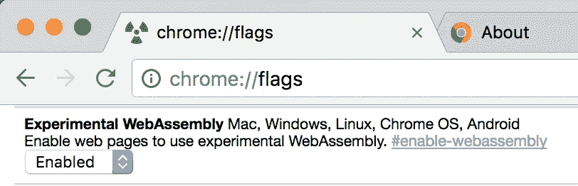
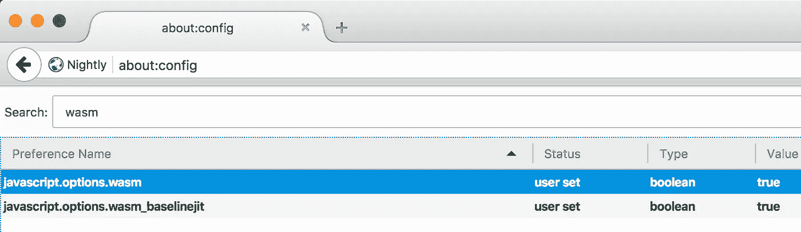
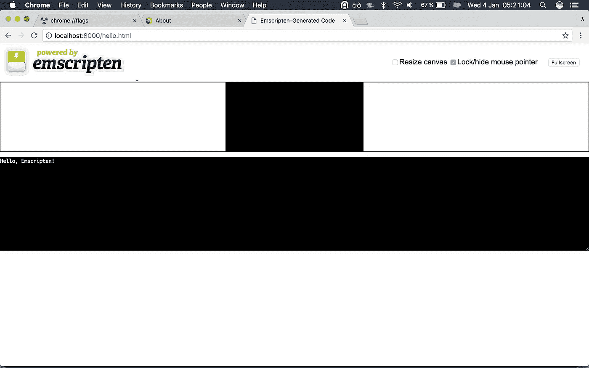
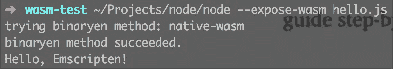

# 将 Rust 编译到 web 汇编指南

> 原文：<https://medium.com/hackernoon/compiling-rust-to-webassembly-guide-411066a69fde>

所以你对什么是 [WebAssembly](http://webassembly.org/) 很感兴趣，并想尝试一下？自 12 月 22 日起，[有可能将铁锈编译成 WASM](https://blog.rust-lang.org/2016/12/22/Rust-1.14.html) 。如果你对[锈语](https://www.rust-lang.org/en-US/)一无所知，推荐你[了解一下](https://brson.github.io/fireflowers/)，太牛逼了！然而，对于本指南，你不需要知道如何用 Rust 编写程序。

在 VM 中运行 WASM 之前，我已经被卡过很多次了。我花了几个小时找出每一步的错误，我想帮你节省时间。所以我们开始吧！

首先你应该在你的电脑上安装 Rust language。最好的方法是使用一个名为 rustup 的工具。您可以像下面这样简单地安装它

```
curl [https://sh.rustup.rs](https://sh.rustup.rs) -sSf | sh
```

可选地[配置你的](https://www.rust-lang.org/en-US/install.html) `[PATH](https://www.rust-lang.org/en-US/install.html)` [环境](https://www.rust-lang.org/en-US/install.html)变量(如果你打算学习和使用 Rust，我推荐这么做)。

安装稳定的防锈目标

```
rustup install stable
rustup default stable
rustup target add wasm32-unknown-emscripten
```

需要安装新的目标来将你的代码从你的平台交叉编译到 WASM。

下载一个[Emscripten SDK 的便携版本](http://kripken.github.io/emscripten-site/docs/getting_started/downloads.html#download-and-install)，然后运行下面的命令:

```
source .**/**emsdk_env.sh
```

现在检查 emcc 版本

```
emcc -v
```

您可能会安装 Emscripten SDK(又名 em SDK)1 . 35 . 0 版，但您需要 1.37.0(或更高版本)才能编译到 WASM。不幸的是，(在发布本指南时)没有预编译的二进制文件，所以您应该从源代码中编译 Emscriten SDK。

```
emsdk update
emsdk install sdk-incoming-64bit
emsdk activate sdk-incoming-64bit
```

这需要时间(对我来说大约需要 2 个小时)，所以请耐心等待。完成后，再次检查`emcc -v`。它应该告诉你你现在已经(至少)安装了 1.37.1。

从现在开始，你已经准备好了！让我们试试吧！

```
rustc --target=wasm32-unknown-emscripten hello.rs -o hello.html
```

这将生成一堆文件。我们只对其中的三个感兴趣:

*   你好 wasm
*   hello.js
*   hello.html

第一个是 [WebAssembly](https://hackernoon.com/tagged/webassembly) 二进制。我们不能独自运行 wasm。WebAssembly 没有任何 I/O，所以我们需要将它封装到将加载、编译和运行 wasm 的 [JavaScript](https://hackernoon.com/tagged/javascript) 中。生成的 HTML 文件提供了一个我们可以运行代码的环境(带有画布和控制台)。

要在浏览器中运行 WebAssembly，您需要 Chrome Canary



Enabling WebAssembly in Chrome Canary

或者 Firefox Nightly



Enabling WebAssembly in Firefox Nightly

现在运行`python -m SimpleHTTPServer`(或任何其他 web 服务器)并在浏览器中打开[http://localhost:8000/hello . html](http://localhost:8000/hello.html)(端口可能有所不同)。您将在 Emscripten 控制台中看到`Hello, Emscripten!`。



**Achievement unlocked**: Rust & WebAssembly hacker.

恭喜你。您刚刚在浏览器中运行了 wasm！看起来把 Rust 编译成 wasm 没那么难，但是相信我，很多人都放弃这么做了。请关注布兰登·艾希的推特评论。在那里你可以找到我对各种问题的解决方案。如果你一步一步地遵循这个指南，你不太可能有任何问题。

不幸的是，Node.js 并不完全支持 WebAssembly。然而，你可以使用 [polyfill](https://github.com/WebAssembly/polyfill-prototype-1) 或`[interpret-wasm](https://github.com/kripken/emscripten/wiki/WebAssembly#binaryen-methods)`binary en 方法(我在使用 rustc 时运气不好)。

**更新(2017 . 1 . 6)**:你**可以**在 Node.js 中运行 wasm！克隆[这个 repo](https://github.com/v8/node/tree/vee-eight-lkgr) ，然后切换到`vee-eight-lkgr`分支[从 sources 构建 Node.js](https://github.com/nodejs/node/blob/master/BUILDING.md) 。使用带有`--expose-wasm`选项的构建节点运行`hello.js`脚本。



WebAssembly running in Node.js

呼呼！

**下一个目标**:将 Rust 编译成 [WebAssembly 单机版](https://github.com/kripken/emscripten/wiki/WebAssembly-Standalone)。这需要一些工作，因为我需要以某种方式将 rustc 连接到 emcc，但我还不知道如何做。如果你能帮忙，请联系我！

请让我知道，如果你有任何问题，按照这个指南。我会尽力帮助你，并更新指南来帮助其他人。

非常感谢

*   [阿龙·扎凯](https://medium.com/u/649eac8108d2?source=post_page-----411066a69fde--------------------------------)([@克里普肯](https://twitter.com/kripken))感谢他对艾姆斯普滕和比纳瑞恩的帮助和辛勤工作。
*   Sean t . Larkin([@ TheLarkinn](https://twitter.com/thelarkinn))感谢你审阅本指南，并一直表现出色。
*   Ali Ijaz Sheikh([@ of robots](https://twitter.com/ofrobots))讲述 Node.js 的`vee-eight-lkgr`分支。

# 关于我:

GitHub 挖掘者。TypeScript 用户。铁锈新手。我爱事物的传道者。公共演讲者(如果你会说俄语，你可能会喜欢我关于 WebAssembly 的[公共演讲](https://www.youtube.com/watch?v=eWF_1nMM5Yo)或[其他演讲](https://github.com/chicoxyzzy/public-talks))。促成了 React，Babel 等。帮助维护[兼容表](http://kangax.github.io/compat-table/esnext/)和 [babel-preset-env](https://github.com/babel/babel-preset-env) 。莫斯科[剧组的一员，](http://moscowjs.ru/)[啤酒莫斯科](https://www.meetup.com/BeerJS-Moscow/)的协办方。一个杯子总是半满的人。

在推特上关注我 [@chicoxyzzy](https://twitter.com/chicoxyzzy)

[](http://bit.ly/HackernoonFB)[](https://goo.gl/k7XYbx)[](https://goo.gl/4ofytp)

> [黑客中午](http://bit.ly/Hackernoon)是黑客如何开始他们的下午。我们是阿美族家庭的一员。我们现在[接受投稿](http://bit.ly/hackernoonsubmission)并乐意[讨论广告&赞助](mailto:partners@amipublications.com)机会。
> 
> 如果你喜欢这个故事，我们推荐你阅读我们的[最新科技故事](http://bit.ly/hackernoonlatestt)和[趋势科技故事](https://hackernoon.com/trending)。直到下一次，不要把世界的现实想当然！

