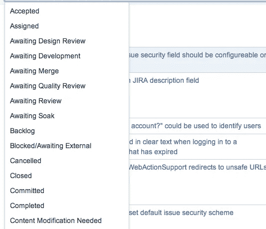

# 已完成！=已验证

> 原文：<https://medium.com/hackernoon/completed-validated-or-valuable-8d75363748f5>

## 更改您的票证状态以击败功能工厂

话语很重要。

当我们讨论“完成的定义”时，我们经常忘记我们的客户、用户和企业(完成的真正仲裁者)的需求和目标。Closed(或者在一些公司中是 Completed)是一个状态值，它有效地将项目从团队的盘子中移除，记录完成日期，并为 sprint 的故事点目标做出贡献。当然，故事可能已经完成，可以发布了，但是我们是否已经验证了作品已经达到了预期的效果？被接受也好不到哪里去。它仍然没有被验证。

> 但是这个故事是一个更大的史诗的一部分！故事完成了，即使史诗没有完成。实际上，它甚至不能真正独立发货。除非我们把它标记为完成，并给它一个狭义的完成定义，否则它会把我们的仪表盘弄得一团糟！

如果是这样的话，你就错过了 INVEST 中的 [I。这个故事不能独立于其他故事发布*。它本身是没有价值的。团队经常遇到这样的问题，当他们 1)害怕分配多个人到一个单独的故事中，和 2)强迫故事的分割服从投资(小)的原则，但是这样做是以牺牲他们故事的完整性和用户焦点为代价的。*](https://www.agilealliance.org/glossary/invest/)

那仍然没有真正触及问题的根源。我们对“完成”的定义通常不是期望的结果。它们是奇特的眼镜。运输是我们的目标，我们使用的词语(如故事的结束和完成)只是加强了这一点。期望的结果在项目经理的幻灯片(或脑袋)中的某个地方丢失了。

要打败[工厂](https://hackernoon.com/12-signs-youre-working-in-a-feature-factory-44a5b938d6a2)，你需要改变你的心态。你必须停止配置你的工具来强化功能工厂的概念，并坚持 Scrum 的“规则”,这些规则通常都过于规范。是的，以开发人员为中心的“任务”比以用户为中心的故事更容易搜索，但这就是票证层次结构的用途。大多数工具都赋予您重命名状态值的权力。

准备验证和已验证如何？不要让你的工具和语言塑造你。需要显示更多的逻辑嵌套和验证周期？那就秀出来！需要更长的冲刺来真正实现客户价值。加长它们。考虑你想要的行为——交付有效的客户价值，而不是功能膨胀——并围绕它塑造你的工具和语言。

这么多过程。几乎没有迹象表明这项工作在起作用…

