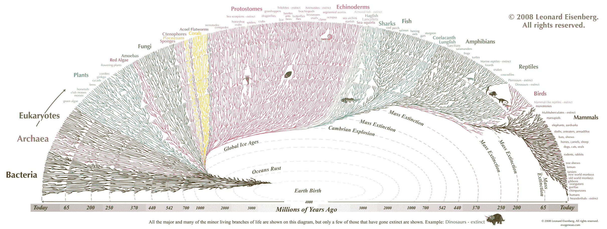
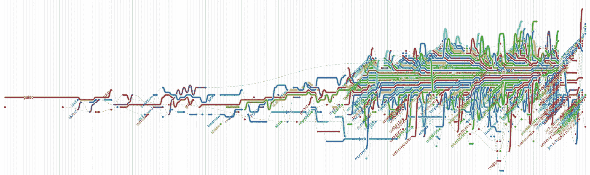

# 作为复杂适应系统的软件应用

> 原文：<https://medium.com/hackernoon/complex-adaptive-systems-and-the-future-of-app-development-2bb0288f05e0>

A visualization of the phylogenetic tree of life

这是对弗雷德·威尔逊的 [*去中心化、自组织系统*](http://avc.com/2017/04/decentralized-self-organizing-systems/) *的回应。*

复杂的适应系统由许多独立的主体组成，它们竞争资源，其中所有主体都有不同的策略，有适应能力，并受到自然选择压力的影响。这些系统是进化的、[自组织的](https://hackernoon.com/tagged/self-organizing)和去中心化的。竞争越激烈，实验率、出生率和死亡率就越高，个体的变异和适应能力就越强，整个系统的弹性、抗脆弱性和影响就越大。效果好的传播，效果不好的消失。

也许我们能看到的最显著的复杂适应系统是地球生物圈的进化过程。最早的有机生命形式出生、繁殖、死亡，并通过一些随机的修改传递它们的遗传物质。在利用环境和繁殖方面效率更高的转基因生物是那些传播和排挤其前辈的生物。这使得世界各地的生物都非常适应它们的环境。生物圈从只占地球的很小一部分，到完全改变了地球，从大气的构成到海洋的构成。现在，随着有意识生物的出现，生物圈已经发展出大规模改变地球表面并扩展到其他星球的能力。

The evolution of antibiotic resistance in real time in a petri dish: [https://www.youtube.com/watch?v=GHI45garS3g](https://www.youtube.com/watch?v=GHI45garS3g)

第二个例子是资本主义和自由市场经济。市场可以被视为一个高度竞争和实验的进化系统。公司很容易被创建和摧毁。它们消耗资源和影响环境的方式大不相同。最成功的实体有能力成长和繁殖。最佳公司的特征不是通过分拆的形成来传播的，而是通过前员工继续创业所获得的机构知识来传播的(见 PayPal 黑手党)。

下面是一些来自维基百科条目的复杂适应系统的例子:

> 复杂适应系统的典型例子包括:城市；公司；市场；政府；工业；生态系统；社交网络；电网；动物群；交通流量；群居昆虫(如蚂蚁)群落；[10]大脑和免疫系统；细胞和发育中的胚胎。基于人类社会群体的努力，如政党、社区、地缘政治组织、战争和恐怖主义网络也被认为是 CAS。[10][11][12]互联网和网络空间——由复杂的人机交互组合构成、合作和管理，也被认为是一个复杂的适应性系统。[13][14][15] CAS 可以是层次化的，但更经常表现出“自组织”的特征[16]

以太坊让我着迷的一个方面是它能够形成一个复杂的适应系统。以太坊上的每个智能合约都有消耗资源(气体)的能力。当它们被放进区块链时，它们就诞生了；当它们耗尽汽油时，它们就死去了；当它们拥有一个其他合同愿意为之买单的策略时，它们就传播了。这可能会导致高水平的实验和创新。这也非常危险，但我相信这里的风险是可以控制的。

还有什么其他类型的系统可以被创造出来，具有与以太坊区块链类似的特性？我们如何实现高水平的应用程序实验，这些应用程序可以“独立生存”，竞争现金支付和人类注意力等资源，并可以通过开发人员在开源代码上的实验和建立在以前的成功基础上随着时间的推移而发展？

这种模式代表了一种新型的应用。这些应用程序不是静态的，不是由它们的创建者“拥有”的，而是属于整个社区。从某种意义上说，它们根本不是应用程序，而是应用系统，许多不同的应用程序使用相同的协议。我们已经看到了这种情况的早期形式，许多电子邮件应用程序，如 Gmail 和 Outlook，都使用相同的 SMTP 电子邮件协议。但是，当应用程序可以在野外独立生存时，这就达到了一个全新的水平。这就要求它们是无服务器的，能够被任何人服务，是开源的，能够被分叉，共享一个被称为协议令牌的公共资源。

The evolution of Python and its many forks over time: [http://www.michaelogawa.com/research/storylines/](http://www.michaelogawa.com/research/storylines/)

这样的应用程序将能够比它们的集中式应用程序更快地成长和适应。应用程序的个体“适应性”，或者说它们如何改善用户的生活，将是前所未有的。包容系统将成为创新的温床，变成一个黑洞，将用户吸入系统，并以尽可能低的成本提供尽可能好的产品。

这就是我对应用程序开发未来的设想。应用于软件的复杂适应系统可能是互联网去中心化的关键，导致创新复兴和经济机会的爆发。

对这篇文章的评论？把你的想法发微博给我。

> [黑客中午](http://bit.ly/Hackernoon)是黑客如何开始他们的下午。我们是 [@AMI](http://bit.ly/atAMIatAMI) 家庭的一员。我们现在[接受投稿](http://bit.ly/hackernoonsubmission)并乐意[讨论广告&赞助](mailto:partners@amipublications.com)机会。
> 
> 如果你喜欢这个故事，我们推荐你阅读我们的[最新科技故事](http://bit.ly/hackernoonlatestt)和[趋势科技故事](https://hackernoon.com/trending)。直到下一次，不要把世界的现实想当然！

