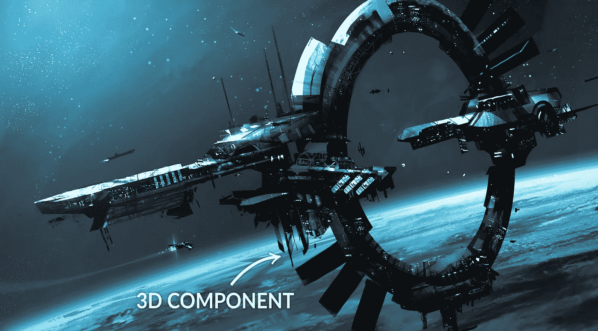

# web 交互式 3D 中的组件系统

> 原文：<https://medium.com/hackernoon/component-system-in-interactive-3d-of-web-18348eecf270>

## 我个人对它应该如何的感觉

第一次使用 [**ReactJS**](https://facebook.github.io/react/) 时，我喜欢的第一件事是组件系统特性。他们让组件成为相互交互的 **DOM** 元素组。这个实现大大简化了我的进一步开发。

# 我如何想象 3D 组件

正如在 **DOM** 中一样，在 **3D** 中我们也有嵌套元素。我们以 [**Three.js 库**](https://threejs.org/) 为例。在那里我们有*场景，网格，灯光，渲染器，摄像机*。首先，你需要创建一个场景，应用将要使用的渲染器和相机对象——但这是关于渲染来自 3D 世界数据的 2D 图像。

为了让这个图像包含你的应用程序的一些部分，你需要填充一些元素，比如*网格和灯光*。将网格添加到场景中时，网格将成为场景的子对象，而场景是的网格父对象。就像在树中一样。

让我们拿一个宇宙飞船网格和一个宇宙飞船组件来比较它们和它们的特征。

3D component hides from our eyes

## 宇宙飞船网格(元素)

宇宙飞船网格可以是一个有其*几何体和材质*的宇宙飞船模型。**它不能做飞船特有的事情**比如用激光开火*(激光需要额外的网格)*因为它应该用一个脚本来描述，这个脚本将与你的网格变换和数据*(几何，材质)*。

## 飞船组件

飞船组件依赖于飞船网格。它包含在这个组件中，应该仅在某些特殊情况下由外部脚本使用。**飞船组件自带不同于其他组件的 API** ，因为它是**专门为飞船**准备的。

它可以拥有一个*。distorne my()*使网格改变其视图并对其模型进行一些操作的函数。此外，它将与其他网格*(可能是宇宙飞船网格的孩子)*互动，如激光。它们将被*使用。*distorne my()【模拟火】功能。

# 为什么组件更好

在这两种情况下，您都需要创建一个脚本来处理 mesh 的动画。但是用组件的方式来做有一些好处:

*   你可能**多次使用飞船，**所以在你的代码中做一个不同的脚本不是一个好的决定。
*   **组件更社会化**。你可以下载某人的组件来节省你再次做同样工作的时间。只需按照开发人员的 API 添加几行代码。
*   组件更容易集成。
*   你可以**与他人分享你自己的组件**以节省他们的时间。他们会对 you☺说“谢谢”

# 3D 网络中组件的当前状态

尝试自己实现**我开发了一个基于 Three.js.** **的框架你可以在 github** **或者** [**它的网站**](https://whsjs.io) 上查看 [**。我的目标是为**](https://github.com/WhitestormJS/whitestorm.js) **[**Three.js**](http://threejs.org/) 环境开发一个组件系统，我想和你分享我的成果。**

> 在这篇文章下面写下你对“3D 网络中的组件”的想法，如果你喜欢 idea☺，请推荐它

> [黑客中午](http://bit.ly/Hackernoon)是黑客如何开始他们的下午。我们是阿美族家庭的一员。我们现在[接受投稿](http://bit.ly/hackernoonsubmission)并乐意[讨论广告&赞助](mailto:partners@amipublications.com)机会。
> 
> 如果你喜欢这个故事，我们推荐你阅读我们的[最新科技故事](http://bit.ly/hackernoonlatestt)和[趋势科技故事](https://hackernoon.com/trending)。直到下一次，不要把世界的现实想当然！

