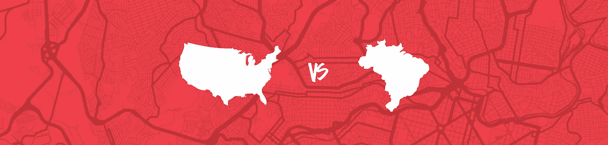
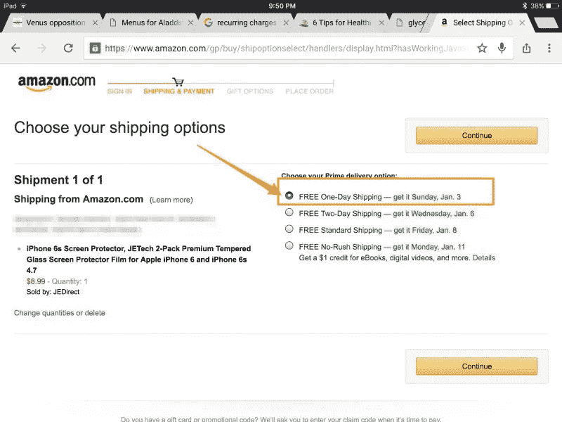
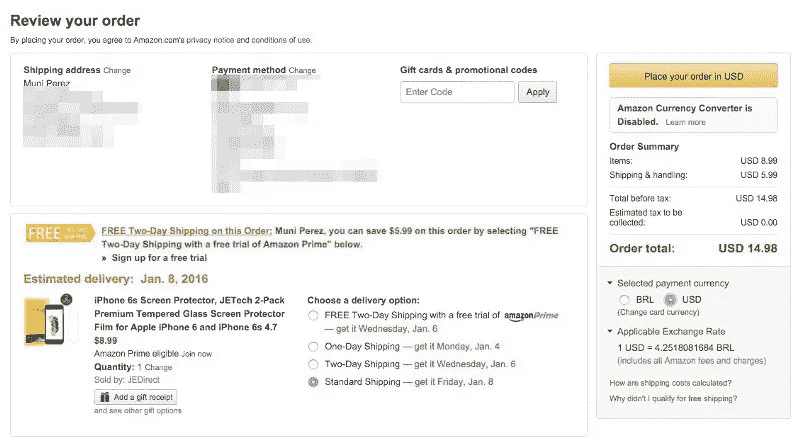
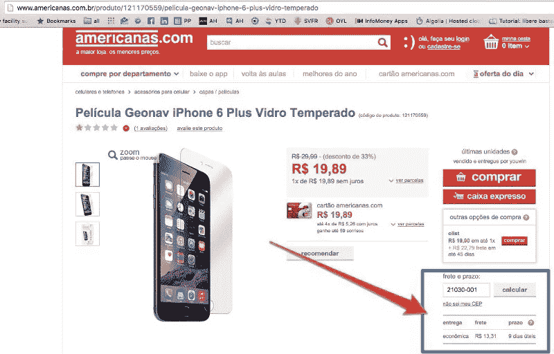
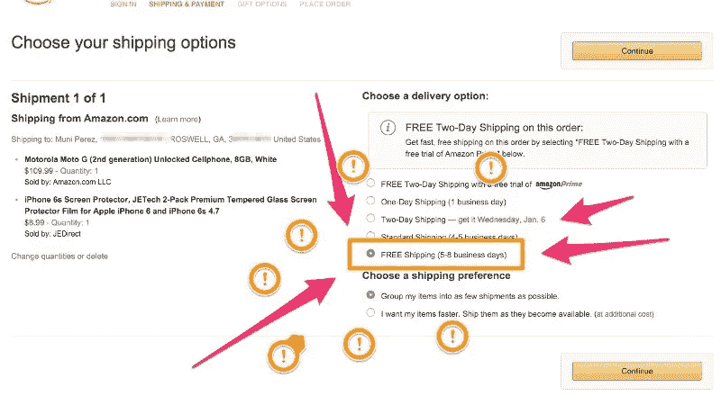

# 美国 VS 巴西在线购物

> 原文：<https://medium.com/hackernoon/compras-online-nos-eua-vs-brasil-f22246eb127a>

## 你应该平均花 5 分钟来阅读这篇文章。当然,如果没有延迟,则需要阅读 1440 次,直到您的在线购买产品到达。

Muni Perez 是许多喜欢在网上购物的巴西人之一。在美国度假时,他注意到他在山姆大叔的土地上进行的网上购物与在巴西进行的网上购物之间的差异。如果你是那些无法抗拒虚拟购物车的人之一,你需要了解我们在谈论什么。

> “如果你正在读这个故事,你可能喜欢电脑和网上购物。

“在巴西,人们也喜欢网上购物,电子商务正呈指数级增长。然而,每次购买都会造成头痛——运费。

如果你住在美国,你可能习惯于在亚马逊上支付 4 或 5 美元的运费,并在几天内收到你的产品。当然,这取决于项目的可用性,但总的来说,亚马逊有库存,并准备快速交付给你。

在巴西,情况有点不同。首先,您没有太多的公司选择运输您的产品,每个公司都必须竞争以赢得他们的心。竞争的好处在于,价格通常会下降,服务也会改善。只有一家大型的、不太称职的国有企业和一些与大型电子商务网站签订合同的私营企业。

因此,当您在巴西在线购买产品时,您的运费可能会超过产品本身,并且可能会或可能不会交付(是!这是发生的)。运送通常相当耗时,您的产品可能需要数周才能到达,具体取决于您居住的地方,有时它会从大型国有运输公司(称为邮政)被盗 - 是的,确实如此。

我目前正在美国度假,几天前,我需要为我的新 iPhone 配备新的屏幕保护程序。我进入了亚马逊的网站,从各种各样的屏幕保护程序中选择了一个 9 美元的屏幕保护程序。当我深入了解购买细节时,我对运费选项感到惊讶 - 这激发了我写这篇文章。看看你自己:

是!这将需要两天,并将在周日交付 - 免费。

重要的是,我的帐户是亚马逊 Prime,但即使如此,我认为如果你经常购物,每月支付 8.25 美元是完全合理的。

因此,为了进行公平的比较,我回到了亚马逊,使用了一个普通帐户,而不是 Prime 帐户,并尝试购买相同的项目。标准运输几乎是产品的价格,因为产品真的很便宜:

因此,每件产品 9 美元,每件运费 6 美元,大约需要一周才能交付。

然后我进入了巴西最大的零售商和电子商务门户网站 Americanas.com。看看我发现了什么作为运费:

是!该产品价格为 20 雷亚尔,运费为 13.31 雷亚尔,需要 9 个工作日才能到达。

注意:当比较硬币时,您可以想象为保护膜支付 20 美元,而不是支付 20 雷亚尔。如果你真的转换成美元,这将是一个非常低的价格,但平均收入实际上是低于美元。因此,假设您将为一件物品支付 20 美元,为运费支付 13 美元。

好吧,回到历史。到目前为止,巴西的价格高得离谱,但说真的,这只是一个便宜的产品。让我们看看当你想买一部手机时会发生什么(这也非常昂贵):

好吧,现在我放弃了。运费实际上要贵得多,需要 13 个工作日才能到达,这意味着如果你幸运的话,你必须等待大约 3 周。再次关于硬币,想象一下在 Moto G 8GB 2Gen 上支付 700 美元。

说实话,我回到亚马逊并模拟了同一款 Moto G 的订单,以及我的 iPhone 的屏幕保护程序,没有 Prime 帐户。惊喜:

免费送货,需要 5 至 8 个工作日,电话是便宜得多,即使我已经转换货币。哦,我的上帝!

幸运的是,隧道尽头有光线,即使它很弱,因为一些初创公司开始表现出试图解决我国这个巨大而荒谬的物流问题。一个令人难以置信的例子是 [Shippify,它甚至收到了大型国有公司的来信,说他们违反了法律,因为邮局垄断了邮件。好吧,现在我放弃了。“](http://shippify.co/)

> [这里](https://medium.com/u/71fa6009b65b#.9pp5in1c0) 。
> 
> 请在[Facebook](https://www.facebook.com/shippify/)上关注我们,并在[Twitter](https://twitter.com/Shippify)和[Instagram](https://instagram.com/shippify/)上关注我们。
> 
> 
> 
> > [黑客中午](http://bit.ly/Hackernoon)是黑客如何开始他们的下午。我们是 [@AMI](http://bit.ly/atAMIatAMI) 家庭的一员。我们现在[接受投稿](http://bit.ly/hackernoonsubmission)，并乐意[讨论广告&赞助](mailto:partners@amipublications.com)机会。
> > 
> > 如果你喜欢这个故事，我们推荐你阅读我们的[最新科技故事](http://bit.ly/hackernoonlatestt)和[趋势科技故事](https://hackernoon.com/trending)。直到下一次，不要把世界的现实想当然！
> 
> 