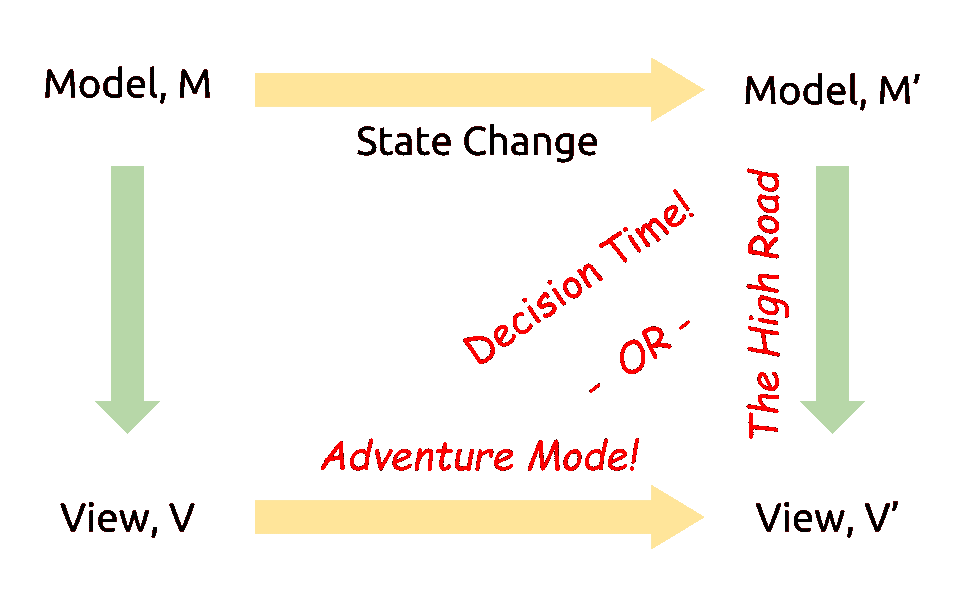
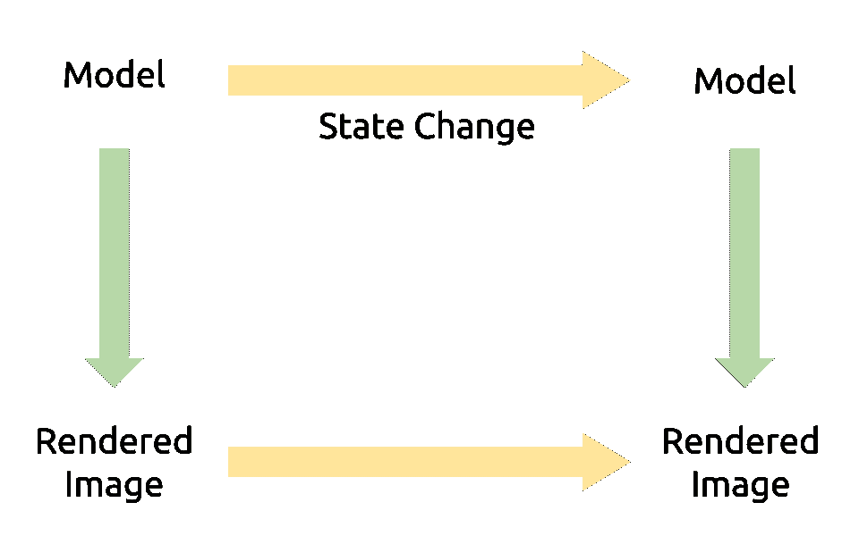
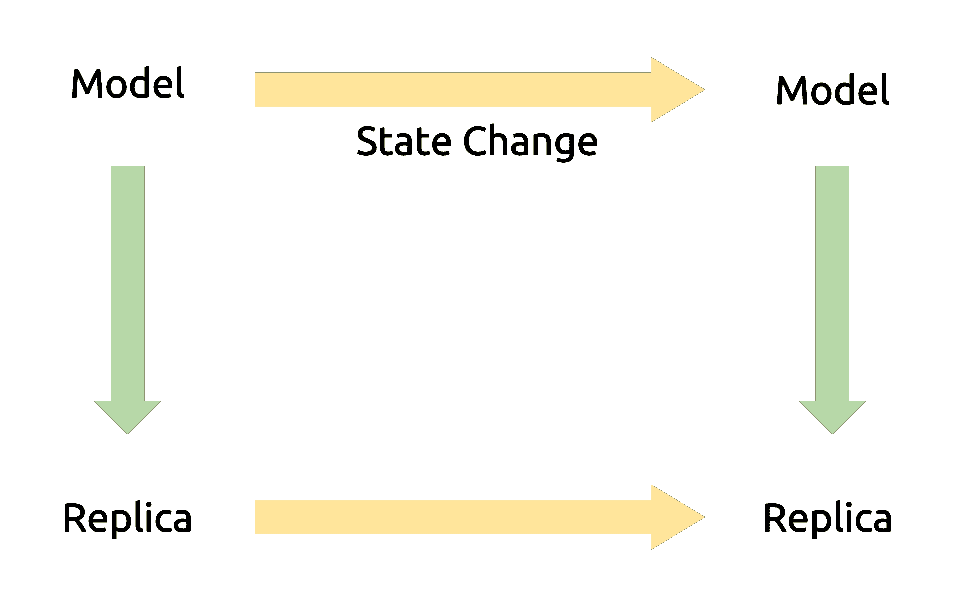
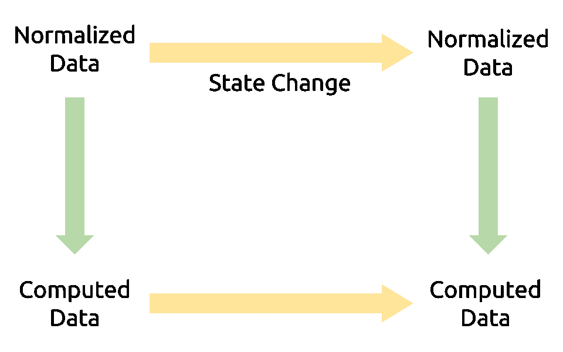
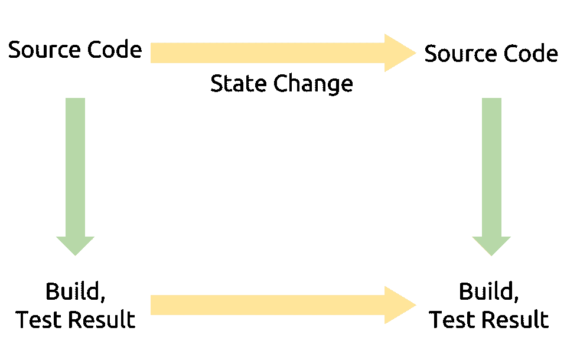
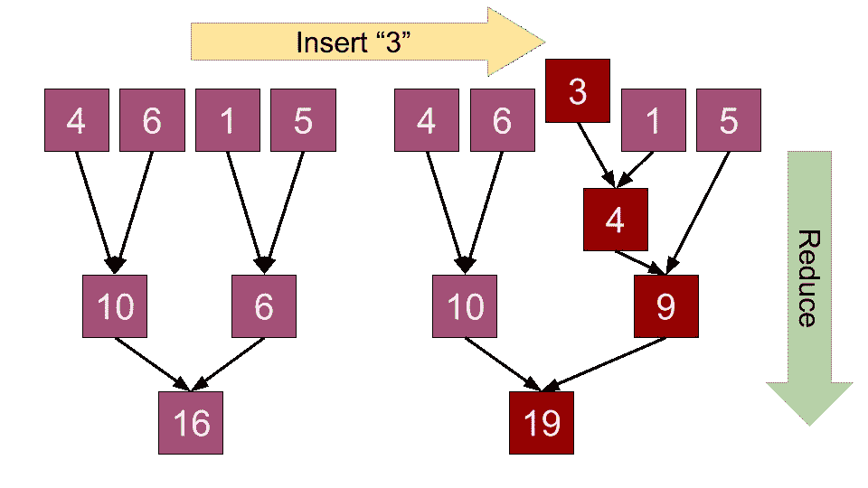

# 计算状态:模型视图问题

> 原文：<https://medium.com/hackernoon/computed-state-the-model-view-problem-9cbe8cf8486f>

从编译器到 web 应用程序，[数据库](https://hackernoon.com/tagged/databases)到缓存，[维护](https://hackernoon.com/tagged/maintaining)计算状态是我作为开发人员所面临的最普遍、最棘手的问题。本文大部分内容都是关于这个问题的，但是如果你只是想看一些代码，可以跳到下面的“【T4 的一点小小贡献】”。

我们许多开发人员都熟悉马丁·福勒的这句名言:

> 计算机科学只有两个硬东西:缓存失效和事物命名。

当然，缓存失效是一件难以置信的困难事情；但这不是福勒要说的重点。“缓存失效”有趣地过于具体:这句话挑战你理解它为什么如此困难。

缓存失效很难，因为管理计算状态很难。

# 问题是

我当然不是第一个谈论这个问题的人，但我很难找到一个人在一般情况下谈论这个问题，并给它一个名字。因此，目前，我称之为“模型-视图问题”您可能熟悉各种 UI 框架中的术语“模型”和“视图”；我以一种类似的方式使用这些词，但是正如你将在下面的例子中看到的，我在这里使用它们有一个更普遍的意图。



The Model-View Problem

从这个图的左侧开始，我们从一个普通的模型 M 和一个视图 V 开始，视图 V 是从 M 派生出来的，带有一个视图函数。

然后，事情发生了:M 改变了，我们剩下一个新的模型，M’。在这里，我们发现自己正处于一个紧要关头。我们应该如何确定新视图 V′？我们有两条可能的路径:

1.  **公路**:用视图功能从 M’重新计算 V’。这是一个好主意，因为我们知道 V’将是正确的。然而，这种方法效率很低，尤其是当模型很大或者视图函数很复杂的时候。
2.  **冒险模式！**:试图根据从 M 到 M’的变化来推断从 V 到 V’的变化。这里躺着龙；这是很难纠正的，但是如果你这么做了，你可能会得到巨大的性能财富，因为相对于模型的大小，变化的大小可能很小。

从代码维护的角度来看，我们希望只定义视图函数。然而，从效率的角度来看，我们更喜欢从模型的变化中得到视图的变化。这种折衷是模型-视图问题的症结所在。

# 五个例子

我断言模型-视图问题是当今开发中最常见和最困难的问题之一。让我们看一些例子。


## 1 —前端开发

在 Javascript 的早期，我们必须并行地发展我们的对象和 DOM 元素:我们陷入了冒险模式，不管我们喜欢与否。我们不喜欢它基本上是对的，下一代 Javascript 框架就是让视图功能更加明确，同时保持尽可能高的性能。



## 2 —渲染系统

在我们花哨的 web 应用程序下，我们的浏览器也有同样的问题——鉴于 DOM 的这种变化，我该如何更新屏幕呢？SVG 渲染器明显存在这个问题。但是这个问题不仅限于网络。

**桌面 OS** :当一个应用程序更新它的窗口时，我需要更新屏幕吗？哪些部分？

**Photoshop** :高级的图像编辑人员必须高效地更新由几个源图层合成的最终产品。

**游戏**:基于用户面对的方式，场景的哪些部分可以从渲染中排除？我可以预先计算什么，我如何知道何时更新计算？

生产力应用:无论你是在处理信件、电子表格还是幻灯片，这些应用的难点都归结为根据源数据的变化来推断最终产品的变化。



## 3-复制状态

西格尔定律是一句格言:“一个有手表的人知道现在是什么时间。一个有两只表的人永远不确定。”保留数据的多个副本是很危险的。

**缓存**:缓存失效解决方案有点像混合路径:它都是关于计算出副本的哪些部分需要从模型中刷新，但是通过查看状态变化来选择它们。

**在客户端存储状态**:没有什么比选择“离线支持”更快的了

**数据库索引**:感谢数据库为你实现；它必须正确地实现源自外键和二级索引的级联更新。

**反规范化**:这是您希望数据库为您实现的。增量更新反规格化很难做对。



## 4-计算的数据库状态

“复制状态”的一个更胖、更丑的表亲是“计算状态”。这里我们有可能是模型-视图问题最常见和最具破坏性的化身。

我在此图中使用“计算数据”来指代聚合以及您放入数据库中的任何其他数据，这些数据可能是从数据库中的其他数据推断出来的。

如果你在高速公路上，你可能每晚都在运行大量的“批处理作业”,并希望你的老板足够老，认为这听起来合理。如果你在冒险模式下，你可能会向你的老板解释，由于本地网络在错误的时间退出，FudgeEater666 的通知计数可能会永远错误。



## 5 —构建系统

作为最终用户，我们也是模型视图问题的受害者。

当涉及到构建和测试时，几乎每个人都走捷径。然而，现代构建系统变得越来越细粒度化，阻碍了预处理程序和打包程序的发展。

这是一个例子，如果我们能同时受益于这两种途径，我们的生活会好得多。我们等待编译器和测试一遍又一遍地运行几乎相同的工作负载已经太久了，这是我们与 CPU 共同经历的一个特殊的炼狱。

# 走向解决

八年前， [Damien Katz 在](http://damienkatz.net/2008/02/incremental_map.html) [CouchDB](http://couchdb.apache.org/) 中为模型视图问题提供了一个解决方案；这非常简单，尽管不完全通用。核心思想是，如果您可以将视图表示为 reduce 函数，那么您可以将 reduce 的中间结果存储在磁盘上 B 树的每个节点中。然后，当发生更改时，您可以在受更新影响的树节点上运行 reduce。下面是一个简单视图的可视化示例，它使用 reduce 生成数字的和:



这样，我们以冒险模式的性能获得了高路的优雅(诚然，是以存储大量中间值为代价的)。更多的数据库应该采用这样的解决方案；这是对一个重要问题的简单而美丽的解决方案。

## 微小的贡献

当然，模型视图问题不仅限于数据库。为了帮助我最近的一些[优化工作](/@pschanely/optimizing-higher-order-functions-with-hypothetical-inverses-e5153ab69753#.ikjebowti)，我用 python 实现了这个算法的一个简单的内存版本:它就像一个(不可变的)列表一样工作，但是基于你指定的 reduce 函数更新视图。从今天开始，您可以开始制作增量地图缩小，如下所示:

```
$ pip install ScenicOverlook
$ python
>>> from scenicoverlook import viewablelist
>>> numbers = viewablelist([5, 10, 5, 0])
>>> # Incrementally maintains the sum of a list:
>>> numbers.reduce(lambda x, y: x + y)
20
>>> numbers = numbers[1:]
>>> numbers.reduce(lambda x, y: x + y)
15
>>> numbers = numbers + [10, 5]
>>> numbers.reduce(lambda x, y: x + y)
30
```

更多示例见[py docs](https://github.com/pschanely/ScenicOverlook/blob/master/scenicoverlook/__init__.py)。这些都是非常简单的例子，但是我相信我上面的许多问题案例在理论上可以被表达为一个更复杂的 map-reduce 操作的图形。

# 两个结论

首先，我认为给这个概念取个名字是有价值的。这些天来，当我发现这个问题的新实例时，我尽量不急于解决。我将它与问题的其他实例进行比较，并思考在那些情况下什么方法工作得好。也许你会发现这种反射也很有用。

第二，我们需要更多的精神能量应用于模型-视图问题。增量 map-reduce 应该存在于更多的数据库和更多的语言中。但是增量 map-reduce 不是唯一的答案:应该有更多的选项，每个选项都有不同的特征。今天，“解决”模型-视图问题仅仅意味着避免灾难；理想情况下，这更像是挑选使用哪种数据结构。

[](http://bit.ly/HackernoonFB)[](https://goo.gl/k7XYbx)[](https://goo.gl/4ofytp)

> [黑客中午](http://bit.ly/Hackernoon)是黑客如何开始他们的下午。我们是 [@AMI](http://bit.ly/atAMIatAMI) 家庭的一员。我们现在[接受投稿](http://bit.ly/hackernoonsubmission)，并乐意[讨论广告&赞助](mailto:partners@amipublications.com)机会。
> 
> 如果你喜欢这个故事，我们推荐你阅读我们的[最新科技故事](http://bit.ly/hackernoonlatestt)和[趋势科技故事](https://hackernoon.com/trending)。直到下一次，不要把世界的现实想当然！

