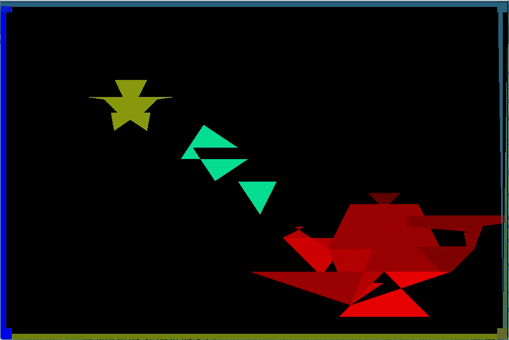
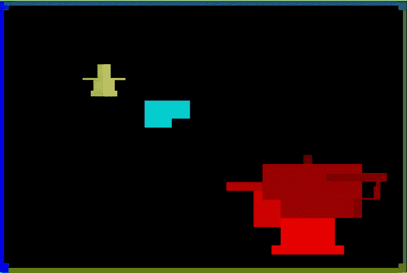

# 计算机图形学:扫描线多边形填充算法

> 原文：<https://medium.com/hackernoon/computer-graphics-scan-line-polygon-fill-algorithm-3cb47283df6>


All hail tea pot

这篇文章是我对“博客世界”的第一次介绍，也希望是许多关于计算和一般技术的文章的第一篇。好了，让我们继续吧。

今天我将讨论扫描线多边形填充(SLPF)算法，然后展示我用 C++实现的算法。SLPF 算法的目的是在给定图形顶点的情况下填充(着色)多边形的内部像素。

# 基本理念:

基本思想是收集组成多边形的所有边(除了水平边),使用边作为起点和终点逐行扫描填充图形。

# 主要组件:

为了成功填充多边形，将使用三个主要组件:**边缘桶**、**边缘表**和**活动列表**。这些组件将包含一条边的信息，保存组成图形的所有边，并分别维护用于填充多边形的当前边。

## 边缘铲斗

边桶是一种保存多边形边信息的结构。取决于算法的实现，边缘桶看起来不同，在我的例子中，它看起来像这样:


Edge Bucket representation

以下是每个成员在边缘存储桶中所代表的内容的细分:

*   **yMax:** 边缘的最大 Y 位置
*   **yMin:** 边缘的最小 Y 位置
*   **x:** 沿扫描线的当前 x 位置，最初从与边缘的 **yMin** 相同的点开始
*   **符号:**边缘斜率的符号(要么是-1，要么是 1)
*   **dX:** 边的顶点之间的绝对差值 x(差值)
*   **dY:** 边的顶点之间的绝对差值 y(差值)
*   **求和:**初始化为零。用作扫描线被填充到 x 到下一个位置

## 边缘表

ET 是包含组成图形的所有边的列表。

**重要 ET 注意事项:**

*   创建边时，边的顶点需要从左到右排序
*   边缘以 yMin 递增的顺序保持
*   一旦活动列表处理完这些边，就从 ET 中删除这些边
*   一旦从 ET 中移除了所有的边，该算法就完成了填充多边形

## 活动列表

AL 包含正在处理/用于填充多边形的边。AL 中的每个边都有一个配对的伙伴边，因为当填充扫描线时，从一个边开始填充像素，直到遇到伙伴边。

**重要铝注:**

*   一旦边缘的 yMin 等于正在处理的当前扫描线，边缘就从边缘表被推入 AL
*   边缘总是成对出现在 AL 中
*   AL 中的边缘以递增的 x 顺序保持。
*   每次通过后，铝将被重新分类

# 步骤:

现在我们已经讨论了主要的组成部分，让我们更详细地回顾一下 SLPF 算法。

**~一般假设~**

*   用户可以使用一种方法来设置单个像素的颜色。您将看到，每当我填充一个像素时，我只需调用 setPixel()方法。
*   给定形状的顶点围绕多边形的圆周按顺序列出
*   这一点很重要，否则多边形将无法正确绘制

以下是步骤:

```
1\. Create ET
    1\. Process the vertices list in pairs, start with [numOfVertices-1] and [0].
    2\. For each vertex pair, create an edge bucket
2\. Sort ET by yMin
3\. Process the ET
    1\. Start on the scan line equal to theyMin of the first edge in the ET
    2\. While the ET contains edges
        1\. Check if any edges in the AL need to be removes (when yMax == current scan line)
            1\. If an edge is removed from the AL, remove the associated the Edge Bucket from the Edge Table.
        2\. If any edges have a yMin == current scan line, add them to the AL
        3\. Sort the edges in AL by X
        4\. Fill in the scan line between pairs of edges in AL
        5\. Increment current scan line
        6\. Increment all the X's in the AL edges based on their slope
            1\. If the edge's slope is vertical, the bucket's x member is **NOT** incremented.
```

(为什么 Medium 不支持嵌套列表？？)

**最终重要提示:**

*   创建边桶时，如果边的顶点不是按从左到右的顺序排列，则桶的符号可能不正确。如果边缘铲斗有错误的符号，当您试图装满它们时会发生这种情况:



Something is not right here…

为了在边缘桶中仅维护整数，斜率并不实际计算，而是作为三个不同的成员维护:sign、dX、dY。

*   这允许边缘桶的 x 成员谨慎地递增，而不用担心在点中遇到实数时会发生什么
*   如果斜率解释不正确，可能会出现以下情况:



No x increment == pixelated image?

# 实施:

现在已经介绍了细节，下面是 SLPF 在 C++中的实现。

> 由于我的教授的要求，代码的 C++实现已经被删除，并替换为伪代码(非常担心学生将复制项目的代码)。如果你对我的 C++实现感兴趣，请随时给我发消息。

**主程序(伪代码)**

```
/*
    Creates edge buckets from the given edges

    [@param](http://twitter.com/param) n    Number of vertices
    [@param](http://twitter.com/param) x[]  array of x points
    [@param](http://twitter.com/param) y[]  array of y points

    [@return](http://twitter.com/return)     List of edge buckets
 */
createEdges(n, x[], y[]) {
    instantiate a new edge table loop through x[] & y[] pairs {
        if the edge's slope is NOT undefined (verticle) {
            create bucket with edge
            add bucket to edge table
        }
    }
}/*
    Given the edge table of the polygon, fill the polygons

    [@param](http://twitter.com/param) edgeTable The polygon's edge table representation
 */
processEdgeTable (edgeTable) {
    while (edge table is NOT empty) {// Remove edges from the active list if y == ymax
        if (active list is NOT empty) {
            for (iterate through all buckets in the active list) {
                if (current bucket's ymax == current scanline) {
                    remove bucket from active list
                    remove bucket from edge table
                }
            }
        }// Add edge from edge table to active list if y == ymin
        for (iterate through the bucket in the edge table) {
            if (bucket's ymin == scanline) {
                add bucket to active list
            }
        }// Sort active list by x position and slope
        sortTheActiveList();// Fill the polygon pixel
        for (iterate through the active list) {
            for (from vertex1.x to vertex2.x of the bucket) {
                setPixelColor()
            }
        }// Increment X variables of buckets based on the slope
        for (all buckets in the active list) {
            if (bucketsdX != 0) {
                bucket's sum += bucket's dX while (bucket's sum >= bucket's dY) {
            increment or decrement bucket's X depending on sign of   bucket's slope
            edge's sum -= dY
                }
            }
        }
    }
}///
// Draw a filled polygon in the Canvas C.
//
// The polygon has n distinct vertices.  The coordinates of the vertices
// making up the polygon are stored in the x and y arrays.  The ith
// vertex will have coordinate (x[i],y[i]).
//
// [@param](http://twitter.com/param) n - number of vertices
// [@param](http://twitter.com/param) x - x coordinates
// [@param](http://twitter.com/param) y - y coordinates
///
drawPolygon(n, x[], y[]) {
    // Create edge table
    finalEdgeTable = createEdges()// Sort edges by minY
    sort(finalEdgeTable)processEdgeTable(finalEdgeTable)
}
```

**带结构的头文件**

```
/*
    Bucket struct to hold edge information
 */
struct Bucket {
    int yMax;
    int yMin;
    int x;
    int sign;
    int dX;
    int dY;
    double sum;
};/*
    Vertex struct to hold x and y values
 */
struct Vertex {
    int x;
    int y;
};
```

这就是实现 SLPF 算法所需要的一切！我希望这篇文章是有建设性的，并且你喜欢阅读它。如果有任何错误，你想留下评论，随时这样做或给我发消息。

干杯！

[](http://bit.ly/HackernoonFB)[](https://goo.gl/k7XYbx)[](https://goo.gl/4ofytp)

> [黑客中午](http://bit.ly/Hackernoon)是黑客如何开始他们的下午。我们是 [@AMI](http://bit.ly/atAMIatAMI) 家庭的一员。我们现在[接受投稿](http://bit.ly/hackernoonsubmission)并乐意[讨论广告&赞助](mailto:partners@amipublications.com)机会。
> 
> 如果你喜欢这个故事，我们推荐你阅读我们的[最新科技故事](http://bit.ly/hackernoonlatestt)和[趋势科技故事](https://hackernoon.com/trending)。直到下一次，不要把世界的现实想当然！

[](https://goo.gl/Ahtev1)