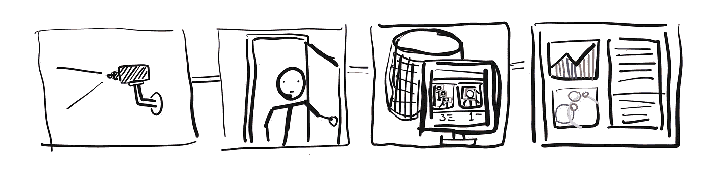
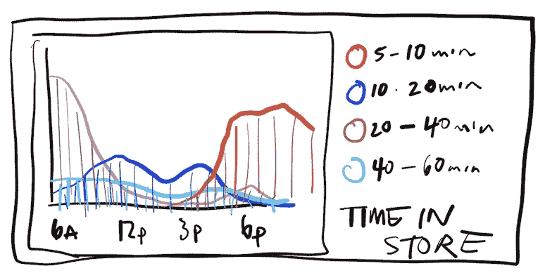
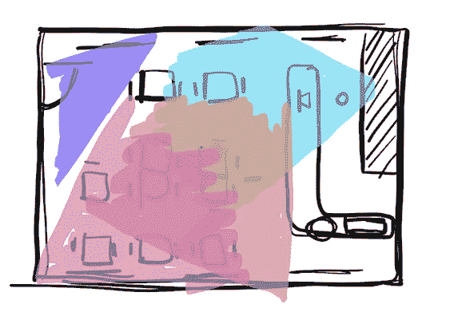
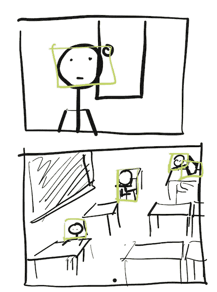
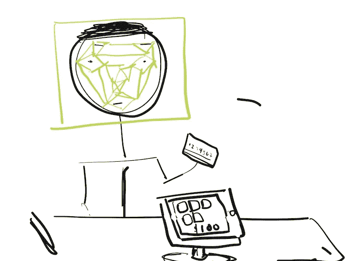

# 商业机构中的计算机视觉

> 原文：<https://medium.com/hackernoon/computer-vision-in-commercial-establishments-7cd3a98d6b65>

Security cameras capture footage used by computer vision software to analyze scenes and summarize insight report.

自从“量化自我”和相应的硬件设备出现以来，我一直很好奇人们在用他们收集的关于自己的数据做什么。Fitbits、苹果手表和步数跟踪工具为个人提供了关于他们身体活动的洞察力。随着产生的关于个人的数据的增加，我倾向于想知道这些信息如何转化为群体。

Businesses could use data gathered in their establishments to better understand their customer behavior.

硬件公司撰写了有趣的研究，分析他们的平台和设备收集的数据，但这些信息仅限于公司选择的兴趣点。较小的机构，如餐馆或商业商店，无法从这些数据点的增加中获得洞察力。

我认为有一种有趣的方式来思考其他新的可用于分析的传感器，具体来说，就是那些一直存在但没有得到充分利用的传感器。

# 所有人现在都可以跟踪公共空间的趋势

几年前，声纳、激光和类似的一次性传感器技术已经被用于通过数据计算物理世界。跟踪公共空间中的交通趋势或跟踪商业机构中的步行交通以前需要专门的硬件。城市和大型商业企业可以使用这种专用硬件，但小规模的商业企业则不行。

Security cameras in restaurants, cafes, and bars could be used to monitor customer behavior.

软件的进步使得普通的数码相机变成了复杂的传感器。使用处理图像的软件，可以快速分析图像的内容，找出可识别的对象和人类行为。基于计算机视觉的软件可用于使用摄像机网络重建场景。这使得常见的安全摄像头基础设施可用于现实生活中的谷歌分析，如分析。

Data gained from analyzing customers could be used to gauge customer loyalty or predict behavior.

由数码相机监控的公共空间中的人类活动可以用于将公共运动解释为可分析的数据点。此外，在商业机构中，交易数据可以扩展这些参考点，以了解实体企业是如何运营的。我认为这些信息不会为企业主提供革命性的见解，但随着时间的推移，将成为业务活动变化的重要参考。有理由假设，随着时间的推移，这些数据将有助于预测业务增长或衰退的趋势。

眼下，这种监控和分析让人不舒服。我很好奇我们的期望和文化规范是否会随着时间而改变。我们的在线活动已经被分析并作为商业产品使用。我们留下的点击轨迹被聚集起来，用于更好地定位广告。我们创造的搜索行为、交流模式或社交图表，比我们大多数人愿意承认的更能洞察我们是什么样的人。这种对行为的监控是人们越来越敏感和越来越少意识到的事情。

How much right does a business have in tracking their customers? Does it make a difference for the customer if they don’t know they are being monitored?

鉴于时代的变化，我想知道实体企业是否愿意使用他们现有的基础设施来获得对其业务的更深入的了解。此外，我想知道，如果客户知道他们的活动被监控和分析是为了企业的利益，他们会有什么感受。

这项技术已经在公共场所广泛使用。像 [Sidewalk Labs](https://www.sidewalklabs.com/) 这样的公司使用配备高质量摄像头的公共电话亭提供免费 wifi，这些摄像头无疑被用于监控公共活动。我很好奇这种监控和分析在过去是否需要使用旧硬件解决方案的不同方法。

> [黑客中午](http://bit.ly/Hackernoon)是黑客如何开始他们的下午。我们是 [@AMI](http://bit.ly/atAMIatAMI) 家庭的一员。我们现在[接受投稿](http://bit.ly/hackernoonsubmission)并乐意[讨论广告&赞助](mailto:partners@amipublications.com)机会。
> 
> 如果你喜欢这个故事，我们推荐你阅读我们的[最新科技故事](http://bit.ly/hackernoonlatestt)和[趋势科技故事](https://hackernoon.com/trending)。直到下一次，不要把世界的现实想当然！

