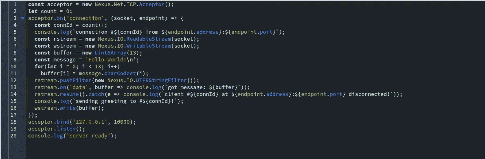
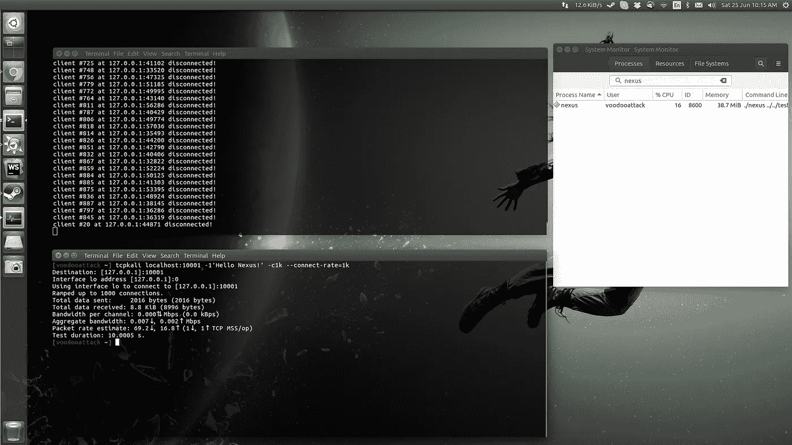
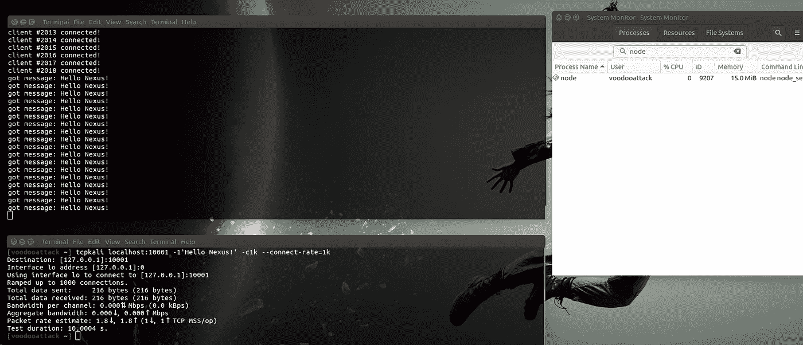

# 并发 JavaScript VI:服务器

> 原文：<https://medium.com/hackernoon/concurrent-javascript-vi-server-9bb626f7cae1>

又到了每月的这个时候，我离开了一段时间，在我母亲的紧急心脏手术后在医院里追逐医生。我很感激她恢复得很好。她是我的生命之光，现在她安全了。我可以再做一次 [Nexus.js](https://hackernoon.com/tagged/nexus-js) 了！

如果你正在阅读这篇文章，但你不知道 Nexus.js 是什么，请阅读这里的介绍:

 [## 并发 JavaScript —简介

### 所以，我一直在做一个多线程的 JavaScript 运行时，Nexus.js。你可以把它想象成 Node 的疯狂表亲…

medium.com](/@voodooattack/multi-threaded-javascript-introduction-faba95d3bd06) 

既然那已经不碍事了…

我刚刚在 [GitHub 库](https://github.com/voodooattack/nexusjs)中获得了一个[提交](https://github.com/voodooattack/nexusjs/commit/a81535706642f0f2695f0a275a6e5a458f6f8dcf)，我对此非常满意。这个提交允许 Nexus 作为一个 [TCP 服务器](https://hackernoon.com/tagged/tcp-server)工作，并且是一个非常高性能的服务器。

让我们看看它是如何工作的。

首先，你有一个接受者。接受者的工作是绑定一个接口(或多个接口)并监听连接。当有新的连接时，它会创建一个 TCPSocket 并发出一个“连接”事件。

“连接”事件是您应该处理流量的地方，第二个参数包含端点信息(传入地址和端口)。

传递给回调的 TCPSocket 是一个双向 I/O 设备，就像任何其他 I/O 设备一样，您可以在它的基础上构造流来处理输入和输出以及操作数据。

所以，让我们对它进行一点压力测试。1024 个连接会消耗多少内存？

18 MB 支持 1000 个连接？很好。但话说回来，那些只是联系。客户端没有向服务器发送任何数据。

所以让我们用数据再试一次。这一次，每个客户端将发送一条消息，并保持线路畅通，直到它们都断开连接。

38.7 MB，现在让我们用 node.js 进行最后一次测试，代码如下:

Node.js 是靠内存取胜的吧？

完全不是，如果你仔细观察连接，你会发现它们都是按顺序处理的，而 nexus 是并行处理所有内核来处理负载。现在，将内核数量乘以节点的内存使用量，以获得如果您尝试使用集群 API 扩展此用例时节点将消耗的实际内存(4 * 15 MB = 60 MB)，然后它将不会以最佳方式利用逻辑 CPU。

这只是一个开始。我已经为 HTTP-和 HTTP 2-服务器 API 制定了计划。

## 有问题吗？

你有什么问题吗？我很乐意回答这些问题。在评论中把它们发送到这里，或者在 Twitter 上发送到[@ voodoo attack](https://twitter.com/voodooattack)，和往常一样:你可以在 [GitHub](https://github.com/voodooattack/nexusjs) 上查看该项目的代码。

 [## 并发 JavaScript——缺席一年

### 如果你不知道 Nexus.js 是什么，请从这里开始阅读:

medium.com](/@voodooattack/concurrent-javascript-a-years-absence-ea5ae93d3b91) 

> [黑客中午](http://bit.ly/Hackernoon)是黑客如何开始他们的下午。我们是 [@AMI](http://bit.ly/atAMIatAMI) 家庭的一员。我们现在[接受投稿](http://bit.ly/hackernoonsubmission)并乐意[讨论广告&赞助](mailto:partners@amipublications.com)机会。
> 
> 如果你喜欢这个故事，我们推荐你阅读我们的[最新科技故事](http://bit.ly/hackernoonlatestt)和[趋势科技故事](https://hackernoon.com/trending)。直到下一次，不要把世界的现实想当然！

