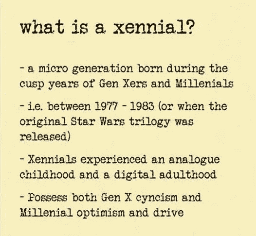
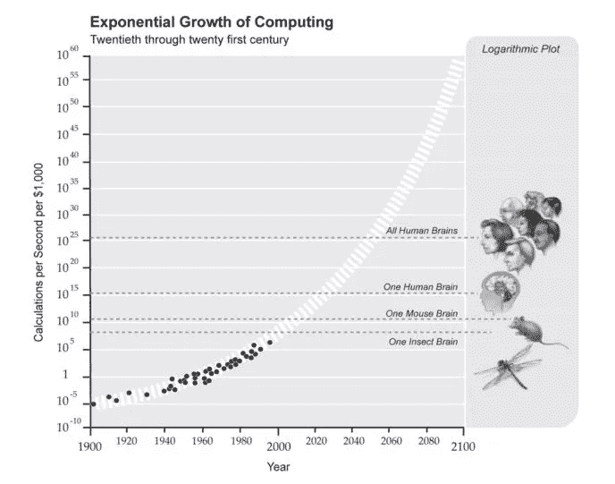
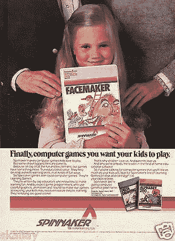
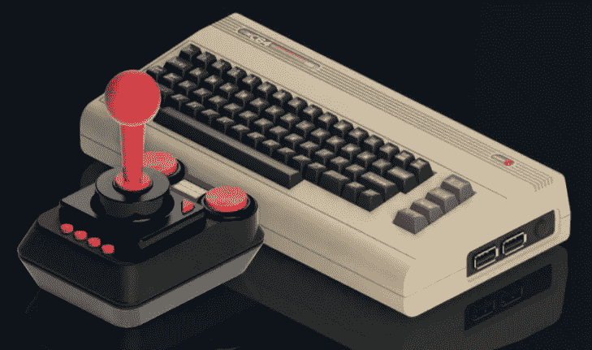

# 一个中年技术人员的自白

> 原文：<https://medium.com/hackernoon/confessions-of-a-middle-aged-techie-21e704cda942>

## 或者我从准将 64 中学到的技术

尽管我才刚刚迈入人生的第四个十年，也没有勾选任何一个“你终于步入中年的 25 个必然迹象”(好吧，也许是几个)，但我的科技创业可以追溯到 20 世纪 80 年代初。在科技时代，我正好处于中年，或者更准确地说是 100111 岁。

我的父亲是一名工程师和技术爱好者。我仍然记得有一天他带着浅灰色的海军准将 64 出现，并自豪地宣称这是未来的潮流。电脑安装好后，他给我和我的兄弟们演示的第一件事就是如何用 BASIC 语言编写程序来猜测你的号码。太神奇了！它怎么知道我们在想什么数字？什么邪恶的魔法正在进行？回过头来看，Commodore 更令人震惊，因为它只用了 64 KB RAM 和 20 KB ROM，处理能力比你的[智能烤面包机](https://www.engadget.com/2017/01/04/griffin-connects-your-toast-to-your-phone/)还要低。我们从第一天起就被迷住了——快进 35 年，你可能(不会)惊讶于我和我的兄弟都是程序员。

The first BASIC programming script I entered into the Commodore 64\. Nerdy memories :)

## 数字时代的到来

Commodore 64 是在一个小时间窗口内出现的，这个窗口见证了模拟的死亡和数字的兴起。它的正式发布日期是 1982 年 8 月，正好是被称为 [Xennials](http://www.dailymail.co.uk/femail/article-4630930/Xennials-new-generation-born-1977-1983.html) 的微小一代人狼吞虎咽的时候。夹在 X 一代和千禧一代之间，有人说 X 一代没有 X 一代的冷漠和愤世嫉俗，也没有千禧一代无尽的乐观。

我们是 spork 一代——不是真正的勺子，不是真正的叉子，可以说一样有用，但有点令人费解。当然，我有点一概而论。一种尺寸不适合所有人。但是大家都同意，新生代出生在一个科技不是驱动力的世界，但是他们看到了技术的指数级增长、进化和潜力，而其他人很少看到这一点。

我想你可以说(可以说)这让我们这些新生代对技术有了独特的看法。那么到目前为止我学到了什么？

## 技术发展很快，你需要适应才能生存

随着计算机处理能力每两年翻一番，以及技术领域的不断创新，计算机成为我们的霸主只是时间问题。好吧，也许这有点夸张，但是每个笑话都包含着真理的内核。

预计到 2020 年，计算机运行计算的速度将比普通人脑快。2050 年将超过[所有人类脑力总和](https://www.linkedin.com/pulse/technology-evolving-faster-than-our-ability-adapt-chris-hooper/)。这种速度加上大规模自动化、大数据和人工智能意味着我们正在迅速进入一个新的技术时代。既令人害怕又令人兴奋。

准将 64 在适应上彻底失败。在文章[*Commodore*](https://arstechnica.com/gaming/2017/01/a-history-of-the-amiga-part-10-the-downfall-of-commodore/)*作者中，杰里米·赖默推测，Commodore 的失败“在于 Commodore 管理层，他们不仅未能适应不断变化的市场，而且在许多情况下还积极敌视自己的公司。”能够适应是科技生存的关键。*

**

## *并非所有的科技创新都来自年轻人*

*有时候，似乎所有的新技术创新都是由街区里的新人开发和引领的。根据 Tech Crunch 的一篇文章，技术创新的高峰期是 25 岁。如果你已经过了那个年龄——太糟糕了，你错过了机会。事实上，如果我能从一个 20 岁的博客作者成为下一个科技超级巨头的故事中得到一毛钱，那么我会像博客作者所说的那样富有。*

*我并不刻薄，我欢迎年轻一代的想法——但是好的想法可以来自各行各业，技术的灵活性是一个真正的问题。与反对者相反，我和我的技术中年伙伴们仍然有时间做出贡献，因为我们有年轻一代没有经历的东西。*

*Commodore 在这一点上失败了，他们赶走了他们的创始人和“有经验的人”，就像苹果赶走了创始人史蒂夫·沃兹尼亚克一样。巧合的是，史蒂夫·沃兹尼亚克在他的书 [iWoz](https://www.amazon.com/iWoz-Computer-Invented-Personal-Co-Founded/dp/0393330435) 中声称，他发明了个人电脑，并为查克·佩德尔提供了第一个 Commodore 宠物的想法——但历史实际上表明，查克·佩德尔设计了使 Apple II 成为可能的芯片。根据[地下硅](https://dfarq.homeip.net/steve-jobs-and-the-commodore-pet/)，“佩德尔能够在没有史蒂夫·沃兹尼亚克的帮助下给他的 KIM-1 增加一个键盘和一个视频电路。”撇开无聊的争论不谈，经验肯定能带来科技市场更深层次的创新。*

***

I hate to admit how much time I spent playing both FaceMaker and Barbie’s Dream Date* 

## *女孩是我们科技未来的关键*

*统计数字令人沮丧。尽管上大学的女性总人数增加了，但专注于计算机科学的年轻女性的比例持续下降。为什么会这样？当然，我没有这个棘手问题的答案，但好消息是有无数的文章、博客和组织致力于解决这个问题，或者至少让人们意识到这个困境。*

*但就我个人而言，作为一个 80 后长大并热爱电脑的女孩，我想知道这是否可以归结为一些看法和刻板印象——男孩喜欢玩电子游戏和使用电脑，而女孩喜欢做艺术项目和阅读？显然，这有点过于简化了，但这是当时的基本信息。*

*例如，如果你仔细阅读 2021 年上市的 Commodore 64 游戏列表，你会注意到很大一部分游戏是基于更典型的与“男性”兴趣相关的主题——外星人、战争、赛车、拳击、忍者、海盗等。随着[最受欢迎的游戏](http://www.lemon64.com/games/votes_list.php)的标题如:*扎克·麦克克拉肯，海盗！* **、** *以及外星御术师*和*执行者:Fullmetal Megablaster* 。虽然像 *FaceMaker* 、 *Barbie's Dream Date* 和 *Barbie's Dream House* 这样的游戏是面向女孩的，但它们似乎从未进入怀旧排行榜的前 100 名(可能有很好的理由)。*

*快进到 2017 年，这种专注于男性电脑程序/游戏的趋势似乎正在逆转。我为我自己的女儿提供了更多的选择，包括性别中立的代码学习游戏，如 [Scratch](https://scratch.mit.edu/) 和 [Osmo](https://www.playosmo.com/en/) 。看看这对进入计算机科学专业的女性有什么影响将会很有趣。*

**

## *准将的归来 64*

*因此，这篇文章以较少的自白和更多的思考而告终，这是由一个激动人心的公告推动的，该公告称，就像 NES 经典游戏[和任天堂 SNES 游戏](https://www.fatherly.com/gear/video-games-gear/the-nintendo-classic-is-finally-coming-back-to-stores/)的复兴一样，Commodore 64 将会小型化，并且[很快就可以购买](https://thec64.com/)！虽然我对它附带的游戏列表很失望(什么，没有冬季游戏？！)你最好相信我会是第一批排队购买的人之一。我是说，科技中年除了怀旧还有什么好处？*

**❤如果你喜欢这篇文章，请点击“鼓掌”图标(次数不限)，在社交媒体上分享这个故事，并在* [*上关注我*](/@cariefisher/) *或*[*Twitter*](https://twitter.com/cariefisher)*！谢谢你，快乐阅读❤**