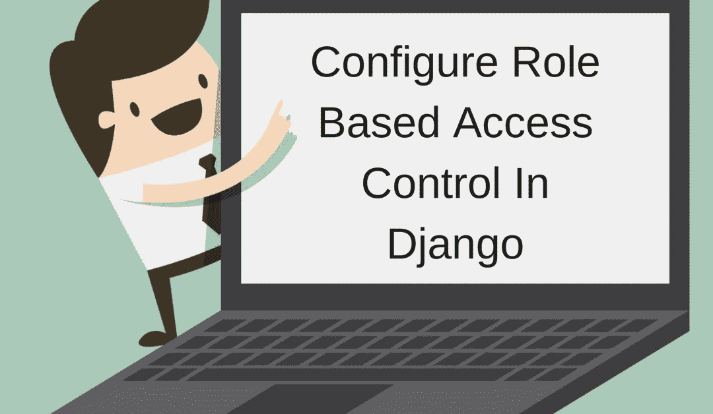

# 在 Django 中配置基于角色的访问控制

> 原文：<https://medium.com/hackernoon/configure-role-based-access-control-in-django-74fa94a54aff>

Role Based Access Control in Django

这个模型存储系统中的实际用户。它有基本字段，如用户名、密码和电子邮件。您可以扩展该类以添加应用程序需要的更多属性。Django 用户认证通过会话和中间件处理认证。

对于每个请求，Django 都会挂钩一个请求对象。使用它，您可以通过 request.user 获得登录用户的详细信息。

# 组:对用户进行分类的方式

这些是系统所需的逻辑用户组。您可以向这些组分配权限和用户。Django 在 admin 中提供了一个基本视图来创建这些组和管理权限。

组表示用户在系统中的“角色”。作为一名“管理员”，你可能属于一个名为“admin”的组。作为一名“支持人员”，你属于一个叫做“支持”的团体。

# 权限:粒度访问控制

定义的组根据分配给每个组的权限控制访问。默认情况下，Django 允许您添加、编辑和更改每个模型的权限。

您可以在管理视图或您的应用程序中使用这些权限。比如你有一个类似‘博客’的模式。

班级博客(模特。模型):pub_date =模型。DateField() headline = models。CharField(max_length=200)内容=模型。TextField()作者=模型。外键(用户)

班级博客(模特。型号):

pub_date =模型。日期字段()

头条=模特。CharField(max_length=200)

内容=模型。文本字段()

作者=模特。外键(用户)

这些模型都在 Django 中注册为 ContentType。Django 创建的所有下层权限都会引用这个特定的 ContentType。在这种情况下，默认情况下将创建以下权限:

add_blog:拥有此权限的任何用户或组都可以添加新的博客。change_blog:任何拥有此权限的用户或组都可以编辑博客。delete_blog:任何拥有此权限的用户或组都可以删除博客。

# 添加自定义权限

Django 的默认权限非常简单。它可能不总是满足您的应用程序的要求。Django 允许您添加自定义权限，并根据需要使用它们。使用模型元属性，您可以添加新的权限:

班级博客(模特。Model): … Class Meta: permissions =((“查看 _ 博客”，“可以查看博客”)，(“可以发布 _ 博客”，“可以发布博客”)，)

班级博客(模特。型号):

(“查看 _ 博客”，“可以查看博客”)，

(“能 _ 发布 _ 博客”，“能发布博客”)，

这些额外权限是在运行 manage.py，migrate 时与默认权限一起创建的。

# 如何使用这些权限

您可以将权限分配给用户或组。例如，您可以将所有权限授予组“管理员”。您可以确保“支持”组仅获得“change_blog”权限。这样，只有管理员用户才能添加或删除博客。在视图、模板或 API 中，您需要[基于角色的访问控制](https://www.techopedia.com/definition/23933/role-based-access-control-rbac)来获得这种权限。

# 视图:

要检查视图中的权限，请使用 has _ perm 方法或装饰器。用户对象提供的方法是 has_perm(perm，obj =无)，其中 perm 是“.”如果用户有权限，则返回 True。

> *user . has _ perm(【blog . can _ publish _ blog】)*

您也可以使用修饰器“permission_required(perm，login _ url =无，raise_exception=False)”。这个装饰者也以“形式”获得许可。。此外，它还带有一个 login_url，可用于将该 url 传递到您的登录/错误页面。如果用户没有所需的权限，那么他将被重定向到此 URL。

> *来自 django . contrib . auth . decorators import permission _ required*

@ permission _ required(' blog . can _ publish _ blog '，log in _ URL = '/sign in/')def publish _ blog(请求):…

如果您有一个基于类的视图，那么您可以使用“PermissionRequiredMixin”。您可以将一个或多个权限传递给 permission_required 参数。

> *来自 django . contribut . auth . mixins import permissionrequired dmin*

类 PublishBlog(permissionrequired adminxin，View):permissionrequired = blog . can _ publish _ blog '

*原为 2018 年 7 月 17 日在*[*hashedin.com*](https://hashedin.com/blog/configure-role-based-access-control-in-django/)*发布。*