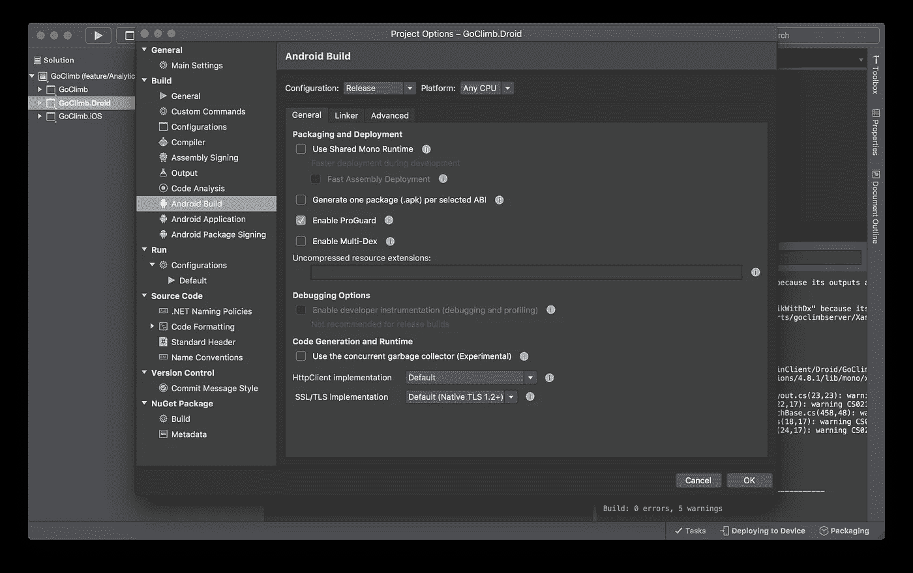
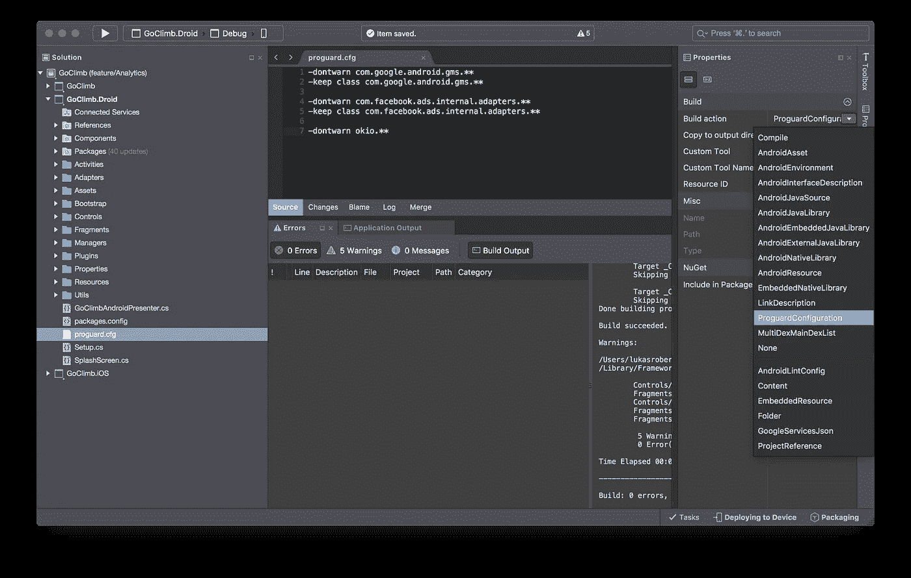

# 配置 Proguard 和 Xamarin Android

> 原文：<https://medium.com/hackernoon/configuring-proguard-and-xamarin-android-eea5a56bc316>

# 方案

最近，我决定在我的应用程序中加入谷歌分析。虽然这对于理解用户通过应用程序的路径是必要的，但添加 Android 版本的 SDK 并没有想象中那么容易。

首先，我决定从 Xamarin store 中添加 SDK 作为组件。这很容易做到，但是当我添加 SDK 时，它带来了一大堆我不需要的依赖项。

对我来说不幸的是，这让我超过了 apk 的 Dex 限制(大约是限制的两倍)。因此，我做了一些研究，所有的答案都告诉我要启用 Proguard。Proguard 是一个工具，它将去掉任何不使用的代码和方法，减少 APK 的大小，并且不包括谷歌分析决定加入的 20 个新依赖项中的任何一个。只是我实际使用的一些代码。

# 解决办法

所以在 Xamarin 中启用 Proguard 有多难。Android be？

结果很难！下面是我让它工作的步骤和我在这个过程中学到的东西。

首先，如果你的目标是 Android 7 / N / API 24 /谷歌决定为 Android 版本起的其他名字，那么你需要更换使用的 Proguard 版本。这可以通过以下步骤完成:

1.  从[这里](https://sourceforge.net/projects/proguard/files/)下载 Proguard 的最新版本
2.  找到你的 Android SDK 的安装位置。在我的 mac 上，我似乎有两个安装。一个用于 Android Studio 使用的 Android 原生版本。另一个是 Xamarin 使用的 Android 版本。因为我是为基于 Xamarin 的构建而做的，所以我将使用它的位置，在这种情况下，它类似于“/Users/your username/Library/Developer/xa marin/Android-SDK-ma cosx/tools/proguard”
3.  用新版本替换旧版本的 Proguard。要做到这一点，将当前文件夹重命名为类似“Proguard-needless”的名称，并将新文件夹复制到 tools 文件夹中。确保新版本的文件夹重命名为“proguard”。
4.  确保所有配置文件也复制到新的 Proguard 文件夹中。对我来说，这是 proguard-android-optimize.txt、proguard-android.txt 和 proguard-project.txt。

现在您有了正确的版本，您需要为您的 Android 项目启用 Proguard。这可以通过右击您的。Xamarin studio 中的 Droid 项目并选择选项。一旦面板打开，在 Build 部分下面找到 Android Build，选择你要发布的配置，然后选择 Enable Proguard 复选框。见下面截图，供参考。



一旦您为项目配置了 Proguard，请确保您在 Xamarin Studio 中以发布模式作为目标进行构建。试着构建一下，看看会发生什么。就我而言，我收到了与谷歌地图、脸书广告和 OkIo 相关的警告。要抑制这些警告，您需要添加自己的 Proguard 配置文件。为此，请遵循以下步骤

1.  向 Droid 项目的根目录添加一个名为 proguard.cfg 的新文件
2.  因为 Xamarin 是智能的，它保存这个新文件在 UTF-8 与 BOM，你将需要改变这一点。打开类似 Visual Studio 代码的东西，用 UTF-8 编码重新保存文件。这是必需的，因为 Proguard 不会读取文件，除非它是 UTF-8 编码。
3.  在 Xamarin studio 中，右键单击该文件并选择 properties。对于构建操作，选择程序配置。见下面截图，供参考。
4.  将相关的 keep 或 dontwarn 子句添加到文件中，参见下面的代码示例，该示例保留 google maps 文件并忽略 OkIo 警告。



Select ProguardConfiguration as a build action for your custom Proguard file

```
-dontwarn com.google.android.gms.**
-keep class com.google.android.gms.**

-dontwarn com.facebook.ads.internal.adapters.**
-keep class com.facebook.ads.internal.adapters.**

-dontwarn okio.**
```

完成这些步骤后，再次尝试构建。希望这次会更成功。如果不成功，检查您的构建输出，看看 Proguard 给出了什么警告和注释。从这个阶段开始，就是要确定你需要对你的定制 Proguard 文件做什么样的修改，一旦成功了，构建就成功了。

# 结论

如您所见，将 Proguard 添加到您的 Xamarin Android 项目并不容易。希望这能帮助其他需要这样做的人。此外，Xamarin 有望在未来让开发人员更容易、更清楚地了解这个过程。

[](http://bit.ly/HackernoonFB)[](https://goo.gl/k7XYbx)[](https://goo.gl/4ofytp)

> [黑客中午](http://bit.ly/Hackernoon)是黑客如何开始他们的下午。我们是 [@AMI](http://bit.ly/atAMIatAMI) 家庭的一员。我们现在[接受投稿](http://bit.ly/hackernoonsubmission)，并乐意[讨论广告&赞助](mailto:partners@amipublications.com)机会。
> 
> 如果你喜欢这个故事，我们推荐你阅读我们的[最新科技故事](http://bit.ly/hackernoonlatestt)和[趋势科技故事](https://hackernoon.com/trending)。直到下一次，不要把世界的现实想当然！

