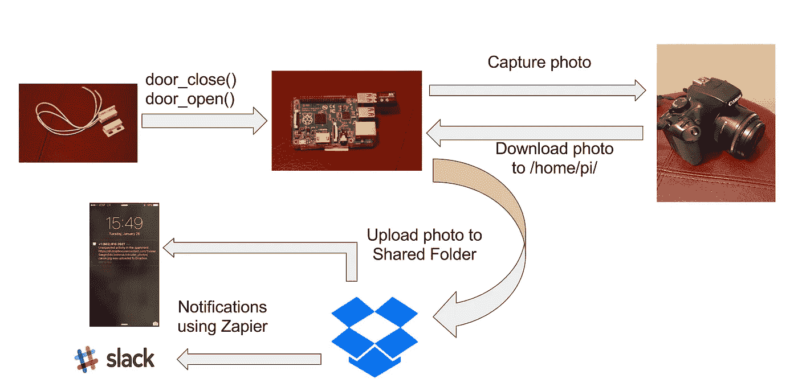
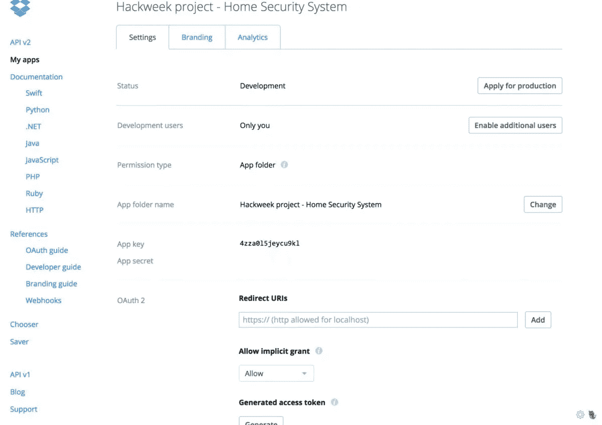
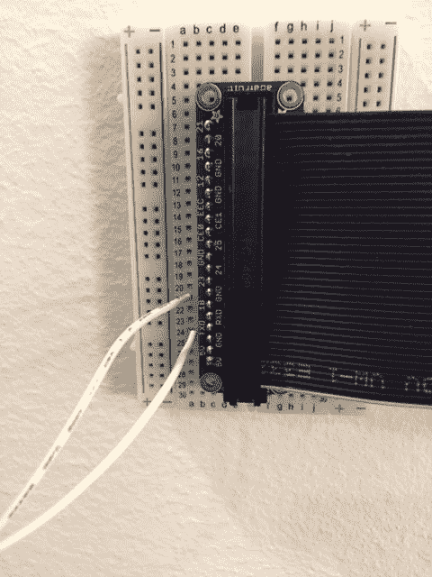
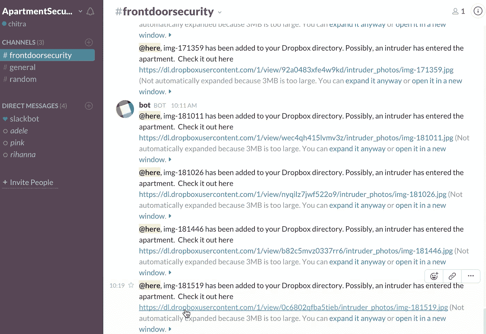
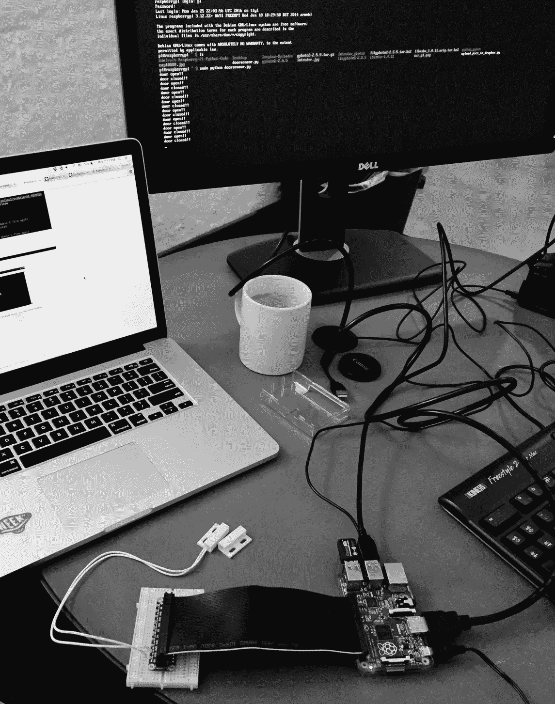

# 连接的设备和 Dropbox

> 原文：<https://medium.com/hackernoon/connected-devices-dropbox-d7f4dab9534c>

## [使用 Raspberry Pi 和 Dropbox 构建家庭安全系统]

黑客周是 Dropbox 文化的重要组成部分。大约每 6 个月，我们的日历上会划出一周的时间，让我们可以自由地做任何事情。办公室变成了一个极客嘉年华，无数超级有趣的想法飞来飞去，逐渐成形。

本周，我决定做一个硬件项目——我用 Raspberry Pi 和 Dropbox 构建了一个家庭安全系统。在过去，我在 Dreamforce 2014 期间参与了一个涉及 Pi 的项目——这里发布了一个简要概述[。因此，回到探索 Pi 的多功能性并作为已经有趣的蛋糕上的糖衣，将它集成到 Dropbox 是很好的——利用 Dropbox 服务的可靠性和世界闻名的同步功能来捕获数据，并使其在任何时间点在任何平台上随时可用。](/@cgulabrani/iot-and-salesforce-com-1397a81625d8#.jnw2s7u1p)

以下是我想到的(这个想法是我在一个寒冷的 12 月夜晚等待从旧金山飞往新奥尔良的极度延迟的红眼航班时形成的):

该实施包括一个磁性簧片开关，它贴在/拧在门上(最好是你家的前门)，并安装在连接到 Raspberry Pi 的试验板上。Pi 从开关接收适当的信号，指示门的状态—打开或关闭。根据开关[反馈](https://hackernoon.com/tagged/feedback)的值，Pi 提示 DSLR 抓拍照片并保存到 Pi 上的主文件夹中。一个简单的 python 程序在 Pi 上运行，它将图片上传到 Dropbox 中的一个共享文件夹，使它不可避免地出现在你的 Dropbox 移动应用程序上。此外，我设置了一些工作流规则，每当有新照片上传到 [Dropbox](https://hackernoon.com/tagged/dropbox) 共享文件夹中时，这些规则就会触发，并导致发送松弛通知。

*还跟我？*

很好！再详细说一下。

这是我刚才描述的实现的可视化示意图:

我将这个项目分成了以下几个独立的阶段:

**阶段 1:让 Pi 控制你的相机**

可以参考我的[黑客日报博文](/@cgulabrani/controlling-your-dslr-through-raspberry-pi-ad4896f5e225#.6o98a3scb)来做这个。如果你完全按照步骤进行，这很简单，几个小时就可以完成。

**第二阶段:让 Pi 与 Dropbox 对话**

我项目的第二阶段是从 Pi 上传图片到 Dropbox。这包括使用 OAuth 建立从 Pi 到 Dropbox API 的连接，并将图片上传到指定的 Dropbox 共享文件夹。

以下是逐步说明:

步骤 2–1:在 Dropbox 上创建应用程序

a.登录您的 Dropbox 帐户，然后前往[https://www.dropbox.com/developers/apps](https://www.dropbox.com/developers/apps)

b.点击创建应用程序，给你的应用程序一个名称和权限类型=完全访问

c.记下应用程序密钥和秘密密钥，您稍后会用到它们

步骤 2–2:下载 Dropbox-Uploader

一旦你声明了应用程序，下载 Andrea Fabrizi 的神奇程序 Dropbox-Uploader。这使您可以从 Pi 命令行访问 Dropbox。

下面是下载这个程序和设置 Dropbox API 授权的步骤

a.https://github.com/andreafabrizi/Dropbox-Uploader.git 的饭桶克隆

这将在/home/pi/目录中创建一个文件夹 Dropbox-Uploader

b.cd 收存箱-上传器

在该文件夹中，有一个脚本 dropbox_uploader.sh，我们将使用它通过 OAuth 连接到 dropbox。

c.运行脚本:

。/dropbox_uploader.sh

d.它会提示您输入您刚刚在上面创建的 Dropbox 应用程序的“应用程序密钥”和“应用程序密码”。在命令行上添加正确的键后，它会要求您填写访问级别。请确保您键入“完全”,因为这是您在创建应用程序时选择的权限类型。

e.然后，Pi 将请求一个 OAuth 令牌，并要求您导航到它在命令行上显示的 URL，以便激活该令牌。一旦成功，您的设置就完成了！

步骤 2–3:在命令行上测试

sh 有一个上传动作，你可以直接在命令行上使用它来上传任何图片。语法非常简单-

。/dropbox_uploader.sh 上传文件 _ 路径 _ 上 _PI 目录 _ 内 _DROPBOX

例如，

。/Dropbox _ uploader . sh uploader/home/pi/pic . jpg/Pictures/

这将把位于/home/pi/的 pic.jpg 上传到你的 Dropbox 账户的/pictures/文件夹中。

**第三阶段:将开关反馈集成到树莓派**

项目的最后阶段是如何将所有这些与簧片开关集成在一起。

*你需要什么-*

*   [磁簧开关](https://www.adafruit.com/products/375)
*   面包板和圆饼
*   您在第 2 阶段的 Dropbox 帐户

实施:

步骤 3–1:首先确保在 Pi 上配置了 GPIO。我遵循了这些说明—[https://learn . ada fruit . com/ada fruits-raspberry-pi-lesson-4-gpio-setup/configuring-gpio](https://learn.adafruit.com/adafruits-raspberry-pi-lesson-4-gpio-setup/configuring-gpio)

步骤 3–2:接下来，将传感器安装在试验板上的 18 号引脚和 Pi 补鞋匠的 GND 引脚上。哪根导线插入哪个引脚并不重要。

步骤 3–3:将馅饼皮连接到试验板和树莓馅饼皮上。做好准备——如果你像我一样有一个全新的试验板，你将需要一些认真的手工努力来将鞋钉推入试验板。

步骤 3–4:将相机连接到 Raspberry Pi，并通过在 Pi 命令行上键入 gphoto 2-auto-detect 来确保您的 Pi 检测到它。

**额外积分—阶段 4:设置通知**

我用 zapier.com 的 T2 为我的 Dropbox 账户中的数据设置了通知。

以下是步骤:

步骤 4–1:在 zapier.com 上创建一个新帐户，并进行新的 Zap

步骤 4–2:选择触发器 app = Dropbox 和 Dropbox triggers =目录中的新文件

步骤 4–3:连接到您在第 2 阶段创建的 Dropbox 帐户

步骤 4–4:在 Dropbox 中选择目录——在这种情况下，它将是您上传照片的共享文件夹[在我的情况下是/intrusor _ photos]

步骤 4–5:测试您的触发规则设置

步骤 4–6:选择行动计划=时差

步骤 4–7:选择一个松弛操作=发送渠道消息

步骤 4–8:连接到您的 Slack 帐户

步骤 4–9:选择您想要广播消息的频道，并起草消息文本[其他内容可选]

步骤 4–10:测试您的设置

******汇聚一切******

最后，为了自动化整个项目设置，我编写了一个简单的 python 程序，保存在 Raspberry Pi 上。程序让 Pi 处理磁簧开关的输入，根据开关输出提示相机拍照，然后将照片保存在 Pi—/home/Pi/intrusor _ photos 上的特定文件夹中然后调用 dropbox_uploader.sh 将照片上传到我的 dropbox 账户中。我将这个脚本命名为 door_sensor.py，并保存在/home/pi/中。

下载并运行 python 代码:

*   你可以在这里下载 python 代码-[https://github . com/cgulabrani/home-security-system/tree/door _ sensor-code](https://github.com/cgulabrani/home-security-system/tree/door_sensor-code)
*   通过在/home/pi/目录下的命令行中键入“python door_sensor.py”来运行程序。
*   摆弄开关[打开和关闭] —当开关打开时，相机应拍摄照片，将其上传到 Dropbox，并随后向您在步骤 4–9 中选择的频道发布松弛通知。

****我希望你能和我一样在构建这个过程中获得更多乐趣！****

> 黑客午间是黑客们从下午开始的时间。我们是 [@AMI](http://bit.ly/atAMIatAMI) 家庭的一员。我们现在[接受提交](http://bit.ly/hackernoonsubmission)并乐于[讨论广告&赞助](mailto:partners@amipublications.com)机会。
> 
> 如果你喜欢这个故事，我们建议你读一读我们的[最新科技故事](http://bit.ly/hackernoonlatestt)和[趋势科技故事](https://hackernoon.com/trending)。直到下一次，不要把现实世界视为理所当然！

