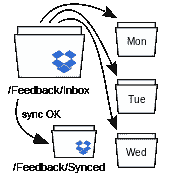
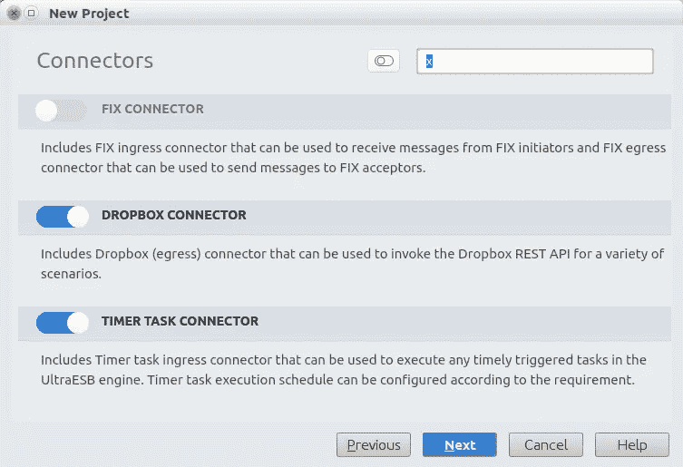
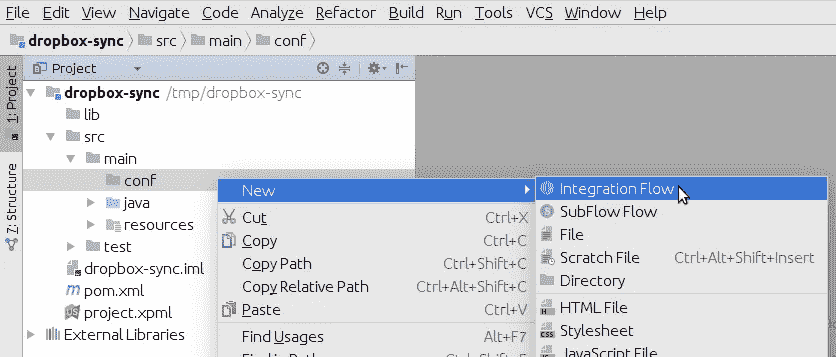
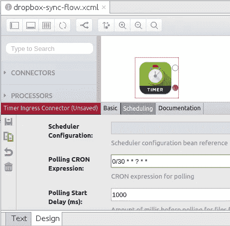
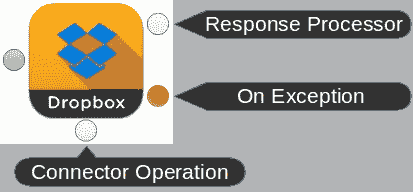
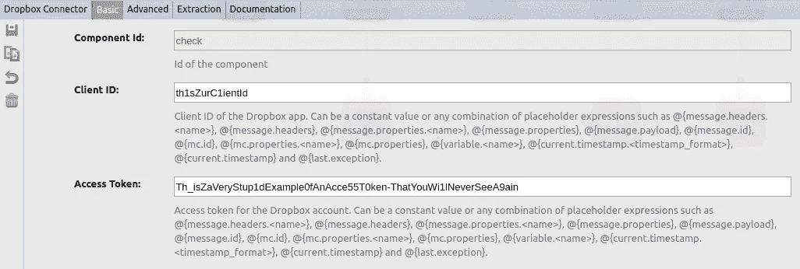
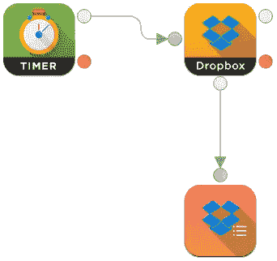
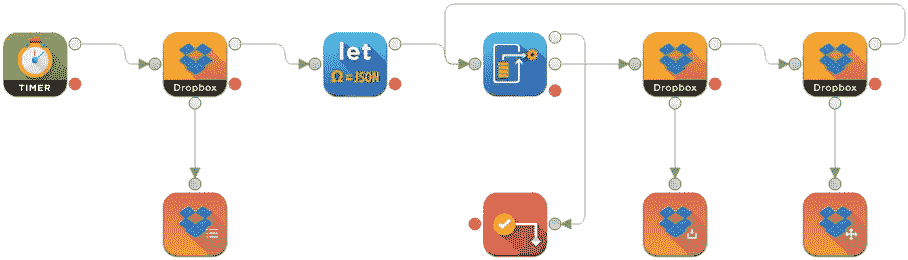

# 以时尚的方式连接点:在 10 分钟内构建您自己的 Dropbox Sync！

> 原文：<https://medium.com/hackernoon/connecting-the-dots-in-style-build-your-own-dropbox-sync-in-10-minutes-24d8f61ccb7d>

在当今高度全球化的商业领域中，整合，或者说“连接各个点”，是很难避免的事情。幸运的是，集成，或者用更“企业 y”的术语来说“企业集成”，不再意味着让你毛骨悚然的东西，这要归功于先进而用户友好的企业集成框架，例如 [Project-X](https://developer.adroitlogic.com/project-x/docs/17.07/) 。

今天，我们将向简伸出援助之手，她是*快乐购物超市服务部*(没听过这个名字？是的，我也没有:)在建立她的最新客户反馈汇总机制的一部分。不过不用担心，因为我会一直帮助和指导你直到最后！

HappiShoppin 超市服务的公关部门开辟了接收顾客反馈的新渠道。除了前者，传统的平装反馈插件，他们现在通过他们的网站以及公共 [Dropbox](https://hackernoon.com/tagged/dropbox) 文件夹接受电子反馈(除了社交媒体、Google Drive、 [Google](https://hackernoon.com/tagged/google) Forms 等)。Jane 是 Dropbox 驱动的反馈项目的负责人，她希望建立一个自动化系统，将任何新添加的 Dropbox 反馈同步到她的计算机上，这样她就可以在方便的时候离线查看这些反馈，而不必一直盯着 Dropbox 文件夹。

Jane 决定构建一个简单的“Dropbox sync”集成流程，该流程会定期将反馈累积 Dropbox 文件夹中的新内容同步到她计算机上的本地文件夹中。

*   在 HappiShoppin 的共享 Dropbox 帐户上，`/Feedback/Inbox`是客户可以放置反馈文档的文件夹，Jane 希望将新收到的文档同步到她电脑上的`/home/jane/dropbox-feedback`中。
*   Jane 估计每天同步一次内容就足够了，因为公司在给定的一天内只收到有限数量的反馈；然而，在即将到来的圣诞节期间，该公司预计客户购买量将会激增，这可能意味着反馈提交量也会随之增加。
*   为了便于跟踪和维护，她希望将反馈文件组织到每日的子文件夹中。
*   为了避免重复同步相同的反馈文件，Jane 必须确保成功同步的文件从收件箱中删除，她希望通过将它们移动到不同的 Dropbox 文件夹来解决这个问题:`/Feedback/Synced`。



Dropbox Sync: Solution Overview

现在，在我们开始之前，先简单介绍一下什么是 Project-X，以及我们将要用它做什么:

*   Project-X 是一个[消息引擎](http://randomizd.blogspot.com/2017/11/project-x-s01e01-pilot.html?m=1)，也可以称之为[企业服务总线](https://en.m.wikipedia.org/wiki/Enterprise_service_bus)(这对于我们将要处理的场景也是有效的)。
*   Project-X 从[入口连接器](https://developer.adroitlogic.com/project-x/docs/17.07/components_of_project_x/ingress_connectors.html)接收*事件*(或*消息*)，通过[处理元件](https://developer.adroitlogic.com/project-x/docs/17.07/components_of_project_x/processing_elements.html)对其进行各种转换，并通过[出口连接器](https://developer.adroitlogic.com/project-x/docs/17.07/components_of_project_x/egress_connectors.html)将其发送给其他系统。对于单个消息，可以以任何顺序发生任何数量的这种转换和发射。
*   上述消息生命周期被表示为一个[集成流程](https://developer.adroitlogic.com/project-x/docs/17.07/architecture_and_design/integration_flows_and_subflows.html)。它有点类似于生产线上的传送带，尽管它可以更加灵活地处理诸如克隆、条件分支、循环和试捕流之类的东西。
*   一组集成项目组成一个[集成项目](https://developer.adroitlogic.com/project-x/docs/17.07/architecture_and_design/projects.html)，当涉及到 Project-X 运行时(如 [UltraESB-X](https://developer.adroitlogic.com/ultraesb-x/docs/17.07/) )时，它是基本的部署单元。

因此，在我们的情况下，我们应该:

*   创建新的集成项目
*   在项目中创建一个集成流，来表示 Jane 的场景
*   添加必要的连接器和处理器，并将它们配置和连接在一起
*   测试流程，看看我们组装的东西是否真的能够完成 Jane 期望的事情
*   将项目构建成可部署的工件，准备在 UltraESB-X 中部署

虽然以上听起来像是相当多的工作，但我们已经有了一个很酷的 IDE [UltraStudio](https://www.adroitlogic.com/products/ultrastudio/) 可以为我们完成大部分工作。有了 UltraStudio，您所要做的就是[拖放并连接](https://www.youtube.com/watch?v=aXfKjqXjqA0)所需的连接器和处理元件，其他一切都会神奇地为您完成。您甚至可以在 ide 中尝试全新的解决方案，并在事件或消息通过您的集成流程时实时跟踪它们。

所以，在我们开始之前，让我们[在您的系统上安装 UltraStudio】(当然，除非您已经安装了它！).](https://developer.adroitlogic.com/ultrastudio/docs/17.07/installation.html)

准备就绪后，[使用菜单栏上的**文件→新建→项目…** 选项，并选择**清空 Ultra 项目**，创建一个新的 Ultra 项目](https://developer.adroitlogic.com/ultrastudio/docs/17.07/project_creation.html)。创建项目时，在各自的向导页面上选择以下组件(不要担心，一会儿我们将实际了解它们是什么):

*   连接器页面上的**定时器任务连接器**和**下拉框连接器**
*   处理器页面上的 **JSON 处理器**和**流量控制**处理器



New Empty Ultra Project Wizard: Connector Selection

如果你没有耐心并且已经创建了一个项目，你可以通过菜单选项**工具→ Ultra Studio →组件注册表**添加上述组件。

现在我们可以开始创建一个新的集成流程`dropbox-sync-flow`，打开**项目**侧窗格，右键单击`src/main/conf`目录。



Creating a New Integration Flow

同样，在开始之前，有一些关于使用图形流 UI 的提示(以防你想知道它到底在哪里):

*   在内部，集成流是一个 XML ( [Spring](https://docs.spring.io/spring/docs/3.0.x/spring-framework-reference/html/xsd-config.html) )配置，为了方便起见，UltraStudio 也可以将它表示为一个可组合的图。
*   当集成流文件在 IDE 中打开时，您可以使用出现在集成流文件底部的两个小选项卡在 XML 和图形视图之间切换。(这些标签在某些时候可能会丢失，例如当 IDE 执行[索引](https://www.jetbrains.org/intellij/sdk/docs/basics/indexing_and_psi_stubs.html)或 [Maven 依赖解析](https://maven.apache.org/guides/introduction/introduction-to-dependency-mechanism.html)时；在这种时候，耐心是一种美德！)
*   图形视图包含一个侧面板，其中包含当前已经添加到项目中的所有组件(连接器和处理器)(在创建时或通过组件注册表)。您可以通过点击面板上的可折叠标签来浏览它们，并通过简单地将它们拖放到画布中来将它们添加到流中。
*   为了模拟消息流，应该使用在组件端口之间绘制的线(出现在组件图标周围的不同颜色的小点)将组件连接在一起。当您看了一些现有的[集成流程](https://developer.adroitlogic.com/project-x/docs/17.07/architecture_and_design/integration_flows_and_subflows.html#one-way-flow)，或者将要开发的流程图(将在本文的后面出现)之后，您将会找到它的窍门。
*   当一个组件需要配置参数时，只要您将一个元素拖放到画布中，就会自动打开一个配置窗格(您也可以稍后通过单击该组件来打开它)。如果配置面板上的标签或描述不够清楚，只需切换到**文档**选项卡，并点击“阅读更多”URL 访问该元素的完整文档(在您最喜欢的网络浏览器上)。此外，确保在做出任何更改后单击 Save 按钮(在底部或侧窗格上)。

用一个[定时器入口连接器](https://developer.adroitlogic.com/connectors/docs/17.07/timer/timer_ingress_connector.html)开始流动。这是一个连接器，用于触发时间驱动的消息流的周期性事件(类似于时钟滴答声)。让我们将其配置为触发一个事件，该事件将启动同步过程。为了灵活起见，我们将使用一个 [cron 表达式](http://www.unixgeeks.org/security/newbie/unix/cron-1.html)来代替一个简单的周期性触发器。

计划选项卡:

*轮询 CRON 表达式*
`0/30 * * ? * *`



Dropbox Sync: Timer Ingress Connector Configuration

尽管 Jane 希望只在每天下午 6 点运行检查，但为了方便起见，我们将轮询时间设置为每 30 秒一次；否则，你只能等到下午 6 点，看看是否一切正常:)

接下来添加一个 [Dropbox 出口连接器](https://developer.adroitlogic.com/connectors/docs/17.07/dropbox/dropbox_egress_connector.html)，并在侧端口添加一个[列表实体](https://developer.adroitlogic.com/connectors/docs/17.07/dropbox/dropbox_query_operations.html#list-entities)连接器操作元素。您可以通过点击组件面板上**下拉框连接器**的向下箭头图标来找到连接器操作，这将展开可用连接器操作的列表。



Dropbox Egress Connector

[连接器操作](https://developer.adroitlogic.com/project-x/docs/17.07/components_of_project_x/connector_operations.html)是一个附件，您可以将其附加到连接器上，它将以特定于连接器的方式对输出消息执行一些额外的处理。例如，对于 Dropbox，我们有一个主连接器，有一堆连接器操作，代表不同的 API 操作，你可以对你的 Dropbox 帐户执行，如管理文件，搜索，下载等。

用共享的 Dropbox 账户凭证( [App ID](https://www.dropbox.com/developers/support#api-keys) 和[访问令牌](https://blogs.dropbox.com/developers/2014/05/generate-an-access-token-for-your-own-account/))配置 **Dropbox 连接器**，用**路径** `/Feedback/Inbox`配置连接器操作。

*收纳箱连接器*，基本标签:

*客户端 ID*
{您的 Dropbox 应用程序的客户端 ID；访问[https://www.dropbox.com/developers/apps/create](https://www.dropbox.com/developers/apps/create)创建新应用程序}

*访问令牌*
{您的 Dropbox 账号的访问令牌，以上 app 下；按照[https://blogs . Dropbox . com/developers/2014/05/generate-an-access-token-for-your-own-account/](https://blogs.dropbox.com/developers/2014/05/generate-an-access-token-for-your-own-account/)获取访问令牌，供个人使用您自己的应用程序}



Dropbox Sync: Connector Configuration

*列出实体*，基本页签:

*路径*
`/Feedback/Inbox`



Dropbox Sync Flow: Progress So Far

上面的装置将返回一个[列表文件夹响应](https://www.dropbox.com/developers/documentation/http/documentation#files-list_folder)，包含当前在`/Feedback/Inbox`中的所有文件，作为一个包装的 [JSON](https://en.m.wikipedia.org/wiki/JSON) 有效负载:

```
{
  "entries": [{
    ".tag": "file",
    "name": **"johndoe.docx"**,
    "id": "id:12345_67_890ABCDEFGHIJ",
    ...
  }, {
    ".tag": "file",
    "name": **"janedoe.txt"**,
    "id": "id:JIHGF_ED_CBA9876543210",
    ...
  }],
  ...
}
```

啊，这就是我们一直在寻找的信息；坐在那里用黑体字写着。现在我们需要想办法把他们拉出来。

接下来添加一个 [JSON 路径提取器](https://developer.adroitlogic.com/processors/docs/17.07/json/json_path_extractor.html)处理器，使用 [JSON 路径](http://goessner.net/articles/JsonPath/index.html)模式:`$.entries[*].name`从上面的 JSON 响应中提取文件路径列表。这将把生成的文件名列表存储在一个名为`files`的范围变量中，以供进一步处理。范围变量是一种临时存储，您可以在其中保留简单的值，以供稍后在流程中引用。

*变量名*
`files`

*JSON 路径* `$.entries[*].name`

然后添加一个 [ForEach 循环](https://developer.adroitlogic.com/processors/docs/17.07/flow_control/for_each_loop.html)来迭代前面提到的范围变量，这样我们就可以分别处理每个观察到的文件。接下来的处理操作将在循环的单次迭代中进行。

*集合变量名* `files`

*收藏类型*
`COLLECTION`

*迭代变量名* `file`

现在添加一个新的 Dropbox 连接器(如前所述使用您的 app 和帐户凭证进行配置)，以及一个，[下载实体](https://developer.adroitlogic.com/connectors/docs/17.07/dropbox/dropbox_transfer_operations.html#download-entity)连接器操作，将当前迭代对应的文件(`file`)从 Dropbox 下载到本地目录。

**提示:**当您从 **ForEach 循环**中绘制输出连接时，请注意最顶端的 out 端口是用于循环终止(退出)路径的，而不是用于下一次迭代的！

*收纳箱连接器*，基本选项卡:

*客户端 ID*
`{client ID for your Dropbox app}`

*访问令牌* `{access token for your Dropbox account, under the above app}`

*下载实体*，基本页签:

*路径* `/Feedback/Inbox/@{variable.file}`

*目的地*
`/home/jane/dropbox-feedback/@{current.timestamp.yyyy-MM-dd_HH-mm}`

接下来添加另一个 Dropbox 连接器(配置了您的应用程序和帐户凭证),使用[移动实体](https://developer.adroitlogic.com/connectors/docs/17.07/dropbox/dropbox_file_management_operations.html#move-entity)连接器操作，将原始文件移动到`/Feedback/Synced`,这样我们就不会再次处理它。我们将连接器的**重试计数**属性设置为 3，以尽最大努力移动文件(以防我们在初始移动期间遇到任何临时错误，如网络故障)。我们还将在连接器操作上启用**自动重命名**,以避免在不同时间将同名文件放置在`/Feedback/Inbox`可能导致的任何问题(这可能会导致移动过程中的冲突)。

*收纳箱连接器*，基本标签:

*客户端 ID*
`{client ID for your Dropbox app}`

*访问令牌* `{access token for your Dropbox account, under the above app}`

*收纳箱连接器*，高级标签:

*重试次数*
`3`

*移动实体*，基本选项卡:

*路径*
`/Feedback/Inbox/@{variable.file}`

*目的地*
`/Feedback/Synced/@{variable.file}`

现在添加一个[成功流结束](https://developer.adroitlogic.com/processors/docs/17.07/flow_control/successful_flow_end.html)元素来表示消息流已经成功完成。

现在，我们需要将处理元素连接在一起，类似于下面的最终流程图:



Dropbox Sync: Complete Flow

最后，现在我们已经准备好测试我们全新的 Dropbox 同步流了！

在继续之前，请确保您的 Dropbox 帐户包含`/Feedback/Inbox`和`/Feedback/Synced`目录。

点击菜单上的**运行→编辑配置…** ，选择左上角**添加新配置** (+)按钮下的 **UltraESB-X 服务器**，创建一个 [UltraStudio 运行配置](https://developer.adroitlogic.com/ultrastudio/docs/17.07/creating_running_flow.html#running-the-project-with-flows)。

现在，一切就绪，从菜单中选择**运行→运行*配置名称*** 来启动您的项目！

如果一切正常，在一系列蓝色日志之后，您将在**运行**窗口的末尾看到下面一行:

```
2017-11-23T11:45:27,554 [127.0.1.1-janaka-ENVY] [main] [system-] [XEN45001I013] INFO XContainer AdroitLogic UltraStudio UltraESB-X server started successfully in 1 seconds and 650 milliseconds
```

如果在此之前您得到任何错误(红色)或警告(黄色)，您将不得不点击**运行**窗口上的**停止**(红色方块)来停止项目，并挖掘日志以获得可能出错的线索。

一旦你启动并运行了，在你最喜欢的网络浏览器上打开你的 [Dropbox 账户](https://www.dropbox.com/home)，并把一些文件放入`/Feedback/Inbox`目录。

几秒钟后(取决于您上面提供的 cron 表达式)，您放在那里的文件将神奇地出现在文件夹`/home/jane/dropbox-feedback/`中。在这之后，如果你再次检查 Dropbox 帐户，你会注意到原始文件已经从`/Feedback/Inbox`转移到`/Feedback/Synced`，正如我们所料。

现在，如果你将更多的文件放入`/Feedback/Inbox`，它们将出现在`/home/jane/dropbox-feedback`下的不同文件夹中(用新的时间戳命名)。这对 Jane 来说不是问题，因为在她的情况下，每天只触发一次流，因此每天只有一个目录。

看到了吗？仅此而已！

现在，剩下的就是给 Jane 打电话，让她知道她的 Dropbox 集成任务已经准备就绪！

*原载于 2017 年 11 月 25 日*[*randomizd.blogspot.com*](http://randomizd.blogspot.com/2017/11/connecting-dots-in-style-build-your-own.html)*。*