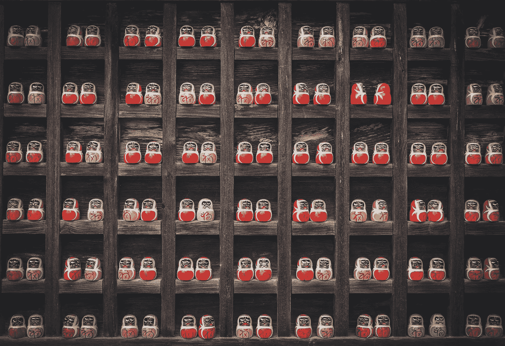

# 连接事物

> 原文：<https://medium.com/hackernoon/connecting-things-3b9f5f79e134>

解决问题是任何伟大产品或业务的核心。在每个闪亮的产品或灯泡创意背后，都有一个正在解决的实际问题。

当试图解决一个问题时，有两个关键活动我们必须进行，数据收集和数据连接。你收集的数据点越多，你就越需要将它们联系起来，形成创造性的模式。正如乔布斯曾经说过的，*[*创意*](https://hackernoon.com/tagged/creativity) *只是连接事物而已。”**

*建立最佳数据连接的最佳方式是收集两种类型的数据，具体数据和一般数据。*

*特定数据是您了解到的关于您试图解决的问题的信息。因此，如果你试图帮助机械师改善他们的日常生活，那么你应该花时间和一些机械师在一起。阅读各种力学书籍和杂志。采访机械师，问他们一些开放式的问题。吸收各种关于机械的信息，为什么他们做他们做的事情，他们喜欢做什么，他们不喜欢做什么，他们努力做什么。*

*然后，一旦你花了足够的时间深入了解这些机制，你应该开始看到一个模式出现。*

*当你在心流中时，做这种调查可能会很有趣，其他时候可能会有点累，但你会坚持下去，但无论哪种方式，我都很容易将这段时间视为工作。*

*数据收集的另一面是通用数据点。这可以来自任何地方。阅读任何你感兴趣的东西是收集通用数据的好方法。听播客或有声书，看电影和纪录片是更好的方式来增加我们一般数据存储的深度和多样性。*

*这种一般性的数据收集根本不像是工作，也不是真的，它只是生活。但是，你收集的非特定数据越多，当你开始连接数据点时，你就能做出越有趣的组合。*

*连接数据点可以随时随地发生。通常，在收集数据点的同时会发生大量的这种情况。随着你对你希望帮助的人以及他们所经历的问题的了解，你会开始看到你收集的不同数据点之间出现线索。*

*然而，通常我们需要远离我们正常的环境来创造最好的联系。你有没有注意到我们有多少最好的想法是在洗澡的时候产生的？*

*乔纳·莱勒认为这是为了让我们自己安静下来，阻止我们被外界干扰，去倾听我们潜意识中已经建立的一些联系:*

> *“……如此多的感悟发生在温水淋浴期间。对许多人来说，这是一天中最放松的部分。直到我们被温水按摩，无法查看电子邮件，我们才终于能够听到我们大脑深处的声音告诉我们洞察力。答案一直都是他们的——我们只是没有听进去。”*

*淋浴是创造性联系的典型温床，但安静、风景优美的散步也是如此。我发现我经常记下我在当地田野散步时想到的见解*(阅读:推特)*。*

*但是尽管创造力增加了，我经常发现很难证明去散步是正确的，因为这不像*感觉*工作*(别担心，我每天都洗澡)*。我在门外迈出的每一步都是离我的笔记本电脑一步，在那里我*觉得*我应该是，*富有成效*。*做工作*。*

*这是一个问题。如果我要以最有效、最有创意的方式解决最有趣的问题，那么我需要给自己时间呼吸。让自己平静下来。不要分心。我需要花时间把这些点联系起来。*

*这和数据收集一样多。我必须约束自己远离我的笔记本电脑，放松一下。*

*找到专注和安静之间的平衡。*

*数据收集和数据连接之间的平衡。*

> **创意只是把事物联系起来。当你问有创造力的人他们是怎么做一件事的时候，他们会觉得有点内疚，因为他们并没有真的去做，他们只是看到了一些东西。过了一会儿，他们似乎明白了。这是因为他们能够将他们的经历联系起来，并综合新的东西。他们能够做到这一点的原因是他们比其他人有更多的经历，或者他们对自己的经历思考得更多。不幸的是，这种商品太稀有了。我们行业中的很多人都没有非常多样化的经历。所以他们没有足够的点来连接，他们最终得到非常线性的解决方案，而没有对问题的广泛视角。一个人对人类经验的理解越广泛，我们就会有越好的* [*设计*](https://hackernoon.com/tagged/design) *。**
> 
> *史蒂夫·乔布斯，连线杂志，1995 年 2 月*

## *喜欢这篇文章吗？点击下面的小❤让你的朋友知道↓*

# *想要更多吗？我每周都会写一些小邮件，里面会有一些博客文章，就像这样。注册吧，如果你愿意，这是免费的。*

*[*或者✔我在推特上*](http://twitter.com/fredrivett)*

**原载于 2016 年 12 月 5 日*[*【fredrivett.com】*](http://fredrivett.com/2016/12/05/connecting-things/)*。**

******

> *[黑客中午](http://bit.ly/Hackernoon)是黑客如何开始他们的下午。我们是 [@AMI](http://bit.ly/atAMIatAMI) 家庭的一员。我们现在[接受投稿](http://bit.ly/hackernoonsubmission)并乐意[讨论广告&赞助](mailto:partners@amipublications.com)机会。*
> 
> *如果你喜欢这个故事，我们推荐你阅读我们的[最新科技故事](http://bit.ly/hackernoonlatestt)和[趋势科技故事](https://hackernoon.com/trending)。直到下一次，不要把世界的现实想当然！*

**