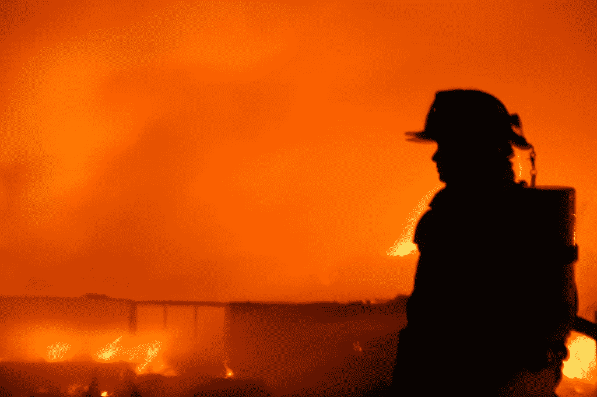
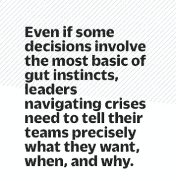

# 征服 3 种最常见的公司危机

> 原文：<https://medium.com/hackernoon/conquering-the-3-most-common-types-of-company-crisis-a863f903254b>

***[Photo:flickr user*** [***ljnixon***](https://www.flickr.com/photos/22812417@N05/)***]***

“危机管理”不是一个铁板一块的过程，也不是一种适合所有情况的技能。

## 无论规模、位置或行业，所有公司迟早都会面临某种危机。然而，问题是我们经常谈论“危机管理”,好像它是一个单一的技能或过程:你要么有，要么没有；你要么做好，要么彻底搞砸。

但事实并非如此，这种误解的影响也不难看出。密歇根大学和埃默里大学[的研究人员审查了数据](http://webuser.bus.umich.edu/lpwooten/pdf/adhr316450.pdf)并发现(不出所料),管理不当的危机往往是由准备不足的领导团队造成的，并导致广泛的长期后果，而有效处理危机的公司则设法全面迅速地恢复。

这里有一个基本的但未被充分重视的商业危机分类法，看看如何度过它们。

## 三种危机

**1。人事危机。**这是指关键人物存在严重的个人不当行为和不道德或非法活动。围绕创始人兼首席执行官罗杰·艾尔斯的性骚扰丑闻正在震撼福克斯新闻频道，这是这种危机的一个明显例子。这不仅反映了艾尔斯所谓的个人行为，也反映了他所领导的组织的文化。

即使有些决策涉及最基本的直觉，但应对危机的领导者需要准确地告诉团队他们想要什么，什么时候，为什么。

大众汽车前首席执行官马丁·文德恩(Martin Winterkorn)因涉嫌参与公司排放丑闻而受到调查，该丑闻于 2014 年开始与大众董事会其他成员一起曝光。该公司已经承认，为了通过排放测试，在大约 1100 万辆汽车上秘密安装了软件，调查人员现在似乎怀疑这一违规行为可能是高层领导管理不善(甚至已经开始)。

**2。系统性危机。** Chipotle 仍在努力从 2015 年末的一系列顾客食物中毒事件中恢复过来。这家公司(T2)终于扭亏为盈，但仍在努力扭亏为盈。Chipotle 的失败是组织上下的系统性运营危机——从供应链和质量控制到客户互动。

**3。背景危机。**英国退出欧盟、大规模枪击事件、恐怖主义:从地方性事件一直到地缘政治动荡，企业可能在某天早上醒来，突然不得不应对各种他们没有预见到的危机。这种类型的危机源自外部，但会极大地改变公司的经营环境。它造成心理混乱，使员工和顾客都不稳定。

麻省理工学院斯隆管理学院的彼得·圣吉教授曾经写道:

> 当人们不再是环境的受害者，而是参与创造新环境时，领导力就存在了。。。领导力就是创造一个领域，让人类不断加深对现实的理解，并更有能力参与世界的发展。归根结底，领导力就是创造新的现实。

这是一个很高的门槛——尤其是在危机时期。但是，如果领导人明白他们的工作已经是创造新的环境，那么命运的突然变化(即使是更坏的情况)可能实际上并不那么反常或可怕。你不能为每一个可能的突发事件制定一个行动计划，但是你没有必要这样做。这里有两个步骤来应对你永远无法预料的危机。

## 1.从自己开始，然后向外努力

管理危机意味着以平静、冷静和积极的态度接受难以置信的不确定性。这从来都不容易。但是处理棘手情况的紧迫感总是需要沉着冷静。

为了在危机来袭时尽快传达一个果断而灵活的计划，你需要有效地评估形势:

**1。** *问问自己:这种情况要求什么？这是一场人事危机、一场系统性危机，还是一场背景危机？*

**2。然后，根据你最终希望如何摆脱这场危机，制定一个即时的应对策略——即使你不知道你将如何实现——并将其传达给你的团队、合作伙伴和客户。**

**3。** *最后，当你开始推行这一战略时，根据危机如何演变，留意(你自己和你的组织)执行这一战略的能力(它会的！)—同时不忽略您公司的资产、结构和能力。*

听起来很难处理？平心而论，的确如此。2014 年，玛丽·巴拉成为通用汽车公司(General Motors)的首位女性首席执行官。上任仅两个月后，通用汽车就不得不召回 170 万辆点火开关存在缺陷的汽车，这导致了十几起死亡事故——这是一场明显的系统性危机，可能会在人事层面产生影响。

巴拉迅速行动起来。她亲自前往媒体参观，并为通用汽车的严重错误道歉。正如[纽约时报](http://www.nytimes.com/2014/03/19/business/gm-creates-a-global-vehicle-safety-position.html?_r=1)报道的，“这是通用汽车公司前所未有的时刻:最高执行官亲自并公开介入公司历史上最严重的安全问题之一。她的表现明显偏离了汽车行业的常规，在这个行业，除非国会传唤，否则公司高管通常会避免谈论召回事件。

在评估形势后，Barra 承担了处理通用汽车危机的个人责任，防止了系统性危机升级为不可挽回的公关灾难和领导失败。

## 2.影响他人，然后让他们影响你

成功的领导者无论在顺境还是逆境都能激励和影响每个人——他们的高管团队、员工、顾客、客户、合作伙伴、投资者以及其他许多人。这也是工作描述的一部分。即使有些决定涉及最基本的直觉，领导在危机中航行也需要准确地告诉他们的团队他们想要什么，什么时候，为什么——然后帮助他们实现。等待太久来权衡反对意见可能会招致厄运。

以下是全国建筑协会主席大卫·罗伯兹在英国退出欧盟投票后说的话:

> 在高度不确定和波动的时期，英国总是处于最佳状态。重要的决定即将到来，但在接下来的几天、几周和几个月里，我们都有责任以冷静、深思熟虑和积极的方式解决这些问题。尽管有反对者，经济将继续有效运行；消费者仍然需要储蓄、借贷和投资，我们将一如既往地支持他们。

罗伯茨即使在努力平息恐惧时也没有诉诸抽象；他简明地描述了英国经济的目标是什么，以及哪些消费者的需求保持不变。这是在背景危机中鼓舞人心的谈话，但也是一种行军命令——这是我们接下来都需要做的——反映了圣吉帮助人们“更有能力参与世界的发展”的目标

在不确定的时期进行有效的沟通意味着不仅仅是阐明你的观点，而是积极倾听——不带偏见或判断，真正愿意考虑不同的观点。罗伯茨也承认这一点，当他提到合作解决问题的共同责任时。

这意味着不仅要注意他人想法的内容，还要注意他们的情感基调。两者对于相互理解都至关重要，最终，每个人都可以重新站起来。

***【图片:flickr 用户***[***LJ Nixon***](https://www.flickr.com/photos/22812417@N05/)

***原文 *@*** [***快公司***](http://www.fastcompany.com/3062710/the-three-kinds-of-crisis-companies-face-and-how-to-pull-through) **。***

*版权所有 2016 年由费萨尔霍克。保留所有权利。*

*我是一名企业家和作家。 [SHADOKA](http://shadoka.com/) 等公司创始人。Shadoka 促进企业家精神、增长和社会影响。《万物互联——如何在创意、创新和可持续发展的时代进行变革和领导》(麦格劳·希尔，2014 年)和《生存与发展:富有弹性的企业家、创新者和领导者的 27 种实践》(励志出版社，2015 年)。在推特上关注我 [@faisal_hoque](https://twitter.com/faisal_hoque) 。*

********

> *[黑客中午](http://bit.ly/Hackernoon)是黑客如何开始他们的下午。我们是阿妹家庭的一员。我们现在[接受投稿](http://bit.ly/hackernoonsubmission)并乐意[讨论广告&赞助](mailto:partners@amipublications.com)的机会。*
> 
> *如果你喜欢这个故事，我们推荐你阅读我们的[最新科技故事](http://bit.ly/hackernoonlatestt)和[趋势科技故事](https://hackernoon.com/trending)。直到下一次，不要把世界的现实想当然！*

**