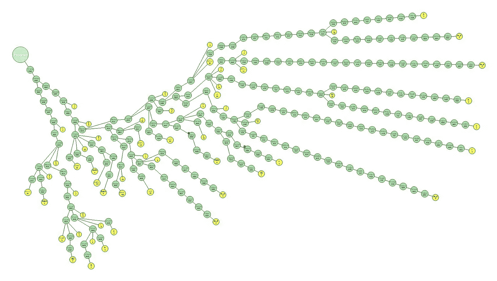

# 对 YAML 的解析一直很糟糕

> 原文：<https://medium.com/hackernoon/consistently-bad-parsing-of-yaml-ae23eb3676a1>



[Credit](https://upload.wikimedia.org/wikipedia/commons/4/4d/Cdsan-Samples-CppParseTree-01-HiRes.jpg)

解析器不容易做对。`libyaml`， [YAML](https://hackernoon.com/tagged/yaml) 的引用解析器，做了大多数正确的事情。然而，有一件小事它做错了，但是因为它做的其他事情都很好，这件小事被忽略了。更糟糕的是，其他解析器实现故意做错了，因为“这就是`libyaml`的工作方式”。尽管还有希望，继续读下去。

```
Found unexpected ‘:’ 
```

如果您正在[解析](https://hackernoon.com/tagged/parsing)YAML——您很可能是这样或那样的人——您可能会在解析以下内容时发现这个错误:

```
urls: [[https://medium.com](/)]
```

(即流程顺序)

或者:

```
location: {url: [https://medium.com](/)}
```

(即流映射)

尽管 YAML 规范明确地说它是有效的:

> 通常情况下，YAML 坚持将*`***:***`*”映射值指示器*与值用空格隔开。这种限制的一个好处是“`**:**`”字符可以在普通标量中使用，只要它后面没有空格。这允许无引号的 URL 和时间戳。*

# *发生什么事了？*

*这是因为您的用于<insert_your_language_here>的 YAML 解析器要么依赖于`libyaml`(作为共享库加载并提供到它的绑定)，要么使用`libyaml`作为它们的引用解析器，换句话说，作为“所有 YAML 解析器之母”并镜像其行为，而不是严格遵循 YAML 规范。这没什么大不了的，但我是在转述事实。</insert_your_language_here>*

*T21 的好消息是有一个简单的解决方法。在流上下文中引用包含冒号的字符串也可以(即`'https://medium.com'`)。*

*坏消息是，似乎不同语言的解析器处理这个问题的方式不一致:*

*   *Python `pyyaml`抛出了一个错误，一个 [PR](https://github.com/yaml/pyyaml/pull/45) 修复了这个错误，已经被合并但是还没有发布*
*   *Ruby `psych`抛出一个错误*
*   *Golang `go-yaml`抛出错误，问题提交[此处](https://github.com/go-yaml/yaml/issues/295)*
*   *Java `snakeyaml`抛出错误，问题提交[此处](https://bitbucket.org/asomov/snakeyaml/issues/397)*
*   *JavaScript `JS-YAML`很好地处理了这个问题*

*并且:*

*   *`libyaml`抛出了一个错误，但是**另一个好消息**是有一个 [PR](https://github.com/yaml/libyaml/pull/28) 解决了这个问题*

*总而言之，到目前为止，唯一能正确处理这个问题的解析器是 JavaScript 解析器。的问题是，如果你的堆栈由 JavaScript 和任何其他语言组成，并且你正在全面解析 YAML，这可能会导致不一致的解析行为，这不是很好。*