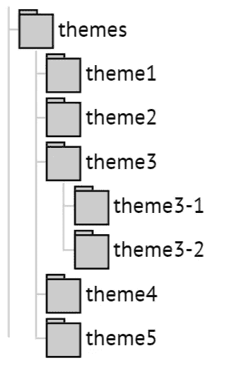
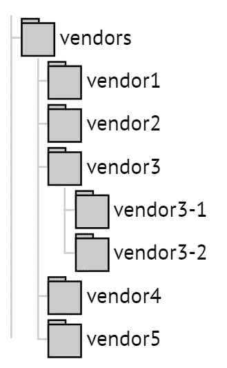

# 安慰成团。向光明面的过渡。日常任务的自动化

> 原文：<https://medium.com/hackernoon/console-into-mass-the-transit-to-the-light-side-automatization-of-routine-tasks-af3200bd9a47>

# 介绍

不管我们做了什么，输入命令有多快，事实是，我们仍然无法击败计算机的性能。从另一方面来说，如果我们多次重复同一个动作，我们很容易让计算机为难，不是吗？你可以写一个`bash`脚本(你最喜欢的编程语言),而不是输入相同的命令，浪费你的时间和精力，运行脚本，给自己一些时间，坐在座位上，想想永恒、宇宙或任何其他出现在你脑海中的东西。

在[上一篇文章](/@var_bin/console-into-mass-bash-scripting-698f75c20163#.5c94xtuwi)中，我们讨论了`bash`编程的原则。今天我们将学习如何在实践中应用这些知识。

## 自动化计划

1.  快速`diff`
2.  快速`diff` +吉拉 API
3.  清洁`_dist`
4.  更新大量存储库
5.  克隆大量的存储库
6.  有用的别名

给定的计划包括一些我每天做几次(有时甚至一小时)的任务。总的来说，自动化是一个独特的和原始的过程，它允许自动化你能想到的任何事情。希望在你读完这篇文章的时候，你会想出自己的自动化计划来超越你的 PC 性能。所以，在我们开始之前，给自己泡一杯热咖啡，享受我们用`bash`进入自动化世界的冒险。

# 快速差分

个人比较喜欢用 [Git](https://git-scm.com/) 。创建`diff`是一项频繁的任务，需要输入以下命令:
`git diff origin/master origin/<branch-name> > "${HOME}/diff/diff-<branch-name>.diff"`

`<branch-name>` —是我们需要为其创建`diff`的分支的名称

## 给定方法的缺点

1.  只能手动输入命令
2.  错误键入命令的风险
3.  不容易记住

然而，如果你使用`bash`，这些问题都可以解决。您应该能够:

1.  输入命令
2.  输入分支机构的名称
3.  获取`diff`

> 顺利完成这一切。

## 这是 end 命令的外观

`gdd <branch-name>`

## 使自动化

现在不用输入很长的命令，输入`./fast_diff.sh <branch-name>`就够了。脚本会提醒您输入分支机构的名称，以防您忘记输入。

## 最后一笔

此时，您可能会对 end 命令感到疑惑，因为使用该脚本并不方便，因为我们仍然被绑定到我们使用的目录。

让我们仔细看看如何为执行文件创建一个新命令，而不是每次都写一个相对/绝对路径。

每个用户都有一个子目录`~/bin`，存储执行文件。如果你没有，你可以很容易地创建它。让它的使用如此方便的是，那里的所有文件都可以通过名字来访问，不需要指定它们的路径。我把用来创建`diff` :
`#!/bin/bash
"${HOME}/htdocs/rybka/tools/fast_diff.sh" "$@"`的`gdd`文件移到了这个子目录

**一些重要提示:**

1.  不需要指定文件扩展名。
2.  属性`x`应该以明确的方式指定(`chmod +x <filename>`)
3.  如果在`$PATH`变量中没有找到`bin`，应该通过键入:`PATH="${PATH}:${HOME}/bin"`使其更加明显。

重新启动终端，使该文件可访问。现在，为了创建`diff`，您只需要输入给定的命令:

`gdd <branch-name>`

如果您不喜欢为每个命令创建一个新文件，您可以使用符号链接来优化此过程:

`ln -s "${HOME}/htdocs/rybka/tools/fast_diff.sh" gdd`

# 快速差分+吉拉 API

如果你使用吉拉或任何其他 API 任务管理器，你可以走得更远。例如，在吉拉 API 的帮助下，可以将 diff 分配给某个任务。为此，您需要使用[卷曲](https://curl.haxx.se/)。

## 求解算法

1.  运行脚本
2.  定义任务`id`
3.  如果任务`id`尚未提供，则向用户发送消息
4.  假设所有操作都已正确完成，我们生成`diff`并将其分配给一个任务

## 这是 end 命令的外观

`gdd_jira <issue_id>`

## 使自动化

您可能已经注意到了，这一次我们不需要将分支的名称传递给脚本。我们可以通过使用`git`命令:
`branch=$(git rev-parse — abbrev-ref HEAD)`执行一些简单的操作来得到它

# 清洁 _ 距离

在我们继续之前，让我们看看`_dist`目录是做什么用的。简单来说，就是 build 系统启动后([咕噜](http://gruntjs.com/)、[大口](http://gulpjs.com/)等)保存所有`CSS`、`JavaScript`、模板([翡翠/泥巴](https://pugjs.org/api/getting-started.html)、[车把](http://handlebarsjs.com/)等)等文件的地方。该目录不一定必须带有`_dist`名称。你可以找到许多不同的变化。

在其中一个项目中，我们使用 Grunt。然而，我们的团队经常会遇到一个问题，那就是在一些文件中似乎并不总是能看到变化，大多数文件中的[更少](http://lesscss.org/)。为了解决这个问题，你可以一次清理一个或者所有主题的`_dist`目录。为此，您也可以使用 Grunt，手动清理目录，然而，它不会像使用`bash`那样有效。这里有更多的目录，不是一两个，甚至不是二十个。他们有很多人。使用脚本时的主要要求是不要在没有必要的情况下用包装器和/或依赖项使它过载。

让我们看看如何用 shell 的力量来做同样的事情:
`find <path-to-themes> -type d -name "_dist" | xargs rm -rfv`

`<path-to-themes>` —主题目录的路径

给定方法的缺点与`diff`创建的情况相同。另外，没有选项来指定我们想要删除的主题目录。

## 求解算法

1.  运行脚本
2.  如果你没有主题的名称，你可以删除`_dist`目录中的所有主题
3.  如果你有一个特定的主题名称，删除`_dist`只为这一个

## 这是 end 命令的外观

`clean_dist [<theme_name>]`

## 使自动化

# 更新大量存储库

假设您在一个大型项目中工作，该项目包含第三方存储库的目录，即使您没有创建它们，您仍然需要支持和更新。如果他们是两个或三个，这可能不是一个大问题，虽然，就我个人而言，我不会这么有信心。

> 但是，如果您有超过 10-15 个存储库需要支持，该怎么办呢？

你需要花很多时间不断地跟踪他们。那么为什么不将这个过程自动化呢？

## 求解算法

1.  转到带有存储库的目录
2.  检查仓库是否在`master`分支中
3.  如果不存在，运行`git checkout`
4.  然后`git pull`

**重要提示。**即使存储库已经切换到`master`分支，它仍然有可能没有被更新。考虑到这一点，无论如何都应该竞选`git pull`。

## 这是 end 命令的外观

`up_repo`

## 使自动化

# 克隆大量的存储库

这个过程与前一个过程紧密相连。以使用户能够在实践中使用先前的命令。我需要为他/她提供一个第三方开发人员的存储库，将它添加到一个`bash/core/vendors`目录中(用户不一定需要知道)。根据`npm modules`的类比，这个存储库不应该和主存储库放在一起。用户所要做的就是执行命令，等待所有存储库的克隆完成。

## 求解算法

1.  储存库列表被设置为一个数组
2.  运行阵列周期
3.  如果一个供应商有多个存储库，要特别注意
4.  多做几项检查
5.  执行`git clone`

## 这是 end 命令的外观

`clone_repo`

## 使自动化

# 有用的别名

我想问我的读者几个问题，希望你诚实地回答。您多久使用一次这个命令？

这个命令呢？
`git status`

这个呢？
`git push origin <branch-name>`

你经常用这个吗？
`ps aux | grep <user-name>`

这个列表可以扩展，很可能每个人都有他/她经常使用的命令。因此，您可能会突然想到，对于所有这些命令，创建别名是一个明智的想法。

在下面的列表中，你会发现一些我日常使用的别名:

为了检查已经设置了哪些别名，您想要运行命令`alias`，但是没有特定的参数。

## 存储别名的位置

要创建永久别名，请将其添加到用户主目录(`~`)下的`.bashrc`文件中。您也可以将其添加到`.gitconfig`文件中，以便使用`git`。

## 不要深夜改化名

别名是一个强大的工具。然而，这里所有的密码。

> 睡觉前不要改化名。

我确实碰巧在深夜换了一个。接下来发生了什么你可以猜到。我不记得我做过，我花了一天的大部分时间试图找出为什么没有工作。

# 最后

当我刚进入`bash`的原理时，我的第一个想法是:“停，它们不就是系统管理员需要的吗？”。然而，我确实明白这一知识的重要性，它能让我减轻日常事务的负担。今天，我可以自信地说，如果你的工作与远程服务器或`OS *nix`有关，或者你与`Windows OS`([Bash on Ubuntu on Windows](https://blogs.msdn.microsoft.com/commandline/2016/04/06/bash-on-ubuntu-on-windows-download-now-3/)、 [Windows 和 Ubuntu Interoperability](https://blogs.msdn.microsoft.com/wsl/2016/10/19/windows-and-ubuntu-interoperability/) )一起工作，那么对`bash`原理的了解和理解将会非常有用。

> 简单地说，脚本只不过是系统命令的基本列表，全部写在一个文件中。

不过，使用这个文件可以简化许多例行任务的执行，否则，您需要手动完成这些任务。

这里有一些与`bash`功能相关的链接，其中一些我已经在我的例子中展示过了:

1.  [输入/输出重定向](http://tldp.org/LDP/abs/html/io-redirection.html)
2.  [功能](http://tldp.org/LDP/abs/html/functions.html)
3.  [数组](http://tldp.org/LDP/abs/html/arrays.html)
4.  [双括号结构](http://tldp.org/LDP/abs/html/dblparens.html#CVARS)
5.  [特殊字符(管道)](http://tldp.org/LDP/abs/html/special-chars.html)
6.  [退出和退出状态](http://tldp.org/LDP/abs/html/exit-status.html)
7.  [别名](http://tldp.org/LDP/abs/html/aliases.html)
8.  [如何给$PATH 变量添加路径](http://unix.stackexchange.com/questions/26047/how-to-correctly-add-a-path-to-path)

就是这样。感谢您的关注，特别感谢那些把文章读完的人。

> [黑客中午](http://bit.ly/Hackernoon)是黑客如何开始他们的下午。我们是 [@AMI](http://bit.ly/atAMIatAMI) 家庭的一员。我们现在[接受投稿](http://bit.ly/hackernoonsubmission)，并乐意[讨论广告&赞助](mailto:partners@amipublications.com)机会。
> 
> 如果你喜欢这个故事，我们推荐你阅读我们的[最新科技故事](http://bit.ly/hackernoonlatestt)和[趋势科技故事](https://hackernoon.com/trending)。直到下一次，不要把世界的现实想当然！

