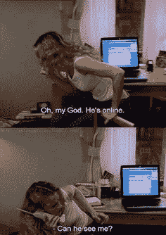
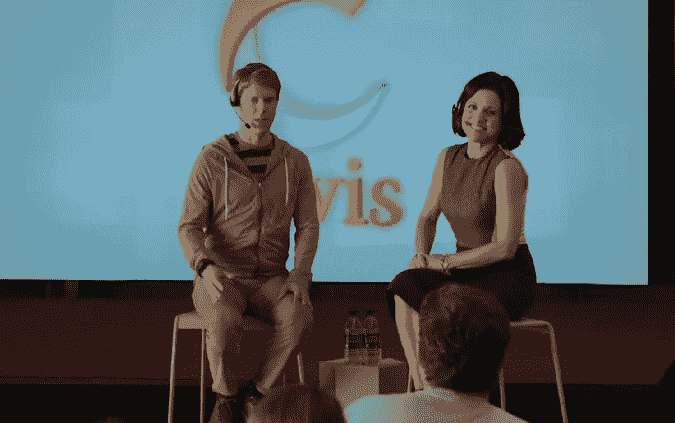

# 消费科技对流行文化来说太快了？

> 原文：<https://medium.com/hackernoon/consumer-tech-too-fast-for-pop-culture-7be1362b8685>

最近重播的《欲望都市》让我很不舒服。这不是因为*的性别*或*的城市*——尽管在大都会歌剧院附近的麦当劳里看到奥斯卡·德拉伦塔是值得畏缩的——而是因为消费技术的现状。

“Sex and the City”/HBO

每当有即时消息出现时，卡丽就躲开她的电脑屏幕，以为发消息的人能看到她，而夏洛特刚刚发现亚马逊提供书籍。iPhone 在系列电影结束后很久才在第一部电影中登场。(凯莉疑惑地看着它，然后把它还给萨曼莎。)

自那以后，已经有很多关于今天的《欲望都市》会是什么样的科技文章——凯莉会有多少推特粉丝，萨曼莎的社交媒体营销建议，夏洛特在 Pinterest 上的表现。

但那是十多年前的事了。节目可以原谅。更令人不安的是，最近的一些节目押注于一种科技趋势，而且在短期内仍会失败。

最近，另一部 HBO 电视剧的重播让我想起了这种不适。

大约两年前，朱莉娅·路易斯·德利法斯在《副总统》中扮演的角色塞琳娜·梅尔去硅谷为她的总统竞选筹款。她会在一家名为 Clovis 和 at-ready 的热门初创企业停下来。—雅虎。是的，这家苦苦挣扎的互联网公司，有些人已经开始倒计时了。公平地说，在剧集播出前的两年里，雅虎的股票上涨了近 124%，这意味着该股对编剧来说可能看起来很有前景。在同样的两年里，[谷歌](http://data.cnbc.com/quotes/GOOGL)(现在的 Alphabet)拥有雅虎收益的一半，而[苹果](http://data.cnbc.com/quotes/AAPL)实际上是负数。玛丽莎·梅耶尔(有点像梅耶尔)领导的雅虎可能也有一些吸引力。

幸运的是，这个时刻大部分都被梅耶尔的日程安排员保存了下来，他提醒副总裁不要在雅虎使用谷歌作为动词。"他们在雅虎那里."

“VEEP”/HBO

虚构的科技公司 Clovis 也以重播的形式呈现了一个令人分心的时刻。虽然它被描述成一只类似谷歌的独角兽(但显然不是谷歌，因为这一集提到了谷歌)，但它的估值实际上是一个无心的笑话。副总统非常惊讶地被告知，克洛维斯价值约 30 亿美元——这在今天意味着约 2 倍 Lyft、5 倍 Snapchat、8 倍 Airbnb 或 20 倍优步。

然而，这种有意的玩笑今天仍然很流行。智能手表仍在努力通过一次非常有力的握手来证明它的智能，梅耶可能很想知道这些“网络小子”是使用浴室还是“把他们的粪便放在云端”

这与其说是对现代内容的批评，不如说是对消费技术和流行文化努力跟上潮流的观察。

也许有一天，一个不经意的笑话会说，这一切都不会发生在虚拟现实中。

Oculus Rift

> [黑客中午](http://bit.ly/Hackernoon)是黑客如何开始他们的下午。我们是 [@AMI](http://bit.ly/atAMIatAMI) 家庭的一员。我们现在[接受投稿](http://bit.ly/hackernoonsubmission)并乐意[讨论广告&赞助](mailto:partners@amipublications.com)机会。
> 
> 如果你喜欢这个故事，我们推荐你阅读我们的[最新科技故事](http://bit.ly/hackernoonlatestt)和[趋势科技故事](https://hackernoon.com/trending)。直到下一次，不要把世界的现实想当然！

