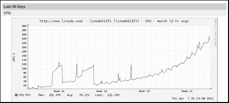
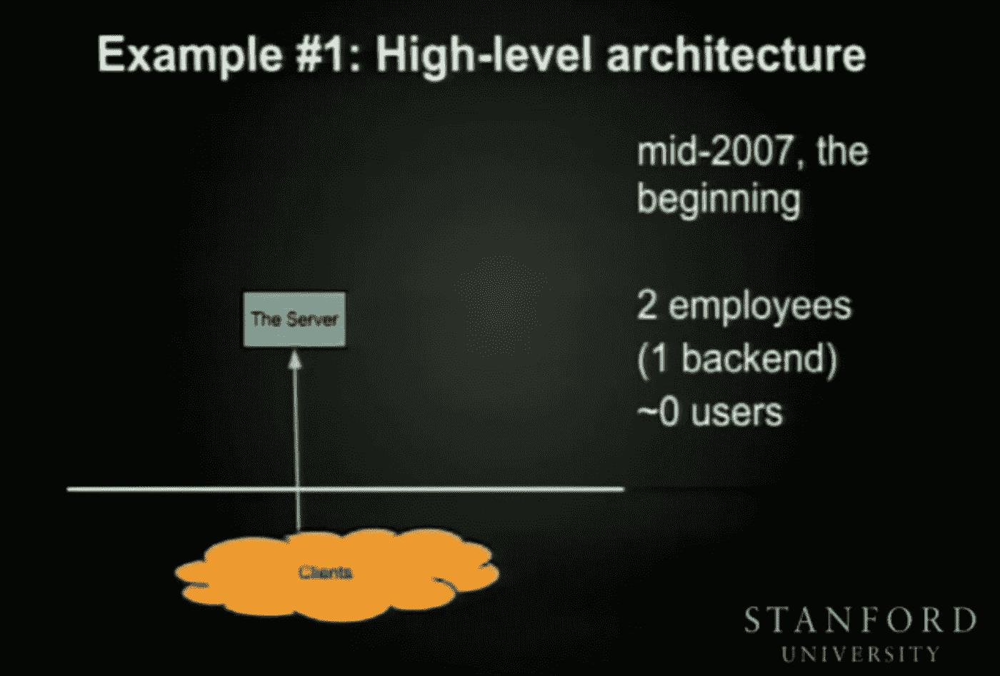
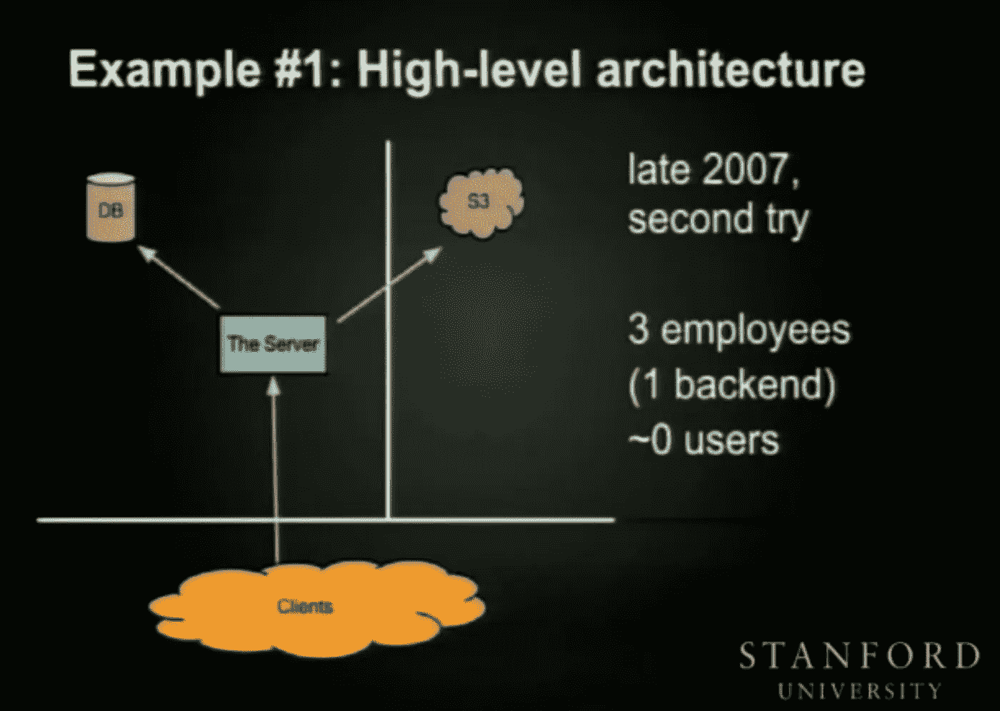
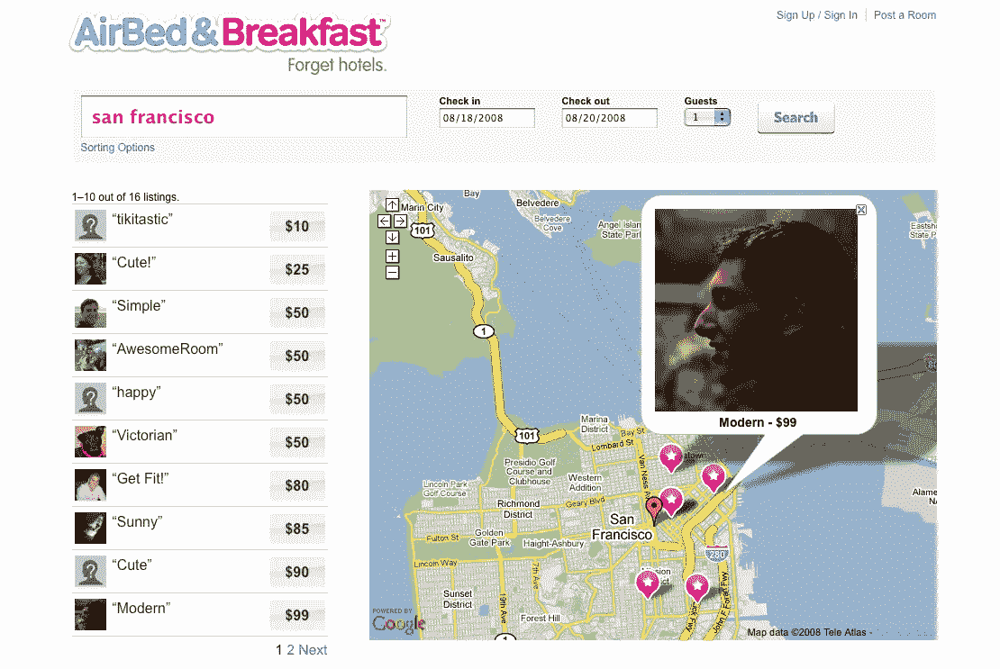

# 消费者不关心你的技术

> 原文：<https://medium.com/hackernoon/consumers-dont-care-about-your-technology-4d5cb687d1de>

本着验证一个想法并快速起步的精神，公司通常在一开始就建立一个 MVP，或最小可行产品。但是一个公司靠 MVP 能生存多久？消费者真的关心幕后发生的事情或者一个系统有多脆弱吗？

简而言之，答案是否定的。如果一种产品服务于消费者的需求，历史表明，技术的作用非常小。要么是因为缺乏关心，要么是因为缺乏知识。

让我们来看看三家成功的大规模 MVP 公司——Buffer、Dropbox 和 Airbnb。

# Buffer——服务于 400 多万人的社交媒体日程安排应用。

在[2014 年发布的一篇博客文章](https://stories.buffer.com/the-cronjob-that-generates-4-million-a-year-4540b0cde584)中，Buffer 承认仍然在运行他们的整个调度架构，这个架构是由创始人[乔尔·加斯科因](https://www.google.com/url?sa=t&rct=j&q=&esrc=s&source=web&cd=6&cad=rja&uact=8&ved=0ahUKEwiz1sGx1sjXAhWkhFQKHb3HDzkQ6F4ISDAF&url=https%3A%2F%2Ftwitter.com%2Fjoelgascoigne%3Fref_src%3Dtwsrc%255Egoogle%257Ctwcamp%255Eserp%257Ctwgr%255Eauthor&usg=AOvVaw3j1P7f_U-pl8YDzpuwcsKp)在他 2010 年的卧室里设计的——一个 cron 工作。您知道，基于 Unix 的操作系统级调度程序设计用于运行 shell 脚本，如更新软件或与 NTP 服务器同步系统时钟。

根据设计，cron 是单线程的。该进程休眠，直到一个调度的作业准备好运行，在这种情况下，它将派生一个进程来运行该调度的作业，然后返回休眠，直到另一个作业被调度。

正如 Buffer 最终发现的那样，这可能会导致一些问题。

1.  没有托管线程或进程池，这意味着如果您分叉太多进程或进程需要太长时间才能完成，您将会过度利用您的机器，导致崩溃或至少导致重要进程停止。发生这种情况时，缓冲区会垂直扩展，升级到更大的虚拟实例，从而延迟问题的出现。
2.  如果调度进程的时间超过了调度间隔(在本例中为 1 分钟)，那么调度将开始延迟，因为没有并发调度。

cron 作业负责每分钟查询他们的数据库**，以找到预计在该分钟发布的帖子。幸运的是，现在有了 AWS 等构建的数据库抽象层，您可以快速扩展一个表来处理这样的读密集型操作，但它仍然注定会失败。如果扫描表格的时间超过了预定的时间间隔(1 分钟)，那么帖子将被延迟，这还不包括准备帖子的处理时间和发布到社交媒体平台的网络延迟。**

CPU usage of Buffer’s single server running both the web-app and SQL database

在规模上，Buffer 开始看到 4 分钟的帖子延迟。为了适应不断增长的数据库表，他们将调度间隔更改为 15 分钟。这意味着 cron 作业现在查找未来 15 分钟内发出的帖子，每小时运行 4 次，而不是 60 次。

他们还将处理转移到实用服务器的服务器池中，这些服务器通过 JMS 消息总线——亚马逊的 SQS——接收 post 意图。尽管所有的意图调度仍然由单个 cron 作业处理。

尽管仍然很大程度上依赖于 MVP 系统，Buffer 轻松获得了近 1600 万美元的收入。

[https://buffer.baremetrics.com/stats/arr](https://buffer.baremetrics.com/stats/arr)

# **Dropbox——拥有超过 5 亿用户的文件备份应用**

在[2012 年斯坦福大学的一次演讲](https://www.youtube.com/watch?v=PE4gwstWhmc)中，[凯文·莫泽莱夫斯基](https://www.google.com/url?sa=t&rct=j&q=&esrc=s&source=web&cd=1&cad=rja&uact=8&ved=0ahUKEwippbD_5cjXAhUnl1QKHUKUCbQQFggoMAA&url=https%3A%2F%2Ftwitter.com%2Fkevmod%3Flang%3Den&usg=AOvVaw0YDh3sS35PPLh61sVZaQmc)回顾了 Dropbox 的前五年，以及试图大规模运营 MVP 时遇到的技术限制。

可能由于当今技术的进步和访问的便利，今天大多数人可能会使用 HDFS(如亚马逊的 S3)来构建文件存储应用程序。你可以以低廉的价格存储大量数据，并且仍然可以相对快速地访问。然后，元数据可以存储在数据库中以供查找。

然而，当 Dropbox 的创始人[德鲁·休斯顿](https://www.google.com/url?sa=t&rct=j&q=&esrc=s&source=web&cd=1&cad=rja&uact=8&ved=0ahUKEwjGmZbM6MjXAhUhsVQKHcL6Ah8QFggoMAA&url=https%3A%2F%2Ftwitter.com%2Fdrewhouston%3Flang%3Den&usg=AOvVaw2g1ljNYQP18VFI_NrpO6HZ)第一次构思这个想法并应用于 YC 时，亚马逊的 S3 刚刚发布，HDFS 即服务的想法还是相当新的。大概因此，Dropbox 被设计成在单台机器上运行，负责为静态网站提供服务，在 MySQL 中存储元数据，并将文件持久化到其本地磁盘。

[https://www.youtube.com/watch?v=PE4gwstWhmc](https://www.youtube.com/watch?v=PE4gwstWhmc)

当年晚些时候，在用完磁盘空间并锁定 CPU 后，Drew 将数据存储转移到 S3，并将元数据从单台机器迁移到专用的数据库实例中。

[https://www.youtube.com/watch?v=PE4gwstWhmc](https://www.youtube.com/watch?v=PE4gwstWhmc)

# **Airbnb——有 4480 万人睡在别人家里的公寓共享应用**

今天，Airbnb 有一个优雅简单的 UX 和一个功能丰富的仪表盘。但是，情况并非总是如此。你喜欢的公寓共享应用曾经是这样的:

AirBed & Breakfast, now Airbnb

第一次迭代只是一个静态网站，允许设计会议的与会者给 Brian Chesky 和 Joe Gebbia 发电子邮件，要求在他们旧金山公寓的气垫上睡觉。

在“成功”推出 3 个快乐的客人之后，室友们决定聘请 Nathan Blecharczyk 来帮助他们建立一个更强大的网站，如上图所示。

该网站仍然非常简单，几年后他们才注意到任何重大增长，并开始添加更多功能，如“星级”属性的能力。

# 什么是正确的方法？

在重新设计系统之前，你应该把 MVP 推到它的技术极限吗？你是否应该[设计一个从第一天](https://www.google.com/url?sa=t&rct=j&q=&esrc=s&source=web&cd=1&cad=rja&uact=8&ved=0ahUKEwj0jNjX68jXAhWCiVQKHVgtDAkQFgg1MAA&url=https://cloudcampaign.wordpress.com/2017/05/04/building-a-tech-stack-that-scales/&usg=AOvVaw0n0x6Rn22OLIWIg_S1rU7j)就可以扩展的堆栈？生存偏差起了多大的作用？

下面分享一下你的想法。