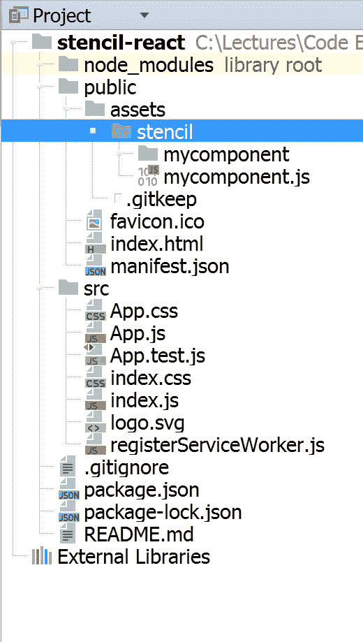

# 在 React 应用程序中使用模板组件

> 原文：<https://medium.com/hackernoon/consuming-a-stencil-component-in-react-app-aa3f37f9e49a>

几天前有人问我一个问题，如何在 [React](https://hackernoon.com/tagged/react) 应用中使用模板组件。由于 Stencil 是一个生成定制元素的编译器，你可以在任何框架/库中使用任何由 Stencil 生成的组件，而不仅仅是在 React 应用中。

另一方面，我问自己为什么不创建一个示例应用程序来展示这一点，这就是为什么写这篇文章的原因:)

## 模具组件

在我的第一篇模板文章[模板介绍](/@gilfink/getting-started-with-stencil-7e331962a9f1)中，我展示了一个可折叠面板组件片段。在本文中，我将在 React 应用程序中使用该组件。

## 添加组件代码

我使用 **create-react-app** 项目模板创建了 React 应用程序。如果您也想生成它，请使用以下命令行代码:

```
npm install -g create-react-app

create-react-app stencil-react
```

第一行将在您的机器上全局安装 **create-react-app** 生成器，第二行将生成 **stencil-react** app 框架。

然后，将可折叠面板组件构建的代码作为资产添加到项目中。在**公共**文件夹中，创建一个**资产**文件夹，然后在那里添加模板组件:



Adding The Stencil Component

*注意:添加组件代码也可以通过导入节点模块、添加*[*CDN*](https://hackernoon.com/tagged/cdn)*中存在的脚本等方式完成。为了简单起见，我只添加了整个组件代码。*

在**公共**文件夹下的**index.html**中，添加组件脚本:

```
<!DOCTYPE **html**>
<**html lang="en"**>
  <**head**>
    <**meta charset="utf-8"**>
    <**meta name="viewport" content="width=device-width, initial-scale=1, shrink-to-fit=no"**>
    <**meta name="theme-color" content="#000000"**>
    <**link rel="manifest" href="%PUBLIC_URL%/manifest.json"**>
    <**link rel="shortcut icon" href="%PUBLIC_URL%/favicon.ico"**>
    <**title**>React App</**title**>
  </**head**>
  <**body**>
    <**noscript**>
      You need to enable JavaScript to run this app.
    </**noscript**>
    <**div id="root"**></**div**> <**script src="assets/stencil/mycomponent.js"**></**script**>
  </**body**>
</**html**>
```

## 使用模具组件

既然我们设置了所有的环境，我们可以像使用任何其他 web 组件一样使用模板组件。我更新了 **App.js** 代码如下:

```
**import** React, { Component } **from 'react'**;
**import** logo **from './logo.svg'**;
**import './App.css'**;

**class** App **extends** Component {
    **collapseTitle** = **'Collapse Me!'**;

    toggle() {
        **this**.**refs**.collapsiblePanel.toggle();
    }

  render() {
    **return** (
      <**div className="App"**>
        <**header className="App-header"**>
          <**img src=**{logo} **className="App-logo" alt="logo"** />
          <**h1 className="App-title"**>Welcome to React</**h1**>
        </**header**>
        <**p className="App-intro"**>
          To get started, edit <**code**>src/App.js</**code**> and save to reload.
        </**p**>
          <**collapsible-panel ref="collapsiblePanel" title=**{**this**.**collapseTitle**}>
              <**ul**>
                <**li**>Components are awesome!</**li**>
                <**li**>They drive the web</**li**>
              </**ul**>
          </**collapsible-panel**>
          <**button onClick=**{**this**.toggle.bind(**this**)}>Toggle from outside!</**button**>
    </**div**>
    );
  }
}

**export default** App;
```

如您所见，我使用了常规的 React 代码，并与模板生成的组件绑定。没什么特别的。在**渲染**函数中，我添加了可折叠面板，并将其标题绑定到 React 组件 **collapsibleTitle** 成员。我还添加了一个 **ref** 属性，使**切换**功能能够从外部切换面板。

如果使用`npm run start`命令运行应用程序，输出将是:


The Running App

## 摘要

在 React 应用中使用模板组件就像添加组件脚本并使用它一样简单。模板也可以从任何其他框架中消耗，包括角形、Vue 或聚合物，这使得它超级强大。

你可以在这里找到 app 代码[。](https://github.com/gilf/stencil-react)

#使用平台