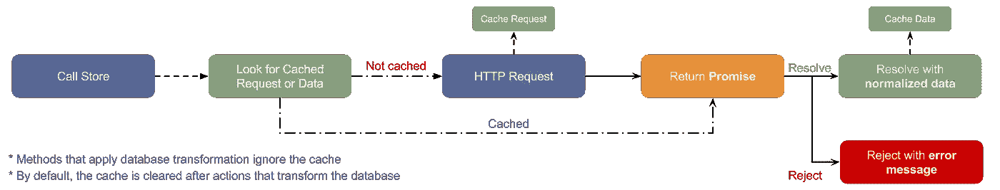

# 使用 Premiere 使用 RESTful APIs

> 原文：<https://medium.com/hackernoon/consuming-restful-apis-with-premiere-ae712d1bc935>

## 如果你喜欢面向对象开发，喜欢 Rails Active Record 和 Laravel 口才，你会喜欢 [*Premiere*](https://pedsmoreira.github.io/premiere/) *。*

RESTful APIs 在过去几年中非常流行，尽管后端已经有了很大的进步，但前端仍然缺少一些库来简化开发过程。这时候 [**首映**](https://pedsmoreira.github.io/premiere/) 开始行动。

尽管有一些好的选择，如 [Restangular](https://github.com/mgonto/restangular) 和[JS-Data](http://www.js-data.io/),[Premiere](https://pedsmoreira.github.io/premiere/)是一个更简单的面向对象的选择，专注于 APIs 目标是给你的浏览器带来与 Rails Active Record 和 Laravel 口才(T21)相同的简单性。

为此， [Premiere](https://pedsmoreira.github.io/premiere/) 以围绕模型工作为中心，并提供了规范化和方法，如*隶属于*，*有一个*，*查找，全部；*可以很容易地配置为缓存并减少应用程序的网络使用。为了解析路由，Premiere 使用 RESTful 标准，所以你不必手动配置每一个，要了解更多，请查看[https://github.com/WhiteHouse/api-standards](https://github.com/WhiteHouse/api-standards)

# 它是如何工作的

[Premiere](https://pedsmoreira.github.io/premiere/) 有一个非常简单的流程来帮助处理您的请求，同时处理智能缓存、规范化、外键，不要忘记头参数，还有 JWT 和 CSRF 令牌之类的东西。



*Premiere Workflow*

** **[*Premiere*](https://pedsmoreira.github.io/premiere/)*使用*[*Axios*](https://github.com/mzabriskie/axios)*来处理 HTTP 请求*

*让我们看看一些代码*

```
import {Api, api, Model} from 'premiere';

Api.*base* = 'http://rest.learncode.academy/api/YOUR_NAME_HERE/';

/*
 * Using API directly
 */

api.*http*().get('albums'); // GET http://rest.learncode.academy/api/YOUR_NAME_HERE/albums
api.*http*().post('albums'); // POST http://rest.learncode.academy/api/YOUR_NAME_HERE/albums

/*
 * Using Models
 */

class Album extends Model {
    static *path* = 'albums';

    id: number;
    name: string;
    date: Date = new Date();

    static *normalize_date*(timestamp: number): Date {
        return new Date(timestamp);
    }

    static *denormalize_date*(date: Date): number {
        return date.getTime();
    }
}

Album.all(); // GET http://rest.learncode.academy/api/YOUR_NAME_HERE/albums
Album.find(1); // GET http://rest.learncode.academy/api/YOUR_NAME_HERE/albums/1
Album.save({name: 'new album'});// POST http://rest.learncode.academy/api/YOUR_NAME_HERE/albums
```

如果你喜欢 JSFiddle 上的一些东西，那就来吧

[http://jsfiddle.net/pedsmoreira/fqLuvjr1/](http://jsfiddle.net/pedsmoreira/fqLuvjr1/?utm_source=website&utm_medium=embed&utm_campaign=fqLuvjr1)

# 首映选手

有一个用[Premiere](https://pedsmoreira.github.io/premiere/)+[React](https://facebook.github.io/react/)+[MobX](https://mobxjs.github.io/mobx/)实现的 Youtube 音乐播放器，可以通过 [Heroku](https://www.heroku.com/) 获得。

[](https://premiere-player.herokuapp.com/) [## 首映选手

### 适用于现代浏览器的音乐播放器

premiere-player.herokuapp.com](https://premiere-player.herokuapp.com/) 

如果你想知道更多关于 Premiere 的信息，请参考文档。该项目是 100%的代码覆盖率，非常欢迎您的合作和建议。

[](https://pedsmoreira.github.io/premiere/) [## 首演

### 用于使用 Restful APIs 的 Javascript ORM

pedsmoreira.github.io](https://pedsmoreira.github.io/premiere/) 

我希望你喜欢！:)

[](http://bit.ly/HackernoonFB)[](https://goo.gl/k7XYbx)[](https://goo.gl/4ofytp)

> [黑客中午](http://bit.ly/Hackernoon)是黑客如何开始他们的下午。我们是阿妹家庭的一员。我们现在[接受投稿](http://bit.ly/hackernoonsubmission)并乐意[讨论广告&赞助](mailto:partners@amipublications.com)机会。
> 
> 如果你喜欢这个故事，我们推荐你阅读我们的[最新科技故事](http://bit.ly/hackernoonlatestt)和[趋势科技故事](https://hackernoon.com/trending)。直到下一次，不要把世界的现实想当然！

