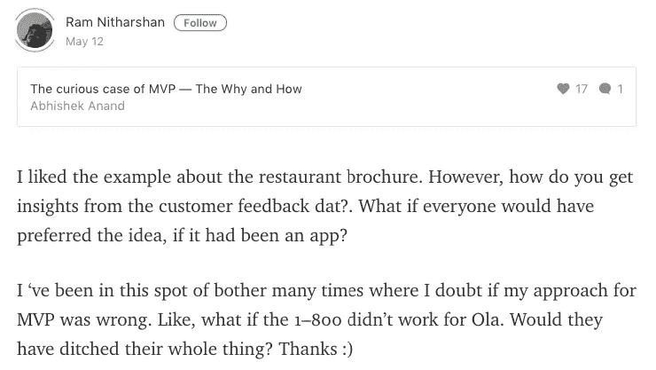
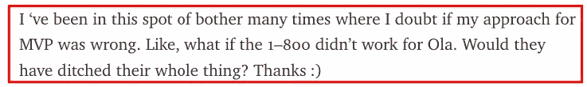

# ..[续。MVP 传奇

> 原文：<https://medium.com/hackernoon/cont-the-mvp-saga-1ec318e97f07>

## 这是上一个关于 MVP 的故事的延续，发表在 [Hackernoon](http://hackernoon.com) 上的[MVP 的奇怪案例——为什么和如何](https://hackernoon.com/the-curious-case-of-mvp-the-why-and-how-e7fa16ad6ae3)。

Yes. This is one topic enough to give you a migraine.

## 背景——为什么要跟进？

*有人问了我几个问题，我的回答有点失控。这是我收到的 Ram Nitharshan* 对前述故事的回应

Ram’s simple, short and concise answer. I couldn’t however, keep the response concise.

我开始回答他的问题，然后像往常一样跑题了。我觉得这东西足够重要(更重要的是相当长)有自己的故事。因此有了新的解读。

我们在 [**最后一个故事**](https://hackernoon.com/the-curious-case-of-mvp-the-why-and-how-e7fa16ad6ae3) 中谈到了 MVP。我们举了几个例子——其中一个是菜肴推荐系统。它会告诉你当地最好的菜肴以及有这些菜肴的餐馆。对于一个显然会在网上销售的产品，我推荐了一个仅仅是一张打印纸的 MVP。在那个例子中，有很多问题我没有涉及到——主要是为了保持文章简短(*或者至少相对简短。我想仍然是 8/9 分钟的读数。*

这一次，我将讨论其中的几个话题。如果你还没有读过这个故事，请阅读一下，以了解正确的背景。你可能还想看看我和 T21 之间的对话，这让这个故事有了自己的空间。

# 为什么反对为 MVP 开发应用程序

好吧。因此，任何了解我的人都知道，当涉及到商业时，我强烈反对“*有一个应用程序来做那个*”的想法。因此，如果他们在读它，他们会点头表示不同意、顺从或绝望，咕哝一句“老样子，老样子”，然后继续前进。

是的。是真的。我喜欢移动应用程序。我知道几乎所有的事情都有一个应用程序。但我认为企业忘记问自己的一个问题是——**应该有吗？**

> 但是我们不会再在这里偏离主题了。

即便如此。在这种情况下，我反对为 MVP 建立一个应用程序的立场与我在应用程序问题上的个人感受和政治无关。这和 MVP 背后的哲学有着千丝万缕的联系。

> (MVP 的)目的是评估产品的可用性和价值，而不是交付的媒介。

所以是不是 app 没有意义。这无关紧要。我只是想节省一些时间，并在构建可能没有人想使用的东西上花费很多精力。除了你。你确信，如果你建立了它，他们会来，你建立了一个你的系统的淡化版本，称之为 MVP，并认为这就是它。然后当“*他们*没有来的时候，你想也许你没有添加正确的功能，所以你增加了几个，你花了更多的广告费。你做了这一切，却没有回答这个问题— *忘记交货方式，他们甚至需要这个*？

这就是为什么 MVP 的唯一目的应该是确定这一点。如果您需要构建一个产品来实现这一点，当然可以——当然可以。去吧。但是你应该这样做，因为**你需要**，而不是因为**你想要**。

# 餐馆的例子

至于那个问题，有很多问题，其中最大的是这个。

> 如果我有今天发布产品的所有正确迹象，并且能够这样做，我会要求消费者为产品付费吗？

(*你应该记得我曾要求消费者支付我 0.30 美元购买印刷宣传册*)

答案是——不，我不会。

# 什么？？？那么为什么要对宣传册收费呢？

宣传册不是免费的，因为如果你免费提供产品，你得到的市场信息可能会在很大程度上对你有利。想象一下。如果我只是分发这些小册子。我可能能够让我遇到的 100 个消费者中的 70-80 个从我这里拿走那些东西。通过给商品定价——任何价格，你也可以把它保持在 0.15 美元——我确保交易的发生是因为他们看到了产品的价值，而不是因为“*我会失去什么*”的心态。如果我的产品提供真正的价值，我最多能获得 30%的转换率，而且价格点足够低，不会引发心理障碍。

# HMMM……有道理……但是为什么不以后再起诉他们呢？

毕竟，消费者已经表现出了明确的支付意愿，对吗？那么，为什么不在我发布产品时也向他们收费呢？

(*假设产品确实是 app* )

答案在于**尺度。**

如果有 20 个消费者认为有足够的价值来支付这项服务，那么如果这项服务是免费的，就会有 60 个消费者认为有足够的价值来使用它。货币化是一个开关。如果你的产品为消费者的生活增加了价值，那么你就有无数的第一、第二和第三收入来源可以利用。第一个目标是这里的增长。为尽可能多的消费者的生活增加价值。

**更多的消费者→更多的使用模式和数据→对业务的未来做出更明智的决策**

我更愿意帮助建立一个社区和一个受众群体，在那里我可以从 100 万人的基础上每月赚取 0.3 美元，而不是从 10 万人的*付费*消费者基础上每月收取 3 美元——即使两种情况下产生的有效收入**完全相同**。

# 为什么？

因为一个免费产品增长 100 万到 200 万比一个付费产品增长 10 万到 20 万容易。

# 法律厅的引文

巴维什将是回答这个问题的合适人选，也许还有 Ola 的一些早期投资者，但让我在这里尝试一下。

我认为法律厅在开始运作时面临的最大和最常见的问题是围绕着潜力和需求。

> 这种服务的市场存在吗？还是'*驾驶室空间*已经饱和？

如果我没记错的话，Ola 是在 2010 年推出的，比优步进军印度早了近三年。当时，出租车市场主要分为两类:

1.  **无线电出租车** — Meru Cabs、Mega Cabs 是两大主要参与者。这些服务的主要用例场景可以分别追溯到机场的接送服务。出租车也在市内行驶，但是你看到出租车的频率很低。艰难而繁琐的预订过程、漫长的等待时间(*您必须在想要出行前几个小时预订出租车*)以及可感知的昂贵本质可以被视为缺乏大规模使用背后的三个原因。
2.  **无组织部门** —主要使用场景:(a)紧急、不可预见的情况，(b)长途旅行，(c)外地旅行，(d)小时包(4 小时、8 小时)。所以没有一个有抱负的独角兽想要的那种频率的主流用法。

很自然，当 Ola 提出自己的观点时，它会与第一类出租车进行比较——无线电出租车。Meru 在这一领域处于明显领先地位。新来者曾试图推翻 Meru，但无济于事。尽管 meru 赚了很多钱——很大程度上得益于其领导地位，但同比增长并不会让你眼前一亮。所以很自然的问题是:

*   还有空间(*和机会*)给另一辆无线电出租车吗？
*   市场不是已经达到饱和点了吗？
*   Ola 可以被认为是无组织部门的替代者(*或取代层*)吗？即使是这种情况，频率使用率仍然很低。那么樱桃在哪里？

解决这些问题的最佳方法是什么？与他们对抗，证明你开始的假设。因此有了呼叫中心。快速实现，相对便宜，实时数据。

哦。Ola 本身应该叫做出租车公司。他们花了多年的努力(*奥拉和优步都*)才开始将自己定位为一家技术/产品公司，即使经历了这一切，他们在很大程度上仍被视为一家出租车公司。

# 关于 MVP 和风投的事情

让我只陈述显而易见的事实。创业公司需要外部资本。这并不总是正确的，但对他们中的大多数人来说都是如此。但是他们需要钱来扩大规模，而不是打基础。

这种区别越早变得清晰，我们就越能清楚地思考基金会应该是什么样子。

当作为一家企业，你可以证明你已经与你的消费者建立了联系时，风投就会带着信念进行投资。不。我不是在说产品的市场适应性。彩虹的那一端还在数英里之外。我说的是拥有消费者喜爱的产品(*解决需求*)，或者通过你如何在消费者面前展示你的产品来击中所有正确的音符。通常，这只是第一个，但如果你把第二个也加入进来，你就是风投们想争取的那种企业。两者都很重要。一个展示得很差的好产品可能会收到可笑的评价。

这就是 MVP 变得重要的原因。来表明你的脉搏是对的。产品可以改变，商业模式可以改变。把握好脉搏与宏观视野有更大的关系。所以。不要太执着于 MVP 应该是什么样子。你甚至不知道 5 年后你的产品会是什么样子。奥拉当然没有！Foodiebay 甚至不知道 5 年后它会自称为 Zomato。专注于正确的问题，将你的精力引向正确的方向。

`**[OPTIONAL READ]**`

# 我个人使用 OLA 的一些注意事项

到 2012 年我第一次使用这项服务时，很多事情都发生了变化。但它远没有今天的样子。尽管他们有一个应用程序。

顺便说一句。有趣的是，在这个阶段，至少在 Bengaluru，Ola 比 Meru 贵。Meru 的每公里费率为 18 卢比，Ola 的每公里费率为 18 卢比。21 ( *如果我记得正确的话*)。然而我更频繁地使用 Ola。差不多每周几次。

## 为什么？

1.  简单性 —预订过程很简单。基于位置。一键。不再需要像在 Meru 上那样填写完整的地址。没有你今天看到的那种出租车。这个想法很简单。按一下按钮就能叫到出租车。
2.  **快速满足**——只有一个按钮。“接我”
    根本没有为以后安排出租车的选项。你预定了一辆出租车，出租车将在几分钟内到达。这下方便了。
3.  **没有夜间收费**——无线电出租车最大的危险之一是夜间收费。超出您正常账单的 25%。Ola 有一个统一的费率——总是**。因此，虽然它在早上比 Meru 贵，但在晚上使用时，它只是稍微便宜一点。对于任何有活跃社交生活的人来说，夜间使用出租车总是更有用的。所以，奥拉在我脑海里挥之不去。**

**这些要点实际上是按优先级降序排列的。是啊！价格因素对我来说甚至不是最重要的。它的简单性和即时性赢得了我的心。**

# **喜欢这个故事吗？与朋友分享！**

************

**联系很容易。我可以在 [Twitter](http://twitter.com/@abyshake) 、[脸书、](http://facebook.com/abyshake)、 [Quora、](http://bit.ly/abyshake)、 [LinkedIn](http://in.linkedin.com/in/abyshake) 上找到我。我写在媒体上，但我猜你已经知道了。我也有一个[邮件](mailto:mail@abyshake.com)账号。:-)**

**玩得开心！我们聊聊吧。人类、机器人——对我来说真的没什么区别。**

************

> **[黑客中午](http://bit.ly/Hackernoon)是黑客如何开始他们的下午。我们是这个家庭的一员。我们现在[接受投稿](http://bit.ly/hackernoonsubmission)并乐意[讨论广告&赞助](mailto:partners@amipublications.com)机会。**
> 
> **如果你喜欢这个故事，我们推荐你阅读我们的[最新科技故事](http://bit.ly/hackernoonlatestt)和[趋势科技故事](https://hackernoon.com/trending)。直到下一次，不要把世界的现实想当然！**

****