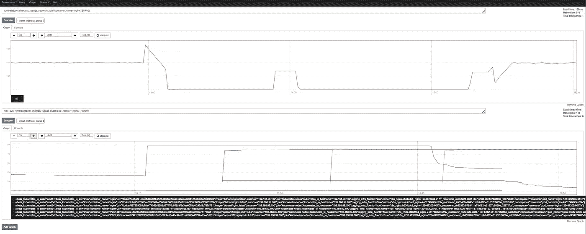
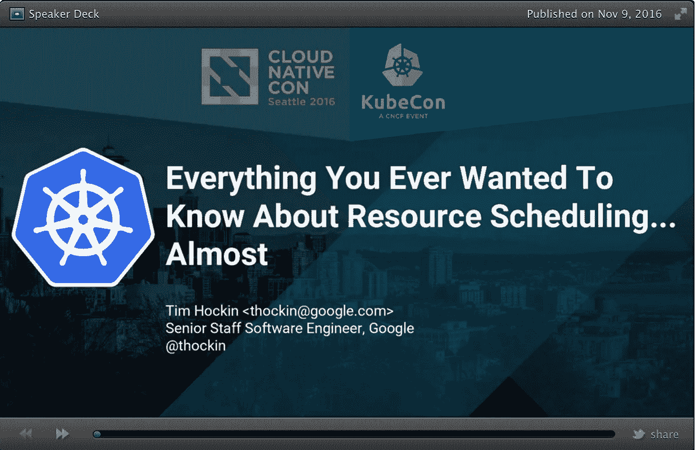

# 容器资源消耗—太重要了，不容忽视

> 原文：<https://medium.com/hackernoon/container-resource-consumption-too-important-to-ignore-7484609a3bb7>



Screen shot of Prometheus expression browser showing CPU (top) and memory (bottom) usage of an NGINX container.

> 快速问题:你知道你的应用消耗多少内存吗？CPU 时间怎么样？交通高峰怎么办？在资源消耗的背景下，你如何处理这个问题？
> 
> 您是否手动管理每个容器的内存和 CPU 限制？或者，也许你还不在那里。也许这整个资源消耗和约束对你来说是全新的。请继续阅读。

**TL；DR:在 Kubernetes 中，设置容器的 CPU 和内存资源需求是很重要的，我们现在要自动化这个过程。**

# 何必呢？

为什么您真的要担心 Kubernetes 集群中的容器消耗了多少内存和 CPU 呢？让我们看看从业者对这个话题有什么看法:

> 不幸的是，Kubernetes 还没有实现动态资源管理，这就是为什么我们必须为我们的容器设置资源限制。
> 我想象在某个时候，Kubernetes 将开始实施一种更少人工的方式来管理资源，但这是我们目前所拥有的一切。

Ben Visser，2016 年 12 月: [Kubernetes —了解资源](http://www.noqcks.io/note/kubernetes-resources-limits/)

> [*Kubernetes*](https://hackernoon.com/tagged/kubernetes) *没有动态资源分配，这意味着请求和限制必须由用户决定和设置。对于一个* [*服务*](https://hackernoon.com/tagged/service) *来说，当这些数字不精确时，一个好的方法是用高估的资源请求和无限制来启动它，然后让它在正常的生产负载下运行一段时间:根据服务的性质是几小时、几天、几周。*

Antoine Cotten，2016 年 5 月: [1 年，从 0 到 Kubernetes 转型的经验教训](https://acotten.com/post/1year-kubernetes)

现在，事实证明，谷歌——在 [Borg](https://research.google.com/pubs/pub43438.html) 的背景下——有这样一个资源消耗预测器/调节器，叫做 *autopilot* ，它实际上提供了一个自动的资源消耗管理。

在 KubeCon 2016 上提出这个话题的人是: *Tim Hockin* ，他是 Kubernetes 早期的委员之一，当时它还是一个谷歌内部项目:



正如聪明的蒂姆在他的演讲*中所说的，关于资源调度*(同时，查看[幻灯片](https://speakerdeck.com/thockin/everything-you-ever-wanted-to-know-about-resource-scheduling-dot-dot-dot-almost)和[视频](https://www.youtube.com/watch?v=nWGkvrIPqJ4)):

> 大约 2/3 的博格用户使用自动驾驶仪。

这听起来挺有说服力的；超过一半的 Borg 用户似乎不仅乐于明确设置资源消耗，而且乐于将这项工作委托给 autopilot。

*回到 Kubernetes。*

早在 2015 年年中，我们就发现 Kubernetes 社区——从谷歌的*自动驾驶*体验中获得信息——提出了一个[问题](https://github.com/kubernetes/kubernetes/issues/10782),以捕捉对自动化资源消耗管理的需求。在 2017 年初，相应的[设计方案](https://github.com/kubernetes/community/pull/338)已经完成，现在关于由此产生的垂直吊舱自动定标器( [VPA](https://github.com/kubernetes/autoscaler/tree/master/vertical-pod-autoscaler) )的初步工作正在进行中。

# 一个演示者:resorcerer

为了收集问题领域的经验——评估容器资源消耗并相应地调整容器——我们建立了一个 POC，一个名为[resource rer](https://github.com/mhausenblas/resorcerer)的演示器。

查看 resorcerer 的[视频演练](https://www.useloom.com/share/41e14ed4a4d349e294ad717dfda58956)，我将向您展示如何在 Kubernetes 集群中使用它(实际上是在一个名称空间中)，它是如何工作的以及有哪些限制:


A [video walkthrough](https://www.useloom.com/share/41e14ed4a4d349e294ad717dfda58956) of resorcerer, its features and inner workings (~27min).

# 引擎盖下:繁重的工作由普罗米修斯完成

为了提出资源消耗限制的建议，resorcerer 演示者利用了 [Prometheus](https://prometheus.io) 。例如，要确定某个容器在过去 30 分钟内的 CPU 使用率，我们可以使用以下 PromQL 查询:

```
sum(rate(container_cpu_usage_seconds_total{pod_name=~"nginx.+", container_name="nginx"}[30m]))
```

这将导致如下结果:


Screen shot of Prometheus, showing container CPU usage over time.

这里棘手的部分是选择有意义的 PromQL 查询以及观察时间段的正确参数。首先，考虑三种情况:

*   *空闲*—容器上没有负载，这是所需的 CPU/内存资源的最小*数量*。
*   *正常*—对容器进行更长时间(数天或数周)的观察，并计算出基线；这是*运营所需资源的典型案例*。
*   *秒杀*——想想一个外部事件，比如一个半价销售活动或在一个受欢迎的新闻媒体上提及，为你的应用程序带来大量流量；这是您仍然希望能够适应的资源消耗的例外情况。

在上面的案例区分中，我们方便地只考虑了无状态应用程序的简单情况，比如应用服务器或 Web 服务器。对于有状态服务来说，事情确实变得相当复杂，例如，涉及到数据库。

在 resorcerer 的背景下，我们要感谢[朱利叶斯·沃尔茨](https://twitter.com/juliusvolz)对 Prometheus scraping 和 PromQL 的支持，以及[斯蒂芬·希曼斯基](https://twitter.com/the1stein)，他帮助导航了 Kubernetes [client-go](https://godoc.org/k8s.io/client-go) 库的棘手部分。

# 前方的路

容器资源消耗的话题是一个重要的话题，我希望我的上述观点能引起你的注意。在 Kubernetes 中，我们正处于旅程的起点，我们需要收集更多关于资源消耗管理自动化的经验。

Kubernetes 垂直 Pod 自动缩放器(VPA)的官方工作现在正在 [SIG 自动缩放](https://github.com/kubernetes/community/tree/master/sig-autoscaling)中进行，所以现在是开始贡献用例和/或分享您的需求以及经验的好时机。您可以加入我们的 [Kubernetes Slack](http://slack.k8s.io/) 社区、#sig-autoscaling 频道，也可以通过[邮件列表](https://groups.google.com/forum/#!forum/kubernetes-sig-autoscaling)参与，或者参加大约每两周举行一次的[周四在线会议](https://docs.google.com/document/d/1RvhQAEIrVLHbyNnuaT99-6u9ZUMp7BfkPupT2LAZK7w/)。