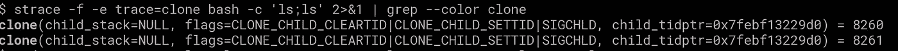
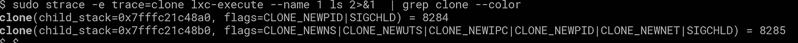
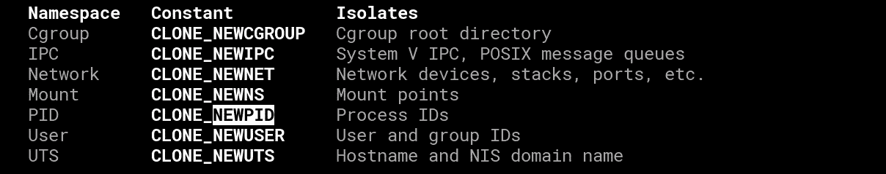
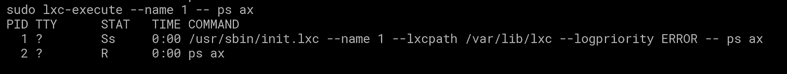

# 集装箱而不是码头工人

> 原文：<https://medium.com/hackernoon/containers-but-not-docker-bec283a4db9c>

我不是 docker 的最大粉丝，但我确实看到了它的好处，尽管我认为它在某种程度上成功地隐藏了 docker 到底是什么以及它真正做了什么，但这篇文章不是关于 docker，而是关于名称空间。

**Docker** / **lxc** 使用一个内核特性，用最简单的话来说，允许一个进程拥有多个级别的隔离(PID/fs/hostname/etc)

那么问题来了，如果 docker/lxc 是一个进程，那么它和一个正常的进程有多大的不同，比方说一个“ls”的克隆()

下面是一个正常的 ls

我们都知道 **fork** () **syscall** 实际上是 clone，clone 将父进程内存的一部分复制到子进程等等。

这是一个执行**容器化**“ls”的克隆示例:

有很多相同的，但不完全相同，有一些额外的论点，这些论点提供了这种隔离:

让我们以 **CLONE_NEWPID** 为例(man 7 名称空间)

Man 说*“PID 名称空间隔离了进程 ID 号空间，这意味着不同 PID 名称空间中的进程可以拥有相同的 PID。PID 名称空间允许容器提供诸如暂停/恢复容器中的进程集以及将容器迁移到新主机的功能，同时容器内的进程保持相同的 PID*

这是有道理的，我想这也有助于保持 PID 的数量相当低，如果您有一个运行大量容器和大量应用程序的大型主机，PID 会非常高，我们通过以下方式验证这一点:

不知何故，我在 pid 2 上得了 ps，相当不错。

所以有很多命名空间参数可以传递给 clone，clone 把一个函数作为一个参数(除了别的以外)，你可以"**容器化**"几乎所有东西。

那里的 child_main()只是一个随机的 C 函数。

我希望这解释了一点名称空间的内部结构，但是缺少了一个将名称空间与 cgroups 链接起来的部分。也许是为了另一篇文章。

谢谢！！

> [黑客中午](http://bit.ly/Hackernoon)是黑客如何开始他们的下午。我们是 AMI 家庭的一员。我们现在[接受投稿](http://bit.ly/hackernoonsubmission)并乐意[讨论广告&赞助](mailto:partners@amipublications.com)机会。
> 
> 如果你喜欢这个故事，我们推荐你阅读我们的[最新科技故事](http://bit.ly/hackernoonlatestt)和[趋势科技故事](https://hackernoon.com/trending)。直到下一次，不要把世界的现实想当然！

