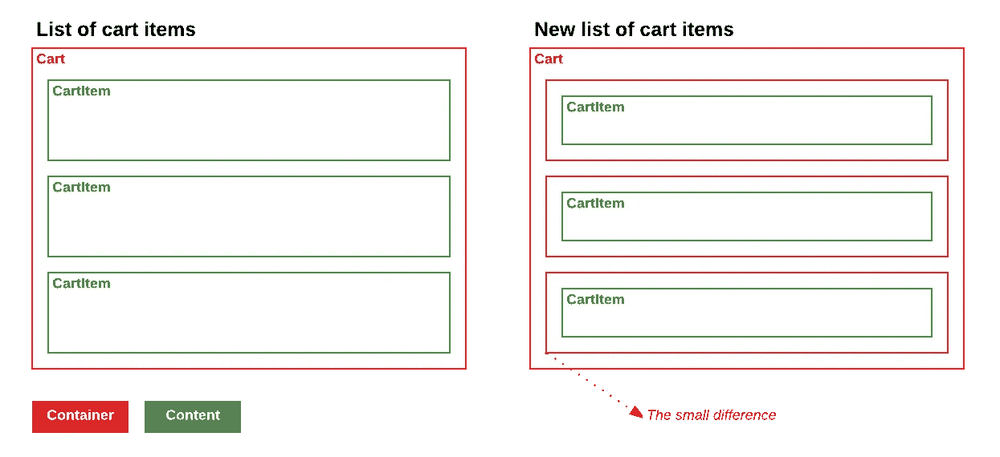
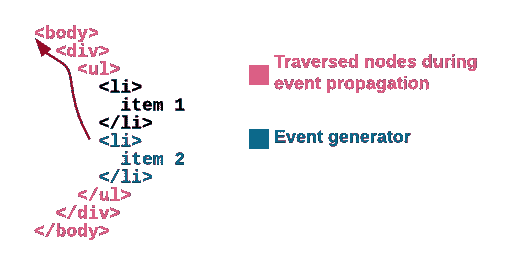

# 内容与容器

> 原文：<https://medium.com/hackernoon/content-vs-container-e0a1ada681c1>

Picture from Amazon.com

我肯定你小时候玩过这个游戏几百次了。那时你学会了如何将不同种类的形状放在它们相应的位置上。这个游戏将会是下一个故事的一个很好的隐喻。

我将通过一个例子来了解如何识别您在组件之间混合职责，以及如何实施[单一职责原则](https://en.wikipedia.org/wiki/Single_responsibility_principle)。当我们要强调什么是内容，什么是容器的时候。

陷入这种混合职责的糟糕模式会影响源代码中的许多组件，不仅影响组件风格，甚至影响组件逻辑。主要目标是在可重用性方面获得更好的组件。我将用这个例子从以下几个方面进行分析:

*   组件样式(用户界面)
*   组件业务逻辑(UX)

**这篇文章中的所有例子都是基于 React 类和 JSX 标记，但是这些建议适用于你使用的任何* [*技术*](https://hackernoon.com/tagged/technology) *。*

# 购物车商品列表

想象一下您购物车中的物品列表。我们的购物车中有三件商品，其中两件被选中，其中一件是*高级*商品。每个商品都有一个按钮，让用户从购物车中删除商品。

一个简单的例子可能是这样的:

样式表是这样的:

当您开始尝试在组件中转换这种布局时，您想到的第一个方法是这样的:

An example of mixed responsibilities

这个列表将是`CartList`组件，而`renderCartItem`将
呈现`li`节点，其中包含列表中每个项目所需的所有内容
，以及显示所有选定项目所需的所有类。

也许在那一点上你看不到问题，但迟早你会开始面对关于这个决定的问题。

几周后，您的购物车有了新的需求。用户应该能够多选列表中的项目。您开始实现这个特性，并且您开始需要一些方法来在项目之间进行通信，以知道它们是否被选中，发送事件，切换项目中的类，等等。

等一下，这太疯狂了…

如果您在应用程序的另一个地方重用这些项目，可能您不想要选择行为，并且您开始添加越来越多的条件来选择哪些是您想要用于它们的所有地方的行为。您是否要将可选行为添加到一个`Order`列表中，但这个是`CartItem`类型？

所以，把这种行为包含在物品中的答案很可能是*否*。

现在，停下来想一想容器和内容。这个布局的容器和内容是什么？

# 购物车物品的新列表

当你开始构建一个组件结构时，考虑一下每个组件在可重用性方面的责任是很好的。区分内容和容器。问问你自己:

*   *这些项目负责管理该列表中的选择吗？*
*   *哪个位置是放置处理程序来管理选择的最佳位置？*

很容易改变你的想法，开始从另一个角度看待他们。想象一个组件`SelectableList`和`CartItem`。让我们用这种布局检查一种新方法:

New cart markup, with better responsibilities

差别是微妙的，但是你会开始利用它们。

## 组件样式

知道你在组件之间混合职责的一个常见模式是你是否滥用了`margin` CSS 规则。内容组件应该尽可能地扩展，并且不应该意识到周围的环境。容器组件是[管理](https://hackernoon.com/tagged/managing)内容组件之间空间的合适工具，你可以通过`padding` CSS 规则来实现。

如您所见，我们将`margin-bottom`规则从购物车项目移到了`selectable-list`中的`padding-bottom`规则。

> 尝试将组件边距转换为填充

当你开始使用这种方法时，你会发现像 [flexbox](https://developer.mozilla.org/en-US/docs/Web/CSS/CSS_Flexible_Box_Layout/Using_CSS_flexible_boxes) 这样的规格更适合你的所有需求。

## 组件业务逻辑

DOM 最有趣也是最容易被误解的特性之一是事件冒泡。当你理解了它是如何工作的，以及哪些是你需要注意的主要问题时，这种新的组件结构就会大放异彩。

事件冒泡的一个简短总结是，在 DOM 节点中发生的事件会经过所有的父节点，直到您调用`stopPropagation`方法。

以此为前提，在应用程序中的所有组件之间分担所有的责任真的很容易。

如果你想一想谁是负责管理选择的人，现在答案真的很简单。肯定是那个`SelectableList`。

**可选列表**:

SelectableList is agnostic of CartItems

**CartItem** :

CartItem component knows nothing from SelectableList component

这件事真正酷的地方在于，现在责任非常明确，两个组件都可以在不冲突的情况下发展。您想在`SelectableList`中添加多选吗？去吧。你在给`CartItem`加新东西吗？没问题。

在组件逻辑方面，使用事件冒泡来决定如何在应用程序中生成每个事件的所有者。如果你认为一个事件不应该通过上层组件，用`stopPropagation`方法阻止它。

如果你发现自己试图禁用组件中的某个特定区域，你可以利用[指针事件](https://developer.mozilla.org/en/docs/Web/CSS/pointer-events)属性来更好地控制什么是可点击的。

# 结论

您可以将这些例子推广到数百个用例中。结果将是一组非常好的可重用通用组件和一组链接到您的业务逻辑的简单组件。

有了这组通用组件，就更容易在应用程序中应用对[可访问性](https://developer.mozilla.org/en-US/docs/Web/Accessibility/ARIA)的改进。这将提高你的应用程序的质量，同时为它的许多部分增加价值。

每当你创建新的
组件时，试着在容器和内容中思考，你将能够找出最适合你的！

*如果你喜欢这篇文章，请点击下面的* ❤️ *按钮，关注这篇文章，这样你就不会错过。*

> [黑客中午](http://bit.ly/Hackernoon)是黑客如何开始他们的下午。我们是 AMI 家庭的一员。我们现在[接受投稿](http://bit.ly/hackernoonsubmission)并乐意[讨论广告&赞助](mailto:partners@amipublications.com)机会。
> 
> 如果你喜欢这个故事，我们推荐你阅读我们的[最新科技故事](http://bit.ly/hackernoonlatestt)和[趋势科技故事](https://hackernoon.com/trending)。直到下一次，不要把世界的现实想当然！

