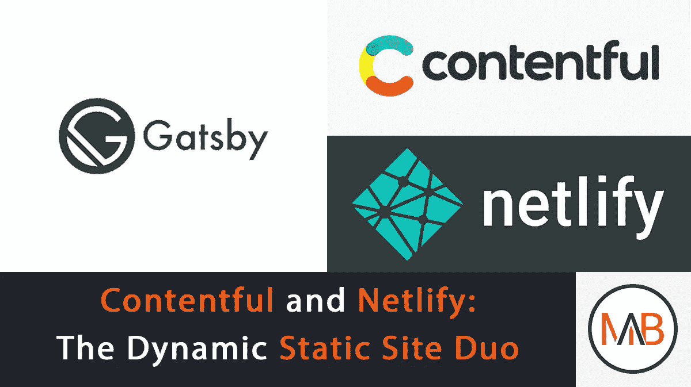
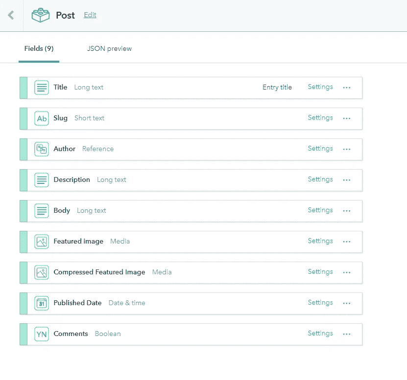
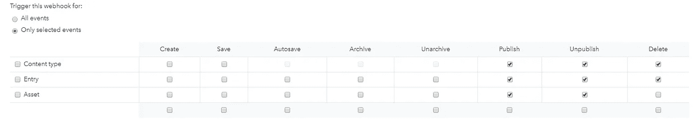

# 满足与有效:静态网站管理的动态二重奏

> 原文：<https://medium.com/hackernoon/contentful-and-netlify-the-dynamic-duo-of-static-site-management-8eb2eff0e343>

今年早些时候，我有了一个提升我的博客游戏的目标。

说到写博客，有很多平台可供人们使用。一个博客可以使用静态站点生成器，比如[杰基尔](https://jekyllrb.com/)，或者像 [Wordpress](https://wordpress.com/) 或者 [Drupal](https://www.drupal.org/) 这样的 CMS。

这两种方法都有各自的优点和缺点，无论博客作者选择哪种解决方案，都会有自己的限制。

我偏爱 Jekyll，主要是因为如果可以的话，我真的不喜欢用 PHP 编写。

我也考虑过在 Medium 上写我所有的博客文章，然后通过 [Medium 的 REST API](https://github.com/Medium/medium-api-docs) 移植到我的博客上。然而，我希望能够将我的技术写作与我未来关于动机和生产力的写作计划分开。

在一些不错的 ol' google-fu 之后，我遇到了一个工具组合，它以一种意想不到的方式真正改变了我的游戏:[**Contentful**](https://hackernoon.com/tagged/contentful)**和**[**Netlify**](https://hackernoon.com/tagged/netlify)**。**

# 什么是知足？

Contentful 是一个强大的 SaaS 平台，为开发者和小型企业提供了一个高度可配置的 CMS，它独立于用户的发布平台。

我喜欢把它看作是一个易于访问的不同类型内容的云数据库。

使用 Contentful，blogger 可以创建模型来表示他们可能希望包含在博客中的不同类型的内容。我喜欢把这些模型想象成**实体**，然后这些实体有**属性**来描述它们。

顺便说一句，如果你不熟悉数据库设计中的实体和属性的概念，我强烈建议你看看这个视频，它讲述了你如何制作可视化模型来描述数据库。建模是一个很棒的工具，可以在你开始之前引导你对项目的想法。

让我们深入一个内容丰富的模型的例子。

在我看来，一篇简单的博文可以分解成几个属性。仔细想想，主要属性有:

*   博客标题
*   Slug(内容的唯一路径)
*   帖子的作者
*   种类
*   帖子正文(您的内容)
*   特色图片(可选图片，当读者滚动你的文章时可以显示给他们)
*   发布日期

当你把所有这些放在一起，你就有了一个已经完成的博客文章的基本框架，而不用担心样式和格式。

这是一个关于内容的模型的例子。我用这个作为我博客帖子的标准支架:

The model representing a blog post on my blog.

# 令人敬畏的内容丰富的特点

当我第一次开始使用 Contentful 时，在描述一个模型时，我发现有两个特性特别有用:

1.  动态字段条目
2.  基于可定制标准的现场验证

## 动态字段

*动态字段*的一个很好的例子是 slug(特定帖子的路径)。出于搜索引擎优化的目的，最好的做法是在 slug 的单词之间使用连字符，因为当你使用空格时，它被编码为 **"%20"** 。

这是因为谷歌和其他搜索引擎只将连字符视为单词分隔符，而忽略了下划线和空格等替代字符。

如果你对为什么这成为标准的历史感兴趣，[看看这个由谷歌的马特·卡特制作的视频。](https://www.youtube.com/watch?v=AQcSFsQyct8)

举个例子，让我们使用 slug 中的空格。当浏览器对 URL 进行编码时，结果将如下所示:

[https://malikbrowne . com/blog/content ful % 20 和% 20 验证% 20 动态% 20 静态% 20 站点%20duo](https://malikbrowne.com/blog/contentful%20and%20netlify%20the%20dynamic%20static%20site%20duo)

呸。

SEO 背后的整个想法是让你的内容具有可读性。让我们看看另一个用破折号的例子:

[https://malikbrowne . com/blog/content ful-and-netlify-the-dynamic-static-site-duo](https://malikbrowne.com/blog/contentful-and-netlify-the-dynamic-static-site-duo)

这更容易阅读。这是排名上的微小差异，但绝对有区别。

为了方便起见，如果您设置了选项*“slug”*，Contentful 会自动将您的标题转换为适当格式的 slug。

Contentful 还允许您为您定义的每个模型创建新的实例。CMS 将模型的这些独立单元视为“内容”本身。

## 现场验证

在博客中，你不可能有一篇没有正文和标题的文章。这些可以设置为必填字段，这样 Contentful 就不会发布帖子，除非它们被填充。

在他们所有的验证特性中，我用得最多的是图像需求。当与多人一起处理一个内容时，需求很容易被混淆，如果不小心，糟糕的图片可能会破坏站点的布局和功能。

例如，为了优化加载时间，您可能希望限制某人设置为博客帖子的特色图像的文件大小，因为 Contentful 不会为您压缩您的图像。

Contentful 允许您设置多个不同的图像参数:

*   图像文件大小
*   图像比例(宽度和高度)
*   文件类型(jpg、png、gif)

这是一个非常有用的特性，允许您在与一组编辑人员一起工作时进行大量的粒度控制。

如果创建这些复杂的模型让人望而生畏，不要担心。Contentful 有大量的基本内容模型模板供用户注册后使用。

最重要的是，Contentful 允许你在他们的系统中免费为**创建多达 *10，000* 条新内容记录。**

Talk about a free trial.

在你或你的合作者填写完文章内容并点击绿色的发布按钮后，Contentful 将通过一个方便的 REST API 让你的内容可以被访问。

这允许开发人员查询和操作您提供的所有可用的**模型**、**资产**和**内容数据**。

Contentful 还存储模型的元数据，提供过滤博客的参数以允许分页，并为您提供一个基本的 markdown 编辑器，如果您还没有设置的话，可以用来写博客文章。

(我个人使用这个叫做 [Typora](https://typora.io/) 的应用程序，当我写 Markdown 的时候，它提高了我一吨的生产力。)

使用互联网上的一大堆工具可以很容易地将 Markdown 解析成 HTML。

写完文章后，你可以通过前面提到的 REST API 或者 Contentful 的 SDK 获取你需要的信息。

您需要考虑的下一个问题是部署。

这就是 Netlify 的用武之地。

# 什么是 Netlify？

Netlify 是一个自动化平台，专注于为管理部署提供最简单的流程，涵盖从持续集成到 CDN 分发和缓存的所有内容。

Netlify 提供的一些我最喜欢的功能是:

*   全球 CDN，在全球范围内分发您的内容
*   一种快速的本地 DNS 服务
*   自动部署，与一键回滚捆绑在一起
*   构建自动化

你可以在这里查看 Netlify 提供的所有精彩功能列表。

Netlify 让这个过程变得极其简单——你只需要**把你的代码推送到 Github。**

当 Netlify 检测到链接的 git 存储库中的变化时，它将通过检查 Github 存储库中的 *package.json* 文件中的任何构建脚本来启动部署。您还可以指定 Netlify 运行哪个构建脚本。

另一件需要注意的事情是，无论你的网站有多大，Netlify 都是可伸缩的。此外，就像 AWS 一样，您只需为您使用的内容付费。

# 为什么同时使用 Netlify 和 Contentful？

当我第一次创建我的博客时，我正在手动部署我的网站，使用 [react-snapshot](https://github.com/geelen/react-snapshot) 创建新呈现的 HTML 文件(用于 SEO 目的)，并将这些生产就绪的文件拖到我的 FTP 服务器上。

每当我想在其他设备上测试后进行 CSS 更改时，我都必须重新构建我的 create-react-app 项目，然后每次都重新运行 react-snapshot。

**让我告诉你:那已经过时了。很快。**

Manual deployments are stupid.

**这就是网钩的用武之地。**

如果你不熟悉 webhooks，webhook 是一种应用程序向其他应用程序提供实时信息的方式。webhook 在数据发生时将数据传送给其他应用程序，这意味着您可以立即获得数据。

在普通的 API 中，您需要频繁地发出网络请求来模拟实时数据。这是非常低效的，也是 webhooks 越来越受欢迎的原因。

Contentful 允许您设置一个 webhook，基于用户在其应用程序中可以执行的不同操作来调用它。

这些行动包括:

*   创建或更新新的资产、条目或内容类型
*   发布或取消发布资产、条目或内容类型
*   删除资产、条目或内容类型

当这些动作发生时，Contentful 将向一个特定的 URL 发出一个请求，告诉所有的侦听器数据已经被更改。

Netlify 可以监听这个 webhook，并在收到对这个 URL 的网络请求时触发一个构建命令。

以下是我在 Contentful 中的个人 webhook 设置:

Available actions to a user in Contentful

在 Netlify 和 Contentful 中的这些 webhooks 的帮助下，我以前必须手动做的所有事情现在都可以通过“git push”命令和 Contentful 上的按钮来完成。

我还切换到了 GatsbyJS，它为我做了几件以前必须手动完成的事情。这包括:

*   为我的博客文章提供了一个很好的模板系统
*   为搜索引擎创建网站地图
*   为以前不存在的页面提供新的 HTML 页面
*   优化我的网站上的图像。

强大、有用、超级直观。

# 满足和有效使用的工具

外面有成千上万的静电发生器。但是我在使用其他开发环境时面临的一个真正的痛点是，添加功能是一个极其令人生畏的过程。

大多数时候，解决方案要么不通顺，要么不直观。

在对 [JAMstack](https://jamstack.org/) 做了更多的研究后，我发现这两个项目对我来说是优化服务器端渲染的绝佳工具:

*   [Gatsby.js](https://www.gatsbyjs.org/)
*   [Next.js](https://github.com/zeit/next.js/)

这两个工具都是兼容的 React 开箱即用，这使得您的静态站点有可能拥有与复杂 web 应用程序相同的功能。

如果你是一名开发人员，并且想创建一个新的博客，我强烈推荐你将这些工具和我提到的静态站点生成器一起使用。

*感谢阅读:)如果你喜欢这篇文章，请给我一些掌声！它会让其他人在媒体上看到。*

*本帖最初发表于*[*malikbrowne.com。你可以在我的网站上找到更多这样的文章！*](https://www.malikbrowne.com/blog/contentful-and-netlify-the-dynamic-duo)

*我总是对来自开发社区的人的消息感兴趣，所以请随时在*[*Twitter*](https://twitter.com/milkstarz)*上向我问好。说说你对 JAMstack 的看法！*