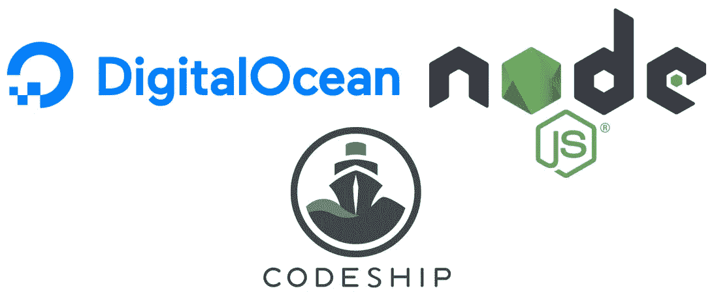

# 在数字海洋上持续部署 Node.js

> 原文：<https://medium.com/hackernoon/continuous-deployment-for-node-js-on-digitalocean-d800e8520ffe>

持续集成和部署已经成为软件开发周期的重要部分。花时间创建特性是很重要的，并且您不想担心代码的部署。另外，手动部署代码越多，出错的可能性就越大。今天，我们将自动运行我们的测试，并将 Node.js 应用程序部署到 DigitalOcean。



通过遵循本指南，您应该在几分钟内就可以完成 Node.js 应用程序的持续集成和部署。它做了一些假设:第一个假设是你在 DigitalOcean 上托管你的应用程序，第二个假设是你在 Github、Bitbucket 或 Gitlab 上存储了你的存储库。它还假设您已经很好地掌握了 Node.js、NPM 和命令行。

# 请随意走动

根据你是否正在使用一个点击式 droplet，你可能会跳过这些说明的大部分。每一部分都应该提醒你其中包含的确切步骤，所以如果你知道你已经完成了一个步骤，那就跳过它。

# 创建 NPM 脚本

该过程至少依赖于 3 个 NPM 脚本:

*   测试:这将运行您的测试。我不会告诉你如何设置你的测试，但是本指南假设你已经有了。它们应该由`npm test`或`yarn test`触发。
*   **启动**:这将启动您的应用程序。这实际上需要以特定的方式设置，因为我们将依赖模块 [PM2](https://github.com/Unitech/pm2) 来启动我们的服务器。`pm2 start index.js -i max — name=\”My-App\”`这将使用 PM2 启动服务器，它以集群模式启动服务器，并在失败时尝试重启。
*   **重启**:下载更新后重启服务器需要重启。该脚本无法正常重启，但可以通过 PM2 使用该选项。但是，您需要在代码中处理这个问题。应该是这个样子的`pm2 restart all`。

你的`package.json`现在应该有这个了:

```
{
  "dependencies": {
    "pm2": "^2.4.2"
  },
  "scripts": {
    "start": "pm2 start index.js -i max — name=\”My-App\”",
    "restart": "pm2 restart all",
    "test": "your test script goes here"
  }
}
```

# 在数字海洋上创建部署用户

对于这一步，我假设你要么知道如何在数字海洋上创建一个液滴，要么你已经有一个了。如果你没有，那就去看看他们的[文档](https://www.digitalocean.com/community/tags/node-js?type=tutorials)，准备好了再回来。

此时，您将需要创建一个用户以在部署中使用。出于安全考虑，您不会希望该用户拥有任何 root 权限。如果您发现您的特定用例需要 root 权限，我将包括如何做到这一点，但通常您不会希望给这个用户完全访问您的系统。

*   **连接:**打开您的终端，通过命令`ssh root@YOUR_SERVER_IP`登录您的 digitalocean droplet。将您的 _ 服务器 _IP 替换为您的 DigitalOcean droplet 的 IP 地址。当你选择你的 droplet 时，你可以在“访问”页面找到它。*如果你还没有把你的 SSH 密钥添加到你的 droplet 中，那么向下滚动到这篇文章的底部，找出如何做到这一点——或者使用 DigitalOcean 的终端。*
*   **添加用户:**您现在应该作为根用户登录到您的 droplet。使用以下命令创建部署用户:`useradd -s /bin/bash -m -d /home/deploy -c “deploy” deploy`。这将在主目录中创建带有文件夹的部署用户。
*   **密码:**现在你需要用`passwd deploy`创建密码，它会要求你输入两次密码。我建议您设置不同于 root 用户的密码。
*   **仅在需要时授予 sudo 访问权限。**通过`usermod -aG sudo deploy`让`deploy`访问一些根级命令。

# 在 droplet 上设置 Node.js 和 NPM

*   运行以下命令进行所有设置。这就是需要一些 sudo 访问的地方。

```
curl -sL [https://deb.nodesource.com/setup_7.x](https://deb.nodesource.com/setup_7.x) | sudo bash -sudo apt-get install nodejs
```

然后，您应该能够运行`nodejs -v`和`npm -v`来查看它是否成功安装。*这个可能过时了，7.x 可能老了*。安装之前，请检查 Node 的最新版本。

# 可选:在水滴上设置纱线

我用纱线代替 NPM。如果你使用 NPM，那么你可以跳过这一步。

纱线安装说明可以在他们的网站上找到。

[](https://yarnpkg.com/en/docs/install#linux-tab) [## 故事

### 快速、可靠、安全的依赖关系管理。

yarnpkg.com](https://yarnpkg.com/en/docs/install#linux-tab) 

为了简单起见，以下是说明:

```
curl -sS https://dl.yarnpkg.com/debian/pubkey.gpg | sudo apt-key add -echo "deb https://dl.yarnpkg.com/debian/ stable main" | sudo tee /etc/apt/sources.list.d/yarn.listsudo apt-get update && sudo apt-get install yarn
```

# 通过 SSH 连接到 Github

通过 SSH 连接到 github 是一个简单的过程，Github 保存了大量关于如何设置的文档。请点击以下链接查看:

 [## 使用 SSH 连接到 GitHub 用户文档

### 您可以使用 SSH 连接到 GitHub。…

help.github.com](https://help.github.com/articles/connecting-to-github-with-ssh/) 

您需要在您的 droplet 上创建一个 SSH 密钥，并按照指示将其添加到 Github。这不仅对于下一步是必要的，而且因为在 CI 通过之后，我们将使用 git 来下载对 droplet 的最新更改。特别要确保您的 SSH 密钥连接到我们之前创建的`deploy`用户。

# 克隆您的存储库

现在您已经连接到 Github，您可以克隆您的 repo 了。

```
git clone [git@github.com](mailto:git@github.com):USERNAME/REPOSITORY.git
```

将用户名替换为您的用户名，将存储库替换为您要克隆的存储库。

之后，你应该将你的库克隆到你的 droplet 上。运行`cd REPOSITORY && yarn && yarn start`安装依赖项并开始运行服务器。我们的构建脚本只会重启服务器，而不会启动它。因此，您必须现在显式启动它。

# 设置代码

现在我们已经在 droplet 上设置好了一切，我们可以开始设置我们的持续集成和部署了。对于这个例子，我选择了 [Codeship](https://codeship.com/) ，因为它的免费层提供了我们完成这个任务所需的一切。

**以下是操作顺序:**

1.  你把代码推送到 Github/Bitbucket/Gitlab。
2.  Codeship 运行您的测试。
3.  如果您的测试通过，那么 Codeship 将运行一个构建脚本。
4.  您的构建脚本触发您的 droplet 从 Github 下载最新的更改。
5.  Yarn 安装任何新的依赖项。
6.  PM2 重启 Node.js 应用程序。

听起来不错吧？好了，接下来要做的是:

1.  创建您的 Codeship 帐户并登录。它应该会引导您连接到 Github(或者 Bitbucket 或 Gitlab ),然后选择您的存储库。既然你是成年人，我就让你来处理这部分！
2.  您现在应该在一个屏幕上，在这里您需要配置您的测试。第一部分给出了设置命令，使用这些命令:

```
nvm use 6
npm i -g yarn
yarn
```

3.接下来，您需要设置您的测试命令。这一部分确实很复杂，但是不要担心，您可以只粘贴以下命令:

```
yarn test
```

4.如果您已经完成了这一困难的步骤，那么继续设置您的部署设置。一旦你进入那个部分，你会看到一堆选项可供选择，比如亚马逊 S3 和 Heroku。我们将使用自定义脚本，这是最后一个选项。该脚本应该如下所示:

```
ssh deploy@DROPLET_IP 'cd NAME_OF_YOUR_PROJECT/; git checkout master; git pull; yarn; yarn restart;'
```

请仔细注意脚本第二部分的单引号。这些引号中的任何内容都将在 droplet 中运行。如果 ssh 连接失败，这些命令将不会运行。

# 允许 Codeship 通过 SSH 连接到 DigitalOcean

我们快完成了。但是现在 Codeship 无法在我们刚刚创建部署脚本中连接到您的 droplet。

转到你的项目设置，找到“通用”，在那里你会找到你的“SSH 公共密钥”。这是您需要添加到 droplet 的 SSH 密钥。阅读下面的链接，了解如何添加 SSH 密钥。

[](https://www.digitalocean.com/community/tutorials/how-to-configure-ssh-key-based-authentication-on-a-freebsd-server) [## 如何在 FreeBSD 服务器上配置基于 SSH 密钥的认证

### SSH 或 secure shell 是一种网络协议，它提供了一种安全、加密的方式来与…

www.digitalocean.com](https://www.digitalocean.com/community/tutorials/how-to-configure-ssh-key-based-authentication-on-a-freebsd-server) 

# 测试一下

就是这样！一旦您向 repo Codeship 提交新的提交，它将运行您的测试并部署您的代码！

# 知道更好的方法吗？

这是我第一次为 Node.js 和 DigitalOcean 设置持续部署和集成。如果你知道更好的方法，请在评论中分享！

[](http://bit.ly/HackernoonFB)[](https://goo.gl/k7XYbx)[](https://goo.gl/4ofytp)

> [黑客中午](http://bit.ly/Hackernoon)是黑客如何开始他们的下午。我们是 [@AMI](http://bit.ly/atAMIatAMI) 家庭的一员。我们现在[接受投稿](http://bit.ly/hackernoonsubmission)，并乐意[讨论广告&赞助](mailto:partners@amipublications.com)机会。
> 
> 如果你喜欢这个故事，我们推荐你阅读我们的[最新科技故事](http://bit.ly/hackernoonlatestt)和[趋势科技故事](https://hackernoon.com/trending)。直到下一次，不要把世界的现实想当然！


嗨，我是贾斯汀·富勒。很高兴你看了我的帖子！我需要让你知道，我在这里写的一切都是我自己的观点，并不代表我的雇主。所有代码样本都是我自己的，与美国银行的代码完全无关。

我也很乐意收到您的来信，请随时通过 [LinkedIn](https://www.linkedin.com/in/justin-fuller-8726b2b1/) 、 [Github](https://github.com/justindfuller) 或 [Medium](/@justindanielfuller) 与我联系。再次感谢阅读！