# 使用 AWS CodeDeploy 和 Github 进行持续部署

> 原文：<https://medium.com/hackernoon/continuous-deployment-with-aws-codedeploy-github-d1eb97550b82>

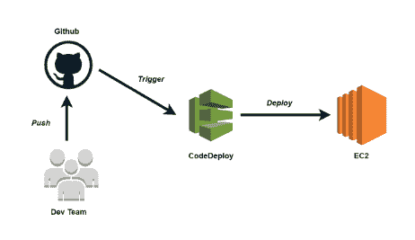

这篇文章将带你了解如何使用 **AWS CodeDeploy** 从 **Github** 自动部署你的应用程序。

让我们首先创建我们将在本教程中使用的 2 个 **IAM 角色**:

*   IAM 角色用于 **CodeDeploy** 与 **EC2** 实例对话。
*   我是 **EC2** 访问 **S3** 的角色。

**1 —代码部署角色**

转到 [AWS IAM 控制台](https://console.aws.amazon.com/iam/home)，然后导航到"**角色**，选择"**创建新角色**，选择"**代码部署**，并附加" **AWSCodeDeployRole** "策略:

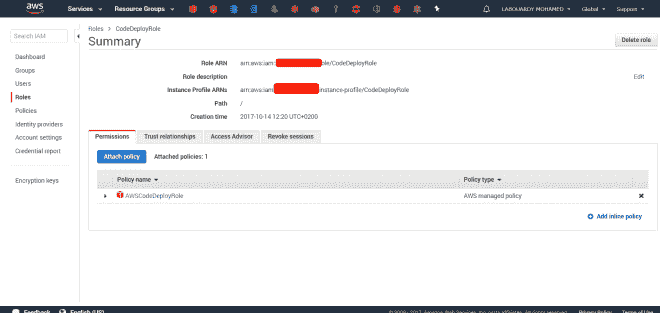

**2 — EC2S3Role**

创建另一个 **IAM** 角色，但是这次选择 **EC2** 作为可信实体。然后，附加“ **AmazonS3ReadOnlyAccess** ”策略:

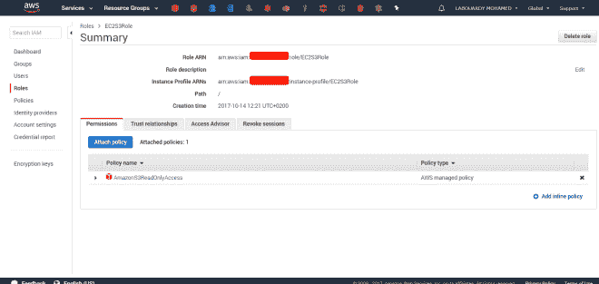

现在我们已经创建了一个 IAM 角色，让我们启动一个 EC2 实例，CodeDeploy 将使用它来部署我们的应用程序。

**3 — EC2 实例**

使用我们在上一节中创建的 IAM 角色启动一个新的 **EC2** 实例:

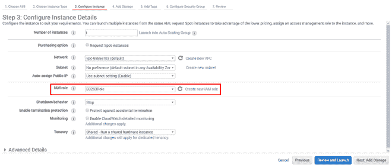

在**用户数据**旁边键入以下脚本，以便在引导时安装 **AWS CodeDeploy 代理**:

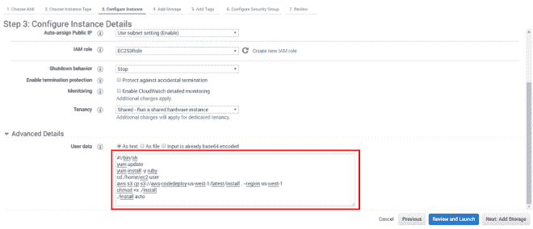

注意:确保在安全组中允许 **HTTP** 流量。

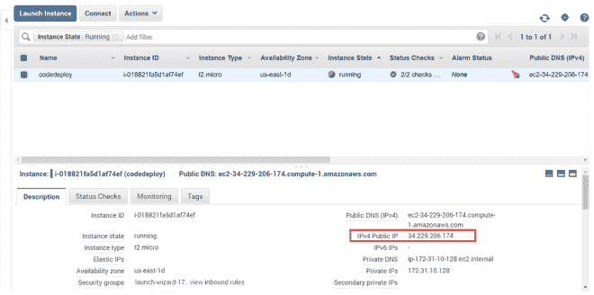

创建后，使用**公共 IP** 通过 **SSH** 连接到实例，并验证 **CodeDeploy** 代理是否正在运行:

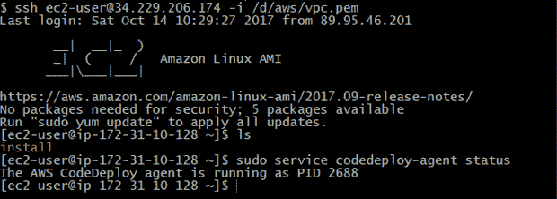

**4 —应用**

将 *appspec.yml* 文件添加到应用程序中，以向 AWS CodeDeploy 描述如何管理应用程序的生命周期:

在安装之前的**，将安装 **apache** 服务器:**

**后安装**将重启 apache 服务器

**5 —设置代码部署**

转到 [AWS CodeDeploy](https://console.aws.amazon.com/codedeploy) 并创建一个新应用程序:

选择**就地部署**(带停机时间):

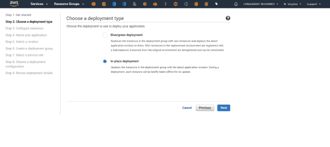

点击“**跳过**”，因为我们已经设置了 EC2 实例:

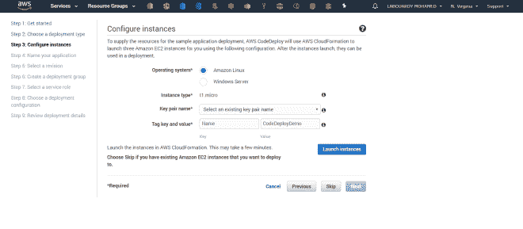

以上将带您进入下一页，您需要在这里为您的应用程序命名:

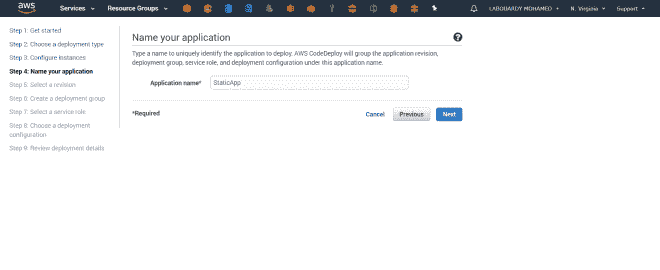

选择 EC2 实例，并为部署组分配一个名称:

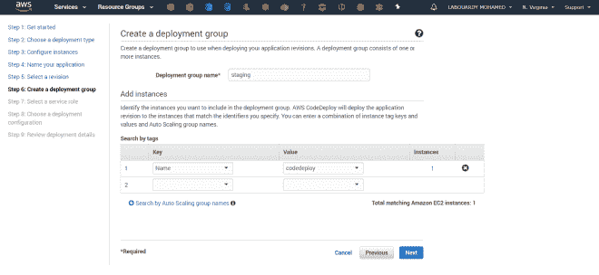

选择我们在教程的第一部分中创建的 **CodeDeployRole** :

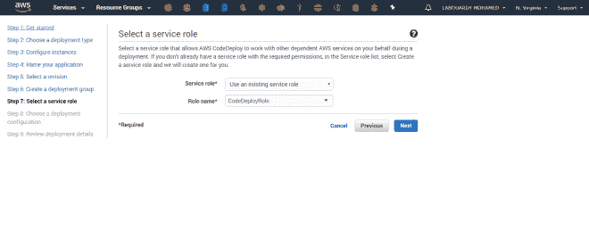

然后点击**部署**:

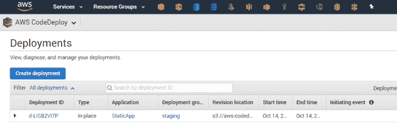

创建一个部署，选择 **Github** 作为数据源:

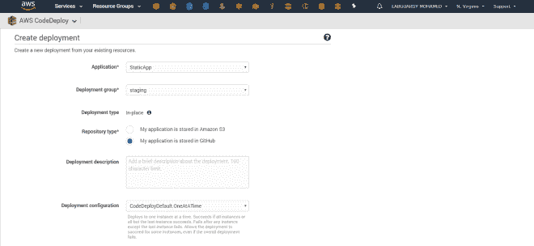

只需选择“**连接 GitHub** ”。这样做将弹出一个新的浏览器窗口，带你到 Github 登录，在那里你必须输入你的用户名和密码

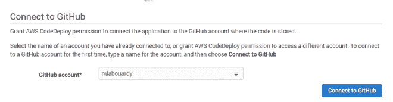

然后回到这个页面，你应该会看到类似下面的内容，只需输入剩下的细节，然后点击“ **Deploy** ”

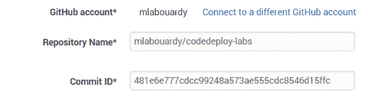

这将带您进入如下页面:

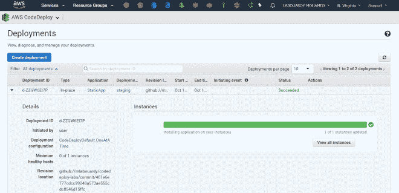

如果您将浏览器指向 **EC2 公共 IP** ，您应该会看到:

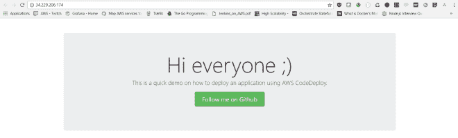

现在，让我们使用 **Github 集成**来自动化部署。

**6 —持续部署**

转到 [IAM 仪表板](https://console.aws.amazon.com/iam)，创建一个新策略，该策略允许从 **Github** 注册和创建新部署。

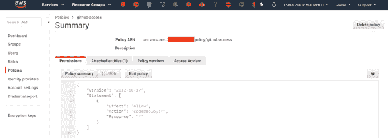

接下来，创建一个新用户并附加我们之前创建的策略:

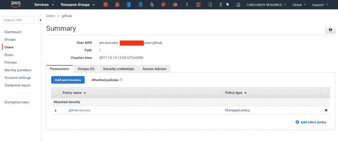

注意:将用户 **AWS 访问 ID** & **AWS 密钥**复制到剪贴板。以后会派上用场的。

**7 — Github 集成**

生成一个[新令牌](https://github.com/settings/tokens/new)从 **Github** 中调用 **CodeDeploy** :

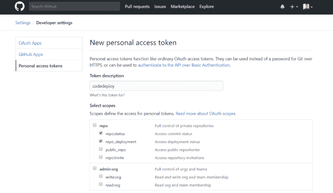

生成令牌后，复制令牌并保存它。然后，添加 **AWS CodeDeploy 集成**:

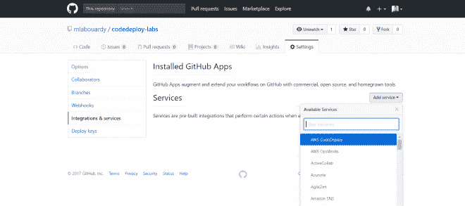

按如下方式填写字段:

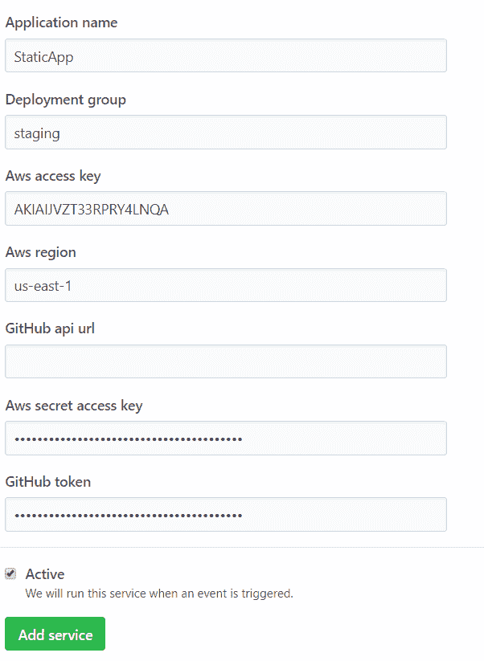

最后，添加 **Github 自动部署**

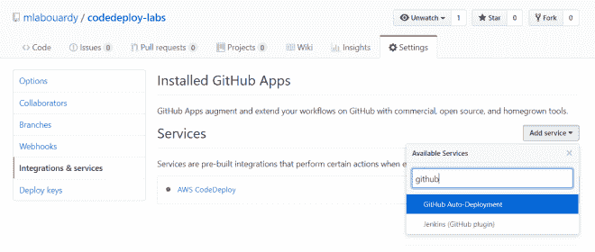

填写如下表格:

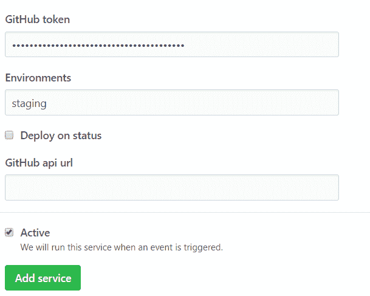

为了测试它，让我们编辑一个文件或提交一个新文件。您应该会在 **AWS CodeDeploy** 上看到新的部署:

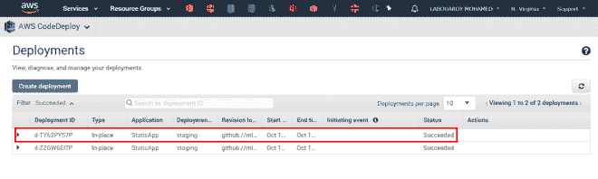