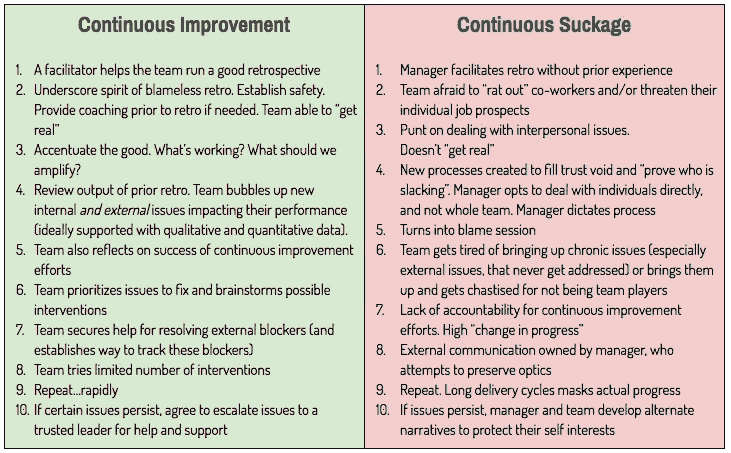

# 持续改进与持续吸取

> 原文：<https://medium.com/hackernoon/continuous-improvement-vs-continuous-suckage-299d79bb0e5>

# 持续改进

1.  主持人帮助团队进行一次好的回顾(并学习如何进行他们自己的回顾)
2.  强调无可指责的复古精神。建立安全。如果需要，在追溯之前提供指导。团队能够“变得真实”
3.  强调好的方面。什么在起作用？我们应该放大什么？
4.  检查以前追溯的输出。团队提出影响其绩效的新的内部*和外部*问题(最好有定性和定量数据支持)。
5.  团队还反思持续改进工作的成功
6.  团队对要解决的问题进行优先排序，并集体讨论可能的干预措施
7.  团队获得解决外部拦截器的帮助(并建立跟踪这些拦截器的方法)
8.  团队尝试有限数量的干预
9.  快速重复
10.  如果某些问题持续存在，同意将问题上报给可信任的领导寻求帮助和支持

# **连续吸吮**

1.  经理在没有经验的情况下推动追溯
2.  团队害怕“出卖”同事和/或威胁他们个人的工作前景
3.  处理人际关系的问题。不“现实”
4.  创建新流程以填补信任空白并“证明谁在偷懒”。经理选择直接与个人打交道，而不是整个团队。经理决定流程
5.  变成了指责环节
6.  团队厌倦了提出长期问题(尤其是外部问题，从来没有得到解决)或提出这些问题，因为不是团队成员而受到惩罚
7.  缺乏对持续改进工作的责任感。高“进行中的变更”
8.  经理拥有外部通信，他试图保护光学。缺乏连贯性
9.  重复一遍。漫长的交付周期掩盖了实际进展
10.  如果问题持续存在，经理和团队会制定替代方案来保护自身利益