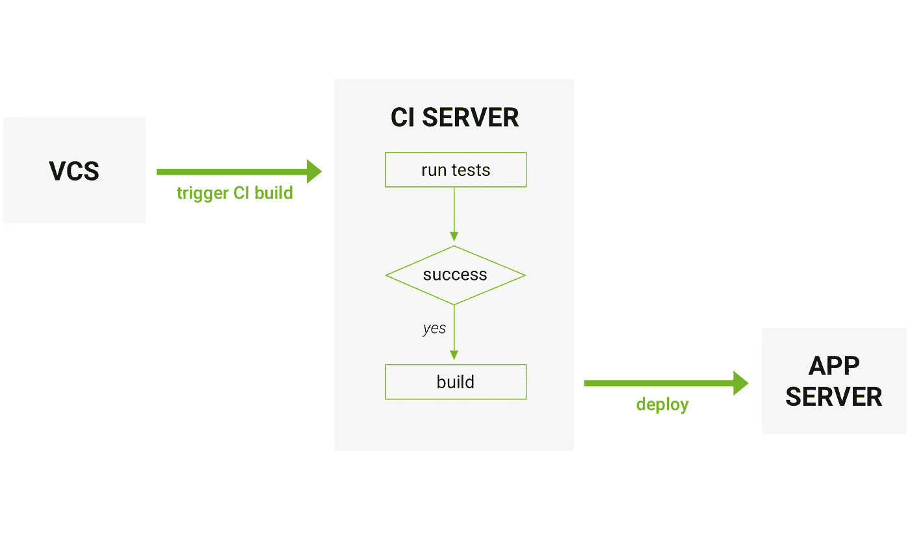
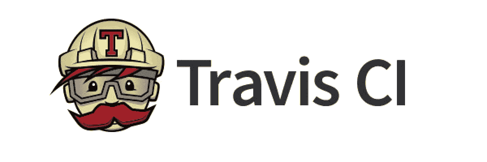

# 持续集成。CircleCI vs 特拉维斯 CI vs 詹金斯

> 原文：<https://medium.com/hackernoon/continuous-integration-circleci-vs-travis-ci-vs-jenkins-41a1c2bd95f5>


> 注意:由于降价，代码示例可能显示不正确。我建议[继续阅读我们博客](https://djangostars.com/blog/continuous-integration-circleci-vs-travisci-vs-jenkins/?utm_source=medium&utm_medium=hackernoon.com&utm_campaign=continuous%20integration&utm_content=continue%20reading)上的原始文章，以确保所有示例都能正确显示。

# CI 定义及其主要目标

持续集成(CI)是一种软件开发实践，它基于将代码频繁集成到共享存储库中。然后，每个签入都由自动构建进行验证。

持续集成的主要目标是更早、更容易地识别开发过程中可能出现的问题。如果你有规律地进行整合——在寻找错误时，要检查的东西会少得多。这导致花在调试上的时间更少，而花在添加功能上的时间更多。还有一个选项来设置对代码风格、圈复杂度(低复杂度使得测试过程更简单)和其他检查的检查。这有助于最小化负责代码审查的人员的工作，节省时间，并提高代码的质量

# 它是如何工作的



*   **开发人员在他们的计算机上本地检查代码**
*   **当完成时——他们提交变更到存储库**
*   **存储库向 CI 系统发送请求(web hook)**
*   **CI 服务器运行作业(测试、覆盖、检查语法等)**
*   **CI 服务器发布已保存的工件进行测试**
*   **如果构建或测试失败，CI 服务器会提醒团队**
*   **团队解决了问题**

# CircleCI vs 特拉维斯 CI vs 詹金斯

现在，当持续集成的过程清晰时(我希望如此),我们可以开始比较一些当今最流行的 CI 平台。每一个都有它的优点和缺点。先说 CircleCI。

# 切尔莱西


**功能:**

*   CircleCI 是一个基于云的系统——不需要专用服务器，您也不需要管理它。但是，它还提供了一个内部解决方案，允许您在自己的私有云或数据中心运行它。
*   它甚至有一个免费的商业账户计划
*   rest API——您可以访问项目、构建和工件，构建的结果将是一个工件或一组工件。工件可以是编译后的应用程序或可执行文件(例如 android APK)或元数据(例如关于测试成功的信息)
*   CircleCI 缓存要求安装。它检查第三方依赖性，而不是所需环境的持续安装
*   您可以触发 SSH 模式来访问容器并进行自己的调查(如果出现任何问题)
*   这是一个完整的开箱即用的解决方案，需要最少的配置\调整

**CircleCI 兼容:**

*   Python，Node.js，Ruby，Java，Go 等
*   Ubuntu (12.04，14.04)，Mac OS X(付费账户)
*   Github，比特桶
*   AWS，Azure，Heroku，Docker，专用服务器
*   吉拉，HipChat，Slack

**CircleCI 优点:**

*   快速启动
*   CircleCI 为企业项目提供免费计划
*   开始很容易，也很快
*   轻量级，易读的 YAML 配置
*   您不需要任何专用服务器来运行 CircleCI

**CircleCI 缺点:**

*   CircleCI 只支持两个版本的 Ubuntu 免费版(12.04 и 14.04)和 MacOS 付费版
*   尽管 CircleCI 可以在所有语言上工作和运行，但 tt 只“开箱即用”支持以下编程语言:

Go (Golang)，Haskell，Java，PHP，Python，Ruby/Rails，Scala

*   如果您想要进行定制，可能会出现一些问题:您可能需要一些第三方软件来进行这些调整
*   此外，虽然作为一个基于云的系统是一个优势，但它也可以停止支持任何软件，你无法阻止这一点

# 特拉维斯·CI



特拉维斯 CI 和 CircleCI 几乎一样

**两个人都:**

*   将 YAML 文件作为配置文件
*   是基于云的
*   在 Docker 的支持下进行测试

TravisCI 提供了 CircleCI 没有的东西？

*   同时在 Linux 和 Mac OS X 上运行测试的选项
*   支持更多现成的语言:

Android、C、C#、C++、Clojure、Crystal、D、Dart、Erlang、Elixir、F#、Go、Groovy、Haskell、Haxe、Java、JavaScript(带 Node.js)、Julia、Objective-C、Perl、Perl6、PHP、Python、R、Ruby、Rust、Scala、Smalltalk、Visual Basic

*   支持构建矩阵

# 构建矩阵

```
language: python  
python:  
  - "2.7"
  - "3.4"
  - "3.5"
env:  
  - DJANGO='django>=1.8,<1.9'
  - DJANGO='django>=1.9,<1.10'
  - DJANGO='django>=1.10,<1.11'
  - DJANGO='https://github.com/django/django/archive/master.tar.gz'
matrix:  
  allow_failures:
    - env: DJANGO='https://github.com/django/django/archive/master.tar.gz'
```

Build matrix 是一个工具，它提供了用不同版本的语言和软件包运行测试的机会。你可以用不同的方式定制它。例如，某些环境的失败可以触发通知，但是不要让所有的构建都失败(这对包的开发版本很有帮助)

## 您可能还喜欢:

[](https://djangostars.com/blog/merging-django-orm-with-sqlalchemy-for-easier-data-analysis/?utm_source=medium&utm_medium=hackernoon.com&utm_campaign=continuous%20integration&utm_content=youmayalsolike1) [## 将 Django ORM 与 SQLAlchemy 合并以简化数据分析

### Django 产品的开发通常简单明了:优秀的文档，许多现成的工具…

djangostars.com](https://djangostars.com/blog/merging-django-orm-with-sqlalchemy-for-easier-data-analysis/?utm_source=medium&utm_medium=hackernoon.com&utm_campaign=continuous%20integration&utm_content=youmayalsolike1) [](https://djangostars.com/blog/django-performance-optimization-tips/?utm_source=medium&utm_medium=hackernoon.com&utm_campaign=continuous%20integration&utm_content=youmayalsolike2) [## Django 性能优化技巧

### 当开发人员接到一个在 Django 上进行性能优化的任务时，我经常会遇到这种情况…

djangostars.com](https://djangostars.com/blog/django-performance-optimization-tips/?utm_source=medium&utm_medium=hackernoon.com&utm_campaign=continuous%20integration&utm_content=youmayalsolike2) 

# 毒药

如果您喜欢任何其他 CI 平台，总可以选择使用 Tox 创建构建矩阵。

```
[tox]
envlist = py{27,34,35}-django{18,19,110,master}[testenv]
deps =  
    py{27,34,35}: -rrequirements/test.txt
    django18: Django>=1.8,<1.9
    django19: Django>=1.9,<1.10
    django110: Django>=1.10,<1.11
    djangomaster: https://github.com/django/django/archive/master.tar.gz
commands = ./runtests.py[testenv:py27-djangomaster]
ignore_outcome = True
```

Tox 是一个通用的 virtualenv 管理和测试命令行工具。您可以使用 **pip install tox** 或 **easy_install tox** 命令进行安装。

**特拉维斯 CI 优点:**

*   开箱即用构建矩阵
*   快速启动
*   轻量级 YAML 配置
*   开源项目的免费计划
*   不需要专用服务器

**Travis CI 缺点:**

*   价格比 CircleCI 高，没有自由企业计划
*   定制(对于某些内容，您需要第三方)

# 詹金斯


**特性:**

*   Jenkins 是一个自包含的基于 Java 的程序，可以开箱即用，带有用于 Windows、Mac OS X 和其他类似 Unix 的操作系统的软件包
*   在更新中心有数百个插件，Jenkins 实际上集成了持续集成和持续交付工具链中的每一个工具
*   Jenkins 可以通过其插件架构进行扩展，为 Jenkins 能做的事情提供了几乎无限的可能性
*   各种作业模式:自由式项目、管道、外部作业、多配置项目、文件夹、GitHub 组织、多分支管道
*   詹金斯管道。这是一套插件，支持实现和集成持续交付管道到詹金斯。Pipeline 提供了一组可扩展的工具，用于通过管道 DSL 将简单到复杂的交付管道建模为“代码”
*   允许您在各种条件下启动构件。
*   你可以用 Libvirt、Kubernetes、Docker 等运行 Jenkins。
*   Rest API —可以控制获取的数据量、获取/更新 config.xml、删除作业、检索所有构建、获取/更新作业描述、执行构建、禁用/启用作业

**詹金斯赞成:**

*   价格(免费)
*   用户化
*   插件系统
*   对系统的完全控制

**詹金斯弊:**

*   需要专用服务器(或几个服务器)。这导致了额外的费用。对于服务器本身，DevOps 等…
*   配置/定制所需的时间

# 结论

选择什么样的 CI 系统？这取决于你的需求和你计划使用它的方式。

CircleCI 推荐用于小型项目，其主要目标是尽可能快地开始集成。

Travis CI 适用于您正在处理开源项目的情况，这些项目应该在不同的环境中进行测试。

Jenkins 被推荐用于大型项目，在这些项目中，你需要通过使用各种插件来进行大量的定制。你几乎可以改变这里的一切，但这个过程可能需要一段时间。如果您计划最快开始使用 CI 系统，Jenkins 可能不是您的选择。

你更喜欢哪种 CI 系统？请给我们留言，分享你的想法。

我们随时欢迎您提出问题，分享您想阅读的话题！

[](https://djangostars.com/services/python-django-development/?utm_source=medium&utm_medium=hackernoon.com&utm_campaign=continuous%20integration&utm_content=banner_end)

> 这篇文章是由[Oleksandr shapo RDA](https://medium.com/u/5eef930686cb?source=post_page-----41a1c2bd95f5--------------------------------)([**ALEXANDER shapo RDA**](https://djangostars.com/blog/author/alexander-shaporda/)**)**——Django Stars 的一位公关经理写的。这篇关于 [**持续集成**](https://djangostars.com/blog/continuous-integration-circleci-vs-travisci-vs-jenkins/?utm_source=medium&utm_medium=hackernoon.com&utm_campaign=continuous%20integration&utm_content=continuous%20integration) 的文章最初发表在 Django Stars 博客上。
> 
> 特别分享给 [Hackernoon](https://medium.com/u/4a8a924edf41?source=post_page-----41a1c2bd95f5--------------------------------) 读者。

> *如果你觉得这篇文章有用，请点击👏下面的按钮:)*

[](http://bit.ly/HackernoonFB)[](https://goo.gl/k7XYbx)[](https://goo.gl/4ofytp)

> [黑客中午](http://bit.ly/Hackernoon)是黑客如何开始他们的下午。我们是 T21 家庭的一员。我们现在[接受投稿](http://bit.ly/hackernoonsubmission)并乐意[讨论广告&赞助](mailto:partners@amipublications.com)机会。
> 
> 如果你喜欢这个故事，我们推荐你阅读我们的[最新科技故事](http://bit.ly/hackernoonlatestt)和[趋势科技故事](https://hackernoon.com/trending)。直到下一次，不要把世界的现实想当然！

