# 使用 TravisCI 持续集成角度项目

> 原文：<https://medium.com/hackernoon/continuous-integration-for-angular-projects-with-travisci-4d2cc72d7853>

在过去的几十年里，web 开发的旅程令人惊叹。标准已经改变，实践已经发展，web 开发世界的情况变得越来越好。例如，人们从猴子修补代码转移到 MVC 和设计模式。公司和个人都倾向于 [TDD](https://en.wikipedia.org/wiki/Test-driven_development) (测试驱动开发)，而不是 [BDD](https://en.wikipedia.org/wiki/Behavior-driven_development) (业务驱动开发)。最后但同样重要的是，CI(持续集成)和 CD(持续交付)在技术行业越来越受欢迎。

在本文中，我将解释如何使用 [TravisCI](http://travis-ci.org/) 在 [GitHub](http://www.github.com/) 上为您的 [Angular](https://hackernoon.com/tagged/angular) 项目设置持续集成。这适用于 angular 应用程序以及您创建的任何 Angular 库/插件。

# 但是为什么呢？

在进入**如何**之前，我们先来看看**为什么**。为什么我们实际上需要在我们的项目中实施 CI？这样做有几个好处:

1.  对于所有手动运行测试的开发人员来说，它节省了时间，并确保一切顺利进行。
2.  开发人员发现很难记住**哪些分支需要测试，哪些分支应该忽略**。没必要再记起那件事了。
3.  不再'它在我的机器上工作。“咄！”。正确设置 CI 后，您可以在您选择的环境中运行测试。
4.  详细说明第三点，它使得在你的 CI 集成中复制生产环境变得更加容易，所以你将知道它在生产中是如何工作的。
5.  **实施 CI 就是爽**。

# 那么我们该怎么做呢？

我将使用[这个示例应用程序](http://ahsanayaz.github.io/ng-traffic-ci)来演示 [TravisCI](https://hackernoon.com/tagged/travisci) 的集成。我已经在应用程序中添加了一些单元测试和端到端测试。这是应用程序的代码库。完成 CI 实施后，我们将能够:。

1.  运行单元测试
2.  运行 E2E 测试
3.  生成生产版本
4.  在 gh-pages 上部署生产版本进行演示。

所以让我们开始吧。首先，我将通过执行以下命令在我的项目中创建一个名为`travis-ci`的分支:

`git checkout -b travis-ci master`

现在，我们将前往[https://travis-ci.org](https://travis-ci.org/)。由于我已经设置了一个 Github 帐户，我可以快速登录。您可以注册或使用您的 GitHub 帐户登录。然后，我们将从那里启用我的帐户下的存储库。请参见下面的快照:

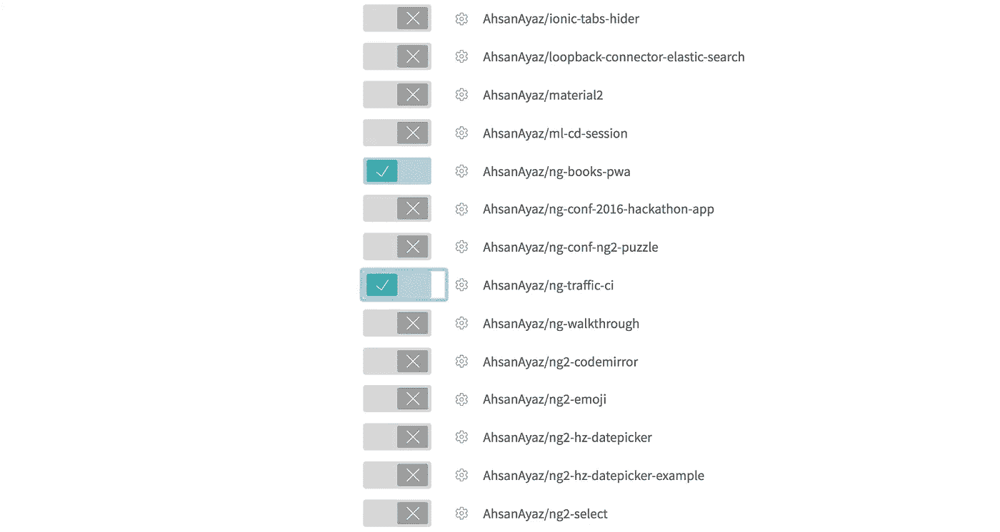

*Turning on TravisCI for our app*

因此，我们为 GitHub repo 打开了 TravisCI，但它现在实际上什么也不做。我们需要在项目的根目录下添加一个`.travis.yml`文件。那份文件会告诉特拉维斯该怎么做。(例如，在哪个环境下工作、操作系统、语言、版本、CI 要考虑的分支等。)
这是我们将要使用的 [YAML](https://gist.github.com/AhsanAyaz/820d40da5d1aa45c138f9e55d5193d34) 文件(记得我们在 git repo 中切换到了分支`travis-ci`)。让我们快速浏览一下这个文件的内容。

*   语言:告诉 travis 哪个环境将用于管道。我们在测试中使用了 node_js 容器。
*   node_js:指定使用哪个版本的 node_js。我们可以指定`stable`获得最新的稳定版本等等。
*   分支步骤配置哪些分支应该执行管道。对于我们的配置，我们只对主分支的构建感兴趣。点击查看更多关于分支[的选项。](https://docs.travis-ci.com/user/customizing-the-build#Building-Specific-Branches)
*   `before_script`阶段在运行脚本之前执行，我们实际上正在为我们的测试环境安装一堆东西，比如用于运行单元的 Google Chrome stable 和基于它的 E2E 测试。
*   脚本阶段包含实际的步骤，我们运行我们的单元测试，e2e 测试，然后我们生成一个产品构建，它将构建保存在 dist 文件夹中。

之后，我们使用 GitHub 的 pages 服务，通过将 dist 文件夹推到 gh-pages 分支来部署我们的代码。我们仅为部署的主分支进行了配置。注意 skip_cleanup 标志设置为 true？它确保在脚本阶段生成并保存到 dist 的构建不会被清除。
最后，为了部署，我们将`github_token`设置为`$GITHUB_TOKEN`，这应该是一个我们必须提供给 TravisCI 的 ENV 变量。但在此之前，我们需要从 GitHub 概要文件中生成令牌。
我将进入我的 GitHub 设置>个人访问令牌>生成新令牌，如下图所示。
**注意:确保允许作用域中的回购访问，并复制和保存您生成的令牌以备后用**:

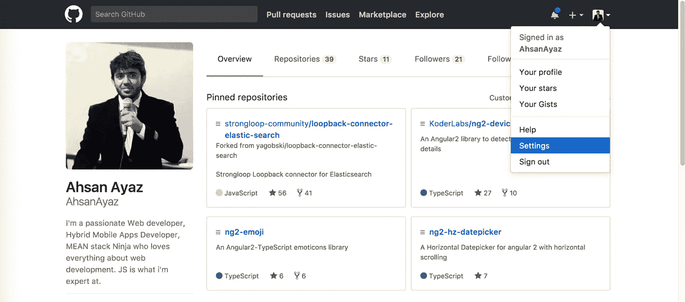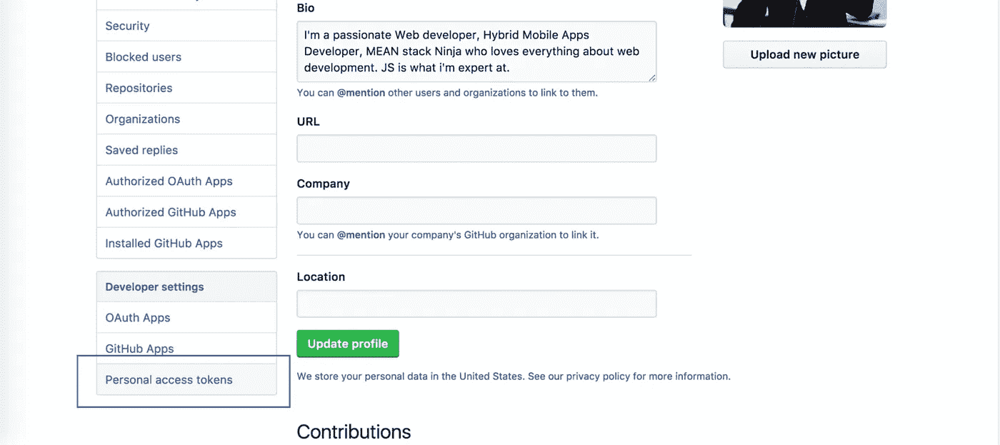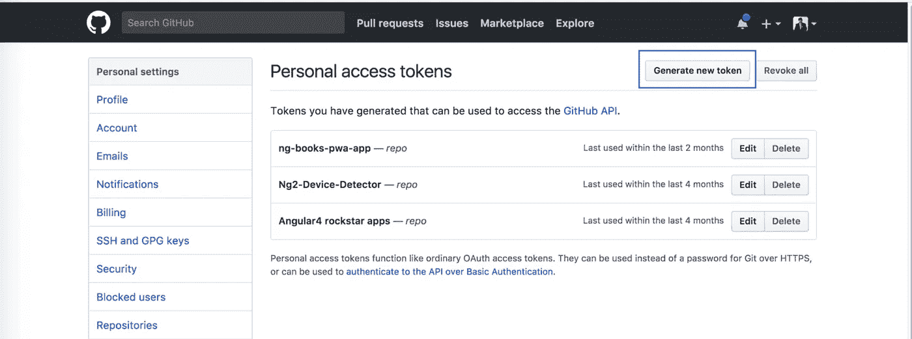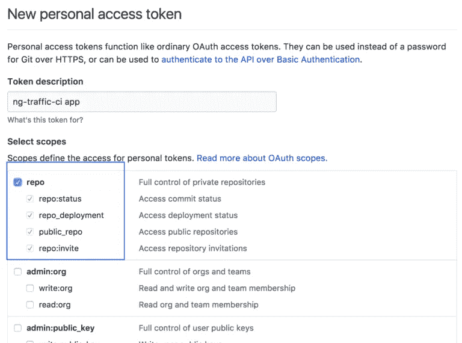

我们已经生成了令牌并复制到剪贴板，因此我们将转到 travis-ci.org 项目的设置页面。

1.  打开`Build only if .travis.yml is present`
2.  输入复制的令牌并赋给变量 GITHUB_TOKEN

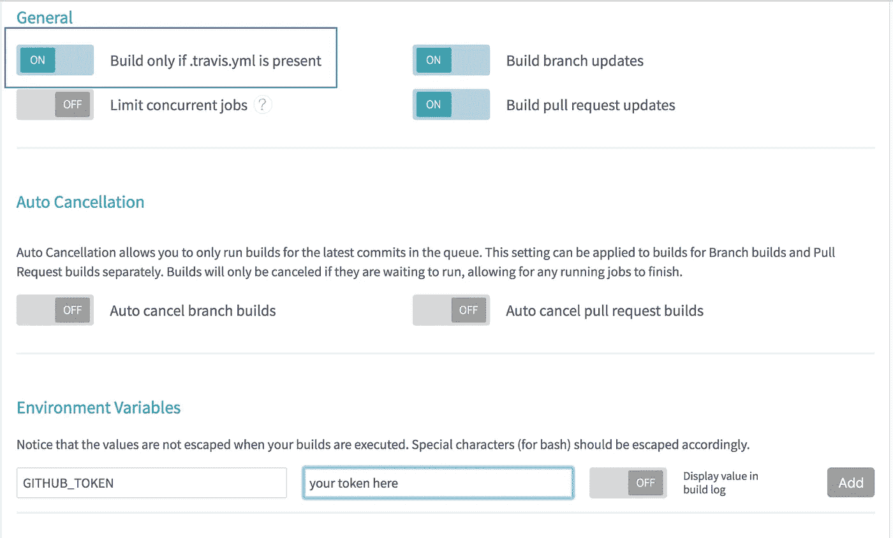

既然已经处理好了，我们可以将我们的`.travis.yml`提交到 GitHub repo。从那里，我们将创建一个到主分支的 Pull 请求，因为我们已经将 TravisCI 配置为只在主分支上执行脚本和部署。请参见下面的快照:

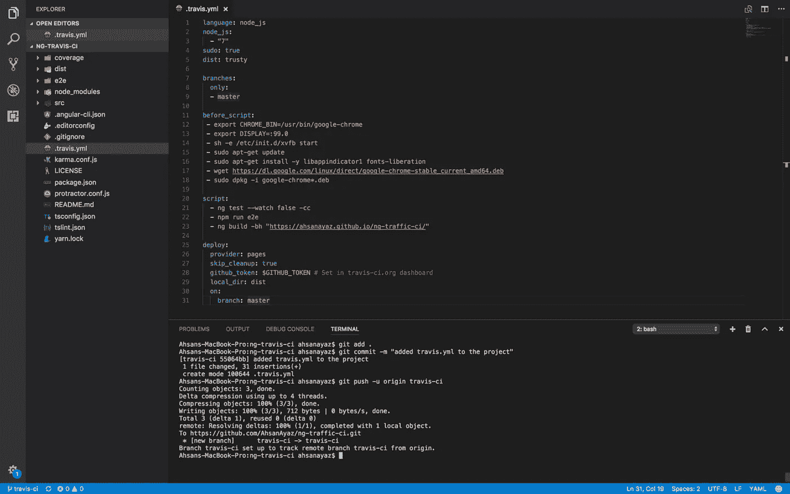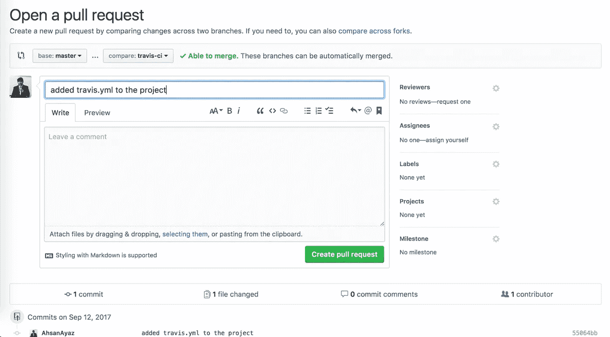

一旦这个 [PR](https://github.com/AhsanAyaz/ng-traffic-ci/pull/1) 被创建，您将看到 TravisCI 构建被触发用于这个 PR。

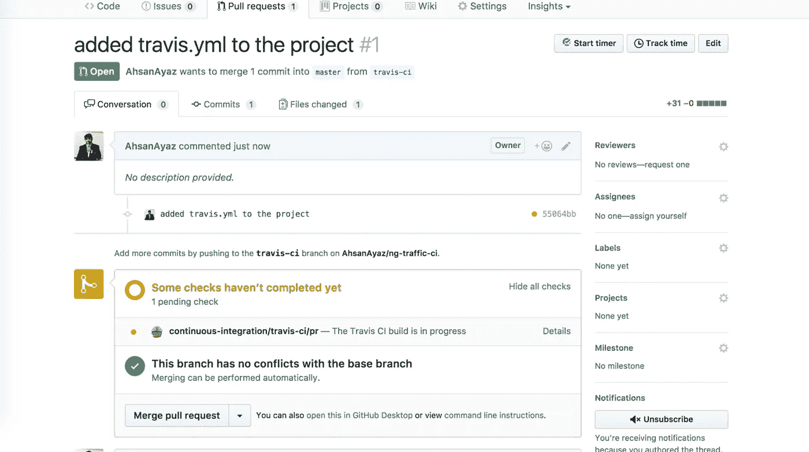

将跳过部署，因为这是一个合并请求。但是一旦合并，部署就会完成。您仍然可以在 PR 页面上看到 TravisCI 构建通过并更新了状态。

我现在已经合并了公关和应用程序的最终代码部署[在这里](https://ahsanayaz.github.io/ng-traffic-ci/)。看看吧，这很酷😉
最后但同样重要的是，你可以在你的自述文件或网站中添加 TravisCI 的 build 徽章。您将直接从您的回购页面上看到当前构建是否通过。以下是获取徽章网址的方法:

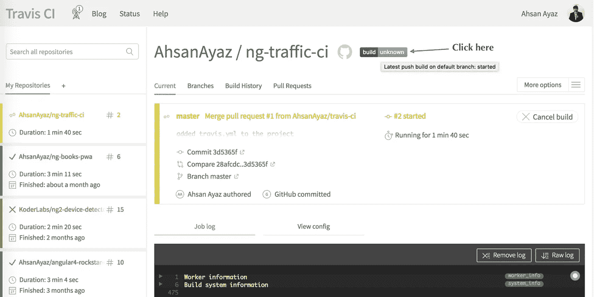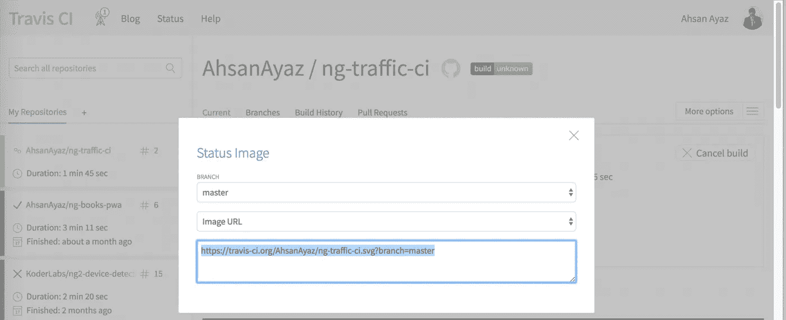

你可以参考我的[项目的自述文件](https://raw.githubusercontent.com/AhsanAyaz/ng-traffic-ci/master/README.md)，看看我是如何在那里嵌入 TravisCI build 徽章的。

# 结论

TravisCI 是将 CI 整合到您的项目中的一个很好的工具(无论是否有角度)。在插件/项目中设置和实现 CI 非常简单，为您的工作增加了额外的好处。大家都在做！请尽你所能支持我们！反馈，掌声，GitHub 明星，任何东西都欢迎。感谢阅读