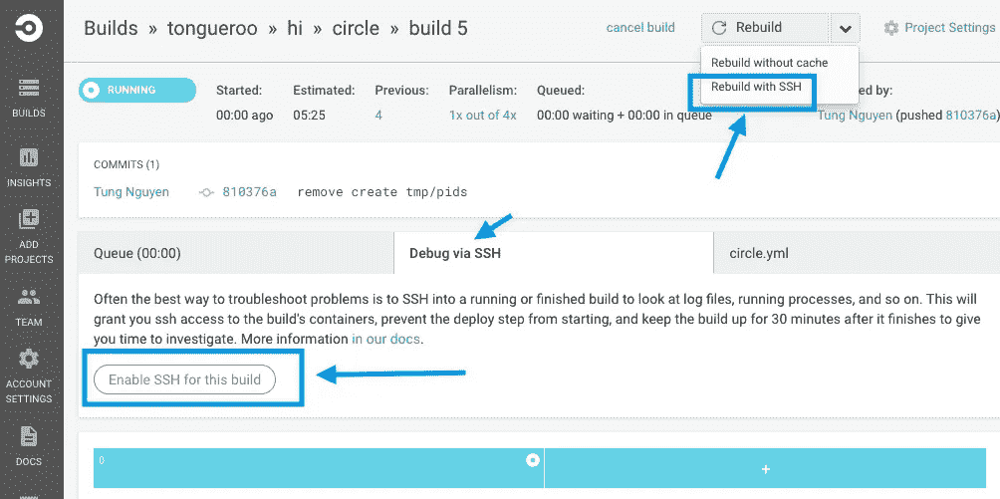
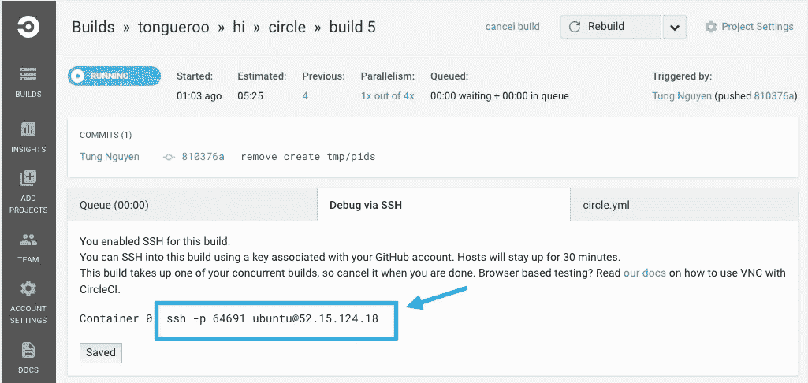
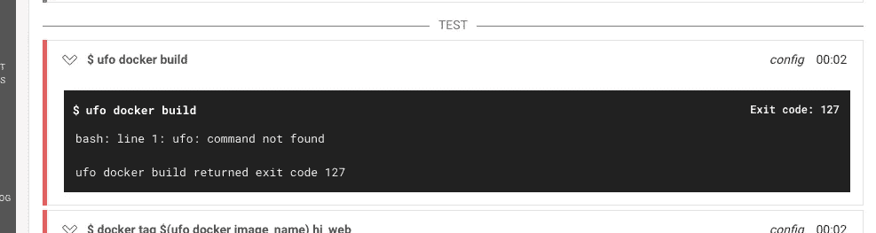
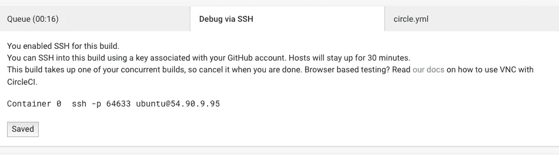
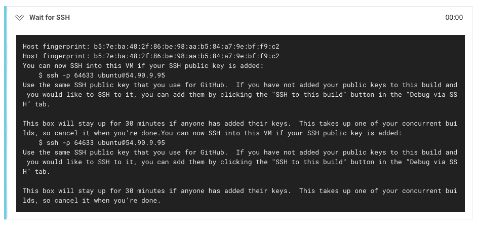

# 持续集成提供者黑仔调试特性:ssh 登录

> 原文：<https://medium.com/hackernoon/continuous-integration-provider-killer-debugging-feature-ssh-login-6515928e0828>

我很喜欢不用自己运营 CI 服务。如果可能，我宁愿使用托管解决方案，而不必担心要维护额外的服务器集群。对于开源项目来说尤其如此。然而，大多数 CI 供应商的调试流程有点麻烦，尤其是初始设置。

这是典型的工作流程:

1.  更新 CI 构建脚本和配置。
2.  将代码提交并推送到 [GitHub](https://hackernoon.com/tagged/github) 。
3.  登录到配置项提供者日志记录界面，观察它的运行。
4.  通常会遇到错误，然后重复步骤 1 到 3，直到构建通过。

如果构建需要几分钟，并且错误发生在最后，那么这个流程会更加痛苦。你最终等了很长时间才看到错误，提交你希望是修复的东西，推它，希望并等待看到构建是否被修复。

# 黑仔调试功能

我不是那种通常会相信单曲杀手特征炒作的人。然而，就 [CircleCI](http://circleci.com) 而言，他们有一个功能在我第一次看到它时就让我大吃一惊，直到今天仍然如此: **ssh 登录**。能够 ssh 到机器中进行调试，并在[环境](https://hackernoon.com/tagged/enviroment)中四处打探，这简直是天赐之物。

该特性的实现方式也使开发人员能够调试实际的错误，而不是必须 ping 操作团队来找出构建中的错误。CircleCI 提供了一个链接，可以在几个地方使用 SSH 进行构建:



单击“Enable SSH for this build”按钮后，它将提供一个 SSH 命令，您可以将该命令复制并粘贴到您的终端中以进入虚拟机。



一旦你到了那里，你就可以 cd 到你的项目，尽情地调试。

**ssh 调试演示**

对于这个调试演示，我使用 GitHub 上的 [tongueroo/hi](https://github.com/tongueroo/hi/tree/circle) 项目的 circle 分支。

对于这个例子，我已经提交了代码，但它导致了一个构建错误。我在构建页面上看到了测试部分的错误:



显然，我忘了安装 UFO gem，作为测试命令的一部分，我用它来构建 docker 映像。我再次运行构建并启用 ssh 进行调试。



调试过程中，箱子将停留 30 分钟。现在，我复制 ssh 命令来进入这个盒子。

```
$ ssh -p 64633 ubuntu@54.90.9.95
$ cd hi
$ ufo docker build
No command 'ufo' found, did you mean:
 Command 'ufw' from package 'ufw' (main)
 Command 'dfo' from package 'dfo' (universe)
 Command 'udo' from package 'udo' (universe)
ufo: command not found
$
```

上面，我再次运行命令来确认错误。这是我忘记安装相关 ufo 工具的一个例子。现在，我要安装飞碟工具，然后继续折腾，直到我得到建设通过。

```
$ cd hi
$ gem install --no-ri --no-rdoc ufo
$ env # checkout env variables
$ ls # checkout ls
$ ufo docker build
$ docker tag -f $(ufo docker image_name) hi_web
$ docker-compose run web bundle exec rake db:create db:migrate
$ docker-compose run web bundle exec rake
1 runs, 1 assertions, 0 failures, 0 errors, 0 skips
$
```

这里的美妙之处在于，我可以在不提交代码的情况下提前进行大量测试，因为我可以 ssh 到环境中，而不必经历较慢的提交和推送周期。我甚至可以四处打探并检查环境变量。最后，一旦我有了高度的信心，我就做最后的提交和上传。这里确认了[版本是固定的](https://circleci.com/gh/tongueroo/hi/10)。


# 摘要

CircleCI 的 ssh 功能非常有用，这也是 CircleCI 在我需要使用托管配置项时使用当前我的 goto 的主要原因之一。ssh 登录特性的 CircleCI 文档在这里是。我希望其他提供商也能实现这个方便的特性。如果确实有其他托管 CI 供应商提供此功能，请随时告诉我，我会将它添加到列表中。

> 谢谢你读到这里。如果你觉得这篇文章有用，如果你推荐这篇文章(点击拍手按钮)让其他人也能找到它，我会非常感激！还有，在 [LinkedIn](https://www.linkedin.com/in/tongueroo/) 上和我联系。

[](http://bit.ly/HackernoonFB)[](https://goo.gl/k7XYbx)[](https://goo.gl/4ofytp)

> [黑客中午](http://bit.ly/Hackernoon)是黑客如何开始他们的下午。我们是 [@AMI](http://bit.ly/atAMIatAMI) 家庭的一员。我们现在[接受投稿](http://bit.ly/hackernoonsubmission)并乐意[讨论广告&赞助](mailto:partners@amipublications.com)机会。
> 
> 如果你喜欢这个故事，我们推荐你阅读我们的[最新科技故事](http://bit.ly/hackernoonlatestt)和[趋势科技故事](https://hackernoon.com/trending)。直到下一次，不要把世界的现实想当然！

