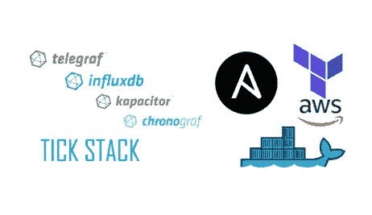
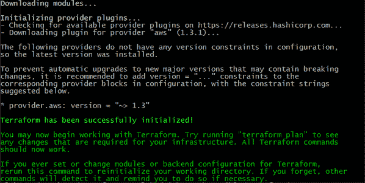
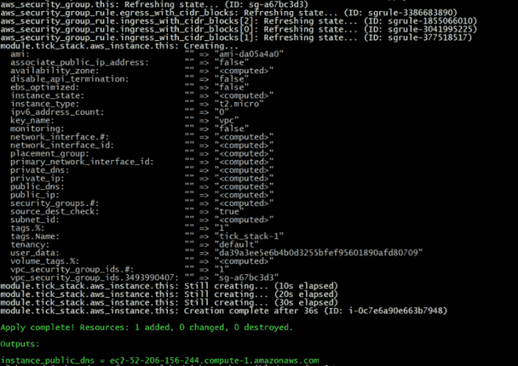
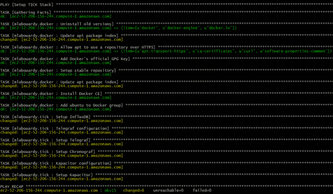
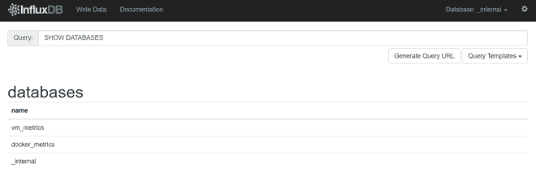
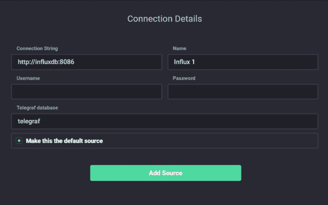
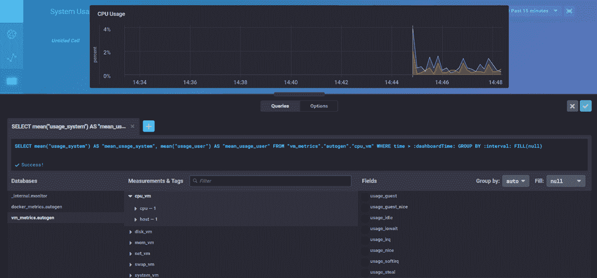
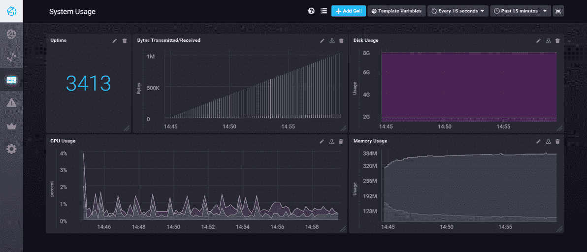
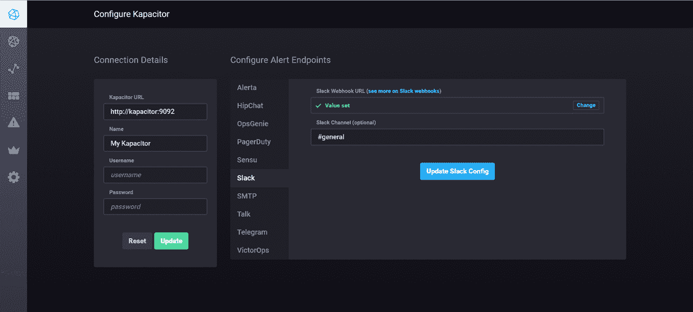
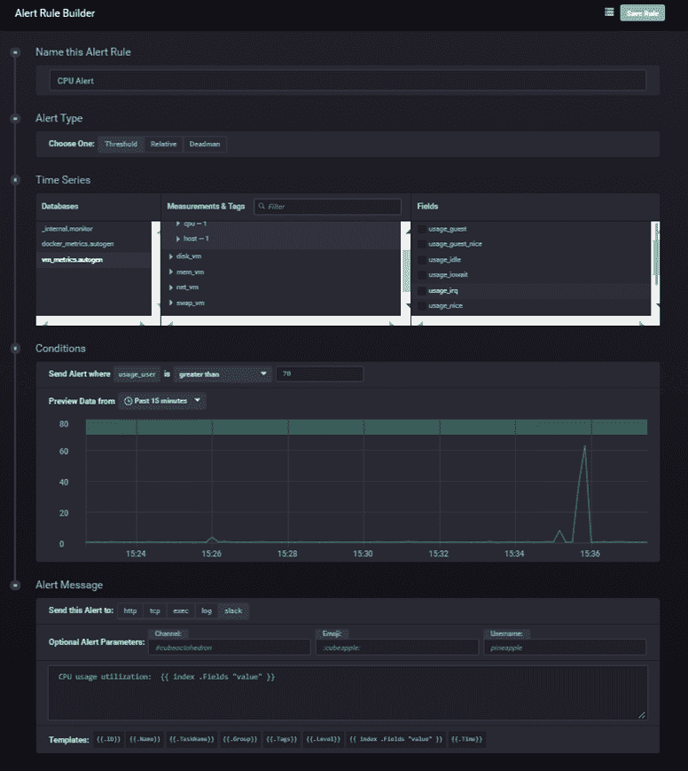

# 利用 TICK 堆栈进行连续监控

> 原文：<https://medium.com/hackernoon/continuous-monitoring-with-tick-stack-10585dfea481>

需要监控您的系统。它帮助您**在任何问题导致影响您的客户和损害您的商业声誉的重大停机之前检测到这些问题。这也有助于您根据系统的实际使用情况**规划增长**。但是从不同的数据源收集指标是不够的，您需要**个性化**您的监控，以满足您自己的业务需求，并定义正确的警报，以便系统中的任何异常变化都会得到报告。**

在这篇文章中，我将向您展示如何建立一个只有开源项目的弹性持续监控平台&如何定义一个事件警报来报告系统中的变化。

克隆以下 Github 存储库:

> git 克隆[https://github.com/mlabouardy/terraform-aws-labs.git](https://github.com/mlabouardy/terraform-aws-labs.git)

**1 —地形& AWS**

在 *tick-stack/terraform* 目录中，使用您自己的 **AWS** 凭证更新 *variables.tfvars* 文件(确保您拥有正确的 **IAM** 策略) :

> region = "AWS 区域"
> 
> access_key = "您的 AWS 访问密钥 ID "
> 
> secret_key = "您的 AWS 密钥"
> 
> key_name = "您的 SSH 密钥对"

发出以下命令下载 AWS 提供程序插件:

> 地形初始化

发出以下命令来配置基础架构:

> terra form apply-var-file = variables . TF vars

**2 —可回答的&对接者**

用您的实例 DNS 名称更新*库存*文件:

> [服务器]
> 
> ec2–52–206–156–244.compute-1.amazonaws.com

然后，安装 Ansible 自定义角色:

> ansible-galaxy 安装 mlabouardy.tick

执行**可行剧本**:

> ansi ble-playbook-private-key = AWS . PEM-I 库存手册. yml

将您的浏览器指向 [http://DNS_NAME:8083](http://dns_name:8083/) ，您应该会看到**influx db**Admin Dashboard:

现在，在**Chronograf**([http://DNS _ NAME:8888](http://dns_name:8888/))中创建一个 **InfluxDB 数据源**:

创建新仪表板，如下所示:

您可以创建多个图形来可视化不同类型的指标:

注:关于如何在 **Chronograf** 中创建交互式动态仪表盘的详细信息，请查看[我之前的教程](http://www.blog.labouardy.com/monitor-swarm-cluster-with-tick-stack-slack/)。

您需要详细说明收集到的数据，以做一些类似警报的事情。因此确保启用 **Kapacitor** :

定义一个新的警报，如果 **CPU 利用率**高于 **70%** ，则发送 **Slack** 通知。

为了测试它，我们需要生成一些工作负载。在这种情况下，我使用了[重音](https://linux.die.net/man/1/stress):

> 容易获得安装应力

给 CPU 带来压力:

> 压力— cpu 4 —超时 20 秒

几秒钟后，您应该会收到一个**松弛**通知。