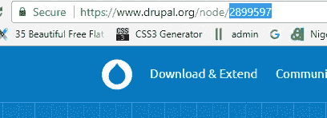

# 为 Drupal 代码库做出贡献；德鲁巴婴儿实用指南。

> 原文：<https://medium.com/hackernoon/contributing-to-drupal-codebase-a-practical-guide-for-drupal-babies-de992efa68b2>


[the.conversation.is.good.gginternational.net](http://the.conversation.is.good.gginternational.net/how-use-git-easily-patch-drupal-modules)

我最近[固定地址字段插件模块](https://www.drupal.org/sandbox/togbonna/2060269)，所以我想记录我的过程，这样我就可以随时查阅，而不是浪费时间上网。本指南将帮助你更好地理解如何为社区做贡献。

# 你将学到什么。

1.  如何报告问题而不被打脸

2.制造问题的最佳实践

# 要求

1.  您必须在本地机器上安装 git

2.理解 git 的基本命令(推、拉、取、克隆)

3.你必须有一个 drupal.org 账户

在我继续写这篇文章之前，有些人可能会想，我为什么要关心 drupal 模块中的一个简单的错别字…

> Pssst，通过纠正小的错别字，你为社区做了很多，这是你提供的一种价值形式，也是一种赞赏的标志，除此之外，你逐渐将你的名字放在平台上，让你可以作为 drupal 贡献者出现在网上，这样公司就可以雇用你。你相信了吗？

# 好的，我们开始吧。

## 第一步:当你发现一个 bug 或错别字时，你会怎么做？

每当您在任何 drupal 代码库中发现博客或打字错误时，您可以通过报告问题来帮助社区。

## 步骤 2:如何报告 bug 问题

我将用我刚刚修复的新模块作为一个典型的例子

a)进入 drupal.org 的模块页面，在我的情况下是 https://www.drupal.org/sandbox/togbonna/2060269 的

b)点击打开问题并创建问题

c)指定你在做什么，在我的情况下，我正在修复我的国家的所有状态，这是一个功能请求，我想完成整个状态。

**注意:如果您正在报告并想要处理它，您可以将问题分配给自己，这将通知其他开发人员您正在处理它。**

下面的过程是在你的本地机器上，确保你已经安装了 git

## 步骤 3:克隆模块

a)返回模块页面，单击版本控制选项卡

b)复制唯一的 URL 以将项目克隆到您的本地机器上

`git clone --branch 7.x-1.x https://git.drupal.org/sandbox/togbonna/2060269.git address_field_nigeria`
`cd address_field_nigeria`

## 步骤 4:创建一个分支。

创建一个分支将帮助你有一个干净的石板来工作。

一)`Git checkout –b fix-36-states`

然后你可以在完成后开始处理这个问题

```
# Commit changed files to your topic branch
git commit -a -m "Issue #123456 by username: fixed all 36 states"
```

## 第五步:重定基数

Git rebase 简单地说就是，连接回主树。这有助于您从源文件中提取任何最近的更改

```
git fetch origin
```

连接回主树

```
# Commit changed files to your topic branch
git rebase origin/[branchname] #e.g. my branch name is 7.x-1.x
```

## 步骤 6:创建补丁

`git diff > [description]-[issue-number]-[comment-number].patch`

[描述]:固定所有 36 个状态

[问题编号]



Issues number

git 命令将创建。本地计算机上的补丁文件。

## 步骤 7:提交补丁

在提交您的补丁之前，请确保您测试了代码并验证了它的工作，验证之后，您可以提交您的补丁并耐心等待维护者/作者的审查。

拍拍自己的背，你在添加 drupal [代码库](https://hackernoon.com/tagged/codebase)方面做得很好。你应该在 medium 博客帖子和 [facebook 群组](https://www.facebook.com/groups/drupal.ng/?ref=bookmarks)页面上谈论它

干杯！