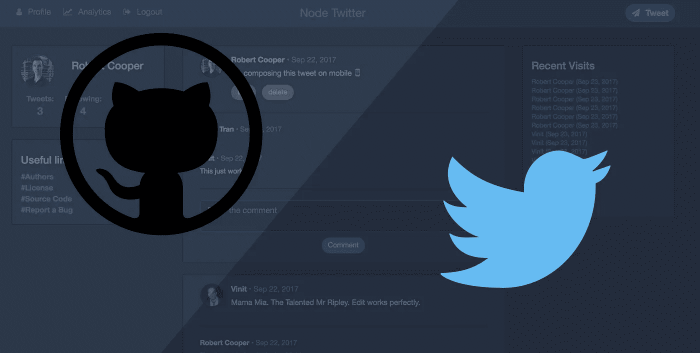
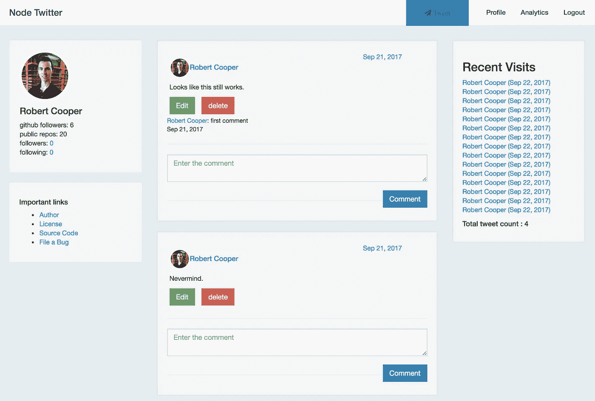
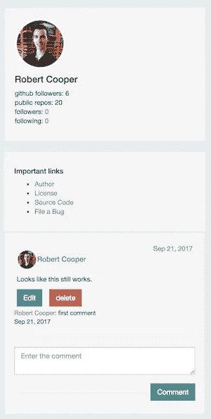
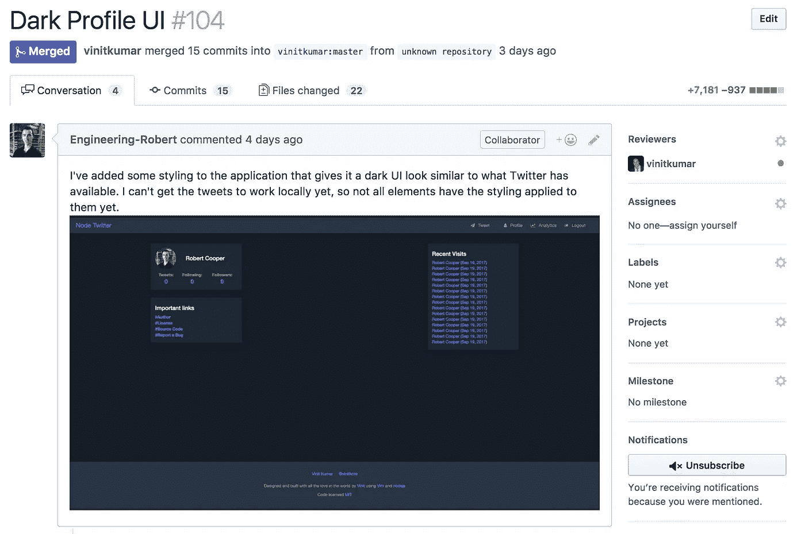
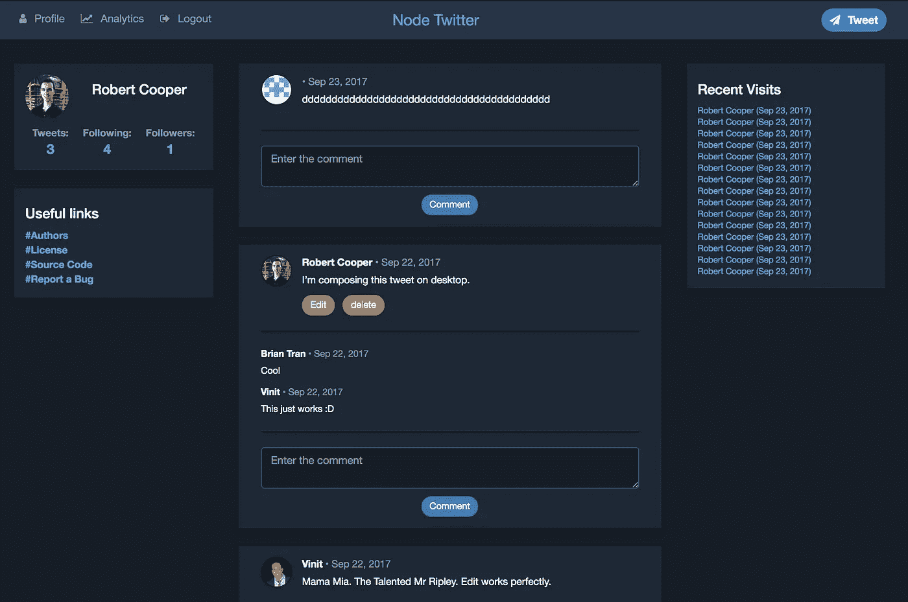
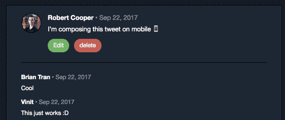
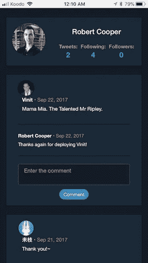
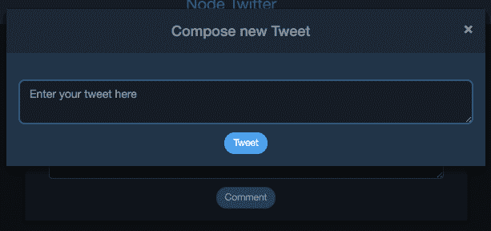

# 为我的第一个开源项目做贡献

> 原文：<https://medium.com/hackernoon/contributing-to-my-first-open-source-project-3e432c5e8caa>

我想为一个开源项目做贡献已经有一段时间了，但是我从来没有找到一个项目使用了很多我熟悉的 web 语言和框架。也就是**到现在**！

为了找到新的开源项目， [Github 建议](https://help.github.com/articles/finding-open-source-projects-on-github/)探索项目[展示](https://github.com/explore)以及通过主题关键字搜索存储库。我首先看了一下项目展示，发现展示的存储库相当复杂，所以我转向按主题搜索存储库。我最终搜索了“ *twitter* ”，因为我有一些使用 [Node.js](https://hackernoon.com/tagged/nodejs) 整合 API 的经验，twitter 是一个非常流行的 API。我最终找到了一个名为[***node-Twitter***](https://github.com/vinitkumar/node-twitter)的存储库，它使用 Node.js、Express、Pug 模板和 MongoDB。这些都是我用过的东西，用起来很舒服，所以看起来很适合我。幸运的是，这款应用在 Heroku 上有一个 live 版本，所以我不用在我的本地机器上设置项目就可以查看项目。

当我去看现场演示的时候，我注意到这个应用程序在前端设计**和**方面做了一点**的改进**。以下是我认为可以改进的一些设计和功能问题的简短列表:

*   当页面内容很少时，页脚浮动在浏览器窗口的底部
*   某些元素靠得太近，可以使用更多的空间和填充
*   导航中的颜色使东西难以阅读，应用程序没有反应
*   编辑推文需要转到不同的页面

Here is the web applications main dashboard, before the design changes I implemented

This was the mobile view of the application when I first came upon the project

我看到了很多帮助我改进 UI 的潜力，这对我很有用，因为我正试图用更多的前端开发工作来建立我的投资组合。我勇往直前，开始着手这个项目。

我**首先将库**分支到我自己的 [GitHub](https://hackernoon.com/tagged/github) 账户中，然后在我的本地机器上克隆它。我不得不试着让这个应用程序在我的机器上运行，但是一旦我修改了配置文件，我就成功地让这个应用程序运行起来了！

我试图为*节点 twitter* 复制[“夜间模式”Twitter UI](https://9to5mac.com/2017/08/08/twitter-night-mode-desktop/) ，因为我认为没有多少人知道 Twitter 上更黑暗的主题 UI。我对 UI 做了一些**更改，然后在主项目存储库上提交了一个**拉请求**。我在我的 pull 请求中包含了一个修改后的应用程序的截图，以引起存储库所有者的兴趣。我还在 Twitter 上给库主发了个 DM(真的那个！)让他知道我是他项目的超级粉丝，我多么希望他能把我的改变融入到项目中。**

The pull request that started it all

在库的所有者的建议下，在我的拉请求中添加了一些提交之后，我的拉请求被**合并到了项目**中！不仅如此，我还被添加为存储库的成员，作者告诉我可以自由地提出自己的合并请求。作者给了我一些**指南，让我在做项目时遵循与 git 工作流相关的**。例如，我应该在“feature”或“fix”分支上进行更改，然后向 master 发出 pull 请求。

My pull request got merged 🙌🏻

从那以后，我花了很多时间在这个项目上，我相信我也重新激发了存储库所有者对这个项目的热情(他的提交频率增加了)。我设法解决了我之前概述的所有问题，并且不断发现更多可以改进的地方。

The latest version of the app’s main dashboard

I improved the functionality related to editing your own “tweets”

The new mobile-friendly view of the app

我从这个项目中学到了很多，项目负责人也给了我很多关于在 Github 上做大型项目的好建议。这也是一个有趣的项目，因为偶尔会有人登录应用程序并留下“推文”。

这是我第一次尝试为一个使用良好 git 工作流实践的开源项目做贡献，它激励我找到更多我可以贡献和学习的项目。我希望这能激励其他人去寻找开源项目，无论是你的第一个*还是第 100 个*。如果你最终找到了你的第一个开源项目，请告诉我。我很想听听！

如果你想试用 Node Twitter 的当前版本，你可以在这里[这样做](http://nitter.herokuapp.com/)(你需要使用 Github 帐户进行认证才能使用该应用程序)。你也可以在这里查看 Github 库[。](https://github.com/vinitkumar/node-twitter)

*如果有人在 Twitter 上看到这篇文章，并想关闭这个 Twitter 克隆，请不要这样做*🙏🏼

如果你觉得这篇文章很有趣，前端开发让你感兴趣，可以考虑在 [**Twitter**](https://twitter.com/RobertCooper_RC) 、 [**Github**](https://github.com/robertcoopercode) 或 [**LinkedIn**](https://www.linkedin.com/in/robert-cooper/) 上关注我。