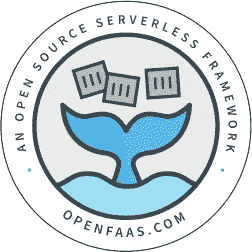
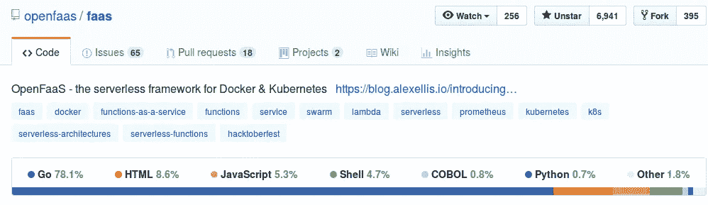

# 在没有写任何代码的情况下为 OpenFaaS 做贡献…(还没有)

> 原文：<https://medium.com/hackernoon/contributing-to-openfaas-without-writing-any-code-yet-846dd014514f>

我的职业是网络开发人员。我的主要编码语言是 Javascript 和 C#。

我发现 [OpenFaaS](https://hackernoon.com/tagged/openfaas) 项目是解决微服务[架构](https://hackernoon.com/tagged/architecture)问题的一个潜在解决方案，所有这些服务器都被部署为最小功能。该项目非常开放，欢迎新的贡献者(见我的另一篇文章[“我对 OpenFaaS 的第一个拉请求——一个主要的开源项目！”](https://hackernoon.com/my-first-pull-request-to-openfaas-a-major-open-source-project-d0c823790691))。我想做出贡献，回馈这个项目，成为这个伟大团队的一员。[投稿指南](https://github.com/openfaas/faas/blob/master/CONTRIBUTING.md)非常详细，提供了如何开始的建议。

A variety of languages are included in the project

OpenFaas 主要是用 Go 和其他语言混合编写的，主要用于示例函数。

我不是一个围棋开发者。我了解基本情况。我浏览了 [Learn Go By Example](https://gobyexample.com/) 并且已经能够编写一些我使用的小命令行工具，但是还没有达到 OpenFaaS 的水平。

那么，一个主要从事 Javascript 工作的 web 开发人员能为这个项目做些什么呢？我如何成为这个令人惊叹的团队的一员，而不是它所使用的主要语言的专家？

当然，我可以帮助完成这个项目的 UI 部分，因为我对这种类型的开发很熟悉，但是我想深入这个项目的核心！我想在这个过程中回馈和学习！

# 一些其他的贡献方式

*   **测试他人的拉取请求**
*   **提供建议/使用案例**
*   **问题答疑**
*   **文档**
*   **社区和社交媒体**

## 测试其他人的拉取请求

你不需要成为编写代码的语言专家，也能知道代码是否按照它应该的方式工作。一些代码更改很复杂，但结果可能是一个新特性(如授权)，或者修复了一个已报告的错误。您不需要知道代码是如何工作的，就可以测试特性是否如预期的那样工作，或者 bug 是否不再存在。

额外的好处是，通过测试后，看看差异，看看是什么改变了它的工作。您将对代码的工作原理有更好的理解。

## 提供建议/使用案例

OpenFaaS 在他们的 Slack workspace 上有一个非常活跃的社区。想要加入，你只需给 alex@openfaas.com 发一封简单的电子邮件，简单介绍一下你自己。从那里，让每个人都知道你在做什么，或者计划做什么。如果有些功能还不存在，或者没有按照你需要的方式工作，有人可以帮助解决。

你不需要写代码来做这件事，尽管团队鼓励并提供了很多帮助，如果你真的想自己尝试的话。

## 回答问题

在撰写本文时，有 4 个标签为“[问题](https://github.com/openfaas/faas/issues?q=is%3Aissue+is%3Aopen+label%3Aquestion)”的未决问题。其中一些问题是关于如何用 OpenFaaS 完成一些事情。如果你使用过这个项目，你可能知道一些事情，或者经历过和提问者相似的情况。

分享您的经验，帮助他人充分利用 OpenFaaS。这将有助于团队中的每个人和用户社区。

## 证明文件

说到帮助社区，更新文档是一项非常有价值的任务！当人们听说这个项目时，这通常是他们首先看的东西。重要的是它保持最新和准确，并且不需要任何代码！

## 社区和社交媒体

甚至不进入 Github repo 也可以做出贡献，写一篇关于 OpenFaaS 的博客，分享一条关于它的推文(@openfaas)，或任何其他社交媒体渠道。

发起一个关于 OpenFaaS 的本地会议，或者在你已经参加过的现有云、Docker 或无服务器会议上做一个演示。甚至在工作中向你的团队提及它，也许有一个问题可以使用无服务器功能来解决。

任何让 OpenFaaS 更加可见的东西都有助于项目的发展。有一个很棒的[社区文件](https://github.com/openfaas/faas/blob/master/community.md)，展示了所有涉及 OpenFaaS 的博客、演示、活动和转发。一旦发布了什么，就做个 PR 加入名单吧！

这些都是快速成为不断壮大的贡献者团队一员的好方法。此外，这将有助于你与项目中的每个人相处融洽，并更加熟悉项目的运作方式。如果你感兴趣，你可以开始研究一些标有“[技能/初学者](https://github.com/openfaas/faas/issues?q=is%3Aopen+is%3Aissue+label%3Askill%2Fbeginner)”标签的问题，并接触代码。

要获得更多建议，请查看[投稿指南](https://github.com/openfaas/faas/blob/master/CONTRIBUTING.md)或通过发送电子邮件给 alex@openfaas.com[加入 Slack 社区。](mailto:alex@openfaas.com)

我的小成功故事始于一个(相对)简单的问题，即当自动化(Travis CI)构建成功完成时，添加将 Docker 映像推送到 Docker Hub 的能力。这不是一个困难的任务，并且不需要编写任何真正的*代码。然而，它确实让我与团队进行了交流，并为更多的贡献打开了大门。*

从那以后，我的第一个贡献被复制到 OpenFaaS 组织的另一个项目中，[FAAS-netes](https://github.com/openfaas/faas-netes)(open FAAS 的 Kubernetes 后端)。我还写了一点 Go 代码，以便能够关闭详细日志记录，并可选地启用它进行调试，以及写两篇关于我的经历的博客，并与我的同事在工作中分享。我对这个项目和代码库越来越适应了，这样我就可以很快开始深入这个项目的核心了！