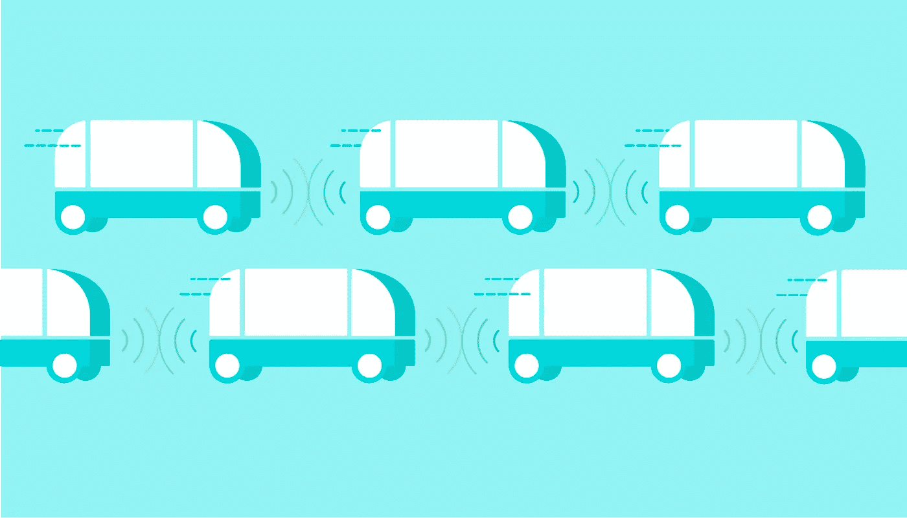
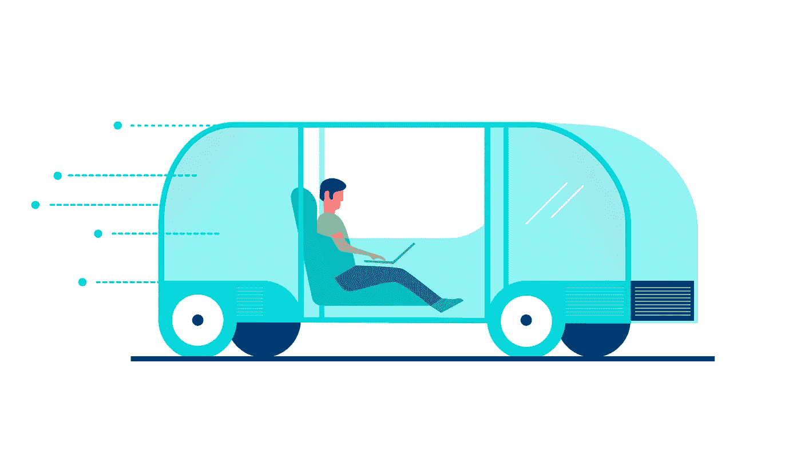

# 融合的未来|第二部分

> 原文：<https://medium.com/hackernoon/convergent-futures-part-ii-77d9ea2f16ad>

Illustration: Alex Chen

交通革命即将来临。自动驾驶技术、电动汽车和分布式工作新时代的融合有望缓解我们交通拥堵的城市和创纪录长时间通勤的压力。

> 数字交通技术是一股不可阻挡的力量。它将改变驾驶方式，就像互联网重塑了整个世界一样。机器人汽车将结束车祸，改善交通流量，减少能源消耗。
> 
> —彼得·切尼

当自动驾驶汽车无处不在时，我们的街道会是什么样子？当更多的汽车是共享的而不是拥有的时候，我们的生活会有什么变化？在这篇文章中，我想象了当我们到达自主驱动的未来时我们的社会。

我在洛杉矶长大，记得每天上学路上无数个小时坐在车流中，凝视着移动大块金属所浪费的空间。回到 2017 年，仅在美国，就有 6 亿个停车位。自从自动驾驶汽车迅速采用以来，这个数字现在已经减少了 1000%。环顾今天的洛杉矶，许多原本专用于停车的混凝土空地已经被改造成了公共公园、游乐场、农场和混合工作/娱乐区。

作为一名数字流浪者，我喜欢每天在一个新的地方工作。通过游牧工作车(NWV)计划，一辆自动驾驶汽车每天早上来接我，我可以选择我想去哪里工作。有时我工作，而我的车带我在一个风景优美的驱动器。有时候我会让它找个好地方停车，这样我就可以不受干扰地工作了。无论是在马里布的悬崖上晒太阳，在回声公园湖边享受安静的时光，还是欣赏西好莱坞的风景，能够在我选择的任何地方工作都是令人惊讶的。

由于我的大部分工作已经转移到数字领域，我的移动“办公室”空间看起来与传统办公室有很大不同。朋友们问我在“轮子上的盒子”里工作是否感到孤独，但实际上我感到比以往任何时候都更有联系。

有一天，我的朋友在吹嘘他在洛杉矶市区 55 楼的新办公室。我告诉他听起来…静电干扰。

我们新的无人驾驶社会最令人惊讶的事情之一是不再有车祸。因此，车辆设计发生了巨大的变化。我的车没有前灯，因为现在所有的车都用隐形传感器来看对方。侧镜已经被移除，取而代之的是一系列的摄像头，笨重的保险杠已经被落地玻璃取代，这样就可以一览无余了。

Illustration: Alex Chen

上周，我有三个客户从东京来参加一整天的研讨会。他们说，他们想参观加州的一个新的部分，但也有一些富有成效的工作时间。因此，当我们进行几个小时的小组工作时，我的车带我们去了约书亚树国家公园。一到那里，我们就吃午饭，快速远足，天黑时回到家——又是在办公室的一天！

我记得那些日子，人们不得不把自己塞进狭小的汽车内部，却不能转身或伸腿。现在我可以站起来，在我的车里走来走去。内部空间的设计是为了配置几十种不同类型的工作或休闲条件。我最喜欢的三个是:

*专注模式，*让所有的窗口都不透明，这样我就可以专注于我正在做的任何事情。如果我需要隐私或者想不受干扰地工作，我会使用这种模式。

*小组会议* *模式*将室内配置成超协同空间。所有的座位都相互面对，巨大的垂直窗户变成了增强的触摸屏，我们可以用它来展示作品和素描。当我在太平洋海岸公路上开车打视频电话时，看到我的客户脸上的表情很有趣。“你的办公室要搬家了？”

最后，*欢乐时光模式*将座椅折叠到地板上，打开所有的车门，这样我和我的客人就可以在车内外无缝行走。我最喜欢的活动之一是我们周五下午的“联系”，我的同事们也有 nwv，他们在当地的公园见面，我们连接成一个迷你大篷车。这让我们感觉像是 21 世纪的先锋，因为我们热爱探索新的地方而走到一起。

当我不得不去外地出差时，其他人可以用我的车——我只在用的时候付钱。我记得那些日子，我会在我的街区转 30 分钟寻找停车位。现在，我再也不用处理停车、保险、维护、清洁或充电等问题了——我的套餐涵盖了一切。

每天晚上，我的车送我回家，然后自动开到我家附近的一个变电站清洗、充电，为第二天做好准备。

*感谢阅读！如果你错过了我的收敛未来系列第一部分，可以在这里* *找到* [*。如果你想继续对话，请在 Twitter 上给我留言。*](https://hackernoon.com/convergent-futures-3b75eac571f9)

> [黑客中午](http://bit.ly/Hackernoon)是黑客如何开始他们的下午。我们是这个家庭的一员。我们现在[接受投稿](http://bit.ly/hackernoonsubmission)并乐意[讨论广告&赞助](mailto:partners@amipublications.com)机会。
> 
> 如果你喜欢这个故事，我们推荐你阅读我们的[最新科技故事](http://bit.ly/hackernoonlatestt)和[趋势科技故事](https://hackernoon.com/trending)。直到下一次，不要把世界的现实想当然！

