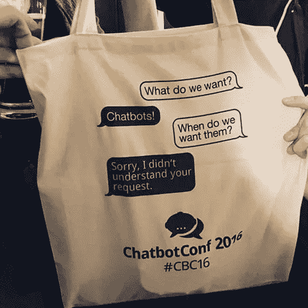
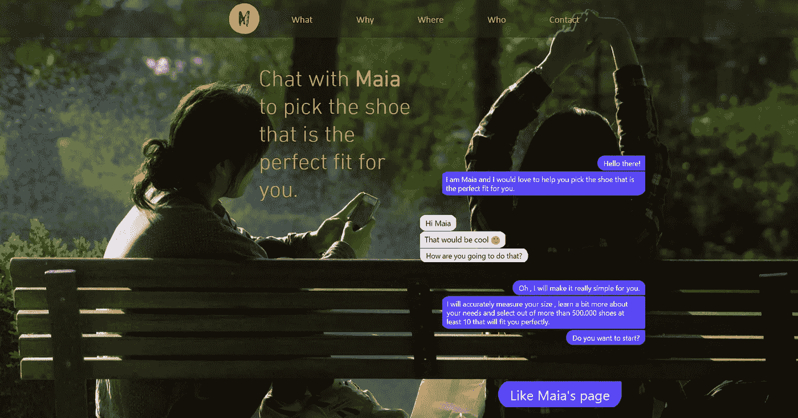
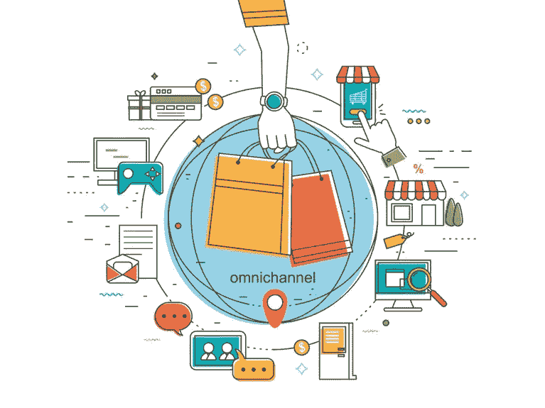

# 对话式商务就在这里。下一步是什么？

> 原文：<https://medium.com/hackernoon/conversational-commerce-is-here-what-is-next-e0892d836f2a>

Source: [reddit.com](https://www.reddit.com/r/gif/comments/321plg/mothers_little_helper_bot/?st=ivupr5kr&sh=5fba6001)

对话式商务就在这里。所以，如果你和我一样，你最初是被[文章](https://medium.com/u/a4ec6f3eb197#.9v8goaskl))和清晰的价值主张，我们将会看到快速的变化。

这是零售商的金矿。在过去的 17 年里，我一直在建立可行的线下和线上零售业务( [Sportmania](http://www.esportmania.gr) )，我是一家帮助线下零售商增加客流量的酷创业公司的联合创始人( [liateR](http://www.liater.co) )，正如你所猜测的，我无法停止思考这些工具对零售商的价值。

我认为，零售商要保持相关性，他们需要创造新的购物体验。现在，我们有一个巨大的机会来创造一种吸引人的购物体验，这种体验完全符合新一代消费者的生活方式。千禧一代希望随时随地以最便捷的方式购买任何东西，他们应该是我们的目标受众。

零售商和时尚品牌如[春天](https://www.botpages.com/bots/xdHYaxb2LSTf6gcdZ)、[丝芙兰](https://bots.kik.com/#/sephora)、[易贝](https://shopbot.ebay.com/)、 [H & M](https://bots.kik.com/#/hm) 、[汤米·席尔菲格](https://www.messenger.com/t/106324770685)、 [Burbery](https://www.messenger.com/t/122792026424) 以及创业公司如 [Maia](http://www.chatwithmaia.com/) 、[经营者](https://operator.com/)、 [Mezi](http://mezi.com/) 、 [Fify](http://fify.ai/) 、 [ChatShopper](https://chatshopper.com/) 已经开始工作

Source: [Maia, your own personal shoe adviser.](http://www.chatwithmaia.com)

这应该只是第一步。我的观点是，我们不应该仅仅停留在制作聊天机器人，而把体验局限在网络世界。为了实现利益最大化，我们应该在物理位置引入引人入胜的对话，并将它们与我们的整个全渠道战略联系起来。

**全渠道应该是遵循**的路径。实施全渠道战略的好处现在对每个零售商来说都很清楚。消费者的生命时间价值比那些只使用一种渠道购物的人高 30%，他们比传统购物者多花 15%-30%，他们也更忠诚。

本质上，我认为**我们应该为全渠道零售创造对话引擎**。目标应该是建立这样的对话，它可以从你的客厅开始，在你去工作的时候继续，并在你最喜欢的商店里蓬勃发展。

“你自己的个人鞋子顾问”是我所知道的唯一解决方案，目前正朝着这个方向努力。如果你知道或正在做类似的事情，或者你只是想进一步讨论这个概念，请联系我。

> [黑客中午](http://bit.ly/Hackernoon)是黑客如何开始他们的下午。我们是 [@AMI](http://bit.ly/atAMIatAMI) 家庭的一员。我们现在[接受投稿](http://bit.ly/hackernoonsubmission)并乐意[讨论广告&赞助](mailto:partners@amipublications.com)机会。
> 
> 如果你喜欢这个故事，我们推荐你阅读我们的[最新科技故事](http://bit.ly/hackernoonlatestt)和[趋势科技故事](https://hackernoon.com/trending)。直到下一次，不要把世界的现实想当然！

