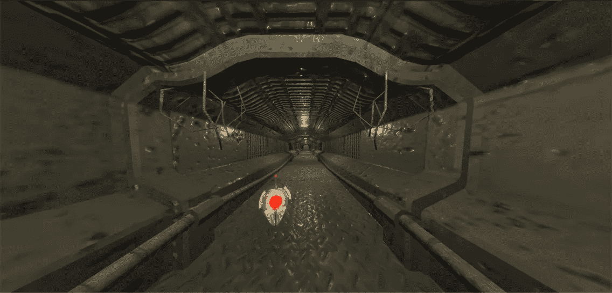

# 对话游戏

> 原文：<https://medium.com/hackernoon/conversational-games-abe3edd12c82>

我们在两周内使用 [Alexa](https://hackernoon.com/tagged/alexa) 构建了一个互动的 [VR](https://hackernoon.com/tagged/vr) 体验。

Echo 的对话潜力是惊人的，我仍在探索在对话中加入停顿，并使互动无提示。目前，Alexa 的提示需要向玩家展示导航对话的方式，这在很大程度上打破了沉浸感。随着对话变得越来越有机，交易越来越少，没有什么会打破沉浸感。

> HAL 9000 的红色球体发出更亮的光，闪烁不定。

> [黑客中午](http://bit.ly/Hackernoon)是黑客如何开始他们的下午。我们是 [@AMI](http://bit.ly/atAMIatAMI) 家庭的一员。我们现在[接受投稿](http://bit.ly/hackernoonsubmission)并乐意[讨论广告&赞助](mailto:partners@amipublications.com)机会。
> 
> 要了解更多信息，请[阅读我们的“关于”页面](https://goo.gl/4ofytp)、[在脸书上点赞/给我们发消息](http://bit.ly/HackernoonFB)，或者简单地说， [tweet/DM @HackerNoon。](https://goo.gl/k7XYbx)
> 
> 如果你喜欢这个故事，我们推荐你阅读我们的[最新科技故事](http://bit.ly/hackernoonlatestt)和[趋势科技故事](https://hackernoon.com/trending)。直到下一次，不要把世界的现实想当然！