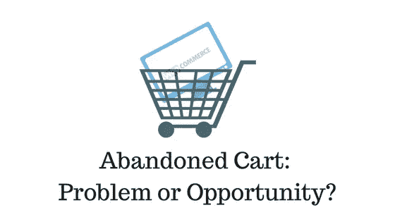
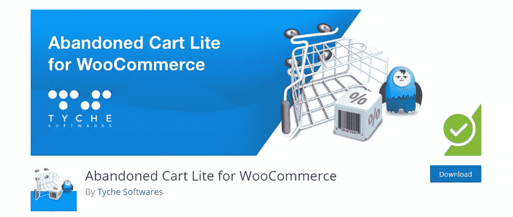
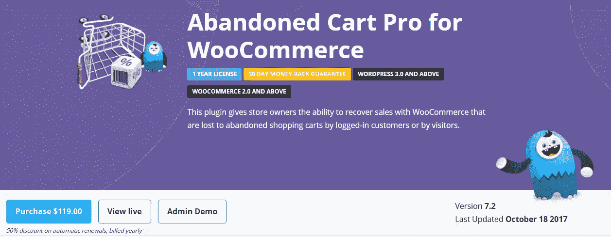
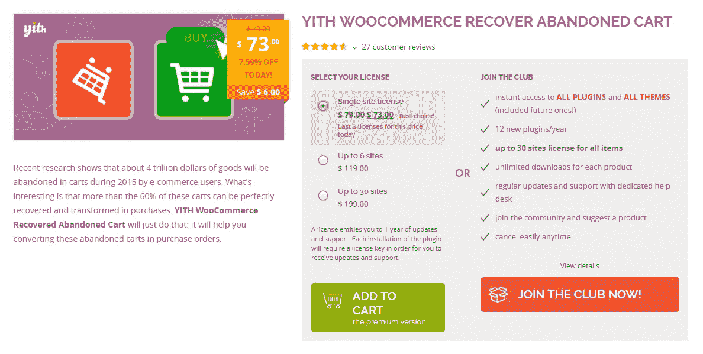
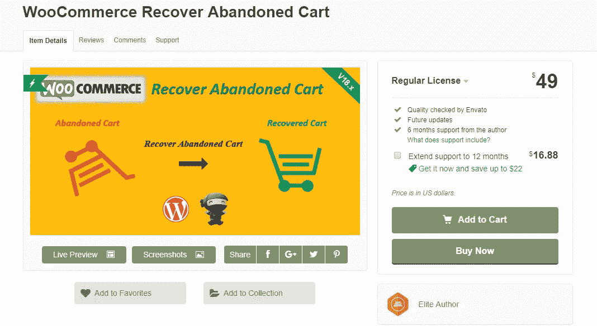

# 将 WooCommerce 废弃购物车转化为成功销售

> 原文：<https://medium.com/hackernoon/convert-woocommerce-abandoned-cart-to-successful-sales-3985fe80c603>

所有领域的电子商务业务的主要问题之一是放弃购物车。当你看统计数据时，弃车的影响确实是巨大的。它根据零售的不同部门而有所不同，原因也是多种多样的。WooCommerce 店主可能会面临放弃购物车的情况，这是实现预期转化结果的一个障碍。本文旨在讨论 WooCommerce 放弃购物车的各种原因，以及一些尝试和测试的方法来找回它。你还会看到一些最好的插件来帮助你使用 WooCommerce 废弃的购物车。

## WooCommerce 弃车如何影响你的生意？

一辆废弃的手推车对你的商店有很大的销售潜力。具有讽刺意味的是，你可能甚至没有意识到这正在你的店里发生。一般来说，所有在线零售网站的购物车废弃率达到 60%到 80%。有两种方式来思考这个问题。你可以把它当作一次失败的销售，或者把它当作一次自省和改进的机会。仔细的分析策略可以给你有价值的见解，指出 WooCommerce 放弃 cart 的原因。及时的干预可以帮助你回收很多这些废弃的购物车，提升你的转化率。

> *根据 2017 年超过 30 项关于购物车废弃的不同研究，平均记录的电子商务购物车废弃率为 69.23%*

# WooCommerce 放弃购物车的原因

放弃购物车的原因因行业而异。然而，与其他人相比，有相当多的人是真正突出的。我们来详细看看 WooCommerce 弃车的原因。

复杂的结账过程

这是在线零售业务中放弃购物车的主要原因之一。不完善的结账流程会严重影响转化的机会。顾客在结账时感受到的动机决定了购物车是否会转化为销售。许多网上商店没有足够的激励，因此客户干脆放弃。另一方面，即使顾客有兴趣购买，如果结账过程对他们来说过于繁琐，他们也可能会放弃购物车。这两种情况都指出了你的结帐过程中的某种不足，这是可以避免的。

结账时的隐藏费用

隐藏的交易费或运费是阻碍用户完成购买的另一个主要因素。在一项相关研究中，42%的客户将此列为他们放弃购物车的主要原因。如果顾客一开始就清楚交易费或运费，他们仍会继续结账。然而，当一个意想不到的运费或便利费突然出现时，他们就失去了动力。

没有客人结账的选项

网上购物者通常寻求快速满足，结账时漫长的注册过程可能会令人扫兴。对于一些网站，像那些基于订阅的产品，注册是不可避免的。另一方面，在服装店或鞋店，顾客希望(快速)结账。

找不到最喜欢的付款方式

谈到付款方式，顾客们都有自己的偏好。找不到他们最喜欢的支付方式可能是他们放弃购物车的主要原因。

安全问题

如果客户不完全信任你的网站来进行安全交易，他们可能会干脆放弃购物车。他们总能从更有信誉的商店进行放心的交易。

保护隐私

类似于安全的情况，如果客户感到他们的隐私不被保证，他们可能选择不继续。对于店主来说，在顾客心中建立对隐私的信任是一项艰巨的任务。

不确定产品

自然，顾客在购买衣服和配饰时并不总是被说服。例如，在购买一套服装时，许多人更喜欢试衣间的保证。

还在研究

喜欢实体店的人可能仍然会使用网上商店来研究产品。他们很可能无意从网上商店购物，甚至可能不会到达结账页面。

等待大减价

如果你的商店享有定期打折的声誉，顾客可能会决定等到下次打折。这在很大程度上取决于你的顾客如何看待你的商店。

# 回收 WooCommerce 废弃购物车的解决方案

减少弃车的第一步应该是确定弃车发生的频率。如果您比较所有已完成交易和所有已启动交易的数字，您将获得放弃购物车的比率。如果你看到相当高的比率，是时候收回这些来提高你的转化率了。首先，你需要找出你的商店放弃购物车的可能原因。这可以通过研究分析数据、客户研究或通过将您的收银台与高性能竞争对手进行比较来实现。一旦您确定了可能的原因，您就可以尝试不同的解决方案并衡量其有效性。更重要的是，让我们看看一些流行的解决方案。

## 简化您的结账流程

在很多情况下，放弃购物车的主要原因是复杂的结账过程。如果你的网站是这种情况，你需要很快让它变得简单。首先，你的商店结账需要在所有类型的设备上顺畅，包括手机。如果繁琐的注册过程使顾客离开购物车，提供客人结账选项。这里有一篇文章将帮助你获得更多关于[简化结账流程](http://learnwoo.com/optimize-woocommerce-checkout-page-better-customer-satisfaction/)的想法。

清楚地了解顾客在结账过程的哪个阶段可能也会有所帮助。因为，有时由于他们不知道结账过程的长度，顾客倾向于离开购物车。此外，确保你的商店提供所有流行的支付方式。如果你想了解更多关于 wooCommerce 的各种[支付方式，请在这里阅读我们的文章](http://learnwoo.com/best-woocommerce-payment-gateway-extensions/)。

## 提高网站的信任度

如果您发现用户由于安全原因而犹豫是否在您的商店上进行交易，您可以尝试几种方法来改善这种情况。一般来说，通过提供客户证明和评论来提高网站的可信度将有助于改善网站的观感。一个好的退款政策也可以帮助吸引困惑的顾客。事实上，如果有退款保证，很多顾客不会介意点击购买按钮。

## 让顾客轻松找到信息

客户在您的网站上轻松找到信息的能力在减少弃车方面发挥了作用。如果一个产品的大部分研究可以在你自己的网站上完成，那么转化的机会就更大。以清晰有序的方式展示产品信息是你首先需要做的事情之一。一个好的描述，多张图片，所用材料的信息，尺寸图(如果需要)等。是可以带来巨大成果的简单方面。常见问题解答、产品评论等也能很好地帮助客户获取信息。此外，如果有实时聊天选项，它可以帮助客户解决他们的任何疑问。大多数情况下，当客户犹豫不决时，有时他们需要的只是支持主管的温和肯定。这里有一篇文章，[讨论了实时聊天支持](http://learnwoo.com/improved-wordpress-customer-support-ticketing-system-with-live-chat-plugins/)的有效性。

## 发送电子邮件提醒以收回废弃的购物车

事实上，废弃的购物车是一个可以通过你的邮件策略很好解决的问题。有几个插件可以帮助你及时发送自动邮件来处理废弃的购物车。让我们来看看其中的一些:

[弃车简装](https://wordpress.org/plugins/woocommerce-abandoned-cart/)

这是 WordPress 插件库中的一个插件，你可以免费下载。它有助于向您的注册客户和客人发送及时的电子邮件通知，这些客户和客人在他们的购物车中保留了一些东西。此外，它使您的客户只需点击一下鼠标，就可以取回他们丢弃的购物车。它还通过比较恢复订单的价值和放弃订单的总价值来帮助您衡量这项工作的成功程度。

有了这个插件，你可以创建无限的电子邮件模板，以及根据你的喜好定制它们。当客户取回购物车时，插件会自动结束邮寄过程。

[弃车亲](https://www.tychesoftwares.com/store/premium-plugins/woocommerce-abandoned-cart-pro/?ref=56)

这是上述免费插件的高级版本。你可以在专业版上获得的一些额外功能是一个要求发送电子邮件的弹出模式。这将有助于您有效地跟踪商店的客人用户。它还可以选择在电子邮件模板中嵌入折扣券。奖励找回购物车的顾客是你的 WooCommerce 商店的一个非常有效的策略。除了自动电子邮件模板，商店管理员还可以根据需要向特定客户发送定制电子邮件。

该插件与 WPML 兼容，因此电子邮件模板可以翻译。你可以花 119 美元购买这个插件。

[WooCommerce 跟进](https://woocommerce.com/products/follow-up-emails/)

这个 WooCommerce 扩展有助于创建一个旨在减少购物车废弃的活动。一旦你安装了插件，你可以选择创建一个商店范围的电子邮件。每当客户向购物车中添加商品时，就会触发该电子邮件。此外，您可以设置触发器来决定何时发送这些电子邮件。您可以为商店中的所有产品、特定类别或特定产品进行设置。但是，您需要确保只有在放弃购物车的情况下才发送电子邮件。为此，有一个复选框“状态改变时删除”，这将确保活动的针对性。

[第一次收回废弃的大车](https://yithemes.com/themes/plugins/yith-woocommerce-recover-abandoned-cart/)

另一个有助于鼓励客户找回他们被遗弃的购物车的插件 YITH Recover abused Cart 插件很容易安装。它有助于向客户和访客用户发送关于他们购物车中商品的温和提醒。您可以安排发送这些电子邮件的频率。

有了这个插件，你可以基于特定的用户角色创建一个策略。此外，该插件允许在电子邮件模板中包含折扣券。此外，该插件还提供了关于您丢弃的购物车和找回的购物车的详细报告。这将有助于你准确地衡量你的努力是否成功。此外，该插件与 WPML 兼容，这确保您可以用他们的语言与客户交流。

[回收废弃推车](https://codecanyon.net/item/woocommerce-recover-abandoned-cart/7715167?ref=LearnWoo)

这个插件的工作方式和本文中讨论的其他插件差不多。您将能够创建无限数量的电子邮件模板，并设置发送提醒的特定时间间隔。您的邮件模板中可以包含折扣券。只要注册用户添加了东西，插件就会捕获他们的购物车。然而，对于访客用户，只有当他们在结帐阶段输入电子邮件地址时，插件才能找到被放弃的购物车。

## 检查您的运输策略

如果你销售的是实物产品，你的运输策略也会在废弃购物车中发挥作用。如果运费没有在购物车中明确提及，用户是不会喜欢的。显示热门航运公司的实时费率将是解决这一问题的一个很好的选择。与付款方式一样，许多客户在运输方面也有自己的偏好。阅读我们的文章到[获取更多关于不同运输策略的见解](http://learnwoo.com/woocommerce-shipping-strategies/)。如果你正在寻找有帮助的工具，[在这里找到一些很棒的 WooCommerce 运输插件](https://www.xadapter.com/product-category/woocommerce/shipping-woocommerce/?affiliates=22)。

# 结论

弃车是电子商务中的一个现象，你真的不能忽视。通过优化你的 WooCommerce 商店的多个方面，你可以利用废弃的购物车来增加转化率。影响因素可能从您的结账流程到付款和运输选项。发送提醒邮件是一种行之有效的策略，可以帮助你赢回一些带着未完成订单离开网站的客户。WooCommerce 社区有很多插件可以帮助你组织电子邮件活动。本文试图揭示 WooCommerce 弃车的一些原因和解决方案。如果你有一些与此相关的有趣见解，请与我们分享。

*原载于 2017 年 10 月 18 日*[*learnwoo.com*](http://learnwoo.com/woocommerce-abandoned-cart/)*。*