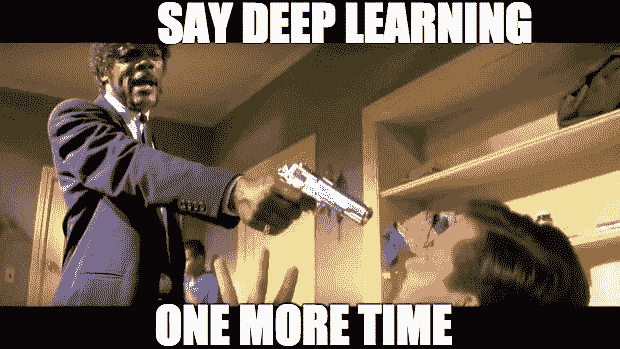
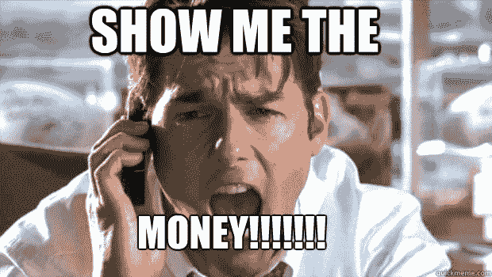
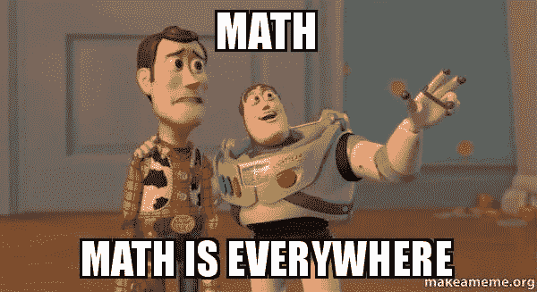
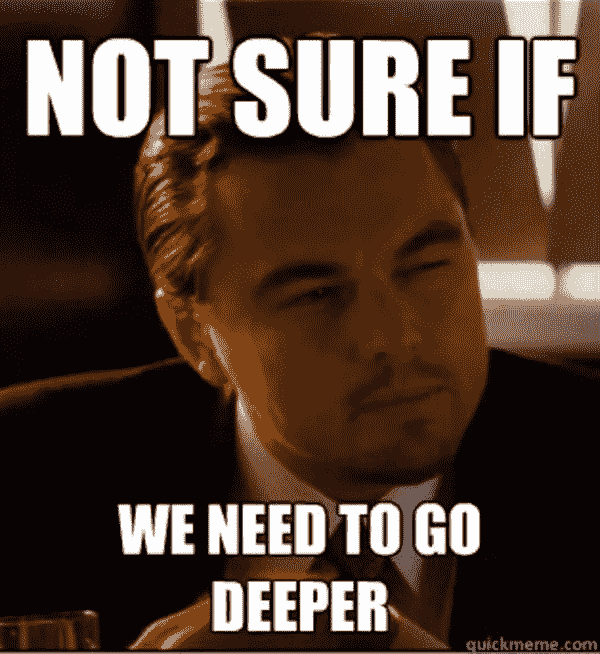
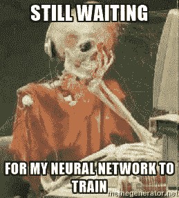
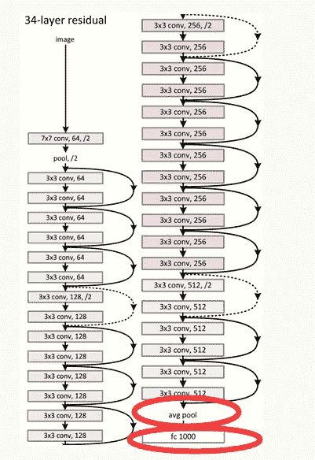

# 卷积神经网络在 5 分钟内

> 原文：<https://medium.com/hackernoon/convolutional-neural-network-in-5-minutes-8f867eb9ca39>

> 你可以在推特@bhutanisanyam1 上找到我

卷积神经网络是用于图像处理技术的深度学习中的领先架构。

**好吧，但是你为什么要在乎呢？**

如果上面那句话没有引起你的兴趣，那么十亿美元听起来怎么样？

这是几年前脸书收购 Instagram 的价格。今天，该公司已经指数级增长到几乎每一部智能手机，甚至你可能经常使用它超过中等。

# 输入 CNN

卷积神经网络是神经网络的一个类别，长胡子的极客研究人员发现它在处理图像数据时更有前途。

它们以类似于人类大脑的方式处理图像:通过寻找更小的细节——一条线、一个矩形、一个斑点——然后处理更抽象的特征——以某种方式排列的线形成一个椭圆形——具有某些特征的某种形式的椭圆形是一张脸。

它们背后的基本思想是数学函数“卷积”。

如果你像我一样在数学课上睡觉，你需要知道的是图像基本上是用多维向量表示的。二维布局是有意义的，但是更多的维度(这是不直观的)用来标记图像中的颜色强度(还记得 MS-Paint 中酷酷的 RGB 调色板吗？)

卷积是一组由过滤器执行的点积(一种数学过滤器，类似于您的常规 snapchat 过滤器，将数据转换为更酷、更理想的形式)。

**A CNN in action**

所以我们拿我们的图像——这是一个巨大的矩阵，用一个过滤器卷积它——一个小得多的矩阵，然后得到一个激活图。

激活图:每个过滤器对特定的数据敏感，当它看到特定的形状/颜色/形式时会变得兴奋。这些被表示为原始图像的激活图，原始图像是在图像中被标记为 Conv 的层。然后，这些信息通过一个激活功能进入另一组过滤器，这些过滤器被更抽象的特征“激发”。

随着我们“深入”我们的神经网络，我们在人类感知和特征方面走得更远。我们首先检测像素格式的特征，然后检测形状，最后是对象。

如果你仔细观察，每一层 Conv 都会变得更容易辨认。从像素到汽车。前几层检测到一些对我来说毫无意义的东西。最后一层与我们的最终结果相似。

这些输出最终被“汇集”或发送到一个完全连接的层，用于从一堆选项中识别我们的对象。

**为什么是 CNN？**

如果你已经注意到了，每一层的神经元并没有完全连接，这意味着更少的复杂性，更少的重量和更快的训练。

另一件很酷的事情是，由于每一层几乎都在前一层中找到某一组特征。所以训练好的网络可以用于'**迁移学习**。在那里你使用一个训练有素的网络——比如说一个擅长检测汽车的网络。然后随机应变来区分轿车和 SUV。

您可以基于 CNN 的特定架构创建一个模型——比方说一个 ResNet34 模型，然后用它来识别狗和猫！(不要担心，下面的图片应该是没有意义的。它让这篇文章看起来更专业)

ResNet Architecture

因此，我们可以有效地做大多数工程师做的事情——创建一个从另一个人的神经[网络](https://hackernoon.com/tagged/network)中得到启发(复制)的模型。

你可以使用已经获奖的架构，比如 VGGNet、 [AlexNet](https://hackernoon.com/tagged/alexnet) ，并在你的个人创业中利用它们的出色之处。

**CNN 能做什么？**

思考内容:你可以创造一个强大的引擎，实时检测图像中的物体，并找到“海滩边的一辆蓝色汽车”。剧透:我的导师杰瑞米·霍华德已经在他精彩的 Ted 演讲中展示了这一点。

不要担心，大约 85%的互联网是像素数据，我们没有技术来正确地分析它。

可能要花上一辈子的时间才能看完。即使你说 Instagram 凭借其革命性的算法向你展示与你的兴趣相关的帖子，其背后的优势是它使用你的 Hastags 和类似的用户趋势来展示数据，而不是实时图像/视频分析来得出结论，谷歌也是如此。谷歌图片结果只是在他们的网站上找到文本的结果。

甚至这些巨人也还没有开发出他们真正的图像分析系统。

这可能是你发展的机会。更好的自动驾驶汽车？新的 Pinterest？

> [你可以在 twitter @bhutanisanyam1 上找到我](https://twitter.com/bhutanisanyam1)
> 
> [订阅我的时事通讯，获取深度学习、计算机视觉文章的每周精选列表](https://tinyletter.com/sanyambhutani)
> 
> [这里](https://becominghuman.ai/a-self-driving-new-year-33284e592f35)和[这里](https://hackernoon.com/a-self-driving-new-year-2-d1bbc5a83570)是我学习自动驾驶汽车道路上的两篇文章