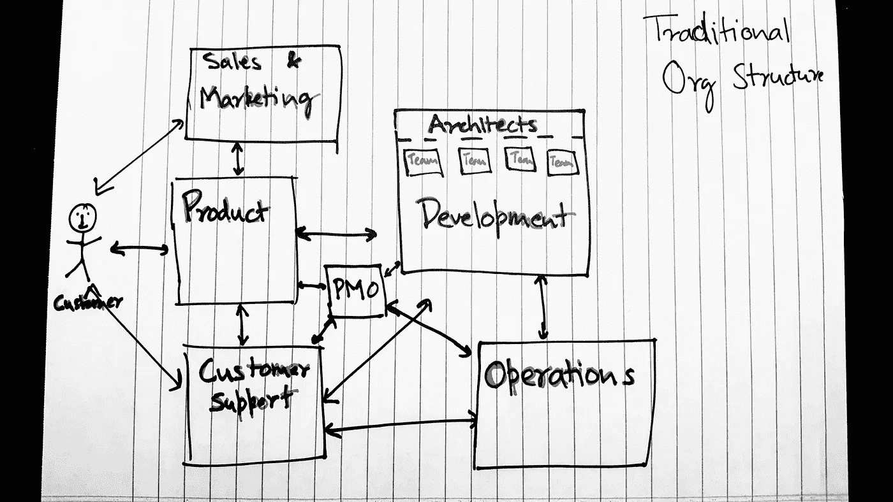
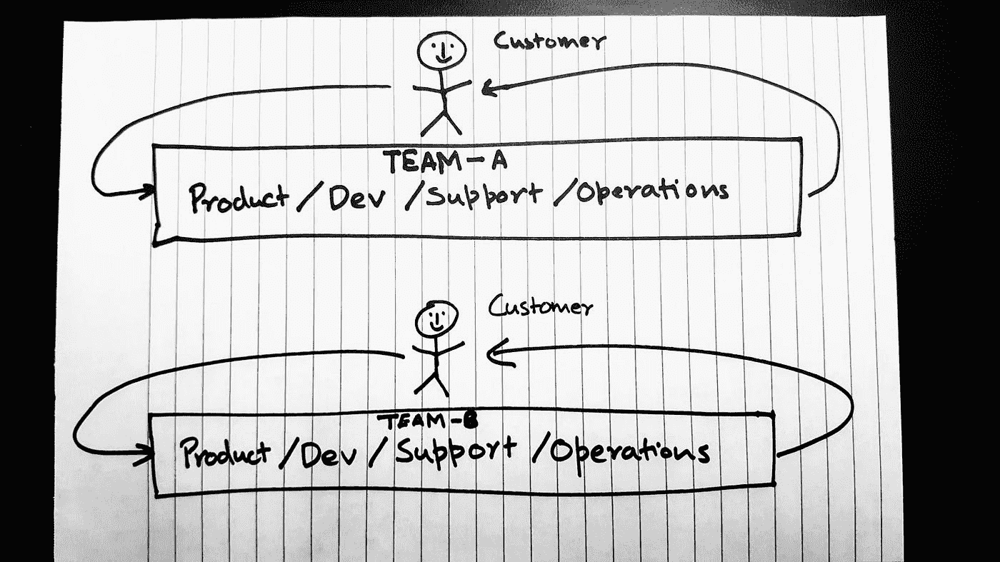

# 康威会杀了你，利特尔帮不上忙

> 原文：<https://medium.com/hackernoon/conway-is-killing-you-and-little-is-helping-750f3acfb60e>

# 康威定律

1968 年，梅尔文·康威写了一篇名为“[委员会如何发明](http://www.melconway.com/research/committees.html)”的论文。他在那篇论文中的一个观察结果(在众多有趣的观察结果中)被称为康威定律。康威定律指出— **任何设计系统的组织(这里的定义比信息系统更广泛)将不可避免地产生一个设计，其结构是组织通信结构的复制**。

康威谈论生产的软件和生产它的组织结构一样多。已经有很多文章支持微服务架构，使用康威定律作为基本前提和理由。这些文章关注团队层面的组织设计。他们提议小团队进行独立的小服务。我对这些建议没有任何疑虑。他们确实经常忽略更大的组织结构对正在生产的软件的影响。如果团队结构决定了软件和界面的设计，那么更广泛的组织结构决定了客户成果的质量。

**康威对产品的影响**

考虑如下所示的组织结构。

首先要注意的是客户(在图的左手边)与开发团队没有直接联系。反之亦然。客户必须通过产品或支持才能进入开发阶段。开发团队本身必须通过产品、PMO、运营或支持来获得客户的反馈。康威定律，当应用于这种设置时，意味着由于开发人员与客户相距一两层，他们生产的功能和产品可能与用户的真正需求相距一两步。

每个组有多个主。产品直接负责满足客户、销售和支持部门的功能和增强要求。产品部还负责向开发团队和 PMO 提供结构化的需求和优先更新。这迫使产品部门创建一组混合的优先级，这些优先级很可能不直接代表客户的优先级。已经有一步之遥的开发团队收到了这个混合的优先级列表。但是对于开发团队来说，这只是一个“客户”。他们还必须满足直接从支持部门收到的请求，向 PMO 提供时间表，向运营部门提供部署要求，同时满足体系结构的首要指示。

每个小组也有自己的目标和激励措施。销售人员希望销售华而不实的产品，客户支持人员希望缩短解决呼叫的时间，产品人员希望拥有尽可能多的完整功能，开发人员希望拥有新技术和可维护的代码，运营人员希望拥有易于部署、可移植且稳定的产品。每个人都在朝着稍微不同的方向努力，客户满意度、客户价值的交付和客户成果的实现都在这场拉锯战中迷失了方向。所有这一切都在发生，而每个部门的每个成员都在竭尽全力，努力实现部门的目标。

排列的缺失启动了康威定律。这样做的结果通常是一个混乱的(或越来越混乱的)产品。不同的部门将各自的议程推到最终产品上。结果，这个产品有很多特性，但是大部分都不协调，很少被使用。由于开发产品的团队离客户有几层距离，这种反馈很少能反馈给他们。即使是这样，他们也已经在处理其他部门优先列表上的下一件事了。每个部门的竞争和错位的优先级导致实际的客户优先级在混乱中丢失。每个部门都坚信他们在为客户做最好的事情，而优先级的错位导致客户的最佳利益最多只能实现一半。

**康威对过程的影响**

不仅仅是优先级不匹配，各个部门的生产能力和速度也不一样。这意味着已经完成的工作在各部门之间排队等待被取走。这也可能意味着各部门在等待来自系统其他部分的可交付成果的同时，也在渴求工作。尽管每个人都在尽最大努力实现自己部门的目标，但产生的价值却排在队列中，而不是使价值精益流向客户的流程。这种结构和不匹配的能力使得心流很难实现。如果我们从过程的角度重申康威定律，它将非常适合——**任何遵循过程的组织都不可避免地会产生一个过程，其结构是该组织沟通结构的副本**。

> 即使在被认为是一个有凝聚力的团队内部，关注点的分离仍然存在。这通常是因为部门本身在目标、优先事项或激励措施上不一致。

我们可以尝试通过将产品和运营团队的人员转移到开发团队来解决这个问题。这有时是可行的，但是只要个人为不同的主人服务，并且有不同的激励，糟糕的、低效的过程就会出现。如果 BAs 和 pm 成为开发团队的一部分，但仍然服务于一个独立的产品部门，他们会收到混淆的信号。很多时候，但不总是，他们倾向于在更大的团队中作为团队行动。由于这个原因，团队中出现了一种“这不是我的工作”和“翻墙”的心态。高层次的需求是项目经理的工作，编写故事是 BA 的工作，编写和测试代码是开发人员的工作，将代码部署到生产环境是运营人员的工作。即使在被认为是一个有凝聚力的团队内部，关注点的分离仍然存在。这通常是因为部门本身在目标、优先事项或激励措施上不一致。

*关于 DevOps 的一个简短说明。如果你把一个来自运营团队的人放到开发团队中，而这个人所做的只是运营工作，与开发人员没有互动，这并不意味着你在“做”开发工作。对于 DevOps，开发人员承担运营责任，运营人员帮助开发。*

有了单独的目标和激励，队列将仍然存在。值将仍然停留在这些队列中，并变得陈旧。故事和功能将在它们被写出来的几周或几个月后被编码和测试。部署活动也是如此。已完成的工作在完成几个月后将无法交付给客户。这将导致该流程的任何客户失望，因为他们的等待时间不断增加。部门间等待时间的增加导致已经隔离的部门之间的不信任增加。各部门认为他们的合作伙伴进展不够快，将越来越多的工作推向下游。销售对产品负责，产品对开发负责，开发对运营负责。压倒一切的信念变成了——“为了完成更多的工作，我们需要把更多的工作推给他们”。这就是利特尔开始帮助康威的地方。

# 利特尔定律

1961 年，约翰·利特尔提供了排队公式的数学证明，这个公式就是众所周知的利特尔定律。在发展世界中，它通常被表达如下—

这里的前置时间(或周期时间)是一个工作项目(任务、故事情节、计划等)所花费的时间。)才能搞定。正在进行的工作(WIP)是正在进行的项目总数。吞吐量是单位时间内(每天、每周、每月等)完成的项目数量。).利特尔定律是一个自然真理。这是数学事实，是不可避免的。

从利特尔法则得出的简单结论是，如果我们有一个稳定的完成事情的速度，做每件事情所花费的时间，与我们正在做的事情的数量成正比。换句话说，如果我们想更快地完成工作，我们需要做更少的事情。需要记住的一件重要事情是，这适用于每个粒度级别。它适用于故事级别、功能级别和计划级别。

> Conway 和 Little——从 20 世纪 60 年代开始将战争放在软件上。

正如我们已经讨论过的，一个组织分裂成专业化部门的后果之一是兄弟部门将越来越多的工作推给彼此。不幸的是，根据利特尔定律，这只会让事情变得更糟。我们承担的事情越多，每件事情花费的时间就越长。与向客户交付个别价值相反，我们什么都做，什么都不交付。由于每件事都需要很长时间，我们试图通过“火线”和高优先级加速来颠覆这个过程。不幸的是，这些都不能免除利特尔定律。他们只会增加在制品。此外，因为我们没有做任何事情来增加我们的吞吐量，所有这一切都增加了我们每个可交付产品的周期时间。增加的周期时间，燃料更多的挫折感，更大的不信任和增加部门之间的摩擦。再一次，顾客，结果是公司，成为这场斗争中的失败者。

# **康威和小个子是你的朋友**

到目前为止，我们只探讨了康威定律和利特尔定律的负面影响。事实是这两个人是我们的朋友。他们可以帮助我们设计成功的组织，然后执行设计。首先让我们定义成功意味着什么，然后围绕成功的定义设计组织，最后建立通向成功的流程。康威将帮助我们设计组织，利特尔将帮助我们建立流程。

如果我们采用一个非常简单的成功定义—为客户取得积极的成果，会怎么样？这需要在组织的所有活动部分之间建立一致性。下面的草图是我建议我们如何创建一个组织来取得成功。

在这个组织中，每个团队实际上都是跨职能的。每个团队成员都可以参与每项活动。产品负责人可以带开发人员一起参加客户访谈。开发人员可以分解故事，BAs 可以测试，我们实际上正在做 DevOps，开发人员也在关注运营需求。每个团队都有获取需求、创建功能、向产品交付代码、接收反馈和支持产品所需的所有能力。团队负责特定功能的整个生命周期。团队中的每个人都能够获得用户反馈，并帮助对反馈做出反应。

每个团队都是完全跨职能的创业公司。当事情开始倒退时，他们能够快速行动并相互支持。没有责任分离。当然，有一些“角色”象征着专业知识，但是我们鼓励人们在这个过程的每一个部分提供帮助。整个团队只有一个目标——帮助客户取得积极成果。团队可大可小，以实现这一目标。他们向同一个部门汇报。他们都被激励去做同样的事情——为客户创造价值。我们摆脱了移交，并与客户一起对生产的产品进行持续的验证。没有相互竞争的大师，只有一个能够独自满足客户需求的团队。

不像利特尔定律是数学事实，康威定律是可以(暂时)逃脱的。您可以保持传统的结构，并推动跨部门的协调。因为这是问题的根源，一旦实现跨部门的一致，每个人自然会像一个团队一样行动。问题是维持跨部门协调所需的精力。一旦这些部门开始召开“全团队”会议，制定部门目标、执行标准和自己的奖金计划，康威将再次接管。要做的决定是——我们是要经历正式化跨职能组织结构的痛苦，还是要继续花费精力来保持跨部门的一致性？

康威只是帮我们建立了一个组织，建立了一个流程(在很高的层面上)。如果我们不多加注意，我们仍然会遇到问题。为了让我们建立流程并快速交付价值进行验证，我们需要回到利特尔法则。我们需要持续观察这些团队的工作量。团队应该承担尽可能多的工作。正如利特尔法则告诉我们的，在稳定的吞吐量下，我们处理的事情越多，完成事情所需的时间就越长。

> 利特尔法则让我们专注于高效，而不是忙碌。

在这里提议的组织中，可能会有大型团队。此外，在客户确认之前，团队不会考虑做某事。这两件事结合在一起，会使团队承担比他们应该承担的更多的工作。为了实现功能的定期验证和交付，Little 告诉我们必须抵制这种冲动。做尽可能少的事情，这样每一个单独的工作项目都能尽快交付。这将使整个团队的精力集中在交付那些少数工作项目上。一旦一个项目被交付，团队就可以计算出下一个最高优先级，并开始处理那个项目。因此，创建一个稳定的、可预测的系统，定期交付功能，并且不容易被外部压力和变化所干扰。利特尔法则让我们专注于高效，而不是忙碌。

当事情的优先级发生变化时，很少有项目会面临风险。事实上，如果团队定期交付东西(每小时、每天、每周……)，没有什么会有风险。这是因为一旦下一个(当前活动的)项目被交付，新的最高优先级的工作就可以被拾取。因此，我们可以使用利特尔法则来消除由于改变优先级而造成的大量浪费。

当我们处理很少的项目时，他们不会在部门或个人之间排队等候。当我们一起处理这些问题时，这些队列要么不存在，要么很小。Conway 和 Little 一起帮助我们消除了由于有价值的工作在部门间排队而积累的浪费。

# 这很难

这主要是因为这种思想要求人们放弃权力。它简化了“产品设计、开发和交付”团队拥有所有权力的结构，并且大多数层级都已死亡。如果组织中的人倾向于行使控制权和个人权力，这将是一个很难的改变，人们甚至可能不会尝试。就像听康威的话对沉迷于权力的经理来说很难一样，听小的话对个人贡献超级明星来说也很难。不再有个人的荣耀。没有烈士和英雄。这些团队一起工作，跨越过去的职能界限，为我们的客户提供最好的服务。

> 在这里，必须放弃大量的个人自我。每个人都必须接受一个更加扁平化的组织，在这个组织中，我们共同努力实现我们最重要的目标——积极的客户成果。

这是另一件困难的事情。如果你注意到，我已经从第二个组织草图中删除了 PMO 和架构。整个部门可能会被淘汰，并被“降级”成为价值交付团队的一部分。结果可能是几乎没有什么会消除对 PMO 的需求，Conway 会鼓励我们将架构师转变为致力于客户结果的开发人员。在这里，必须放弃大量的个人自我。每个人都必须接受一个更加扁平化的组织，在这个组织中，我们共同努力实现我们最重要的目标——积极的客户成果。

康威和利特尔对传统的权力结构和个人荣耀可能是致命的。但是，另一方面，他们可以拯救你的组织，而不是杀死它。