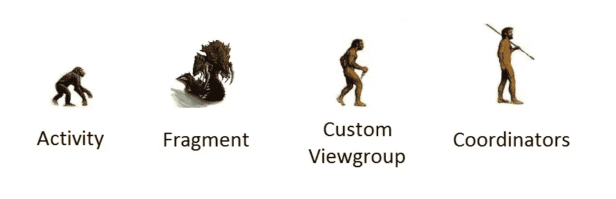
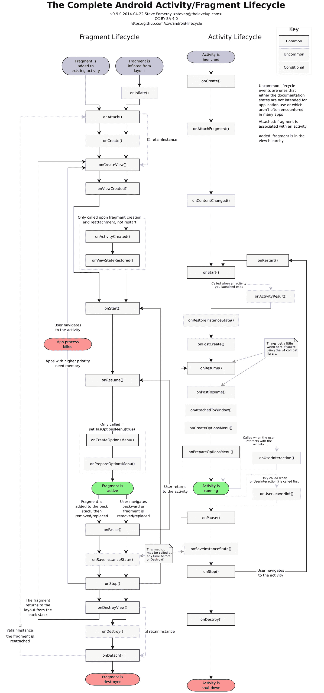

# 协调者:解决一个你自己都不知道的问题

> 原文：<https://medium.com/hackernoon/coordinators-solving-a-problem-you-didnt-even-know-you-had-e86623f15ebf>

Square 有一个大多数人不知道的图书馆。叫做 [**协调人**](https://github.com/square/coordinators) 。不是一个很有描述性的名字，在 Github 页面上也没有太多关于它的信息。

> Android 上的 MVWhatever 的简单生命周期。不开玩笑。

和一些示例代码:

```
class ExampleCoordinator extends Coordinator {

  @Override public void attach(View view) {
    // Attach listeners, load state, whatever.
  }

  @Override public void detach(View view) {
    // Unbind listeners, save state, go nuts.
  }
}
```

你可以在任何一个`View`上安装一个`Coordinator`:

```
// Bind a Coordinator to a View.
Coordinators.bind(view, coordinatorProvider);
```

它真的没有说它是什么，它做什么，以及它应该如何使用，对不对？

为了理解这个问题，我们必须了解一下自定义视图组的发展，因为这显然是下一步。



The evolution of displaying screens on Android

***(如果活动/片段内容让你厌烦，请随意跳到精彩内容！)***

# 活动

每个人都知道活动。它们应该代表应用程序中的单个屏幕，并且根据您可以定义的特定意图过滤器，从技术上来说是一个“入口点”。

为了开始一个新的活动，你使用一个`Intent`，比如`activity.startActivity(activity, OtherActivity.class)`。

它们也不能嵌套。好吧，这并不完全正确，有`LocalActivityManager` 和`ActivityGroup`，但自从 API 级以来，它们就被弃用了。我们还不如假装它们不存在。

用`setContentView()`显示视图组的活动。人们通常认为它只显示一种特定类型的视图组，用它的布局 id ( `R.layout.activity_main`)指定，然后如果你需要一个不同的屏幕，你只需要创建一个新的活动。

然后一旦你不得不把两个不同的屏幕放在同一个“页面”上，一切都乱套了。

# 碎片



Fragment/Activity lifecycle from [https://github.com/xxv/android-lifecycle](https://github.com/xxv/android-lifecycle) by Steve Pomeroy

片段是屏幕的“片段”。从技术上来说，它们显示一个定制的视图组，并由活动内部的`FragmentManager`管理。`Fragment`与`FragmentController`相关联，后者与“主机活动”相关联。

它们的设计主要是为了让你可以创建功能类似于“子活动”的“子屏幕”，继承所有重要的生命周期回调，比如`onCreate()`、`onActivityResult()`、`onPermissionResult()`，甚至更重要的`onSaveInstanceState(Bundle bundle);`。

他们还添加了自己的生命周期回调集，比如`onAttach()`、`onCreateView()`、`onActivityCreated()`、`onDestroyView()`和`onDetach()`。

可以用`getSupportFragmentManager().beginTransaction().add(R.id.container, new MyFragment()).commit();`创建片段。

但是大多数时候，你只需要访问你绑定的活动，*(通常用`onAttach()`完成)，以及对`onCreateView()`和`onDestroyView()`。*

*现在有了所有额外的复杂性，您可以通过使用片段的`[getChildFragmentManager()](http://stackoverflow.com/a/13391359/2413303)`[将一个片段嵌套在一个片段中——这有时会导致混淆您是需要`getFragmentManager()`还是`getChildFragmentManager()`。](http://stackoverflow.com/a/13391359/2413303)*

*有人可能会问，我们真的需要在活动的“子视图”中进行所有这些生命周期回调吗？*

*我们可能还会问，如果我们的活动中可以有“子视图”,那么为什么首先要创建多个活动呢？*

# *自定义视图组*

*你知道活动和片段有什么共同点吗？它们显示了本来就可嵌套的*视图组*(`ViewGroup`和`View`)，它们都是用 XML 声明的，而且它们还有一些不错的回调。*

*当你可以交换视图并得到相同的结果时，你会想为什么我们要首先使用它们来显示不同的屏幕。*

*我们可以扩展我们选择的视图组(`DrawerLayout`、`RelativeLayout`、`FrameLayout`、`LinearLayout`等)。)并使用我们选择的新的自定义视图组作为我们继承的对象。*

*因为我们使用布局膨胀通过`R.layout.custom_viewgroup`来膨胀自定义视图组，所以我们在`@OnClick`或`@BindView`中绑定的视图总是保证存在于`onFinishInflate()`中。*

*所以本质上，我们有类似于`onViewCreated()`、`onStart()`和`onStop()`的开箱即用回调。*

*代替`getSupportFragmentManager().beginTransaction().blah().commit()`，我们可以很容易地只选择`inflate`、`addView`或`removeView`。*

*但是，即使我们已经制作了一个子屏幕，不再直接绑定到一堆不必要的回调，由神秘的`FragmentManagerImpl`编排——有一件事可能仍然会困扰我们。*

***自定义视图组是通过通货膨胀创建的，它不是 POJO。它有 4 个构造函数，需要扩展一个 Android 特定的类才能工作。***

# *协调者*

*为了摆脱定制视图组的限制，我们可以将所有“视图控制器”逻辑移出视图组本身，并将其作为标签附加。*

*它是这样工作的:*

*因此，您可以创建一个协调器，它几乎可以是任何 POJO 类，并且可以附加到任何自定义视图组，而不必扩展它。*

*有了协调器，您会收到对`attach(View)`和`detach(View)`的回调。代替原始视图组的`onAttachedToWindow()`和`onDetachedFromWindow()`回调。*

*然后，这个协调器实例通过存储为一个`tag`与 ViewGroup 相关联。这样就可以得到协调器为`Coordinator coordinator = (Coordinator)getTag(R.id.coordinator)`，当然是由`Coordinators`类提供的。*

*这有什么好处？既然我们的类是一个 POJO，我们实际上可以直接用 Dagger 注入这个类，而不必在组件中指定一个`void inject(MyCustomViewGroup group);`方法。*

*因此，我们获得了以下好处:*

*   *我们不需要从视图组继承并定义 4 个构造函数来定义我们自己的“视图控制器”逻辑*
*   *我们可以从匕首直接注射我们新做的协调器，不需要`void inject(MyCoordinator coordinator)`*
*   *我们不再需要一个`Context`来创建“视图”的实例，我们可以创建一个协调器来代替*

# *结论*

*个人比较喜欢`Coordinators`走的方向。我不完全确定`onAttachedToWindow()`和`onDetachedFromWindow()`回调本身是否真的足够，但是在我们自己的类中定义一个自己的`attach(View)`和`detach(View)`方法，然后将它与一个`tag`关联起来也并不困难。*

*作为回报，我们得到了一个 POJO 视图控制器，它可以通过 Dagger 直接创建和注入，而不需要创建 4 个构造函数，也不需要在自己的 XML 文件中硬连接自定义视图组。*

*如果导航逻辑从活动/片段中分离出来，并被移动到表示层，那么新的协调器方法会工作得特别好。这使得代码更加简洁——毕竟，应用程序状态转换不是视图应该管理的事情。*

*我带着协调员在[https://github . com/zhuin den/simple-stack/tree/master/simple-stack-example-MVP](https://github.com/Zhuinden/simple-stack/tree/master/simple-stack-example-mvp)进行了一次试驾。*

*[](http://bit.ly/HackernoonFB)**[](https://goo.gl/k7XYbx)**[](https://goo.gl/4ofytp)*

> *[黑客中午](http://bit.ly/Hackernoon)是黑客如何开始他们的下午。我们是这个家庭的一员。我们现在[接受投稿](http://bit.ly/hackernoonsubmission)并乐意[讨论广告&赞助](mailto:partners@amipublications.com)机会。*
> 
> *如果你喜欢这个故事，我们推荐你阅读我们的[最新科技故事](http://bit.ly/hackernoonlatestt)和[趋势科技故事](https://hackernoon.com/trending)。直到下一次，不要把世界的现实想当然！*