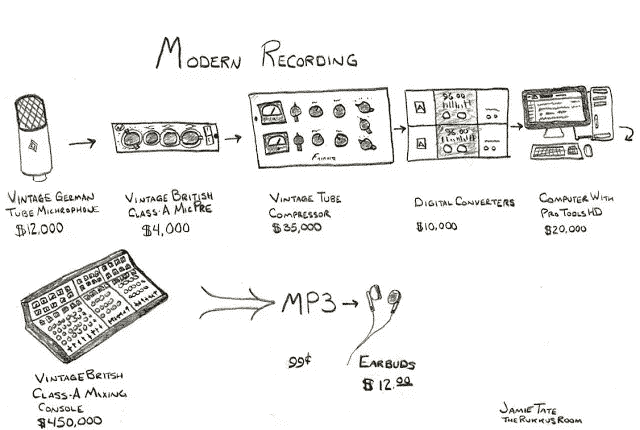

# Coppertino 团队博客:开发像“不可能什么都不是”这样的 VOX

> 原文：<https://medium.com/hackernoon/coppertino-team-blog-developing-vox-like-impossible-is-nothing-a903d92028a8>

你们好，伙计们！我的名字是奥列格。两年来，我一直忙于在科波蒂诺开发音频引擎。很难吗？是的，差不多。不过，我没有放弃。让我在这个 5 分钟的故事里告诉你为什么。

> 从一开始，音乐就比技术更重要…

正如许多人可能会怀疑的那样，在我职业生涯的最开始，我并不是一名音频引擎架构师。一切都始于对创造力和技术的热情。我一直都知道我的生活会和音乐以及与之密切相关的一切联系在一起。获得声学和电子学学士学位后，我花了一些学习时间来熟悉编程语言。因此，我认为自己是自学编程的。最初是我对音频细节的兴趣让我拥抱了计算的力量，以及它能为音乐领域带来什么。增强音乐世界的冲动让我找到了通过编程来表达自己想法的方法。

在上学早期，我非常喜欢发现新的可编程电子设备——首先是可编程计算器，然后是第一台光谱计算机。我的家庭背景和我居住的地区促使我在技术方面进行创新。这就是为什么当我还是个孩子的时候，我总是忙于制造电子设备，目睹计算机技术每天都在进步。

> 第一步

当我在专业音频行业担任音响系统工程师时，我迈出了严肃编程的第一步。这是计算机变得更加个人化的时候，音频处理实质上进入了数字领域，数字技术的兴起将整个音乐行业带到了一个新的水平。当然，没有软件，这一切都是不可能的。用于声学测量和预测的大多数现有软件包非常昂贵，并且不是非常用户友好，仅用于专有硬件或者仅由大公司提供。好的录音室多声道录音包要花费几千美元，专业的 CAD 软件甚至更贵。我有一些关于为扩声/音乐会音频行业创建应用程序的想法。我想开发这样的应用来增强声音的力量。这种意愿，加上互联网力量的崛起和获得在线编程所需知识的机会，使我开始学习编程并进行利用音频计算能力的实验。我最初的一个应用想法是…(你现在不要太惊讶)一个音乐播放器！虽然不像 VOX。我在考虑一种多区域 PC 播放解决方案，可以在不同的空间或房间播放不同的曲目。

> 加盟科波蒂诺

在 Coppertino 之前，我在音频技术和教育领域的几家科技创业公司工作。我在加入球队前一年左右就知道了科波蒂诺。我下载了 VOX，想知道是谁做的。令人惊讶的是，开发团队位于我的家乡城市。我有点喜欢这个名字，因为它听起来几乎像苹果公司的故乡:)，我也喜欢这个播放器的名字，因为它让我想起了过去一个传奇的音乐相关品牌。当我上一份工作的职责全部完成后，我发现了一则公告，称 Coppertino 正在招聘一名 iOS 开发人员。我去试试运气，科波利蒂诺欢迎了我。我认为我的音频背景是优势。

> 最薄弱的环节

当我加入 Coppertino 时，许多来自专业音频领域的同事开玩笑说，我通过加入音乐播放器项目和整个技术行业，从“专业”市场向下转移到了消费市场。他们为什么拿这个开玩笑？好吧，看这个。

Credits: [http://sonicfarms.blogspot.com/2013/01/modern-recording-signal-chain.html](http://sonicfarms.blogspot.com/2013/01/modern-recording-signal-chain.html)

这张照片很好地展示了在我们这个由智能手机驱动的现代数字世界中，从音乐被录制到被聆听的过程中，音乐的音质发生了怎样的变化。这是这样的情况，设备的价格只是为了显示在离开录音棚后，对质量的关注如何迅速下降。因此，作为对所有批评的回应，我经常说的是，我已经离开，去帮助解决这个“专业”音乐产业链另一端的技术质量问题，也就是最薄弱的一端，即听众的声音环境。

> 开发 VOX 是一种怎样的体验？

对我来说，从事 VOX 开发的主要价值是…有趣。我真的很喜欢它，因为这是一个自我激励的过程，你创造了很多人需要的东西，你*也在这个过程中听音乐。*

*除此之外，大多数开发者会认为音乐播放器是一个微不足道的应用程序。或许，这是真的，直到我们谈论我们在 VOX 中加入的广泛功能，以及苹果将应用程序的质量标准提高了多高。开发人员社区经常建议我们应该做什么以及如何做才是正确的，我很感谢他们的指导。有时看起来确实很少有人真正理解 VOX 已经变得多么复杂，以及它利用了多少不同的部分来实现如此多才多艺和可接受。*

*开发 VOX 是一个非常实验性和非线性的过程，在这个过程中，我们的想法和梦想推动我们前进，有时速度超过了技术允许的速度。有时候真正的解决方案并不像“纸上谈兵”那样显而易见。这是对更好方法的不断探索。太多时候，向前迈两步，你必须后退一步。*

> *这很艰难，但也很有趣*

*Vox 作为音乐播放器的重要之处在于，对我们的用户来说，音乐意味着…很多。真的很多。这是他/她的生活方式的一部分，是一个人心情的很大一部分。此外，这是一个长期使用的应用程序，而不仅仅是一两分钟。所以从技术上来说，这款应用必须足够可靠，能够承受长期使用。*

*我将与你分享的关于音乐播放器的另一个秘密是，视觉冲击也非常重要，所以图形和人体工程学设计应该尽可能达到最高水平。*

> *处于“仅仅是可能”的边缘*

*当 VOX 开发中的一些任务似乎很难执行时，我经常发现自己处于非常危急的情况下——但是克服这些任务是前进的最佳方式。起初，你看着这个想法，没有进入技术细节，你认为，“这仅仅是可能的”。然后你会发现实现它的方法比你最初想的要漫长和曲折得多。在寻找正确的解决方案的过程中，在某个时刻，在理清复杂的混乱之后，**你**发现自己对这个任务很满意——解决方案变得“小菜一碟”。对我来说最困难的是整个 VOX 项目的复杂性和多功能性。这真的迫使我在途中研究了许多新的技巧和技术。然而，最简单也是最棒的部分是成为这样一个才华横溢的大团队的一员。*

*想分享你开发音乐播放器的经验吗？在这里留下你的评论，或者给我发电子邮件，告诉我关于 olegn@coppertino.com 的事情。*

*世界某处见，VOX 粉丝们！；)*

******

> *[黑客中午](http://bit.ly/Hackernoon)是黑客如何开始他们的下午。我们是 [@AMI](http://bit.ly/atAMIatAMI) 家庭的一员。我们现在[接受投稿](http://bit.ly/hackernoonsubmission)，并乐意[讨论广告&赞助](mailto:partners@amipublications.com)机会。*
> 
> *如果你喜欢这个故事，我们推荐你阅读我们的[最新科技故事](http://bit.ly/hackernoonlatestt)和[趋势科技故事](https://hackernoon.com/trending)。直到下一次，不要把世界的现实想当然！*

**