# 企业预测市场:主要参与者综述

> 原文：<https://medium.com/hackernoon/corporate-prediction-markets-a-roundup-of-the-major-players-3632b5d3cf09>

[罗宾·汉森](http://www.overcomingbias.com/bio)最近发出了一个“[的召唤去冒险](http://www.overcomingbias.com/2017/06/a-call-to-adventure.html)”:

> “我很快就要 58 岁了，我开始意识到我可能活不到足够长的时间来完成我许多伟大的人生项目。所以我想试着吸引年轻人继续下去。因此，这就叫冒险。”

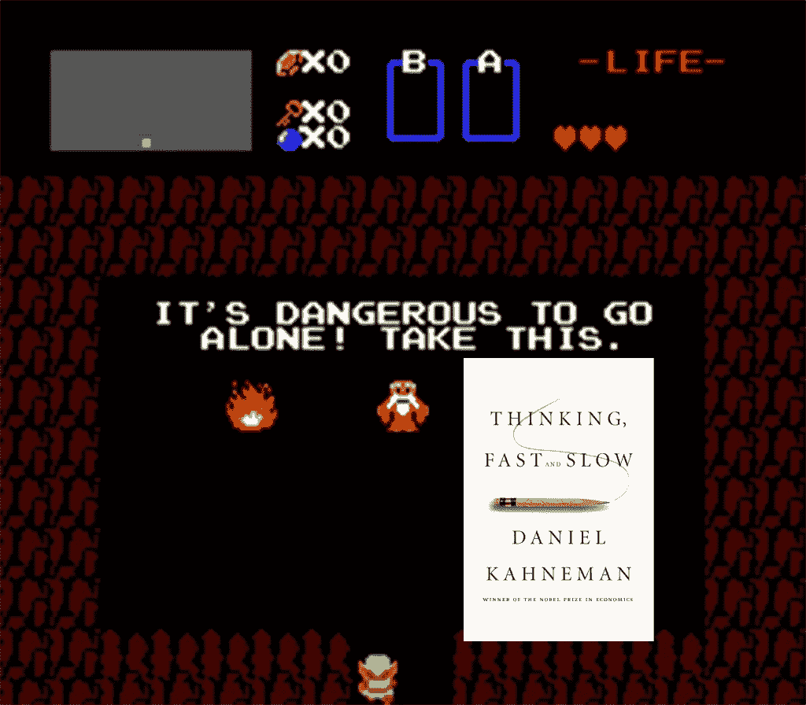

《冒险一号》鼓励“愿意亲自动手处理现实组织的复杂性的精明人”去“通过决策[市场](https://hackernoon.com/tagged/markets)重新制定集体决策”，也就是[预测市场](https://en.wikipedia.org/wiki/Prediction_market)。

自从阅读了罗宾关于“[想法未来](http://mason.gmu.edu/~rhanson/ideafutures.html)”的著作和菲利普·泰特洛克关于专家如何以及为什么不擅长预测的研究之后，我就一直是这个想法的粉丝。

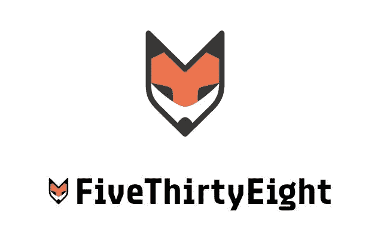

Ever wondered why FiveThirtyEight’s logo features a fox? [Because Philip Tetlock](http://www.slate.com/blogs/browbeat/2014/03/19/foxes_vs_hedgehogs_a_history_from_nate_silver_fivethirtyeight_and_isaiah.html), basically.

上次我在一家大型上市软件公司工作时，我非常希望我们能在内部利用市场来减少失误。我希望预测市场是我们社会的基本组成部分。我希望我们把它们用在科学上。

但是很明显，在我们走向未来之前，我们必须先在小范围内取得成功。成功螺旋上升，诸如此类。

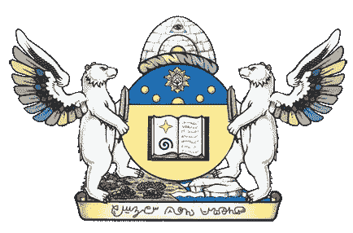

[Raikoth](http://slatestarcodex.com/2013/04/15/things-i-learned-by-spending-five-thousand-years-in-an-alternate-universe/) uses prediction markets. If you haven’t read Scott Alexander’s [conworld / vision of a utopia](http://slatestarcodex.com/2013/05/15/index-posts-on-raikoth/), please do. It’s fascinating, and you’ll thank me.

在现实世界的组织中使用预测市场的想法一直存在于我的脑海中，名为“*比你更聪明、更努力的人已经搞定了*”。但是现在已经过去将近十年了，我仍然没有遇到任何一个在使用这些系统的公司工作的人。

所以今天，我想通过对目前正在从事这项工作的企业做一个快速调查，来看看其他人在多大程度上覆盖了这项服务。

# [共识点](https://www.consensuspoint.com)

他们成立于十多年前，以罗宾·汉森为首席科学家，已经筹集了近 600 万美元，并指定通用电气、百思买和摩托罗拉为客户。他们的使用指标超出了我的预期，尽管我很好奇有多少预测是由员工内部做出的，而不是由公众做出的:

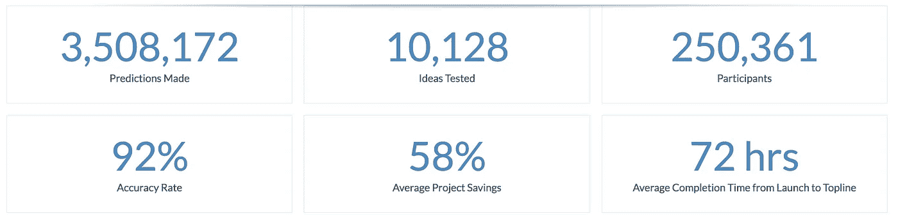

来自[他们的一个案例研究](http://www.consensuspoint.com/case-study-employee-retail/):

> “摩托罗拉在全公司范围内发起了一项倡议，向员工征集想法和创新。作为对邀请的回应，摩托罗拉的创意评审委员会被系统产生的 15000 个创意淹没了

考虑到摩托罗拉只有 4 万名员工，这是一个令人印象深刻的敬业度。

对[百思买](http://www.consensuspoint.com/case-study-employee-personal-tech/)和[通用](http://www.consensuspoint.com/case-study-employee-durable-goods/)的案例研究也是基于对其员工市场的预测。两者都没有具体说明研究是何时进行的，也没有说明这两家公司是否仍然是客户。摩托罗拉事件似乎发生在十年前。

Consensus Point 谈论他们的“平台”Huunu，但我在上面能找到的唯一实质性的东西似乎是由设计师设计的[实体模型:](http://www.tarajokirk.com/huunu/)

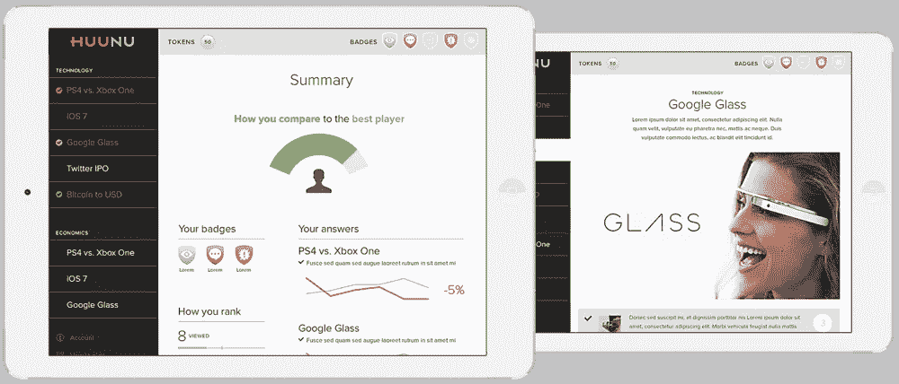

Vapourware? It’s unclear. But the fact that they’re referencing Google Glass non-ironically dates these pictures to … 2014? **[UPDATE: aha! The Wayback Machine** [**confirms my hypothesis**](https://web.archive.org/web/20141129211918/http://www.tarajokirk.com/huunu/)**.]**

根据他们的员工阵容和网站内容(以及他们为客户而不仅仅是员工经营预测市场的事实)，**看起来他们特别关注市场研究**而不是总体的公司决策(例如，验证新产品想法而不是回答诸如“这个项目会超出预算吗？”或者“这个项目会按时交付吗？”).

我想知道这在多大程度上是由于公司政治:如果高管们发现他们的下属一直都知道一个已经在进行的项目是个累赘，这可能会很尴尬。很少有穿西装的掌权者喜欢被告知他们的决策是次优的。

Huunu. Who knew? Hoo hoo. Get it? I rate the name 4/7 using [the Paul Graham method](http://aux.messymatters.com/pgnames.html).

五个月前，Consensus Point 更新了他们的网站，他们的博客相当活跃，但目前还不清楚他们有多成功——我找不到任何关于他们目前客户的信息，也不知道他们是否有野心将 Huunu 变成不仅仅是咨询工作的工具。

尽管如此，我还是惊喜地看到他们做得有多好。他们相对于其他参与者的优势归结于他们十多年的机构知识和罗宾·汉森的品牌。

# [培养实验室](https://www.cultivatelabs.com/)

2015 年，Adam Siegel(他创建了 [Inkling](http://inklingmarkets.com/) 并带领它穿越了 YC)与技术联合创始人 [Ben Roesch](https://www.benroesch.com/about) 一起成立了 Cultivate，该公司拥有一些令人印象深刻的客户:

看起来他们试图从总体上解决公司治理问题，而不是从市场研究开始:

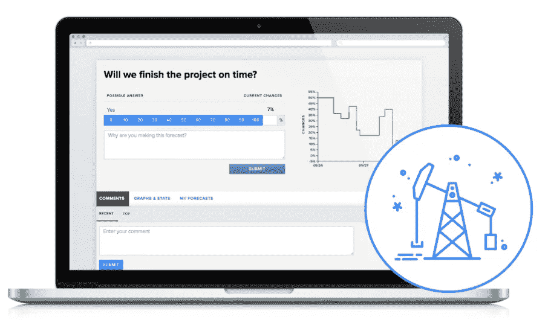

这不仅仅是截图，正如[他们与一家石油公司](https://www.cultivatelabs.com/oil_case_study)(可能是壳牌，基于他们的客户名单)合作的案例研究所示，更不用说首席技术官最近发表的关于[预测市场如何能够更准确、及时地“测试”首席执行官的能力和诚信](https://www.cultivatelabs.com/posts/a-board-s-check-on-its-ceo)的博客文章了。

我非常喜欢使用他们的技术是多么容易:

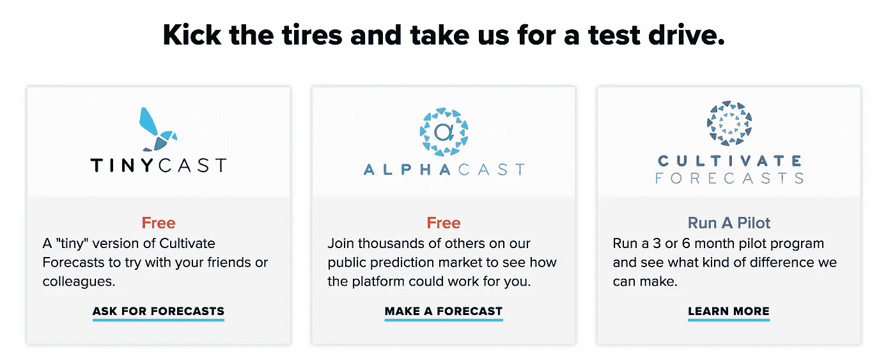

起初，我认为 AlphaCast 只是我的老朋友[预测书](https://predictionbook.com/)的一个稍微花哨的版本(它让你*说*你认为某事有多可能，但不打赌)，但是[正如亚当·西格尔友好地指出的](/@amsiegel/hey-alistair-thanks-for-including-us-in-your-review-and-for-the-mostly-kind-words-9c1ab8da3ecb)，那只是一个在复杂的市场后端之上的漂亮界面:

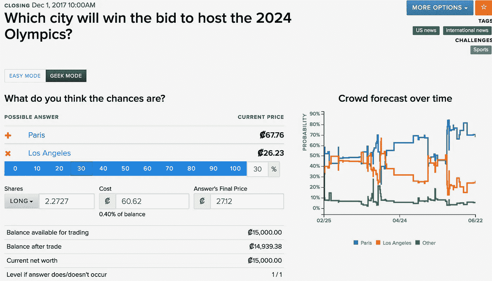

我很好奇这个通知指的是什么，它与他们当前的产品有什么不同:

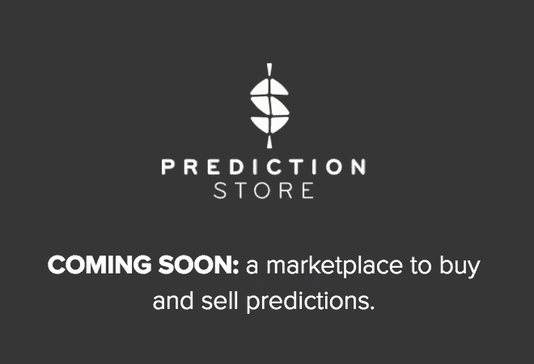

**UPDATE**: fresh details, [from the horse’s mouth](/@amsiegel/hey-thanks-for-the-revision-i-appreciate-it-68a985f88632)

我喜欢他们推销预测市场的方式——从他们强烈呼吁采取行动，到时尚的网站设计，再到技术本身。如果我只能投资这些公司中的一家，我会选择培养。

# [Lumenogic](http://lumenogic.com/)

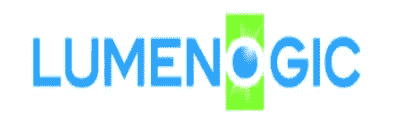

Lumenogic 的网站有点傻，最初我不确定他们是否还活着，但是[在谷歌新闻上快速搜索](https://www.google.com/search?hl=en&gl=uk&tbm=nws&authuser=0&q=%22lumenogic%22&oq=%22lumenogic%22&gs_l=news-cc.3..43j43i53.1861.2315.0.2550.3.3.0.0.0.0.226.553.0j2j1.3.0...0.0...1ac.1.bTpCq_m3Jkk)打消了我的疑虑。[他们的案例研究](http://lumenogic.com/?page_id=1027)表明，他们不只是口头上支持预测市场的想法:

> “这些想法是匿名提交的，附有说明以及对客户和公司的益处。在博彩游戏中，参与者得到虚拟代币，每个人得到 10 个绿色代币，放在最佳创意上，3 个红色代币放在坏创意上。

我被他们令人难以置信的客户名单震惊了:

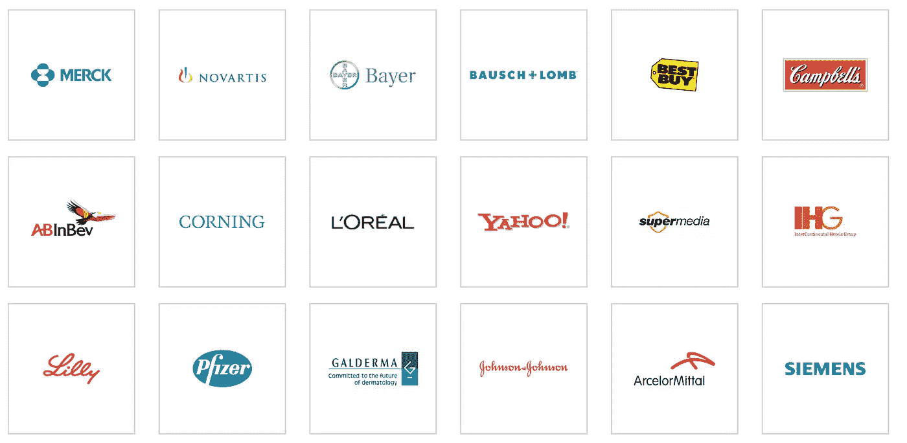

There are literally pages of these logos

上面的案例研究描述了洲际酒店集团的“创意盛会”。在 2008 年的《纽约时报》上有一篇关于它的很好的文章。我也很喜欢这篇彭博写的关于几年前 Luminogic 与空军合作的文章。有趣的是，它简短地提到了他们“在美国大约有六个竞争对手”。我想知道有多少人在雷达下飞行，或者谁已经折叠？请让我知道我在综述中漏掉的公司。

顺便说一下，看看他们案例研究页面的截图:

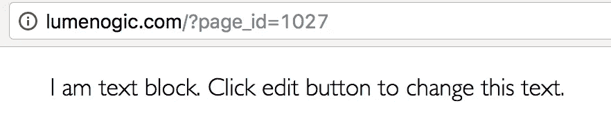

他们可以从培养实验室的营销/品牌/设计人员那里学到一些东西。从表面上看，Luminogic 在争取客户方面没有任何困难，但我感觉他们并没有花很多时间来制作心爱的产品。

# 还没有人找到一种方法来放大这个

因此，看起来有一些有能力的公司在这个领域蓬勃发展。有一点我可以肯定的是，还没有现成的工具。上述公司都是靠咨询赚钱的，AFAICT。有一天，这将成为 SaaS 的产品，公司可以注册并立即开始使用，而无需昂贵的咨询和培训费。

这个领域的现状让我希望在澳大利亚开始相关的业务，在这里(据我所知)，没有人能像上述三家公司一样兴风作浪。

这部分是技术上的挑战，但主要是组织上的挑战。这是一个巨大的变化，现在只有最勇敢、最聪明、最见多识广的领导者(和团队)才会开始使用这些系统，而不需要大量的手把手，也就是变化管理，也就是**极长的销售周期**。

随着老一辈的消亡，随着 UX 产品的完善，随着这些思想通过越来越多的书籍、文章和成功故事进入主流意识，这种情况将会改变。

马克斯·普朗克有句名言:

> “一个新的科学真理不会因为说服其反对者并让他们看到光明而胜利，而是因为它的反对者最终会死去，而熟悉它的新一代会成长起来。”

幸运的是，企业预测市场不需要成为“科学真理”才能让精明的企业开始使用它们。

> [黑客中午](http://bit.ly/Hackernoon)是黑客如何开始他们的下午。我们是 [@AMI](http://bit.ly/atAMIatAMI) 家庭的一员。我们现在[接受投稿](http://bit.ly/hackernoonsubmission)并乐意[讨论广告&赞助](mailto:partners@amipublications.com)机会。
> 
> 如果你喜欢这个故事，我们推荐你阅读我们的[最新科技故事](http://bit.ly/hackernoonlatestt)和[趋势科技故事](https://hackernoon.com/trending)。直到下一次，不要把世界的现实想当然！

