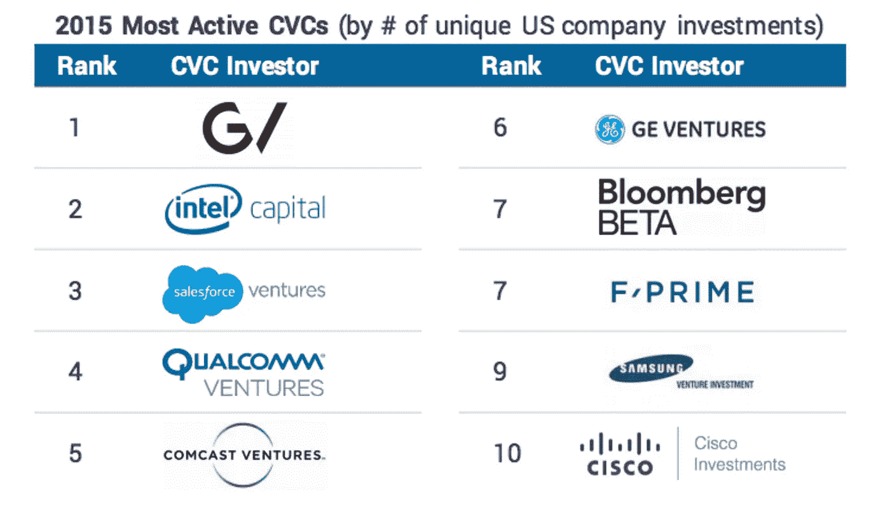
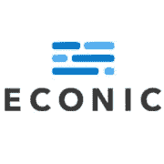

# 企业风险投资的声誉挑战

> 原文：<https://medium.com/hackernoon/corporate-venture-capitals-reputation-challenge-8da32285ac92>

企业风险投资正在增长，虽然传统的风险投资公司(T2)并不都喜欢这种趋势，但创业公司却喜欢。随着早期投资领域的竞争加剧，新投资者为成长中的初创企业带来了更友好的条款清单。现在，风险投资公司只需要确保他们不会在创业生态系统中产生负面声誉。太迟了吗？

*(注意，并非所有传统风投都对竞争感到不安。许多风险投资公司拥有良好的声誉，是风险投资公司理想的共同投资者。请看本周:* [*富士康*](http://www.globalcorporateventuring.com/article.php/14910/foxconn-helps-sinovation-with-675m-fundraise) *，* [*美国运通*](http://www.globalcorporateventuring.com/article.php/14903/signifyd-charges-to-19m) *，* [*通用电气*](http://www.globalcorporateventuring.com/article.php/14888/corporate-venturing-deal-net-5-9-september-2016) *)*

## 投资者挑战

企业风险部门的任务是实现财务目标和战略目标。经济上——把钱和一些钱一起还回来。战略上——投资于服务于我们使命的想法或公司。财务方面大同小异，这是一个战略要素，有风险投资的诽谤，创始人的疑惑，以及风险投资公司拼凑的合格报价。Merck Global Health Innovation 董事总经理 Joe vol PE[谈到了](http://www.globalcorporateventuring.com/article.php/12909/global-corporate-venturing-rising-stars-awards-2016-contents)将公司战略与明智投资相结合的挑战，“很难在我们的重点领域挖掘创新投资，也很难找到准备投资的公司，以及那些理解我们的论点或投资战略的实体，还很难协调各方的时间安排，以及混合风险投资、增长型股票和并购。”

 [## Ep。23 岁-克里斯蒂娜·贝克霍尔德与三星和帝国天使| acast 上的内外创新

### 一家以面条店起家的公司如何成为一家拥有比苹果或苹果更多年度专利的大公司？

www.acast.com](https://www.acast.com/insideoutsideinnovation/christinabechholdw-samsungandempireangels) 

对于那些因与需要持久投资者的初创公司建立自私的短期合作关系而声名鹊起的风险投资机构来说，调整投资目标更加困难。高通人寿基金的高级总监满舒克在今年《全球企业风险投资的明日之星》报告中谈到了最重要的[挑战](http://www.globalcorporateventuring.com/article.php/12909/global-corporate-venturing-rising-stars-awards-2016-contents)，“风险投资行业正变得越来越复杂，竞争越来越激烈。许多大公司正在通过提供从项目设计到高管招聘的增值服务来重组业务。CVC 需要更深入地挖掘自己的独特资产，同时不追求短期商业利益。”

抛开投资者关系不谈，新的风险投资机构担心社区中更广泛的声誉会削弱他们的项目签约下一个行业独角兽的机会。许多公司甚至[将他们的风险部门更名为](https://www.amazon.com/dp/B01L7RO4FG/ref=dp-kindle-redirect?_encoding=UTF8&btkr=1#nav-subnav)，以独立公司的形式出现。首要问题仍然是——初创公司会被我们吸引吗？

## 三星电子

三星是一家由面条变成科技的公司，拥有比苹果或谷歌更多的专利。他们每年在研发上的花费超过 140 亿美元，也就是每天 4000 万美元。7 万名工程师在全球运营着 36 个研发中心。他们在纽约、硅谷和特拉维夫有一个加速器和投资团队。他们的创新生态系统的每个成员都有责任了解组织中每个业务领导者的当前使命，以便他们在演示日、个人网络或通过企业家常驻项目会面时，能够将年轻的公司与合适的人联系起来。他们在种子阶段、A 轮和 b 轮进行投资。他们有超过 30 万名员工，他们想投资你。

是什么阻碍了你？

[CBInsights CVC Trends 2016](https://www.cbinsights.com/research-cvc-trends-mar2016)

对于许多初创公司来说，这是一种混合，不想对一家公司做出承诺，感觉公司不会提供适当的支持，担心他们会接受一项不平衡的交易，其中他们的热情被导向公司的议程。

## 创业公司关系

最近，我们[与人工智能和金融科技领域的成长型初创公司](https://smallbusinessforum.co/what-its-like-to-partner-with-a-corporation-3ba001e34b41#.vlw33pplm)交流了他们对企业作为长期合作伙伴的看法。我们采访的每个团队都是 2015 年从企业加速器项目毕业的。

当我们采访微软和巴克莱加速器的毕业生时，我们听到的反馈大多是正面的。*所有的团队都完成了他们在项目开始前设定的目标。这些公司在时间、金钱和关系方面都很慷慨。与企业团队和同事的关系超越了加速器计划，有些发展成了合资企业。*

但这些初创公司也对他们的东道主提出了建议:*更加珍惜我们的时间。培训您的员工了解我们的紧迫性和优先事项。在为我们的团队安排公司介绍时，要更加透明。*

在风险领域，我们继续听到和读到更多类似的内容:*公司不理解初创公司的问题，所以作为投资者，你应该避开他们。*

很明显，公司和创业团队之间存在一些误解，阻碍了双方始终有效地合作。但是，正如我们在 Capital One 和三星(Samsung)看到的那样，这两家公司都有初创企业创始人和以前的投资者，这是一个可以解决的问题，与 CVC 合作的好处(资产、知识、关系)应该仍然远远超过这一可避免的成本。一位创始人建议企业团队在与创业公司合作之前“阅读一堆保罗·格拉厄姆的文章”。这可以帮助员工在短期项目中可视化创业优先事项，但投资者预计将指导团队度过漫长而艰难的时期。创业公司希望投资者有涉水低迷的经验，这就是我们听到的分裂的根源。CVC 错误地为他们的风险部门配备了没有创业经验的业务开发和战略人员。声誉问题随之而来。

## CVC 人员配备

正如 Fred Wilson 在这篇博客中提到的，基本上有两种类型的风险投资公司:被动的公司风险投资部门和主动的战略投资。消极的公司风险投资部门是支持性的、长期的、亲自参与的投资者。积极的战略投资更多的是口头承诺，而不是实际行动。三星的 [Christina Bechold](https://www.linkedin.com/in/christinabechhold) 说，不同之处在于团队的构成。*他们有投资经验吗？他们有创业经验吗？*

“他们经常从企业发展或战略部门挖人，并让他们从风险投资部门转行，这不是我们三星的做法。我们的风险团队都有投资和运营背景。”(克里斯蒂娜加入了我们的 I/O 播客，讨论风投与传统风投、硅谷之外的创业公司的崛起等等)。

Capital One、Neopost、Ericcson 和 Konika Minolta 都是最近的 I/O 客户，他们招募了具有创业经验的新员工来管理公司与创业公司的关系。竞争投资者仍然可以提出一些问题:*他们是否考虑到了你的最大利益？他们会在以后的比赛中支持你吗？*但是在第一线，招聘和人员配备可能是成功协作模式的关键。

## 在互惠互利的道路上

创业公司必须减轻对 CVC 资金的负担，因为企业风险资本投资者在 2015 年期间提供了超过 75 亿美元的资金，这是自 2000 年以来的最高水平。此外，花旗风险投资(Citi Ventures)董事总经理凡妮莎·科莱拉(Vanessa Colella)表示，企业一直在努力改善他们的关系资本:“由于我们的大部分投资组合已经商业化，我们在指导初创公司如何在跨国企业中参与和互动方面有着丰富的经验——否则他们可能很难驾驭这一点——并为他们指出他们可能增加价值的领域。”(参见全球企业风险投资[可下载的](http://www.globalcorporateventuring.com/article.php/12909/global-corporate-venturing-rising-stars-awards-2016-contents)冉冉升起的新星报道，了解凡妮莎的引述。)

如果自助商店还没有停止运营，他们正忙着重组他们的模式，模仿英特尔投资、GV 和其他知名公司。尽管企业在寻找任何方式将潜在的颠覆者与初创公司联系起来，更多的初创公司在更多的地方(T2)成立，初创公司与企业的合作模式将继续影响 CVCs 的结构和条款清单。看起来他们已经学会相处得很好。

# 订阅输入/输出播客

[iTunes](https://itunes.apple.com/us/podcast/inside-outside-innovation/id1105487293?mt=2) ______ [电子邮件](http://insideoutside.io/)_ _ _ _ _ _[演员阵容](https://www.acast.com/insideoutsideinnovation)

感谢您的阅读——我们是 [Econic](http://econic.co) ，我们帮助公司规划和执行创新。如果你喜欢这篇文章，我们希望你能分享它。点击下面的绿心，发微博。

给我们发电子邮件至 team@econic.co[https://twitter.com/econicco](https://twitter.com/econicco)

> [黑客中午](http://bit.ly/Hackernoon)是黑客如何开始他们的下午。我们是阿妹家庭的一员。我们现在[接受投稿](http://bit.ly/hackernoonsubmission)并乐意[讨论广告&赞助](mailto:partners@amipublications.com)的机会。
> 
> 如果你喜欢这个故事，我们推荐你阅读我们的[最新科技故事](http://bit.ly/hackernoonlatestt)和[趋势科技故事](https://hackernoon.com/trending)。直到下一次，不要把世界的现实想当然！

