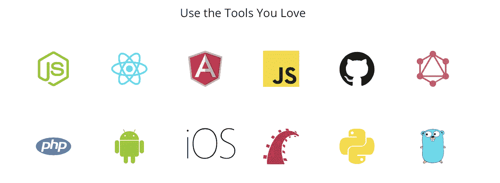
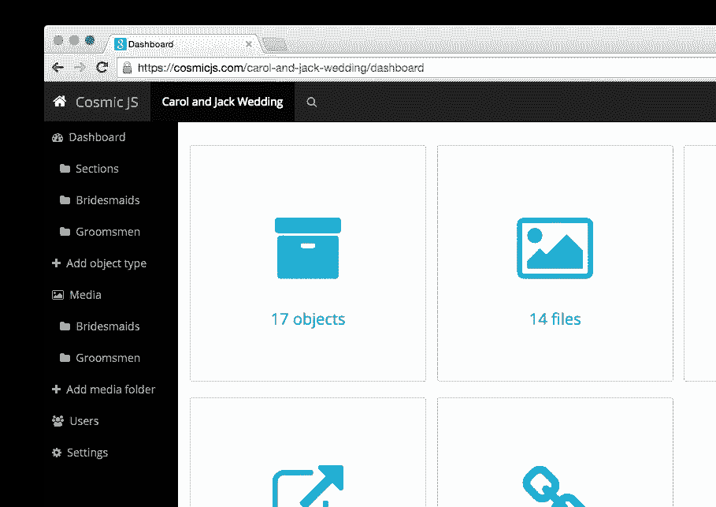

# 宇宙 JS vs. WordPress

> 原文：<https://medium.com/hackernoon/cosmic-js-vs-wordpress-668608df4e22>

Cosmic JS vs. WordPress for Content Management

Cosmic JS 是一个 [API 优先的 CMS](https://cosmicjs.com) ，帮助开发者和内容编辑团队更快地构建应用。在 StackOverflow 上接受调查的[64.5%的开发者表示 WordPress 是他们最害怕使用的平台之一。由于对已安装系统的种种不满，是时候与云中 API 优先的内容管理进行比较了。](https://insights.stackoverflow.com/survey/2017)

你是 WordPress 开发者吗？想知道是什么让 Cosmic JS 成为更适合你的 CMS 后端？

Cosmic JS 提供了一个直观的 API，可以向任何网站或应用程序提供内容。这使您可以自由地使用任何编程语言来构建应用程序，并允许在您的开发团队中更容易地扩展。 [Cosmic JS](https://cosmicjs.com) 提供了简化的编辑体验，为您提供了快速轻松发布内容所需的一切。由于没有 CMS 安装，您可以在开发的任何阶段轻松构建内容，并避免不必要的流程瓶颈。

# 1.宇宙 JS 更有生产力

已安装的内容管理系统会产生持续的技术债务，这些债务会成为明天的问题。停止在每个项目上重新发明轮子，避免安装、配置和维护的时间消耗。现在通过 API 优先，你将看到节省项目时间、时间表和成本的直接好处。不要让另一个项目成为一个已安装的头痛项目，从未来的项目中夺走资源。

使用安装的内容管理系统，只需花费几分之一的时间即可完成项目。消除瓶颈，加快运输速度。使用不同技能和技术的团队可以围绕一个独立于语言的 API 轻松协作，获得直观的内容编辑体验。

构建内容并将其发布到您的网站、iOS 和 Android 应用程序。你的内容也为你未来的手表、汽车或虚拟现实应用做好了准备。

一个字:神奇。[Cosmic Stack](https://cosmicjs.com/blog/the-cosmic-stack)不仅缩短了您的上市时间，还彻底改变了您的开发流程。您将能够即时部署新应用程序，只需点击几下鼠标即可复制项目，并以前所未有的方式轻松启动应用程序。

[宇宙栈](https://cosmicjs.com/blog/the-cosmic-stack)是最简单的内容管理栈。有了 Cosmic JS 和 GitHub，你就有生意了。

# 3.Cosmic JS 提供了更好的内容编辑器体验

通过 [Cosmic JS](https://cosmicjs.com/) 仪表盘，可以轻松管理内容、拖放媒体和建立内容关系。为开发人员提供了构建全功能应用程序的强大工具，为内容编辑人员提供了简单直观的内容管理方式。

# 4.宇宙 JS 的速度非常快

[Cosmic JS](https://cosmicjs.com) 建立在最前沿的编程语言、框架和云技术之上。这使得它比 WordPress 在发布后台 CMS 和加载网站方面都要快。

# 5.Cosmic JS 负责升级、可伸缩性和安全问题

更新 WordPress、安装和升级插件、备份数据库和修复安全问题的日子已经一去不复返了。 [Cosmic JS](https://cosmicjs.com) 是一个 API 优先的内容管理平台，因此我们会为您负责维护、安全性和可扩展性。

存储在 [Cosmic JS](https://cosmicjs.com/) 中并由 API 交付的内容受到 256 位 SSL 加密的保护。您还可以通过在 Cosmic JS Bucket 的 Settings 选项卡中添加可选的访问令牌来限制对内容的访问。

# 结论

传统的内容管理系统无法应对现代业务的发展速度。当做出错误的技术选择时，项目时间表和成本会显著增加。技术债务随着时间的推移而增长，消耗未来的资源来维护旧的基础设施。

[Cosmic JS](https://cosmicjs.com/) 提供了一个基于云的解决方案，支持快速应用开发，可扩展以满足现代业务的需求。您将立即看到节省项目时间、成本以及团队内部更高级别的协作带来的好处。

准备好试试宇宙 JS 了吗？[报名](https://cosmicjs.com/)加入[宇宙 JS 社区](https://cosmicjs.com/community)更快的搭建 app。通过 [Twitter](https://twitter.com/cosmic_js) 或 [Slack](https://cosmicjs.com/community) 联系我们。

# 无头 CMS 资源

*   公司网站的无头 CMS
*   [用于博客的无头 CMS](https://cosmicjs.com/solutions/headless-cms-for-blogs)
*   [新闻网站的无头 CMS](https://cosmicjs.com/solutions/headless-cms-for-press-websites)
*   [用于营销活动的无头 CMS](https://cosmicjs.com/solutions/headless-cms-for-marketing-campaigns)
*   [用于本地应用的无头 CMS](https://cosmicjs.com/solutions/headless-cms-for-native-apps)
*   [现代堆栈网站的无头 CMS](https://cosmicjs.com/solutions/headless-cms-for-modern-stack-websites)
*   [电子商务网站的无头 CMS](https://cosmicjs.com/solutions/headless-cms-for-ecommerce-websites)
*   [新兴技术的无头 CMS](https://cosmicjs.com/solutions/headless-cms-for-emerging-tech)