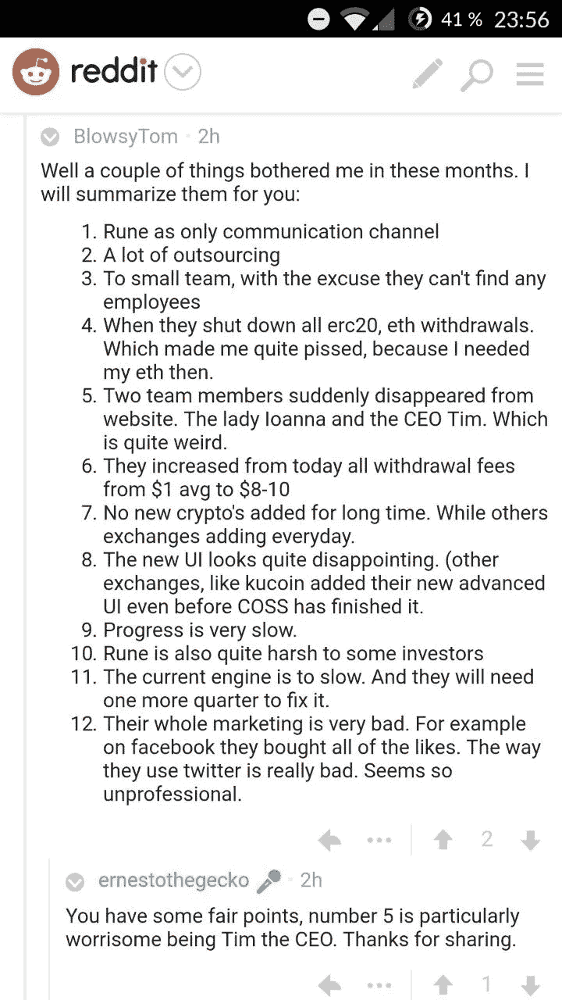
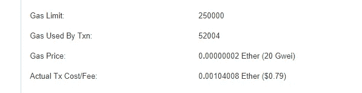

# 曹仁。IO 更新

> 原文：<https://medium.com/hackernoon/coss-io-update-d52013bd75a4>

十二月二十七日。2017

COSS 更新 2017 年 12 月 27 日

哇，这是疯狂的几个星期，这个更新可能有点长，但希望你会喜欢阅读。一如既往，没有任何特定的优先顺序。

首先，我代表整个团队祝大家圣诞快乐:
[https://www.youtube.com/watch?v=F0kzV9UBqvg&feature = youtu . be](https://www.youtube.com/watch?v=F0kzV9UBqvg&feature=youtu.be)

好了，让我们开始吧。如前所述，对于 COSS 和整个行业来说，这是忙碌的几周，发生了很多事情。

12 月 15 日，我们以基准令牌开始了新的交易宣传。多好的开始啊。每天的流量从 20 万增加到超过 2M。COSS token 从 6 美分涨到 30 多美分。收回发生了，交易量下降到 100 万，价格回到 15 美分，在撰写本文时，价格回落到 28 美分左右。动荡的时代给一些人带来了数量和兴奋，也给一些人带来了挫折。不幸的是，必须有人在历史高点买入，而幸运的是，有人反其道而行之，在历史低点买入。我不得不说这是游戏的一部分。对于那些玩这个游戏的人来说，有足够的套利空间。早期适应者和低价买入者的快乐时光。在这几周里，我们也看到了费用分割分配的良好增长。当然，这与交易所的交易量密切相关。在本周的节日期间，我们将再次看到收回。

在这几个星期里，我们也经历了一些消极的事情。DropDeck 的 ICO 将大部分资金锁定在平价发行上，不得不“取消”他们的项目，并安排一次收购，以便其追随者能够挽回损失。幸运的是，对于那些通过 COSS 参与的人来说，所有的 ETH 都完好无损，并将在本周全额退款。

同一周，我们在 EtherDelta 的一个同事遇到了 DNS 问题/黑客攻击，许多用户损失了资金，有些人甚至失去了他们的 COSS 令牌。
我对所有用户的强烈建议是并将永远是:永远不要在交易所储存超过你打算交易的资金。离线存储其余的，尽一切可能使用 2FA。

在危机中，你还会注意到站出来帮忙的热心人。我们注意到电报中的一个时刻，一个没有多少钱可输的年轻学生不幸在 ed 事件/黑客中丢失了他的 2000 COSS 代币。社区立即伸出援手，自掏腰包补偿了他的所有损失。这在一年中的任何一天都是温暖人心的，但在圣诞节期间看到这种情况证明人类仍然存在，甚至更加温暖。

另一方面，我们有用户大声尖叫说 COSS 是一个骗局，甚至在 reddit 上发了一个完整的帖子。你可能会问为什么。因为我们带着价值 25 美元的 LSK 代币取款时晚了 48 小时。这是 LISK 硬分叉后的第二天，我们必须升级 LSK 节点。当然，我们本可以更加积极主动，发布相关通知，但由于目前有 68 对黄金在交易，有时很难跟踪市场上正在发生的所有这些分歧和转变。尤其是在人手严重不足的情况下。我们对此表示歉意，但我们也敦促大家提出问题，等待答案，然后再下结论。嘿，在过去的两周里，我甚至听到了关于我自己死亡的谣言。如果我可以这么说的话，有点夸张了。

现在让我们暂时进入正题。我们有很多关于这个团队的问题，为什么网站会发生变化等等。在进入细节之前，我将分享我之前在 Medium 上发布的部分更新，作为 11 月 19 日的 COSS 更新:

**团队:招聘和正在进行的更改。
正如你们所知，我们一直致力于扩大团队。
我们目前正与 3 个 IT 团队密切合作，以改进网站。
一个团队来自罗马尼亚，一个团队来自新加坡，一个团队来自阿姆斯特丹。除此之外，我们还看到了新加坡总部内部招聘的突破和进展。
我们已经增加了 CS 员工(已经开始)和合规员工(本月入职)。我们也找到了一些有技能的 IT 人员，他们有望很快加入新加坡团队。
在谈论团队时，我们可以从我们的社区渠道解决一个常见问题:为什么我们在所有这些团队成员的 LinkedIn 个人资料中看不到 coss？嗯，答案很简单。团队不等于员工。在这个非常年轻的行业，你会发现许多人参与多个项目，他们都是团队的一部分，但不一定被公司雇用。例如，你不会雇佣别人加入你的顾问团队。如果你将部分 IT 外包出去，你可能会将该 IT 公司的所有者和/或项目经理纳入你的团队，但他们仍然不是你的员工。他们只是负责项目的这一部分。出于同样的原因，你已经看到了，并且在未来将会看到更多，球队将会发生变化。有些会被添加，有些会被删除。一些人只是转移到其他项目，一些人在其他地方寻找机会，一些人在同一家公司担任其他角色。
作为一家公司，尽管我们是透明的，但我们看不到每次员工变动都要向全世界通报的冲动。正如大多数公司一样，有些员工会比其他人更公开，但这并不意味着那些你不常见到的员工就不那么重要了。**

然后到今天的话题。新任命的 COSS 首席执行官蒂姆·格兰特先生。基于他广泛的商业背景，Tim 最近被任命为 COSS 首席执行官。他加入后，主要专注于重组团队/组织的结构，并在确定和雇佣新员工方面提供了很多帮助。对于那些认识我并熟悉这个行业的人来说，你们已经知道运营和维持一个初创企业是一项 24/7 的工程，也是一种生活方式。在试用期间，Tim 意识到了这一点，并开始质疑他可能不是以这种方式推动 COSS 前进的合适人选。在与我进行了长时间的良好交谈后，包括讨论他在董事会兼职的选择，但不是担任首席执行官和许多其他话题，结论是 Tim 决定提交辞呈。Tim 表示，他希望回到之前的投资相关项目，我们祝愿他在未来的工作中一切顺利。没什么特别的，尽管我意识到这个更新应该在网站改变之前写好并发布。

在公司的短暂时间里，蒂姆为公司做出了一些非常有价值的贡献。他带来了一个合规团队，该团队现在完全专注于新加坡的法规和许可，以及 COSS 上菲亚特交易的启动流程，以及新的和改进的 KYC/反洗钱/CTF 程序。所有对 COSS 同样重要的组件都尽可能符合要求。为此我们应该感谢蒂姆。

我们现在已经在合规团队中雇佣了 2 名新员工，目标是在 1 月份再增加 4 名。与此同时，我们在新加坡的客户服务团队增加了 2 名员工，目标是在 1 月份再增加 2-4 名。我们还增加了 2 个内部 IT 部门(前端和后端),这两个部门都将于 1 月份加入。我们希望他们能早点开始，但由于他们目前工作的通知期，这是不可能的。我想所有这些招聘仍然会引发更多的问题，比如:营销团队怎么样？如前所述，我们有一个清晰的营销战略，但在我们有一个更强大、更稳定的平台之前，它不会推出。
你可能已经注意到，我们不是普通的初创企业。他们在考虑雇佣营销人员之前，会建立一个 6 人的合规团队。对我们来说，这很简单。我们的目标是合规并保持合规。我们的目标是适应即将到来的法规，我们的目标是一旦有许可证申请就获得许可。即使没有交易账户，我们也会走这条路。我们在这里是长期的，我们正在采取一种“模仿银行”的政策。

这里有一个小小的震惊，可能会让一些人感到不安，也可能会让我们的一些意图变得安心。我们将在 Q1 2018 期间实施强制性 KYC。这意味着:仅基于电子邮件验证没有低限制。要么去 KYC，要么不交易。我们充分意识到，短期内我们可能会失去那些为了匿名而进入加密货币的人，但我们不能考虑这些。我们将增加一个完整的 KYC/反洗钱系统，用于入职、持续筛查、对照制裁名单进行筛查、PEP(政治公众人物)筛查，我们还将在身份验证中增加面部识别功能。我们可能会成为最合规的交易所，我们这样做是为了保护公司及其用户，并确保无论未来可能实施什么样的监管变化，我们都能够继续经营下去。

有些人会说，密码是由反对“老大哥”心态的无政府主义者发明的，它应该是自由流动的，没有边界和限制。不幸的是，我们并没有生活在这样一个世界中，加密货币真正普及的唯一方式是与监管机构合作。我们不是生活在一个充满独角兽和童话的世界里，我们都必须现实一点。

Praveena 是我们的新合规主管，她拥有来自毕马威、World First、华侨银行等机构的经验，她面临着一项艰巨的任务，即调整我们的程序并确保公司的合规性。

此外，我们的客户支持主管 Gary 看到了他的团队在这两周内的成长，增加了 2 名员工，并打算雇佣更多员工。我们仍然有积压的支持电子邮件，但我们正在赶上。Gary 已经为他的团队实现了 Freshdesk 系统，以便更容易地跟踪和报告，但我们还需要在网站上实现一个票务系统，使用户更容易支持通信线路。这将是 Q1 会议的重中之重。

在 Q1 期间，我们还打算增加更多的人到德斯蒙德的财务团队。这是非常重要的，尤其是当我们接近实施菲亚特交易。

另一个重要话题是美国公民。尽管许多交易所正采取严厉措施，将美国公民排除在交易之外，原因是美国证券交易委员会制定了许多复杂的规则，但 COSS 却反其道而行之。我们正在实施 FATCA、IRAS/SEC 报告/备案登记等。因此，我们可以确保我们的美国用户仍然有一个合规的交易平台。

当我们谈到团队话题时，值得注意的是，我过去 4 年的同事 Andrei 先生已经决定在 COSS 中扮演一个更次要的角色。他仍然是公司的股东和重要的影响者，但他也有很多自己的想法，他想花一些时间和精力来探索和验证。安德烈是一个聪明的家伙，也许有一天我们会在 COSS 上看到来自他想法的产品或服务。

现在转到我认为是本月最热门的话题。新用户界面。

在上周，我们的测试团队一直忙于测试新的用户界面。虽然我们在将 UI 连接到引擎时确实遇到了一些问题，但我们现在很高兴地说，它已经连接好了，而且看起来很好。UI 是基于我们从用户那里得到的许多反馈的共同努力，在它上线后，我们仍将继续收集反馈。这是一次重大的升级，但同时也是 1.1 版本的一次重大改进。我们将始终根据用户的反馈努力改进。

时间线:是的，虽然雄心勃勃，我们仍然致力于在年底前推出新的用户界面。我们意识到我们不能把它作为圣诞礼物，我们也完全意识到起初看起来像是 2 分钟的小修补程序可能需要更长的时间。从这个意义上来说，它通常是不可预测的。我可以百分百诚实地说，没有任何保证。我把时间线建立在 UI 团队和测试人员不会遇到任何需要花费大量时间来修复的重大错误的基础上。如果最坏的情况发生，我们也将错过新年的最后期限。然后我们将开放用户界面进行公开测试，这样你们就可以看到它的外观和感觉。毕竟，功能性比时间线更重要，但所有手指交叉，可能墨菲这些天远离新加坡。

我们真诚地感谢我们敬业的测试人员，他们一直在尝试新的用户界面，在电子表格中填写评论，并提出更多的编辑建议，甚至在平安夜和圣诞节期间也是如此。我们真诚地感谢你为使 COSS 成为一个更好的平台所付出的努力。这确实是一种最佳的社区精神。

随着用户界面的更新，整个网站的布局也将发生变化。首页和所有子页面也将被改变，但这并不像交换那么重要，不会在第一周全部到位。我们还在更新白皮书、团队页面等。

现在让我们转到另一个话题。永远受人喜爱的 FUDDERS。经常有人在项目上“投资”很少，但不知何故，觉得比任何上市公司的股东有资格获得更多的信息。有时根本不属于公司，但缺乏更好的事情去做，有强烈的欲望去感受自己的重要和被关注。

我们的社交渠道有很高的上限，但不幸的是，我们仍然不得不采取措施禁止一些用户。我们总是欢迎建议和建设性的批评，但是当它重复出现的程度真的让其他用户感到讨厌和不安时，我们就不得不执行我们非常少的规则。在我看来，主要规则是这样的:要么守规矩，要么滚蛋。不使用污言秽语，不攻击个人，不骚扰团队成员和/或志愿者的管理员，提供建设性的反馈是非常可能的。对于骚扰和种族主义言论，我们采取零容忍政策。

从股东到代币持有者有着巨大的区别。这是这个行业中证券和非证券的主要区别之一。值得注意的是，虽然大的“包包持有者”总体上很高兴，甚至不积极参与社交渠道，而是不时给我发一封友好的电子邮件，祝贺我们达到的里程碑，但我们看到最大的需求是更新、见解等。来自最小的股东(如果有股东的话)。我们以前说过，现在我再重复一遍。我们仍然人手不足。我们在努力提高的同时也尽了最大的努力。我们会犯错吗，当然会。我们会错过更多的时间线吗，是的，我想会的。随着时间的推移，我们会变得更好吗？是的，我当然希望如此。

趁着正题。不是 FUD，而是最近一篇 reddit 帖子中提出的问题。我被要求对此进行评论，所以我将简要地涵盖整个帖子。

回复:
1)我们目前没有任何全职的社交媒体经理来负责此事。我们使用志愿者管理我们的渠道。我尽可能经常去那里回答问题。同样，我们人手不足，我觉得在他们工作超负荷的情况下，让开发或合规部门的人来回答问题是非常错误的。我不介意花额外的时间回答问题。

2)是的，眼下一个必要的恶。但是通过引入越来越多的内部团队成员，对外包的需求将会减少和/或更容易处理。

3)在本更新的上面和前面已解决。团队在成长，我们在这个话题上打破了僵局。更多的队员正在赶来。

4)如果我们没有关闭，ETH 也不会联系到你。我们仍然没有让用户设置自己的取款费的选项，以确保交易将被矿商快速选中。有时候必须快速做出决定。有时他们按计划工作，有时则不然。我们仍然认为这样做是正确的。甚至有专家表示，简单地调整费用不是一个可行的解决方案。我们很遗憾您没有更快收到您的 ETH。

5) Tim 已在更新中解决。Ioana 是 Dan 公司的一部分，而不是 COSS 的员工。团队成员和员工是有区别的。丹的公司有许多项目正在进行，他有 20 多名员工。他们不是 COSS 的员工，他把谁奉献给各种项目是他的事，而不是其他。但这也包括在以前更新中。

6)平均值更像是 6-8，但我认为这不是你主要关心的问题。我们已经宣布了 3-4 次(我想)我们正在调整所有的费用。到目前为止，我们或多或少地赞助了大多数货币的所有用户，我们估计已经花费了大约 250-300，000 美元的费用，这些费用是我们没有向用户收取的。
举几个例子:
到目前为止，提取亲属代币收取 0.1 亲属费。下面是实际成本的一个例子:

现在考虑这一点:
1:用户存入亲戚并支付正常费用(由用户支付)
2: COSS 将代币移动到安全存储库(由 COSS 支付费用)
3:用户要求提取
4: COSS 将代币从安全存储库移动到在线钱包(由 COSS 第二次支付费用)
5: COSS 将代币发送给用户(由 COSS 第三次支付费用)

写完这篇文章后编辑:我们已经决定再次修改费用，把它降到最低，COSS 的收入为零。请查看您的 coss 仪表盘，了解最新的提款费用。

因此，在本例中，coss 支付了 2.37 美元的费用。取款费目前为 30，000 新西兰元，相当于 4.08 美元。该费用一直上涨，直到 0.1 新西兰元的变化，其美元价值相当于 0.0000136 美元

我们现在已经调整了系统，所以我们更容易改变费用，我们将更多地监测波动并相应地调整费用。然而，我们将查看最近的变化，并再次验证所有的计算，因此费用可能会在短时间内再次发生变化。

7)我们最近添加了多个令牌，但没有您想要的那么多。我们希望增加更多和更快。但是 Dev 现在需要分清主次。此外，我们目前的引擎在可能的配对数量方面有所限制，但这将会改变和改进。

8)新的 UI 或多或少基于我们用户的反馈。也许你不喜欢，但我们确实倾听我们的社区，我们认真对待他们的反馈和参与。拥有 40，000 个交易账户永远不可能让 100%的人满意，不幸的是，从表面上看，你是那些不喜欢新 UI 的人之一。但是我相信大多数人会的。

对此我只能表示同意。我希望我们能更快更好地交付。没有比这更让我开心的了。

10)不知道你在这里指的是什么，但我可能没有权利判断我自己的性格，但从我听到的，我对大多数用户相当宽容和耐心。我曾经说过一些不太正面的话的极少数人肯定是那些越界的人。如果我有任何不公平的行为，我可以向受影响的人道歉，但是，我不确定你指的是什么。

11)没错，我们已经宣布将制造一款新的发动机。

12)我再次同意。我们还没有把营销放在首位(如果有的话)，我们也没有任何全职的社交媒体经理。我们有内容经理和多名志愿者。

另一件需要记住的事情可能很多人都没有想到。像我们这样的加密货币交易所和许多其他交易所不是数十亿美元的赚钱机器。以曹仁为例。让我们假设交易双方的平均交易费是 0.12%。平均每笔交易的回报率为 0.24%。每 100 万美元的交易量，公司就能赚 1200 美元。如果你估计一个相当规模的团队+开发成本每月烧钱 15 万美元，你需要每月 1.25 亿的交易量(每天 41.66 亿)才能达到收支平衡。所以，这听起来就像是雇佣所有你需要的人，按你希望的速度建造，每天做顶尖的营销等等。但事实并非如此。我们试图以负责任的方式经营公司。我们不超支，但也尽量不超支。幸运的是，我们在象征性出售后选择做多 ETH，因此从那以后我们的持有量增加了而不是减少了。
不确定你是否得到了所有问题的答案，但这是我目前为你准备的。感谢您的反馈。

这一天，各种论坛都在热烈讨论最近的提现费变化。我们经营的业务的长期目标是让它真正盈利。然而，一如既往，我们确实注意到了您的反馈，我们已经看到它应该逐步调整，而不是一次完成。

我们还走过了另一个值得一提的里程碑。截至今天早上 7:30，我们在 COSS.io 上的交易账户超过了 40，000 个，远远超过了 2017 年的年度目标 25，000 个

借此我和整个曹仁团队祝你们新年快乐【https://youtu.be/G9Hz8V4ho94