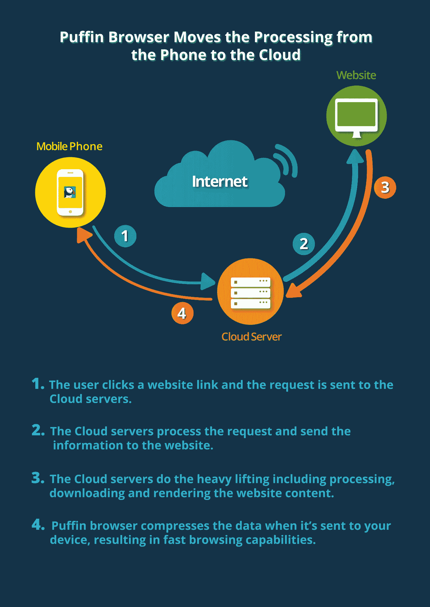
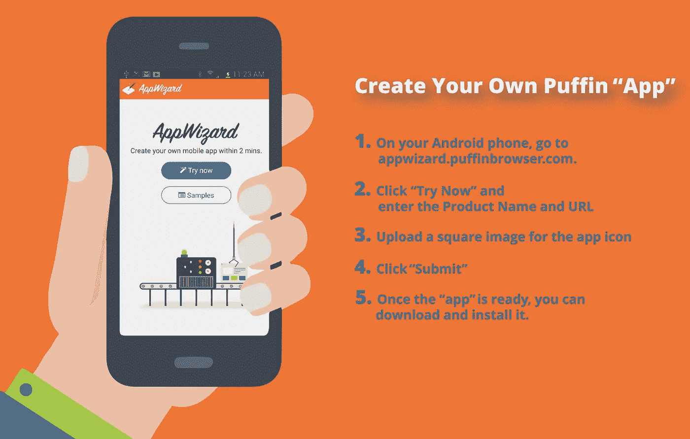

# 浏览器会破坏应用经济吗？

> 原文：<https://medium.com/hackernoon/could-a-browser-wreck-the-app-economy-a95787952d03>

由于传统移动浏览器速度缓慢，企业历来将应用作为在智能手机和平板电脑上访问内容、玩游戏和播放视频的更好选择。事实上，科技行业已经被洗脑了，认为公司需要花费数十万美元来创建和维护应用程序以接触客户。

事实是，通过将这些资源重定向到他们的网站，然后利用像 CloudMosa 的 Puffin 这样的浏览器，他们会得到更好的服务，这种浏览器通过使用远程数据中心(而不是手机的有限电子设备)进行处理，重新改写了等式。Puffin 的 8000 万移动用户基本上可以轻松获得整个服务器机房的能力。

随着智能手机几乎永久地附着在每个用户的指尖，应用程序已经完全扎根于我们的文化中。我们的团队认识到，为了证明基于云的浏览器更优越，我们必须在应用程序的游戏中击败它们。

进入: [CloudMosa App Wizard](https://appwizard.puffinbrowser.com/) ，通过网址不到一分钟自动创建一个类似 Android 的“App”。

结果不是一个传统的应用程序。相反，它们是一些特定网站的直接链接，运行在 CloudMosa 的云技术上。你可以通过使用样本“应用”来测试它们，比如脸书的[海雀、亚马逊的海雀和 Instagram 的海雀](https://appwizard.puffinbrowser.com/samples-en.html)——它们的功能与它们的同名应用一样，只是速度提高了五倍，数据使用量减少了 80%。

使用基于云的浏览器，移动用户不需要下载应用程序更新，开发者可以专注于维护网站效率。这不仅节省了时间，也节省了金钱和网络带宽。云还有助于保护用户免受典型的安全威胁，因为用户与互联网保持一定距离。

我们要求应用程序开发者和内容提供商对他们的应用程序和海雀同类产品进行并排比较，因为海雀的优越性是显而易见的。

未来很简单:清除你的主屏幕上的闲置应用程序，转而使用速度极快的基于云的浏览器访问这些网站。

请测试 CloudMosa 的应用向导，并在下面的评论中告诉我们它的进展。

你可以在 https://appwizard.puffinbrowser.com/[下载一个现有的 Android 版海雀电力应用程序，或者自己制作一个。](https://appwizard.puffinbrowser.com/)

沈
总裁&首席执行官